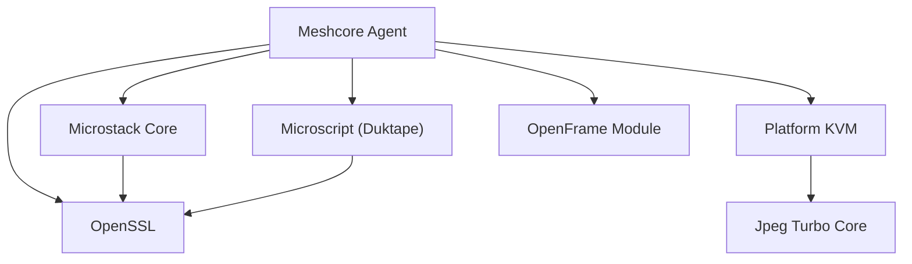

# Contributing to MeshAgent

Thank you for your interest in contributing to MeshAgent! This document describes how to set up your development environment, understand the codebase, and submit contributions.

MeshAgent is part of the [Flamingo](https://flamingo.run) / [OpenFrame](https://openframe.ai) ecosystem and is a core component of the open-source MSP infrastructure managed by the [OpenMSP community](https://www.openmsp.ai/).

---

## Community First

All support, bug reports, feature requests, and contribution discussions happen in the **OpenMSP Slack community** — not GitHub Issues or GitHub Discussions.

- **Join OpenMSP Slack:** [https://www.openmsp.ai/](https://www.openmsp.ai/)
- **Direct invite:** [https://join.slack.com/t/openmsp/shared_invite/zt-36bl7mx0h-3~U2nFH6nqHqoTPXMaHEHA](https://join.slack.com/t/openmsp/shared_invite/zt-36bl7mx0h-3~U2nFH6nqHqoTPXMaHEHA)

Before opening a pull request, especially for non-trivial changes, please discuss your approach in Slack first.

---

## Development Environment Setup

### System Requirements

MeshAgent is a native C/C++ project. You need a working build toolchain for your platform before writing any code.

#### Linux

```bash
# Ubuntu / Debian
sudo apt-get update
sudo apt-get install -y \
  build-essential \
  libssl-dev \
  libx11-dev \
  libxtst-dev \
  libxext-dev \
  libxfixes-dev \
  zlib1g-dev

# Red Hat / Fedora
sudo dnf install -y \
  gcc gcc-c++ make \
  openssl-devel \
  libX11-devel \
  libXtst-devel \
  libXext-devel \
  libXfixes-devel \
  zlib-devel
```

#### macOS

```bash
xcode-select --install
```

#### Windows

Install Visual Studio 2019 or 2022 with the C++ workload and Windows SDK 10.0.18362+. Use the **Developer Command Prompt** for builds.

### JavaScript Tooling (Optional)

For AI-assisted development tooling and documentation generation:

```bash
node --version   # Requires Node.js 18+
npm install
```

### Clone and Build

```bash
git clone https://github.com/flamingo-stack/meshagent.git
cd meshagent

# Linux / macOS
make

# Windows (Developer Command Prompt)
nmake
```

For a full environment setup walkthrough, see the [Development Environment Setup](./docs/development/setup/environment.md) guide.

---

## Project Structure

```text
meshagent/
├── meshcore/          # Agent core (C) — control channel, KVM, auth
│   ├── KVM/
│   │   ├── Linux/     # X11/XShm screen capture and input
│   │   ├── MacOS/     # CoreGraphics capture, TCC handling
│   │   └── Windows/   # GDI/DXGI capture, secure desktop
│   └── MacOS/         # macOS-specific utilities
├── microstack/        # Async networking stack (C)
├── microscript/       # Duktape JS engine bindings (C)
├── modules/           # JavaScript automation modules
├── openframe/         # OpenFrame/Flamingo integration (C)
├── openssl-1.1.1f/   # Pinned OpenSSL 1.1.1f headers
├── openssl/           # OpenSSL 3.x interface headers
├── lib-jpeg-turbo/   # TurboJPEG compression headers
├── meshconsole/       # Console application (Windows)
├── meshservice/       # Windows service host
├── meshreset/         # Reset utility
├── samples/           # WebRTC C and C# reference samples
├── tests/             # Self-test and diagnostic scripts
└── package.json       # Node.js tooling dependencies
```

Key entry points:

| File | Purpose |
|---|---|
| `meshcore/agentcore.h` | `MeshAgentHostContainer` — central agent state struct |
| `meshcore/agentcore.c` | Agent lifecycle: Create, Start, Stop, Destroy |
| `meshcore/meshdefines.h` | Protocol constants (port `16990`, command opcodes) |
| `microstack/ILibChain.*` | ILibChain reactor — the async event loop core |
| `microstack/ILibWebRTC.*` | WebRTC ICE, DTLS, and SCTP implementation |
| `microscript/duktape.*` | Duktape JavaScript engine |
| `openframe/token_extractor.*` | AES-256 token decryption for OpenFrame |

---

## Architecture Overview

MeshAgent is built around the **ILibChain** reactor pattern: a single-threaded, non-blocking event loop. All networking, I/O, and callbacks run on this chain thread — avoiding the need for locks in most code paths.

The main modules and their relationships:



Read the full [Architecture Overview](./docs/development/architecture/README.md) before touching any of the core subsystems.

---

## Code Style

### C / C++

- **Indentation:** 4 spaces (no tabs, except in Makefiles)
- **Line endings:** LF (`\n`)
- **Encoding:** UTF-8
- **Brace style:** Follow the existing patterns in the file you are editing
- **Naming:** Follow the naming conventions in the file being modified (`ILib` prefix for Microstack, `MeshAgent_` / `MeshCommand_` for the agent core)
- **Memory management:** Always use the explicit ownership flags (`ILibAsyncSocket_MemoryOwnership_*`) when passing buffers to the stack
- **No blocking calls** in chain callbacks — all I/O must be non-blocking

### JavaScript (modules/)

- **Indentation:** 4 spaces
- **Style:** Follow existing module style (CommonJS `require`/`module.exports`)
- **Duktape constraints:** No ES6+ features; Duktape targets ES5.1 compatibility

### Editor Configuration

The project uses `.editorconfig`. Install the EditorConfig plugin for your editor to apply settings automatically:

```text
[*.{c,h}]
indent_style = space
indent_size = 4
end_of_line = lf
charset = utf-8
trim_trailing_whitespace = true
insert_final_newline = true

[*.js]
indent_style = space
indent_size = 4

[Makefile]
indent_style = tab
```

---

## Development Workflow

### 1. Fork and Clone

```bash
git clone https://github.com/flamingo-stack/meshagent.git
cd meshagent
git remote add upstream https://github.com/flamingo-stack/meshagent.git
```

### 2. Create a Feature Branch

Use descriptive branch names that reflect the change:

```bash
git checkout -b fix/kvm-linux-cursor-rendering
git checkout -b feat/webrtc-turn-relay-fallback
git checkout -b docs/update-quick-start
```

### 3. Build and Test Locally

```bash
# Clean build with debug symbols
CFLAGS="-g -O0" make clean && make

# Verify the binary
ls -la meshagent
file meshagent

# Run against a local or dev management server
./meshagent
```

### 4. Incremental Development

`make` only recompiles changed files. A typical incremental build after modifying a single `.c` file takes a few seconds.

JavaScript modules in `modules/` are interpreted at runtime — changes take effect on the next agent restart with no recompile needed.

### 5. Debugging

#### GDB (Linux)

```bash
CFLAGS="-g -O0" make clean && make
gdb ./meshagent
(gdb) run
(gdb) bt      # backtrace on crash
```

#### LLDB (macOS)

```bash
lldb ./meshagent
(lldb) run
(lldb) bt all
```

#### Valgrind (Linux — memory leak detection)

```bash
valgrind --leak-check=full --track-origins=yes ./meshagent
```

#### Duktape JavaScript Debugger

Enable by setting `jsDebugPort=9090` in the agent's data store, then connect with the VS Code **Duktape Debugger** extension (`HaroldBrenes.duk-debug`) on `localhost:9090`.

### 6. Commit Your Changes

Use clear, descriptive commit messages:

```text
fix(kvm-linux): correct cursor alpha blending for multi-monitor setups

- Apply correct alpha extraction for 32-bit cursor bitmaps
- Handle edge case when XFixes returns empty cursor data
- Add fallback to CRC-based detection when XFixes unavailable
```

Format: `type(scope): short description`

Common types: `fix`, `feat`, `docs`, `refactor`, `test`, `chore`

### 7. Open a Pull Request

Push your branch and open a pull request against `main`:

```bash
git push origin fix/kvm-linux-cursor-rendering
```

Open your pull request at: [https://github.com/flamingo-stack/meshagent/pulls](https://github.com/flamingo-stack/meshagent/pulls)

**Before submitting:**
- [ ] Code compiles cleanly on your target platform
- [ ] You have tested your change against a real management server (or local MeshCentral)
- [ ] You have reviewed the [Security Guidelines](#security-guidelines) if touching crypto, auth, or input handling
- [ ] Commit messages are clear and follow the format above
- [ ] You have discussed the change in OpenMSP Slack for non-trivial contributions

---

## Security Guidelines

Security is a first-class concern in MeshAgent. Follow these rules when modifying security-sensitive code:

### Cryptography

- **Do not weaken TLS** — All control channels must use TLS. Do not add plaintext fallbacks.
- **Certificate pinning** — The agent validates the management server's certificate hash (`ServerID`). Do not bypass this check.
- **OpenSSL version** — The project pins OpenSSL 1.1.1f in `openssl-1.1.1f/`. Do not upgrade without full security review and team discussion.
- **Key storage** — Agent certificates and private keys are stored in `meshagent.db`. Ensure file permissions are `0600`.

### Authentication

- **Never skip AuthVerify** — The mutual authentication handshake (`AuthRequest` → `AuthVerify` → `AuthConfirm`) must complete before any commands are accepted.
- **Nonce validation** — Always validate nonces in the authentication sequence to prevent replay attacks.

### Input Handling (KVM)

- **Validate all input packets** — KVM input handlers (`kvm_server_inputdata`) must validate packet length and type before processing.
- **Process isolation** — The Linux KVM engine runs in a forked child process. Maintain this isolation.

### JavaScript Sandbox

- **Respect security flags** — Do not add code that bypasses `SCRIPT_ENGINE_NO_*` flags in isolated script contexts.
- **No secrets in scripts** — CoreModule scripts execute in a sandboxed Duktape context. Do not expose host secrets through the `MeshAgent` JS object.

### Secrets Management

- Never commit secrets, keys, or tokens to source control.
- `OPENFRAME_SECRET` and similar environment variables must be managed through your environment's secrets manager.
- The `.msh` file contains mesh credentials — verify file permissions are `0600` after any installer changes.

---

## Areas Open for Contribution

- **Platform ports** — ARM64 Linux, additional BSDs, or embedded platforms
- **WebRTC improvements** — TURN relay fallback, ICE candidate filtering, bandwidth estimation
- **KVM performance** — Improved tile sizing heuristics, adaptive frame rate, JPEG quality tuning
- **JavaScript modules** — New automation modules in `modules/` (power management, hardware inventory, etc.)
- **OpenFrame integration** — Expanded Flamingo/OpenFrame platform features in `openframe/`
- **Documentation** — Architecture deep-dives, module guides, translated docs
- **Testing** — Integration test scripts in `tests/`, CI pipeline improvements

---

## Getting Help

- **OpenMSP Slack:** [https://www.openmsp.ai/](https://www.openmsp.ai/) — primary support channel
- **Flamingo Platform:** [https://flamingo.run](https://flamingo.run)
- **OpenFrame:** [https://openframe.ai](https://openframe.ai)
- **Source:** [https://github.com/flamingo-stack/meshagent](https://github.com/flamingo-stack/meshagent)

---

<div align="center">
  Built with 💛 by the <a href="https://www.flamingo.run/about"><b>Flamingo</b></a> team
</div>
