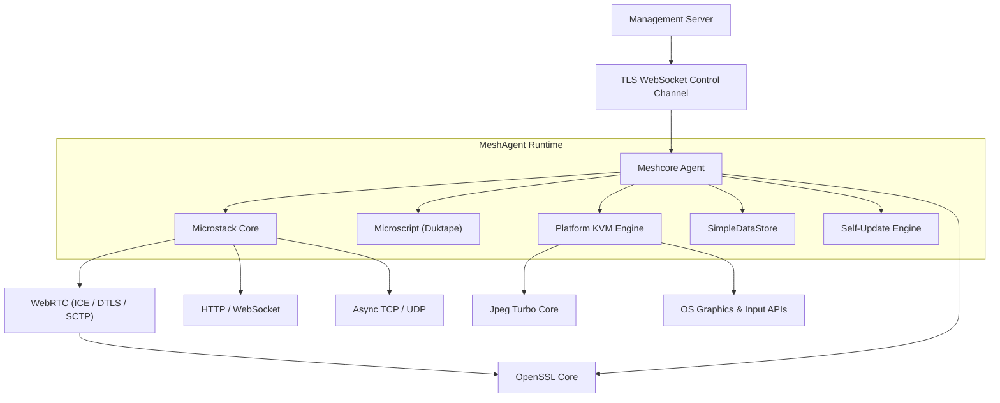
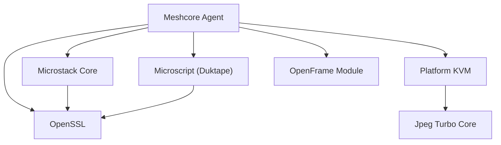

<div align="center">
  <picture>
    <source media="(prefers-color-scheme: dark)" srcset="https://shdrojejslhgnojzkzak.supabase.co/storage/v1/object/public/public/doc-orchestrator/logos/1771371901777-lc3cse-logo-openframe-full-dark-bg.png">
    <source media="(prefers-color-scheme: light)" srcset="https://shdrojejslhgnojzkzak.supabase.co/storage/v1/object/public/public/doc-orchestrator/logos/1771372526604-k3y1w-logo-openframe-full-light-bg.png">
    
  </picture>
</div>

<p align="center">
  <a href="LICENSE.md"></a>
</p>

# MeshAgent

**MeshAgent** is a cross-platform, high-performance remote management agent written in native C/C++. It powers the [Flamingo](https://flamingo.run) / [OpenFrame](https://openframe.ai) platform and MeshCentral-compatible infrastructures, providing secure remote access, device monitoring, and IT automation at scale.

MeshAgent runs on managed endpoints — servers, workstations, and embedded devices — and maintains a persistent, encrypted control channel back to a management server. It combines an event-driven async networking stack, a full WebRTC implementation, cross-platform remote desktop engines, and an embedded JavaScript automation runtime into a single production-grade agent binary.

---

## Features

- **Secure TLS Control Channel** — WebSocket connection to the management server with certificate-based mutual authentication on port `16990`
- **Cross-Platform Remote Desktop (KVM)** — Screen capture and input injection on Windows (GDI/DXGI), Linux (X11/XShm), and macOS (CoreGraphics)
- **Embedded JavaScript Engine** — Duktape-based scripting runtime with Node.js-like APIs (streams, EventEmitter, fs, net, WebRTC bindings) for remote automation
- **WebRTC Data Channels** — Full ICE, DTLS, and SCTP stack for peer-to-peer browser-to-agent streaming
- **High-Performance JPEG Streaming** — Tile-based differential screen encoding via TurboJPEG with CRC change detection
- **Self-Update Engine** — Secure in-place binary updates with SHA-384 hash and digital signature verification
- **OpenSSL Cryptography** — Full TLS/DTLS stack, X.509 certificates, RSA/EC key management (pinned OpenSSL 1.1.1f + 3.x interface)
- **Modular Async Networking** — Non-blocking TCP/UDP, HTTP client/server, WebSocket — all built on the `ILibChain` reactor pattern
- **OpenFrame Integration** — AES-256 encrypted token extraction for Flamingo/OpenFrame platform integration
- **JavaScript Security Sandbox** — Per-engine security flags controlling file system, network, process, and MeshAgent API access

---

## Architecture

MeshAgent is a layered, event-driven runtime. The core orchestrator (`meshcore`) drives all subsystems through a single-threaded, non-blocking reactor chain.



### Module Dependency Graph



---

## Core Modules

| Module | Language | Role |
|---|---|---|
| `meshcore/` | C | Agent orchestrator — lifecycle, auth, control channel, self-update |
| `microstack/` | C | Async networking reactor (TCP, HTTP, WebSocket, WebRTC ICE/DTLS/SCTP) |
| `microscript/` | C | Embedded Duktape JavaScript runtime with Node.js-like APIs |
| `meshcore/KVM/` | C | Platform-specific remote desktop engines (Windows / Linux / macOS) |
| `lib-jpeg-turbo/` | C | High-speed JPEG tile compression via TurboJPEG |
| `openssl-1.1.1f/` | C | Pinned OpenSSL 1.1.1f cryptographic library |
| `openssl/` | C | OpenSSL 3.x header interface (provider architecture) |
| `modules/` | JavaScript | Agent-side automation, installers, and utilities |
| `openframe/` | C | OpenFrame/Flamingo platform AES-256 token integration |
| `samples/webrtc/` | C / C# | WebRTC reference implementations |

---

## Technology Stack

| Layer | Technology |
|---|---|
| Agent core | C — event-driven reactor, control channel, cert auth, self-update |
| Networking | C (Microstack) — async TCP/UDP, HTTP, WebSocket, WebRTC |
| Scripting | C + JavaScript (Duktape) — sandboxed automation engine |
| Cryptography | C (OpenSSL 1.1.1f / 3.x) — TLS, X.509, RSA/EC, HMAC, AES |
| KVM engines | C — OS-specific screen capture and input injection |
| Agent modules | JavaScript — cross-platform automation and installers |
| Build tooling | Node.js + npm — AI-assisted documentation and analysis |

---

## Quick Start

### Prerequisites

Ensure you have a C/C++ compiler and `make` installed for your platform. See the full [Prerequisites](./docs/getting-started/prerequisites.md) guide for platform-specific dependencies.

### Clone and Build

```bash
# 1. Clone the repository
git clone https://github.com/flamingo-stack/meshagent.git
cd meshagent

# 2. Install JavaScript tooling dependencies (optional, for development)
npm install

# 3. Build the native agent
make
```

### Configure and Run

Create a `meshagent.msh` configuration file alongside the binary:

```text
MeshServer=wss://your-server.example.com/agent.ashx
MeshID=your-mesh-id-here
MeshType=2
```

> Obtain the `MeshServer` URL and `MeshID` from your MeshCentral or OpenFrame management server. Refer to your environment configuration for the correct values.

```bash
# Run the agent
./meshagent
```

On first run, the agent auto-generates an RSA/EC key pair and certificate stored in `meshagent.db`, connects to the management server via TLS WebSocket, and performs mutual authentication.

### Install as a Service

```bash
./meshagent --install
```

This registers MeshAgent with the appropriate init system (systemd on Linux, LaunchAgent on macOS, Windows Service on Windows).

For a full walkthrough, see the [Quick Start guide](./docs/getting-started/quick-start.md).

---

## Platform Support

| Platform | Screen Capture | Input Injection | Service Mode |
|---|---|---|---|
| **Linux** | X11/XShm | XTest / XKB | systemd / init.d |
| **macOS** | CoreGraphics | Accessibility API | LaunchAgent / LaunchDaemon |
| **Windows** | GDI / DXGI | Win32 input | Windows Service (SCM) |

---

## Networking Requirements

| Port | Protocol | Direction | Purpose |
|---|---|---|---|
| `16990` | TCP (TLS WebSocket) | Outbound | Agent → management server |
| `16991` | UDP | Outbound | STUN for WebRTC NAT traversal |
| Ephemeral | UDP (DTLS) | Both | WebRTC peer-to-peer data channel |

---

## Documentation

📚 See the [Documentation](./docs/README.md) for comprehensive guides covering getting started, development setup, and architecture reference.

- [Introduction](./docs/getting-started/introduction.md) — What MeshAgent is and how it fits the OpenFrame ecosystem
- [Prerequisites](./docs/getting-started/prerequisites.md) — Build toolchain and system requirements
- [Quick Start](./docs/getting-started/quick-start.md) — Clone, build, configure, and run
- [First Steps](./docs/getting-started/first-steps.md) — Verify identity, configure logging, explore modules
- [Architecture Overview](./docs/development/architecture/README.md) — Design principles and module internals

---

## Community

All support, questions, and discussion are managed on the **OpenMSP Slack community** — not GitHub Issues.

- **Join OpenMSP Slack:** [https://www.openmsp.ai/](https://www.openmsp.ai/)
- **Direct invite:** [https://join.slack.com/t/openmsp/shared_invite/zt-36bl7mx0h-3~U2nFH6nqHqoTPXMaHEHA](https://join.slack.com/t/openmsp/shared_invite/zt-36bl7mx0h-3~U2nFH6nqHqoTPXMaHEHA)

---

## Related Projects

- **Flamingo Platform:** [https://flamingo.run](https://flamingo.run) — AI-powered MSP platform
- **OpenFrame:** [https://openframe.ai](https://openframe.ai) — Unified AI-driven MSP interface
- **MeshCentral:** Compatible management server for deploying MeshAgent

---

<div align="center">
  Built with 💛 by the <a href="https://www.flamingo.run/about"><b>Flamingo</b></a> team
</div>
