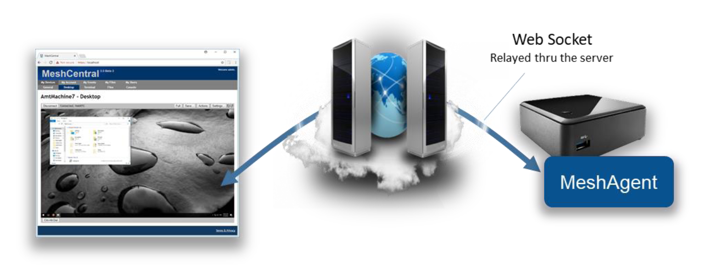

## Mesh Agent Architecture

### Abstract
This document describes the archicture and design of the Mesh Central Agent. This document covers the overview of the design and goes into details about the protocol and various decisions and trade-offs. 
It is intended for anyone that wants to understand the inner workings of the Agent, or someone that wants to make a security review of the software.

### Design Overview
From a high level, the overal design of Mesh Central encompasses 3 main components. The Server, the Agent, and the Web application. This document will focus on the agent, but will
highlight the other components where applicable. The server is a NodeJS application that is published at https://www.npmjs.com/package/meshcentral. The primary user interaction is with the
web application running side a web browser. From the web application, the user is able to interact with aspects of the agent, via the server. The server serves the web application to the
web browser, and acts as a server for all the agents to connect to. The server can also act as relay, to facilitate secure connections between the web application and agent.

#### Agent Certificates
The mesh agent generates one or two RSA certificates when it first starts. On smaller IoT devices such as a Raspberry Pi, this can take a little while to do and the CPU 
will spike to 100% during this time. This is normal and only occurs the first time the agent runs. The certificates are generated a little differently depending on the 
platform. On Windows, the Mesh Agent will use Microsoft cryptographic providers to harder the agent root cert. If available, the agent will use the platform TPM to harden 
the certificate. On other platforms, only one certificate is generated and used for both agent authentication to the server and WebRTC session authentication.

**Agent root certificate.** This certificate is the root trust of the agent. The SHA384 hash of
this certificates public key is the agent’s identifier on the server. When a agent connects
to the server using web socket, it performs a secondary authentication check using this
certificate. The server will compute the agent’s identifier after the agent sent a signed
proof to the server. This certificate is also used to sign the secondary certificate below
when it’s needed.

**Secondary certificate.** This is a certificate signed by the agent root above. It’s currently
only used by WebRTC to perform dTLS authentication to a remote browser. This
certificate does not need to be signed by a trusted CA for WebRTC purposes since the
hash of the certificate will be sent to the browser using a trusted path. If the agent root
certificate is not hardened using platform cryptography, the secondary certificate is not
created and the agent root cert is used for all purposes.

A possible attack would occur if someone were to be able to access the agent root certificate.
They could impersonate the agent to the server. Agents don’t have any rights to perform
management operations on the server or other agents, but by impersonating a agent, a rogue
agent would pretend to be an office computer to which administrator would login with their
username & password, especially when the root is not hardened. Some care should be taken to
protect the “meshagent.db” file and to not give important information to untrusted agents.

#### Agent to Server Handshake
One interesting aspect of MeshCentral’s design is how the agent connects to the server. We wanted a way for the agent to connect to the server that would be similar to how browsers 
connect to web servers. This allows for a large number of agents to connect just like if a large number of browsers where connecting. All of the infrastructure that helps web server’s 
scale would be put to use in the same way for agent connections. For example: TLS offload hardware, load balancers, reverse-proxies, web server scaling, etc. could all be put to use. 
It also makes the server easier to setup because only one port (HTTPS 443) is needed for both users and agents. One big difference between the agent connecting and a typical browser 
is how the server is authenticated. Browsers have a set of known trusted root certificates. The server’s web certificate is checked for validity including the name, time
trusted CA and more. The agent does not have this. Instead, it just has a hash to a private server certificate. The public facing web certificate of the server can change frequently.
For example, Let’s Encrypt certificates are valid 90 days. Agents need to be able to validate a specific server for a long time and don’t really need to trust anything else except 
one specific server. We also don’t want to tie the agents to a specific domain name as we could change that in the future or want to support servers with dynamic IP addresses and no 
fixed DNS names. To handle all this, the agent performs a TLS connection to the server and will first see the web certificate of the server. It will then exchange a set of web socket 
binary messages to the server to perform a secondary authentication with the server.

The secondary check allows the agent to confirm that this server does own the private key of the private certificate expected by the agent. The agent caches the hash of the “outer” 
web certificate. When re-connecting, if the agent sees the same outer web certificate, it will skip the secondary check. For obvious security raisons, it’s important that the agent
not accept any management messages until the secondary check is completed or skipped. To prevent man-in-the-middle attacks, the secondary check also “pins” the outer web certificate. 
That is, the server both confirms it’s the right server and indicates to the agent the hash of the outer certificate that it must have seen during the TLS connection. The agent must 
check this hash to make sure there is no attacker in the middle. The agent connection design allows for reverse-proxies and TLS offload hardware. The agent will first connect a TLS
session to the offload hardware. Clear traffic flows between the offload hardware and the server which will perform the secondary check if needed.

To makes all this work, the MeshCentral server must be able to fetch the hash of the outer web certificate from the reverse proxy. In this case, the server does not need the 
private key to the web certificate. Note that when the outer web certificate is updated, the server may have to perform many secondary checks at the same time causing a server slowdown 
during this time. To help with this, MeshCentral will offload the RSA signing operation to many slave processes (as many as the CPU core count on the server) to speed this up. In addition, 
native NodeJS RSA signing is used (not ForgeJS). The details of the secondary certificate check look like the diagram below. To boost speed, the exchange is fully asynchronous and both
sides send the first message as soon as the TLS connection completes.

Note that these messages are binary (not JSON). This exchange is handled by native C code in the agent. Binary message 1 is sent immediately after the TLS connection is setup. Both 
sides will send binary message 2 when message 1 is received and message 3 when message 2 is received. In addition, there are two extra messages of interest that can be sent by the
agent right at the start. The agent may send the server message number 4 if the secondary check can be skipped and may send binary message number 5 indicating what server hash it
expects to verify. Message number 5 is interesting because a server may have many “identities” at the same time, and so, the server will use message number 5 in order to use the right
Agent Server certificate.In order to be as secure as possible, all hashes use SHA384 and certificates are RSA3072 and nonces are generated on both sides using a cryptographic random 
source. The server and agent signatures are computed like this:

While the server will often skip its RSA signature operation due to the agents caching the outer web certificate, the server must perform an RSA verify to each agent connection. 
This can’t be skipped but is needed to authenticate the agent. Once connected, the trust relationship between the server and the agent is one-way. That is, the server has management
rights on the agent, but the agent does not have any right on the server. This is important since the agent does not, by default, have any credentials to the server. Any agent can
connect to the server and claim to be part of a device group.

#### Browser to Agent Relay and WebRTC

Browsers and agents often need to communicate to each other. Data sessions are used for desktop, terminal, file transfers, etc. and must be setup securely. To setup a session between 
a browser and the agent, the server will send a URL to both sides to connect to. The URL is generated by the server and includes a unique connection token. It is sent to both the 
browser and agent using the web socket control channel and a JSON message. Both sides perform a websocket connection to the target URL and the server will “pipe” both sessions
together to act as a passive relay. For security, the agent will only accept connections to the URL given by the server if the server has the same outer web certificate as its
control connection. Also note that in this mode, the session is not end-to-end encrypted. The server is performing a TLS decrypt and re-encrypt and the traffic cost is high as each 
byte of data has to be received and sent again.

The relay server is just websocket server that will wait for connections with session tokens. When two connection with the same connection token arrive, the server makes sure that 
at least one of the two connections is an authenticated user, it then sends the character “c” on both sides to inform both parties that the relay is starting and then pipes both 
sessions together. Once the session is started, the browser and agent are free to send messages to each other. Note that when the server sends the relay URL to the agent, it also 
sends to the agent the user’s permissions flags. This may be used by the agent to limit what the user can do on this session. With this design, the flow control between the browser 
and agent is simple, each session gets its own end-to-end connection and the server will apply appropriate TCP back pressure on both sides as needed.

A unique feature of MeshCentral is its use of WebRTC. WebRTC was introduced in major browsers as a way to allow browsers to directly communicate to each other and perform audio/video 
streaming. The mesh agent has a WebRTC data-only stack that is custom built for this project in C code. It’s compatible with Chrome and Firefox implementations and once a session is 
set up, allows data to flow directly from the browser to the agent, bypassing the server.

The use of WebRTC allows MeshCentral to scale better, to offer a faster user experience and lower hosting costs all at the same time. However, WebRTC is not easy, especially when you
must maintain the C code for it and have to keep up with browser implementations, but the benefits are clear. To setup WebRTC, browsers typically use STUN and TURN servers to get 
traffic thru any network obstacles (routers, proxies, firewalls). This infrastructure can be complex to setup especially if an administrator is not familiar with WebRTC concepts. 
To make things easy, MeshCentral opted to always start by using a websocket relay thru the server to get things started. While a session is active, the browser and agent will attempt 
to automatically switch the session traffic to WebRTC when possible. This way, the session always works and gets more efficient when network conditions allow. To perform the switch-over, 
both browser and agent will exchange WebRTC control messages over the newly established web socket relay session.

In order to differentiate session traffic from WebRTC control traffic, the browser and agent agree to send WebRTC setup traffic using web socket text fragments. All other session traffic
is sent using binary fragments. The agent has a special API allowing a session to be piped for a single fragment type. So we can perform a remote desktop session to the agent while trying 
to setup WebRTC at the same time. The browser will kick off the WebRTC setup sending the initial WebRTC offer with the agent responding with a WebRTC answer. If the WebRTC session gets 
setup, both sides need to negotiate a clear transition from the web socket session to the WebRTC session. To do this, both sides send a start switch control fragment (this is a text fragment), 
the other side will respond with an ACK when the web socket session is flushed out and it’s safe to switch. On the agent side, the new WebRTC session inherits the user access rights of the 
web socket. Currently, the web socket channel is still maintained open. While it’s not strickly needed, the web socket session terminates more cleanly than WebRTC and so, oddly its closure 
is used to signal the end of the WebRTC session.

#### JavaScript Runtime

#### Native Update

The primary update mechanism utilized by the Mesh Agent, is the Native Update mechanism. This utilizes the Server Control Channel, as the main update mechanism.
When the agent connects to the Server and is authenticated, the server will ask the Agent for the Agent Hash. The Mesh Agent will respond by sending to the server,
the hash of the currently installed agent binary. Note, the agent and server hash the binary in such a way, that it excludes any embedded configurations. When a user installs a new agent,
and downloads the agent from the server, the server will embed the user's configuration in the binary, such that only a single file download is necessary.

If the server determines that the hash does not match the hash of the currently deployed agent in this version of the server, the server may elect to update the agent to the latest version.
To kick off this process, the server will send a MeshAgent_AgentUpdate (13) command to the agent, via the control channel, followed by a series of MeshCommand_AgentUpdateBlock (14) commands,
which contain a fragment of the updated agent binary. The server will keep sending these blocks, while the agent will also send MeshCommand_AgentUpdateBlock (14) to confirm each block, 
as a pseudo means of flow control. Since the Server Control Channel is websocket based, these packets are ordered. After the server sends the last update block,
the server will send a final MeshCommand_AgentUpdate (13) command which will contain the SHA384 hash of the updated agent, to signal to the agent that the update has been fully sent.
The agent will be able to utilize this hash to verify that the updated agent has been correctly received.

After the agent has verified the update, it will attempt to update itself, in a platform specific way. On Non-Windows platforms this involves overwriting the agent binary
and then using the service manager, (initctl, launchctl, service, etc) to restart the service. On Windows Platforms, this involves spawning a detached cmd shell to stop the agent service, overwrite the binary,
then restart the service.

#### Recovery Core Update

As the agent has evolved, so too has the self update mechanism. Sometimes bugs have been discovered in the self update mechanism that posed problems for the self update process.
Sometimes these problems were show-stoppers that prevented the agent from being able to update, or worse, caused the agent to halt without being able to restart, etc.
Problems with the Native Self Update Mechanism, as the name suggests, would require a new agent to fix some of these problems. This poses a problem if there is a problem with the update mechanism of an already deployed agent.

To mitigate these situations, we came up with an alternative update mechanism. Recovery Core, simply refers to a stripped down Javascript core file that the server sends to the agent, 
which contains code to be able to perform a self update. This update mechanism if for all intent-and-purposes not dependent on the agent version, because most all of the implementation of the self update mechanism
is provided by the server, as JavaScript. 

This update mechanism starts with the server sending the Recovery Core to the agent, instead of the primary Mesh Core. Once the recovery core is sent, 
the server will send a JSON command on the control channel with the action set to 'agentupdate', hash set to the SHA384 hash of the update, and the url set to an https url where the agent can fetch the updated agent binary.
The recovery core JS, will download the update from the specified url, verifying the hash with the received hash value. During this process, the recovery core may send progress data via the control channel. 
Once the update has been received and verified, the agent will send a JSON command back to the server with the action field set to 'agentupdatedownloaded'. This will indicate to the server that the update has been successfully downloaded and verified.
It should be noted that the TLS certificate presented by the server hosting the agent update, must match the TLS certificate presented by the server in the Agent control channel. 

To perform the actual update after verifying receipt, the recovery core will utilise _wexecve() to stop the agent service, overwrite the agent binary, then restart the service.
On Linux and BSD platforms, the recovery core will simply overwrite the agent binary and utilize execv() to restart the agent after closing all open descriptors.
