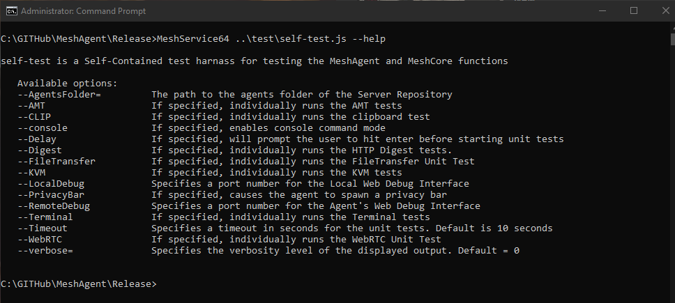
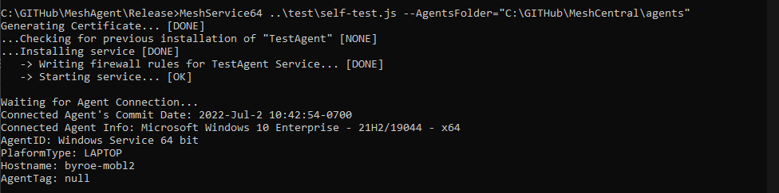
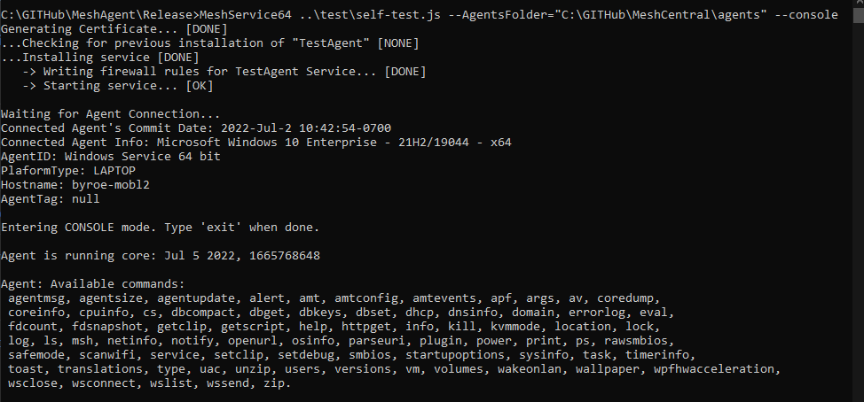

# Mesh Agent Unit Tests

## Abstract

This document presents an overview of what a Mesh Core is,
how the agent runs it, as well as how self-test.js can be used to test it.

## Mesh Core

At a high level, the Mesh Agent is essentially a container service, 
which securely connects to a Mesh Server, which then pushes a JavaScript "Mesh Core" to the agent, 
which then runs it, in a Duktape JavaScript environment.

By itself, the Mesh Agent provides a Node like environment for the JavaScript Mesh Core to run.
It doesn't actually utilize node, such that the Mesh Agent can be as compact as possible to be able to run
in a diverse set of environments as possible, from computers, to routers, etc.

By providing functionality in this fashion, enables scenarios where new features and patches can be deployed to the agent in realtime, 
without necessarily having to recompile and update the agents. This also enables powerful testing and debugging tools to be developed, 
as the server can push functions specifically built to test and/or interact with the runtime environment. For example, "Console Mode", allows the user to directly evaluate code within the
agent's runtime environment, to quickly debug/introspect the JavaScript running in the agent. More on that later...

### Testing the Agent

self-test.js was specifically written to facilitate testing any and all aspects of the Mesh Agent's JavaScript Runtime. This script will simulate a Mesh Server,
and install a Mesh Agent onto a system, configured to talk to the simulated server. The simulated server will act as an actual server and push an instrumented mesh core to the agent. 
The first step to using the test script, is to clone the Mesh Server Repository. The test script will only interact with the /agents folder of the repository, as that is where the Mesh Server keeps
all the JavaScript files that it sends to the agent. As a result, the test script should be compatible with any version of the Server, which means you'll be able to use it to test any version of the server with the agent.

To run the test script, simply run the Mesh Agent with the path to the self-test.js file in the command line. It can be found in the /test folder of the Agent Repository:



The test script will inform you of any missing parameters that are required for whatever mode you are running. The typical way to run the 
self-test, is to simply run it without any options, other than AgentsFolder. This option lets the test script know where to find the necessary JavaScript files.
The test script will load the javascript files the same way an actual Mesh Server would, and send them to the agent the same exact way... The first thing the test script will do, is validate the parameters that were passed in. If any necessary values were omitted, the script will exit, and display a brief on which parameters are missing.
The first thing the script will do is to install the Mesh Agent onto the system, and wait for a connection from the agent.
Once it connects, you'll see some meta-data on the connected agent, such as Commit Date, OS Name, PlatformType, etc:



After the mesh core is pushed to the agent, the self test tool will begin running the individual unit tests. As the test tool evolves,
more unit tests will be added, and this document will be updated to reflect the new tests. The current unit tests are as follows:


The first four tests, (Version Information, Agent Info, Network Info, and SMBIOS Info) deal with the agent startup sequence, as these data structures are sent to the server upon connection to the server. 
These values are used by the server to populate various meta data about the agent. The rest of the tests, involve the server testing individual components of Mesh Core.

**AMT Detection:**
This test will validate the agent's AMT detection logic, and display if AMT is supported, and display it's version and provisioning state.

**Tunnel Test:**
This test will validate that the agent is able to instantiate a tunnel session with the server. This is a core building block for the agent,
as it is used for most all of the interactive usages, such as File Transfer, Terminal, and KVM. The test server will instruct the agent to connect a tunnel session, 
which will not only test the websocket connection logic, but also the TLS authentication logic, as normally the agent will validate that the TLS certificate presented by the tunnel server
is the same TLS certificate presented in the control channel.

**Console Test:**
This test will validate that the agent is responsive and will handle console commands. A future version of this test will parse the **help** console command, 
and then test each command to verify that the advertised commands are implemented. 

**CPUInfo Test:**
The test server will attempt to fetch cpu info from the agent. This is one of the many telemetry modules that the agent implements. The goal is for the test server to be able to test each and every metadata retrieval function.

**PS Test:**
The test server will attempt to fetch a list of all of the running processes on the system, and verify that the returned data structure is a valid JSON object.

**Service Enumeration Test:**
This test is more involved then it seems, as even tho the task is simple, in that the server is merely trying to enumerate all the background services installed on the platform,
how that agent carries that about is very platform specific. Each platform has a very different mechanism by which services are managed, such that it is important
to test each platform to verify that the service manager module is correctly able to handle the service implementation for that platform.

**Clipboard Test:**
One of the more vital user interactions with the Mesh Agent, is clipboard manipulation. This test will test this functionality, by sending a randomized
string to the agent to set to the clipboard. Then verify tha retrieved value from the clipboard exactly matches the value that was set.

**HTTP Digest Test:**
This test involves testing the different authentication modes of HTTP Digest, which is a core infrastructure piece used by the agent. 
Each of these tests will utilize a variable length randomized string for the Realm, username, password, and entity body. The 3 different authentication modes are:
- Basic: This will test the basic digest method, to validate successful authentication.
- auth: This will test that the client can negotiate quality of protection, and select and use auth correctly.
- auth-int: This will present all modes to the agent as being available, and will verify that the agent will correctly select and use the most stringent mode. 

**WebRTC Test:**
In this test, the test tool will attempt to negotiate a Peer to Peer WebRTC Datachannel session between the test tool and the agent. This test is split into the various phases of the channel negotiation:
1. Initial Offer. This tests that the agent was successfully able to initialize WebRTC and generate the initial offer.
2. Counter Offer. This tests that the agent is able to set the counter offer generated by the test tool when the initial offer was set.
3. Peer Connection Establishment. Once the offers are exchanged, this verifies that a **DTLS** session is able to be established between the agent and the test tool.
4. Data Channel Creation. Once the peer connection is established, the test tool will attempt to create a named DataChannel in the session, and verify that the agent correctly negotiates an SCTP DataChannel.
5. Data Fragmentation Test. After a data channel is established, the test tool will verify that the agent correctly reassembles large data blocks, by sending randomized blocks of data, and verifying the hash on the received blocks to validate that they are correctly received.

**File Transfer Test:**
In this test, the test tool will validate agent's File Transfer capability, in 5 steps:
1. Initialize Upload. This will ask the agent to instantiate a data tunnel with the server for file upload
2. Uploading a file. This will generate random data, and upload it to the agent
3. Initialize Download. This will ask the agent to instantiate a data tunnel with the server for file download
4. Download a file. This will cause the agent to download the uploaded file from the server
5. CRC Check. This will verify the downloaded data exactly matches the data that was uploaded

**Terminal Test:**
This test will validate that the agent is able to instantiate a terminal session. This test consists of up to 4 separate tests, depending on the platform:
1. ROOT Terminal. This will prompt the agent to spawn a user consent dialog asking for a Terminal Session. Once allowed, the agent will spawn a ROOT terminal, that the test tool will then send input to close the session.
2. USER Terminal. This will prompt the agent to spawn a user consent dialog asking for a Terminal Session. Once allowed, the agent will spawn a USER terminal, that the test tool will then send input to close the session.
3. PowerShell ROOT Terminal. On Windows platforms with ConPTY support, this will prompt the agent to spawn a user consent dialog asking for a Terminal Session. Once allowed, the agent will spawn a ROOT PowerShell terminal, that the test tool will then send input to close the session.
4. PowerShell USER Terminal. On Windows platforms with ConPTY support, this will prompt the agent to spawn a user consent dialog asking for a Terminal Session. Once allowed, the agent will spawn a USER PowerShell terminal, that the test tool will then send input to close the session.

**KVM Test:**
This test will validate that the agent is able to instantiate a Remote KVM session. This test is carried about in multiple steps:
1. Initiate KVM Tunnel. This will prompt the agent to spawn a user consent dialog asking for a Remote KVM Session. Once allowed, the agent will spawn a KVM session.
2. Display Info. On platforms with multiple detected monitors, the agent will send a control packet with meta-data about each attached display, including resolution of each display. Note: On linux, X currently does not detect each attached display, it detects a single virtual display that encapsulates all displays.
3. Display Selection. The agent will send a control packet indicating the selected display.
4. Screen Resolution. The agent will send a control packet indicating the resolution of the selected display.
5. JUMBO Packet. For large JPEGs, the agent will send an encoded JUMBO packet encapsulating the JPEG data.
6. JPEG Received. This validates that the test tool was able to receive encoded image data from the agent.


### Different Testing Modes

The self-test.js test tool supports different testing modes, to aid in testing/debugging Mesh Agent features.

**Console Mode:** This mode enables the user to interact directly with the console commands of the agent. This mode will install the Mesh Agent 
just like in normal mode, except instead of running all the unit tests, it will connect **stdin** with the console command interface of the agent. Typing `exit` will end the test.



**Privacy Bar:** This mode will simply cause the agent to directly spawn the privacy bar. When the privacy bar is closed for any reason, the test will conclude.
This is useful for debugging the Privacy Bar itself. This mode can be started by specifying `--PrivacyBar` as in the following:
```bash
MeshService64 ..\test\self-test.js --AgentsFolder="C:\GITHub\MeshCentral\agents" --PrivacyBar
```

**Delay:** This will cause the test tool to wait for user input on stdin after the agent connects to the test server, before running the unit tests. This can be used to help with debugging, by delaying unit test start until the user is ready.

**LocalDebug:** If specified, this will enable the WebDebug Web interface on the specified port, for the local test tool. This is useful for debugging things like WebRTC, DTLS, etc.

**RemoteDebug:** If specified, this will enable the WebDebug Web interface on the specified port, for the agent. This is useful for debugging things like WebRTC, DTLS, etc.
