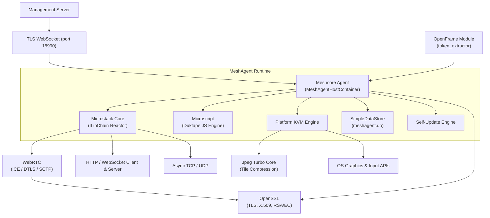
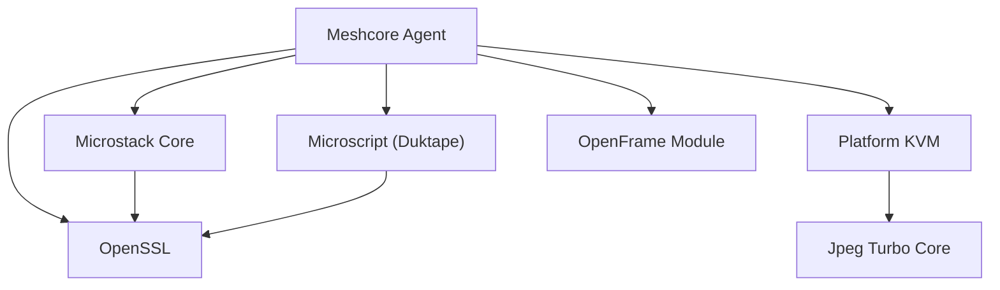
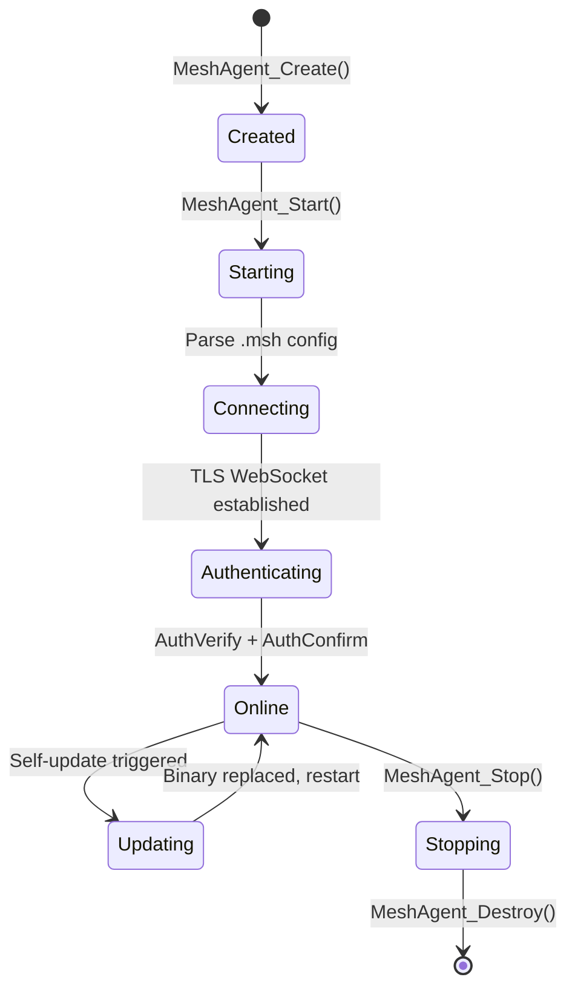
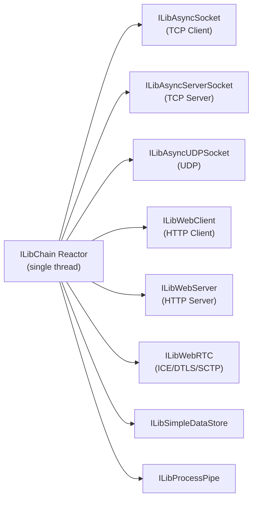
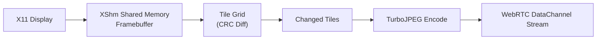
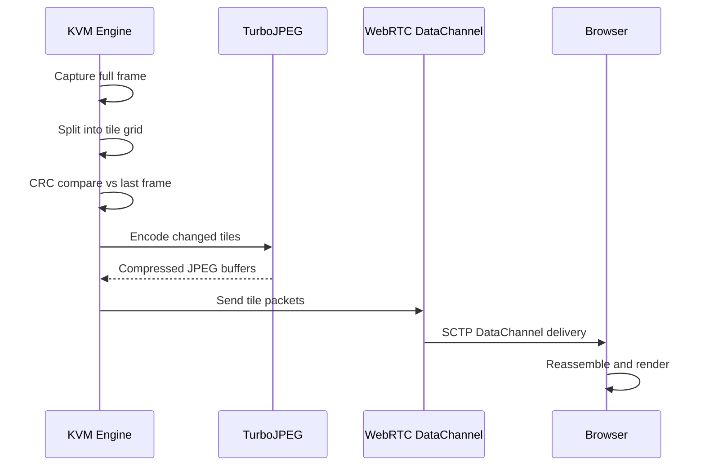
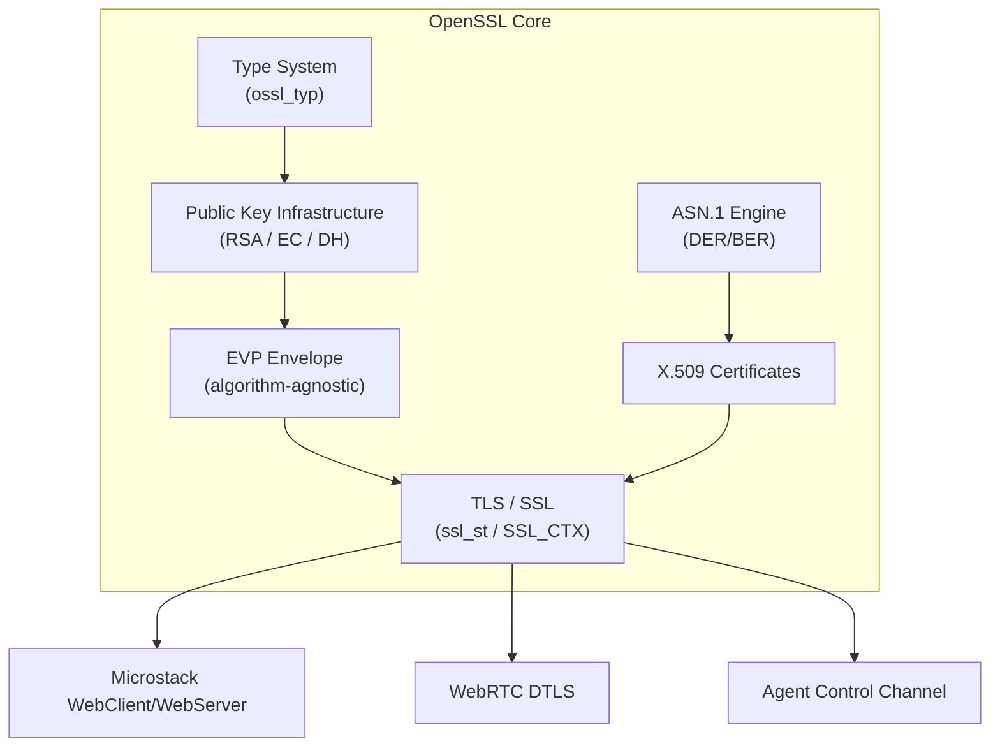

# Architecture Overview

MeshAgent is a native C/C++ remote management agent with an embedded JavaScript runtime. It is designed around an **event-driven, single-threaded reactor** with clean separation between the networking stack, scripting engine, KVM engine, and cryptographic layer.

---

## High-Level Architecture

---

## Core Components

| Component | Language | Location | Role |
|---|---|---|---|
| **Meshcore Agent** | C | `meshcore/` | Central orchestrator — lifecycle, auth, command dispatch |
| **Microstack Core** | C | `microstack/` | Async networking reactor (TCP, HTTP, WebSocket, WebRTC) |
| **Microscript (Duktape)** | C | `microscript/` | Embedded JavaScript engine with Node.js-like APIs |
| **Platform KVM** | C | `meshcore/KVM/` | OS-specific screen capture and input injection |
| **Jpeg Turbo Core** | C | `lib-jpeg-turbo/includes/` | High-speed JPEG tile encoding for screen streaming |
| **OpenSSL Core** | C | `openssl-1.1.1f/` | TLS, X.509 certs, RSA/EC, AES — pinned to 1.1.1f |
| **OpenSSL Include** | C | `openssl/` | OpenSSL 3.x headers (provider architecture) |
| **JavaScript Modules** | JavaScript | `modules/` | Agent-side automation, installers, utilities |
| **OpenFrame Integration** | C | `openframe/` | AES-256 token extraction for Flamingo/OpenFrame |

---

## Module Dependency Graph

---

## Meshcore Agent — The Orchestrator

The central state is held in `MeshAgentHostContainer` (defined in `meshcore/agentcore.h`). This structure holds:

- **Connection state** — TLS WebSocket session to the management server
- **Crypto certs** — Agent identity certificate and key pair
- **JS engine contexts** — Active Duktape execution contexts
- **Platform info** — OS identifier, capabilities bitmask
- **OpenFrame config** — Integration flags and token path

### Lifecycle

### Capability Bitmask

The agent advertises its capabilities to the server as a bitmask:

| Flag | Capability |
|---|---|
| `DESKTOP` | Remote desktop (KVM) |
| `TERMINAL` | Remote terminal |
| `FILES` | File transfer |
| `CONSOLE` | Console access |
| `JAVASCRIPT` | Duktape JS execution |
| `TEMPORARY` | Temporary agent session |
| `RECOVERY` | Recovery mode |
| `COMPRESSION` | Compressed streams |

---

## Microstack — Async Networking Reactor

Microstack implements the **ILibChain** reactor pattern: a single-threaded, non-blocking event loop that drives all networking activity.

- All callbacks are invoked on the chain thread — no locking needed in most code
- TLS is applied transparently via `ILibAsyncSocket_SetSSLContextEx`
- WebRTC builds on top of `ILibAsyncUDPSocket` with DTLS via OpenSSL

---

## Microscript — JavaScript Sandbox

The Duktape engine provides a sandboxed JavaScript environment. Scripts can be isolated with per-engine security flags:

| Flag | Effect |
|---|---|
| `SCRIPT_ENGINE_NO_MESH_AGENT_ACCESS` | Block access to the MeshAgent host object |
| `SCRIPT_ENGINE_NO_GENERIC_MARSHAL_ACCESS` | Block native marshaling |
| `SCRIPT_ENGINE_NO_PROCESS_SPAWNING` | Block child process creation |
| `SCRIPT_ENGINE_NO_FILE_SYSTEM_ACCESS` | Block file system access |
| `SCRIPT_ENGINE_NO_NETWORK_ACCESS` | Block all networking |
| `SCRIPT_ENGINE_NO_DEBUGGER` | Disable debugger attachment |

The JavaScript layer exposes Node.js-compatible APIs: streams (Readable, Writable, Duplex), EventEmitter, `fs`, `net`, `dgram`, `child_process`, and WebRTC bindings.

---

## Platform KVM Engines

Remote desktop is implemented in three platform-specific engines:

### Linux KVM (X11/XShm)

- `kvm_relay_setup()` — Initialize X11 session
- `kvm_relay_feeddata()` — Inject keyboard/mouse events via XTest
- Tile-based CRC change detection minimizes bandwidth

### macOS KVM (CoreGraphics)

- LaunchAgent **reverse-connection** model (agent connects to a local helper)
- IPC validated via code-signature check (`mac_kvm_auth`)
- TCC permissions (Screen Recording, Accessibility) managed via `mac_tcc_detection`

### Windows KVM (GDI/DXGI)

- GDI capture (legacy) and DXGI (DirectX) for low-latency capture
- Multi-monitor support
- Touch input injection
- Secure desktop (UAC/logon screen) handling

---

## Data Flow: Screen Streaming

---

## Cryptographic Architecture

Agent identity certificates are generated at first run, stored in `meshagent.db`, and used for mutual TLS authentication with the management server.

---

## Key Design Principles

| Principle | Implementation |
|---|---|
| **Event-Driven** | ILibChain single-threaded reactor — no blocking calls in the hot path |
| **Platform Abstraction** | KVM engines isolated per OS; shared interface via `kvm_relay_*` functions |
| **Secure by Default** | TLS on all channels; certificate pinning; code-signature validation (macOS); digital signature verification on updates |
| **Modular Composition** | Each subsystem (JPEG, TLS, WebRTC, Scripting) is independently replaceable |
| **Performance-Oriented** | Tile differential encoding; CRC change detection; TurboJPEG acceleration; zero-copy async sockets |
| **JS Sandboxing** | Per-engine security flags; process-isolated child containers |

---

## Reference Documentation

For deeper dives into each subsystem, see the generated reference documentation:

- [Architecture Reference Overview](./reference/architecture/README.md)
- [OpenSSL Core Reference](./reference/architecture/openssl-core/openssl-core.md)
- [OpenSSL Include Reference](./reference/architecture/openssl-include/openssl-include.md)
- [WebRTC Samples Reference](./reference/architecture/samples-webrtc/samples-webrtc.md)
