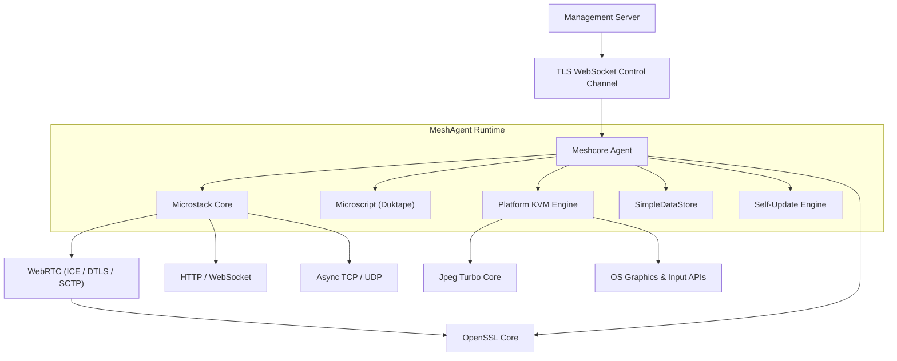
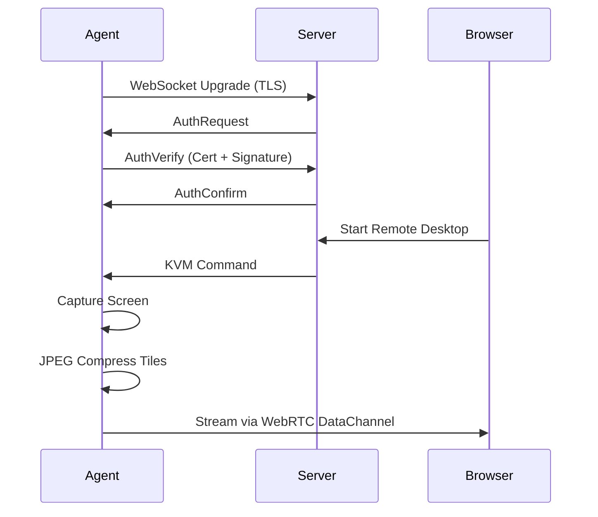

# Introduction to MeshAgent

MeshAgent is a **cross-platform, high-performance remote management agent** that powers the [Flamingo](https://flamingo.run) / [OpenFrame](https://openframe.ai) platform and MeshCentral-compatible infrastructures. Written in native C/C++ with an embedded JavaScript automation engine, it provides the low-level backbone for secure remote access, device monitoring, and IT automation at scale.

---

## What Is MeshAgent?

MeshAgent runs on managed endpoints — servers, workstations, and embedded devices — and maintains a persistent, encrypted control channel back to a management server. From that channel, operators can:

- Launch real-time **remote desktop sessions** (KVM) across Windows, Linux, and macOS
- Execute **JavaScript automation scripts** in a sandboxed engine
- Transfer files, manage services, and run terminal sessions
- Monitor device identity, hardware info, and connectivity
- Perform **over-the-air self-updates** with signature verification

As part of the Flamingo/OpenFrame ecosystem, MeshAgent is the open-source agent component that lets Mingo AI (technician automation) and Fae (client-facing intelligence) operate remotely on managed devices.

---

## Key Features

| Feature | Description |
|---|---|
| **Secure Control Channel** | TLS WebSocket connection to the management server with certificate-based mutual authentication |
| **Cross-Platform KVM** | Remote desktop capture and input injection on Windows (GDI/DXGI), Linux (X11/XShm), and macOS (CoreGraphics) |
| **Embedded JavaScript Engine** | Duktape-based scripting runtime with Node.js-like APIs for automation, accessible from the server side |
| **WebRTC Data Channels** | Peer-to-peer connectivity via ICE, DTLS, and SCTP for direct browser-to-agent streaming |
| **High-Performance JPEG Streaming** | Tile-based differential screen encoding via TurboJPEG with CRC change detection |
| **Self-Update Engine** | Secure in-place binary updates with digital signature validation |
| **OpenSSL Cryptography** | Full TLS/DTLS stack, X.509 certificates, RSA/EC key management |
| **Modular Async Networking** | Non-blocking TCP/UDP, HTTP client/server, WebSocket — all built on the Microstack reactor pattern |
| **OpenFrame Integration** | AES-256 encrypted token extraction for integration with the Flamingo/OpenFrame platform |

---

## Target Audience

MeshAgent is designed for:

- **MSP Engineers** deploying remote management infrastructure for client endpoints
- **Platform Integrators** embedding MeshAgent within Flamingo/OpenFrame or MeshCentral environments
- **Open-Source Contributors** extending agent capabilities or porting to new platforms
- **Security Researchers** studying the agent's cryptographic and sandboxing architecture

---

## Architecture Overview

MeshAgent is a **layered, event-driven runtime**. The core orchestrator (`meshcore`) drives all subsystems through a single-threaded, non-blocking reactor chain.

### Runtime Flow (Control + KVM)

---

## Core Modules at a Glance

| Module | Language | Role |
|---|---|---|
| `meshcore` | C | Agent orchestrator, control channel, cert auth, self-update |
| `microstack` | C | Async networking (TCP, HTTP, WebSocket, WebRTC) |
| `microscript` | C | Embedded Duktape JavaScript runtime |
| `meshcore/KVM` | C | Platform remote desktop engines (Windows/Linux/macOS) |
| `lib-jpeg-turbo` | C | High-speed JPEG tile compression |
| `openssl-1.1.1f` | C | Pinned OpenSSL 1.1.1f cryptographic library |
| `modules/` | JavaScript | Agent-side automation, installers, utilities |
| `openframe/` | C | OpenFrame/Flamingo platform integration |

---

## Part of the OpenFrame Ecosystem

MeshAgent is one component of the larger **OpenFrame** platform. OpenFrame unifies multiple MSP tools into a single AI-driven interface — MeshAgent provides the secure, native endpoint presence that makes remote operations possible.

Learn more:
- **Flamingo Platform:** https://flamingo.run
- **OpenFrame:** https://openframe.ai
- **Community (OpenMSP Slack):** https://www.openmsp.ai/

---

## Repository

- **Source:** https://github.com/flamingo-stack/meshagent
- **License:** Apache 2.0
