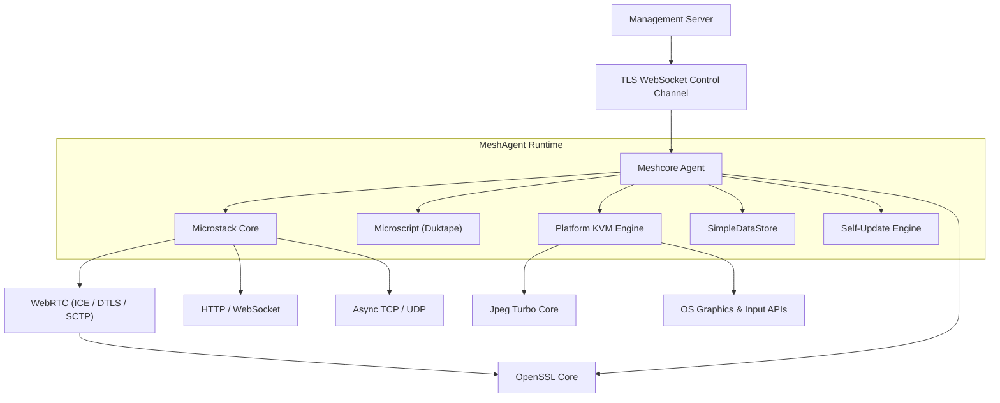
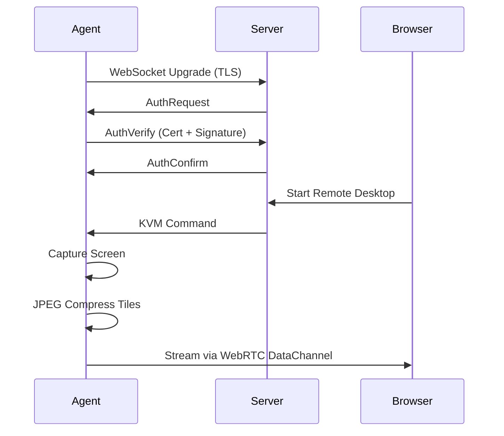
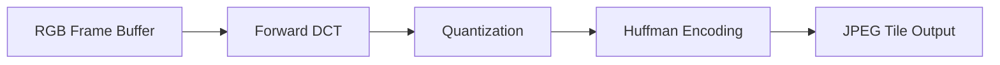
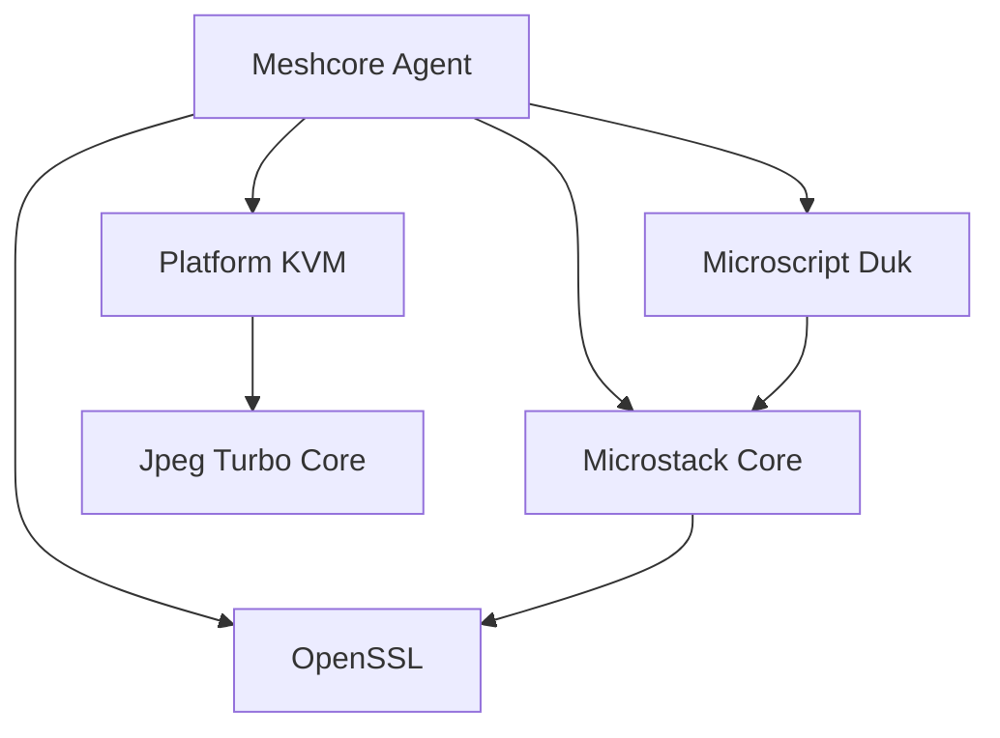

# MeshAgent Repository Overview

**Repository:** https://github.com/flamingo-stack/meshagent  
**Purpose:** Cross-platform, high-performance remote management agent powering Flamingo / OpenFrame and MeshCentral-compatible infrastructures.

MeshAgent is a native C/C++ remote management agent that provides:

- Secure control channel to a management server
- Remote desktop (KVM) across Windows, Linux, and macOS
- WebRTC data channels
- Embedded JavaScript automation engine (Duktape)
- TLS/DTLS cryptography via OpenSSL
- High-performance asynchronous networking (Microstack)
- JPEG-based screen streaming
- Self-update and certificate-based authentication

It is architected as a modular, layered runtime composed of reusable subsystems.

---

# End-to-End Architecture

The following diagram illustrates the full runtime architecture of MeshAgent:

---

# Runtime Flow (Control + KVM Example)

---

# Repository Structure & Core Modules

MeshAgent is composed of the following major modules:

---

## 1️⃣ Meshcore Agent (`meshcore`)

**Role:** Orchestrator and runtime container.

- Control channel management
- Certificate authentication
- CoreModule JavaScript execution
- Remote desktop session routing
- Self-update mechanism
- Persistent configuration

📖 Documentation:  
`meshcore-agent`

Key structure:
- `MeshAgentHostContainer`
- `MeshCommand_BinaryPacket_*`
- `SCRIPT_ENGINE_*`
- `RemoteDesktop_Ptrs`

---

## 2️⃣ Microstack Core (`microstack`)

**Role:** Asynchronous networking and protocol stack.

- Non-blocking TCP/UDP sockets
- HTTP client/server
- WebSocket support
- WebRTC (ICE, STUN, DTLS, SCTP)
- Process pipes
- Data store
- Remote logging
- IP monitoring

📖 Documentation:  
`microstack-core`

Core subsystems:
- Async Sockets
- Web Client and Server
- WebRTC
- Cryptography
- Data Store
- Remote Logging
- Process Pipe

---

## 3️⃣ Microscript Duk (`microscript`)

**Role:** Embedded JavaScript runtime layer.

- Duktape engine
- Node.js-like stream APIs
- EventEmitter
- File system bindings
- WebRTC bindings
- Crypto bindings
- Script container isolation

📖 Documentation:  
`microscript-duk`

Enables:
- CoreModule execution
- Secure remote automation
- Plugin-style scripting

---

## 4️⃣ Platform KVM Engines (`meshcore/KVM`)

Implements cross-platform remote desktop:

### Windows
- GDI/DXGI capture
- Multi-monitor support
- Touch injection
- Secure desktop handling

📖 `meshcore-kvm-windows`

### Linux
- X11 / XShm framebuffer capture
- Tile-based CRC diffing
- XTest input injection

📖 `meshcore-kvm-linux`

### macOS
- LaunchAgent reverse-connection model
- CoreGraphics capture
- Code-signature IPC validation
- TCC permission handling

📖 `meshcore-kvm-macos`

---

## 5️⃣ Jpeg Turbo Core (`lib-jpeg-turbo/includes`)

**Role:** High-performance JPEG compression engine.

Used by:
- KVM tile compression
- Lossless transforms
- TurboJPEG fast buffer APIs

📖 `jpeg-turbo-core`

Compression pipeline:

---

## 6️⃣ OpenSSL Core (`openssl-1.1.1f/include/openssl`)

**Role:** Cryptographic foundation (OpenSSL 1.1.1f).

- TLS / SSL
- X.509 certificates
- ASN.1 engine
- RSA / EC / DH
- Digest and MAC
- CMS / PKCS7 / PKCS12

📖 `openssl-core`

---

## 7️⃣ OpenSSL Include (`openssl/include/openssl`)

**Role:** OpenSSL 3.x header interface layer.

- Provider-based architecture
- EVP_KDF / EVP_MAC
- OSSL_PARAM
- Modernized crypto abstraction

📖 `openssl-include`

---

## 8️⃣ WebRTC Samples (`samples/webrtc`)

Reference implementations:

- C-based rendezvous server
- Native Microstack WebRTC console sample
- C# WinForms WebRTC wrapper

📖 `samples-webrtc`

---

# Core Design Principles

### ✅ Event-Driven Architecture
Built on `ILibChain` reactor pattern — single-threaded, non-blocking core.

### ✅ Platform Abstraction
KVM engines isolated per OS.

### ✅ Secure-by-Default
- TLS everywhere
- Certificate pinning
- Code-signature validation (macOS)
- Secure desktop handling (Windows)

### ✅ Modular Composition
Each subsystem (JPEG, TLS, WebRTC, Scripting) can evolve independently.

### ✅ Performance-Oriented
- Tile-based differential encoding
- CRC change detection
- TurboJPEG acceleration
- Zero-copy async sockets

---

# High-Level Module Dependency Graph

---

# Summary

The **meshagent** repository implements a complete, production-grade remote management agent with:

- Secure TLS control channel
- WebRTC streaming
- Cross-platform remote desktop
- Embedded scripting runtime
- High-performance asynchronous networking
- Certificate-based authentication
- Self-updating capability

It combines:

- `meshcore-agent` (runtime orchestrator)
- `microstack-core` (networking)
- `microscript-duk` (JavaScript engine)
- `meshcore-kvm-*` (remote desktop backends)
- `jpeg-turbo-core` (screen compression)
- `openssl-core` / `openssl-include` (cryptography)

Together, these modules form a highly modular, portable, and security-focused remote management system suitable for MSP platforms such as Flamingo / OpenFrame.

---

**Repository:**  
https://github.com/flamingo-stack/meshagent