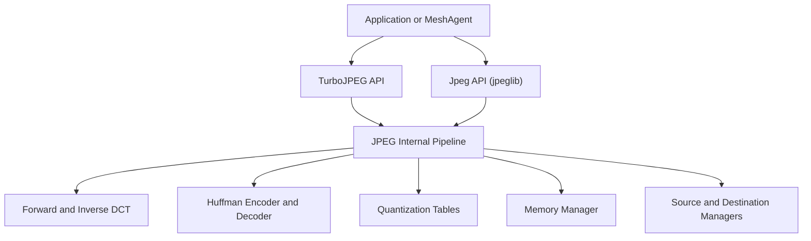
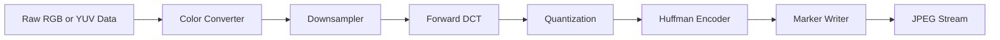
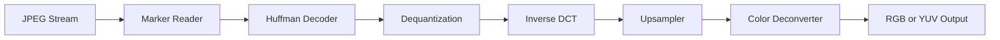
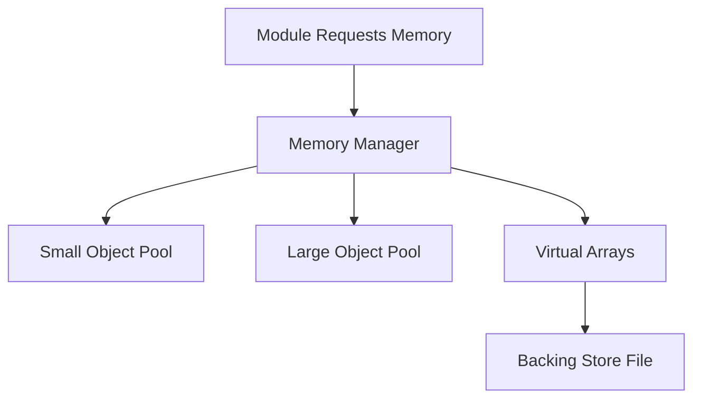
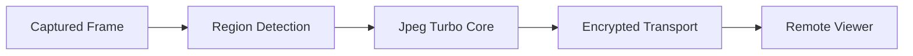

# Jpeg Turbo Core

## Overview

The **Jpeg Turbo Core** module provides the embedded JPEG compression, decompression, transformation, and in-memory acceleration capabilities used by the MeshAgent runtime. It is based on libjpeg-turbo and exposes both the classic IJG-style API (`jpeglib`) and the high-performance TurboJPEG API (`turbojpeg`).

Within the larger MeshAgent architecture, Jpeg Turbo Core is primarily responsible for:

- Encoding raw pixel buffers into JPEG streams
- Decoding JPEG streams into RGB or YUV buffers
- Performing lossless JPEG transformations (rotate, flip, crop)
- Managing entropy coding (Huffman), quantization, DCT/IDCT
- Providing memory management and virtual buffer abstractions

This module is performance-critical in remote desktop and KVM scenarios, where screen regions are repeatedly compressed and transmitted.

---

## High-Level Architecture

Jpeg Turbo Core is layered into three primary API tiers:

1. **Application API (jpeglib)** – Standard JPEG compression/decompression interface
2. **Internal Pipeline (jpegint)** – Modular compression/decompression controllers
3. **TurboJPEG API (turbojpeg)** – High-performance in-memory interface

The internal pipeline is modular. Each stage is represented by a controller structure with function pointers, enabling flexible configuration for compression, decompression, progressive mode, and lossless transforms.

---

## Core Public API Layer

### Common Structures

The public-facing API is defined primarily in `jpeglib` and centers around two master structures:

- `jpeg_compress_struct`
- `jpeg_decompress_struct`

Both extend `jpeg_common_struct`, which includes:

- Error manager
- Memory manager
- Progress manager
- Global state machine

These structures coordinate all internal modules through embedded controller pointers such as:

- `jpeg_c_main_controller`
- `jpeg_c_coef_controller`
- `jpeg_entropy_encoder`
- `jpeg_d_main_controller`
- `jpeg_d_coef_controller`
- `jpeg_entropy_decoder`
- `jpeg_inverse_dct`
- `jpeg_upsampler`

This design enables runtime polymorphism in C via function pointers.

---

## Compression Pipeline

The compression process transforms raw image data into a JPEG bitstream.

### Key Components

- **Color Conversion** (`jpeg_color_converter`)  
  Converts RGB to YCbCr when required.

- **Downsampler** (`jpeg_downsampler`)  
  Applies chroma subsampling (4:2:0, 4:2:2, etc.).

- **Forward DCT** (`jpeg_forward_dct`)  
  Converts spatial domain 8x8 blocks into frequency coefficients.

- **Quantization Tables** (`JQUANT_TBL`)  
  Reduce precision of DCT coefficients.

- **Huffman Encoder** (`jpeg_entropy_encoder`, `c_derived_tbl`)  
  Performs entropy coding using derived Huffman tables.

- **Marker Writer** (`jpeg_marker_writer`)  
  Writes SOI, SOF, SOS, DQT, DHT, EOI markers.

---

## Decompression Pipeline

The decompression process reverses compression and reconstructs pixel data.

### Key Components

- **Marker Reader** (`jpeg_marker_reader`)  
  Parses headers and scan markers.

- **Huffman Decoder** (`jpeg_entropy_decoder`, `d_derived_tbl`)  
  Uses fast bit-buffer logic and lookup tables.

- **Bit Buffer Management** (`bitread_perm_state`, `bitread_working_state`)  
  Handles optimized bit-level extraction.

- **Inverse DCT** (`jpeg_inverse_dct`)  
  Converts frequency coefficients back to pixel samples.

- **Upsampler** (`jpeg_upsampler`)  
  Reconstructs chroma resolution.

- **Color Deconverter** (`jpeg_color_deconverter`)  
  Converts YCbCr back to RGB when required.

---

## Internal Controllers and State Machines

The module uses explicit state constants such as:

- `CSTATE_START`, `CSTATE_SCANNING`
- `DSTATE_START`, `DSTATE_SCANNING`, `DSTATE_STOPPING`

These enforce correct call sequencing and protect against invalid API usage.

The decompression master controller (`jpeg_decomp_master`, `my_decomp_master`) manages:

- Multi-pass quantization
- Progressive scan handling
- Upsampling strategy selection

The coefficient controllers (`jpeg_c_coef_controller`, `jpeg_d_coef_controller`, `my_coef_controller`) manage MCU-level buffering and progressive scan assembly.

---

## Memory Management

Memory allocation is abstracted through `jpeg_memory_mgr`.

Responsibilities include:

- Small and large object allocation
- Virtual sample arrays (`jvirt_sarray_control`)
- Virtual block arrays (`jvirt_barray_control`)
- Backing store management (`backing_store_info`)

This enables:

- Memory pool lifetimes (permanent vs image scope)
- Optional disk-backed storage
- Controlled maximum memory usage

---

## TurboJPEG Acceleration Layer

The TurboJPEG API provides a simplified, high-performance interface:

- `tjInitCompress`, `tjCompress2`
- `tjInitDecompress`, `tjDecompress2`
- `tjTransform`

Key data structures include:

- `tjscalingfactor`
- `tjregion`
- `tjtransform`

TurboJPEG bypasses much of the traditional scanline API and operates directly on in-memory buffers, making it ideal for:

- Remote desktop streaming
- Real-time video frame compression
- Region-based updates

It supports:

- Multiple chroma subsampling modes
- Bottom-up pixel order
- Fast DCT and fast upsampling flags
- Lossless rotation and cropping

---

## Lossless Transform Support

The transformation utilities (`jpeg_transform_info`) allow:

- Rotation (90, 180, 270 degrees)
- Horizontal and vertical flips
- Transpose and transverse transforms
- Lossless cropping
- Grayscale forcing

Transforms operate at the DCT coefficient level, avoiding recompression artifacts.

---

## Entropy Coding Internals

Huffman encoding and decoding are performance-sensitive components.

Key mechanisms include:

- Derived Huffman tables (`c_derived_tbl`, `d_derived_tbl`)
- Lookahead tables for fast decoding
- Inline bit-buffer macros (`GET_BITS`, `PEEK_BITS`, `DROP_BITS`)

These optimizations significantly reduce CPU overhead during:

- Screen region compression
- Progressive JPEG decoding

---

## Integration Within MeshAgent

In MeshAgent, Jpeg Turbo Core typically operates in conjunction with:

- Platform-specific KVM modules (Linux, macOS, Windows)
- Network transport layers
- Zlib compression modules

A typical remote desktop flow:

The module’s performance and memory efficiency directly impact:

- Bandwidth usage
- Frame latency
- CPU utilization on embedded devices

---

## Summary

The **Jpeg Turbo Core** module is a highly modular, performance-optimized JPEG engine that provides:

- Standards-compliant JPEG encoding and decoding
- Advanced progressive and multi-pass support
- Lossless coefficient-domain transformations
- Virtual memory-backed buffering
- High-speed TurboJPEG APIs for real-time use

Its layered controller architecture, optimized entropy coding, and memory abstraction make it well-suited for high-frequency image processing workloads such as remote desktop streaming within MeshAgent.
