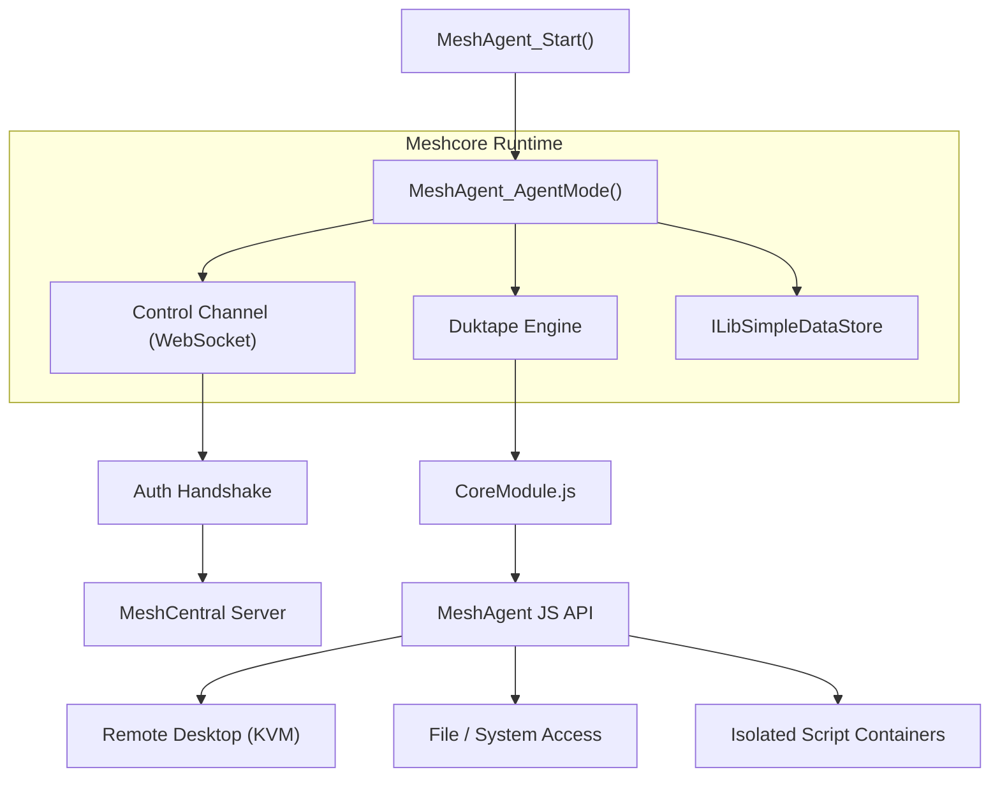
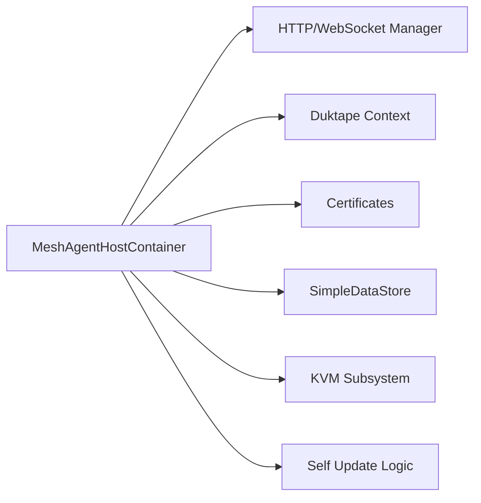
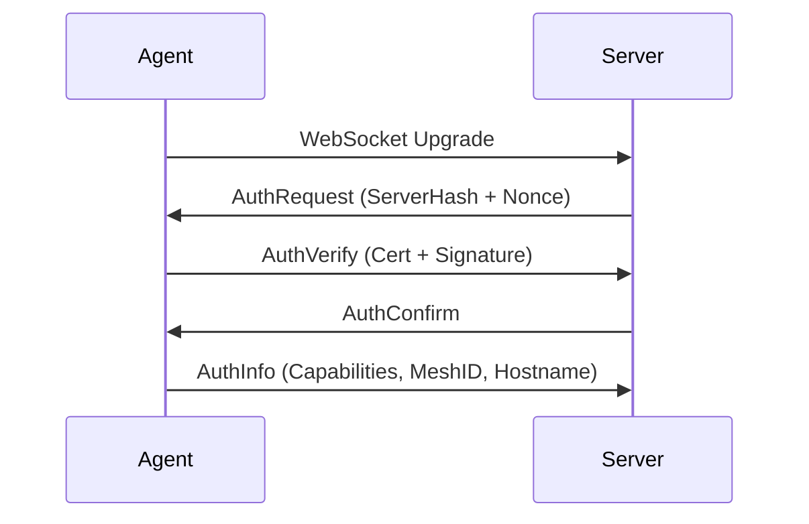
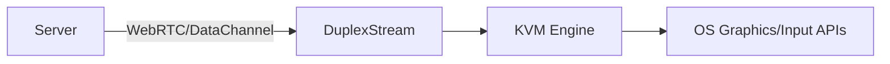
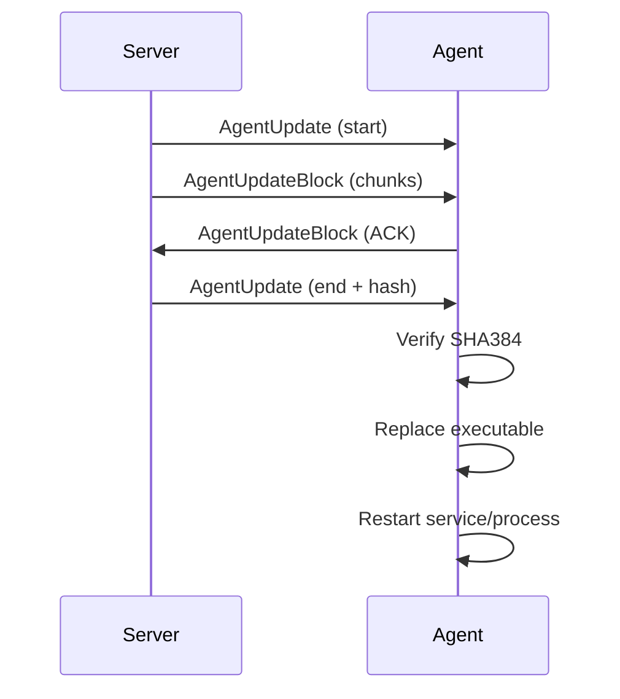
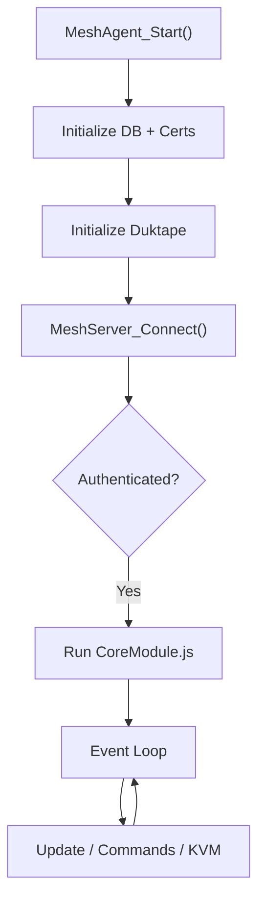

# Meshcore Agent

Meshcore Agent is the core runtime module of the MeshAgent binary. It is responsible for:

- Establishing and maintaining the secure control channel to the MeshCentral server
- Hosting and executing the JavaScript Core Module (MeshCore)
- Managing authentication, certificates, and self‑update
- Providing Remote Desktop (KVM), scripting, and system integration services
- Exposing the native agent capabilities to the embedded Duktape JavaScript engine

This module acts as the **orchestrator** between the network stack (Microstack), cryptography (OpenSSL / WinCrypto), compression (zlib), and the embedded scripting engine.

---

## Architecture Overview

At runtime, Meshcore Agent wires together networking, cryptography, storage, and scripting into a single event‑driven system.

### Key Responsibilities

| Area | Responsibility |
|------|---------------|
| Networking | WebSocket control channel, multicast discovery, proxy handling |
| Security | TLS authentication, certificate validation, signature checks |
| Scripting | Duktape engine hosting CoreModule and isolated script contexts |
| Remote Access | KVM / Remote Desktop stream bridging |
| Persistence | Configuration and state via SimpleDataStore |
| Updates | Self-update and core module hot‑swap |

---

## Core Runtime Container

The central structure is:

- `MeshAgentHostContainer`

This structure maintains all runtime state:

- Control channel state (`controlChannel`, `serverAuthState`)
- Certificates (`selfcert`, `selftlscert`)
- JavaScript contexts (`meshCoreCtx`, `bootstrapCoreCtx`)
- Persistent storage (`masterDb`)
- Update flags and capabilities
- Platform and service metadata

Conceptually:

All major subsystems attach back to this container.

---

## Control Channel and Authentication

Meshcore Agent connects to the MeshCentral server using a WebSocket over TLS.

### Authentication Flow

Binary packets used in the handshake:

- `MeshCommand_BinaryPacket_ServerId`
- `MeshCommand_BinaryPacket_AuthRequest`
- `MeshCommand_BinaryPacket_AuthVerify`
- `MeshCommand_BinaryPacket_AuthInfo`

High-level handshake:

Authentication ensures:

- The server certificate matches the expected `ServerID`
- The agent proves possession of its private key
- Both sides validate nonce-based signatures

Once `serverAuthState == 3`, the control channel is fully authenticated.

---

## JavaScript Engine Integration (Duktape)

Meshcore Agent embeds Duktape and exposes a native `MeshAgent` object.

### MeshAgent JavaScript API

The native binding (`ILibDuktape_MeshAgent_PUSH`) exposes:

- Events: `Ready`, `Connected`, `Command`, `DesktopSessionChanged`
- Methods: `SendCommand()`, `getRemoteDesktopStream()`, `ExecPowerState()`
- Properties: `ServerUrl`, `ServerInfo`, `updatesEnabled`

The Core Module (`CoreModule.js`) is:

- Retrieved from the server (or local file in OpenFrame mode)
- Stored in `SimpleDataStore`
- Dynamically compiled and executed

### Script Isolation

Structures:

- `SCRIPT_ENGINE_ISOLATION`
- `SCRIPT_ENGINE_COMMAND_HEADER`
- `SCRIPT_ENGINE_COMMAND_EXEC_STR_DATA`
- `SCRIPT_ENGINE_COMMAND_DB_GET_DATA`

Isolated script containers run with:

- Explicit security flags
- Execution timeouts
- Controlled DB access

This enables safe execution of remote automation scripts.

---

## Remote Desktop (KVM) Integration

Remote Desktop support is abstracted via:

- `RemoteDesktop_Ptrs`
- Platform-specific KVM implementations (Windows, Linux, macOS)

Data path:

Meshcore Agent bridges:

- WebRTC data channels (via Microstack WebRTC)
- Native OS capture/input
- Duplex stream exposed to JavaScript

On macOS, domain sockets are used for privilege-separated KVM handling.

---

## Persistence and Configuration

Meshcore Agent uses:

- `ILibSimpleDataStore`

Stored keys include:

- `MeshServer`
- `ServerID`
- `MeshID`
- `CoreModule`
- `SelfNodeCert`
- `disableUpdate`

The datastore is used for:

- Core module caching
- Certificate persistence
- Update state
- Service configuration

---

## Self-Update Mechanism

Update-related commands:

- `MeshCommand_AgentHash`
- `MeshCommand_AgentUpdate`
- `MeshCommand_AgentUpdateBlock`

Update flow:

Security checks include:

- SHA384 binary hash verification
- Signature validation (Windows Authenticode or embedded signature)

---

## Compression and Data Handling

Meshcore Agent embeds zlib:

- `deflate` / `inflate` state machines
- Gzip and raw deflate support

Used for:

- Core module compression (`MeshCommand_CompressedCoreModule`)
- Data transport optimization

The module integrates tightly with Microstack WebSocket framing.

---

## Platform Abstraction

Platform-specific behaviors include:

- Windows: WinCrypto, service mode, DPI awareness
- Linux: POSIX signals, fork/exec helpers, network interface parsing
- macOS: LaunchAgent, TCC permission handling, domain sockets

Platform type is tracked via:

- `MeshAgent_Posix_PlatformTypes`
- `AgentIdentifiers`

---

## Lifecycle Summary

---

## Role in the Overall System

Within the full MeshAgent stack:

- `microstack-core` → Networking and WebRTC
- `openssl-core` / `wincrypto` → Cryptography
- `jpeg-turbo-core` → Screen encoding for KVM
- `microscript-duk` → JavaScript runtime

**Meshcore Agent** is the integration layer that binds these modules into a functioning remote management agent.

It is the operational heart of the MeshAgent binary.
