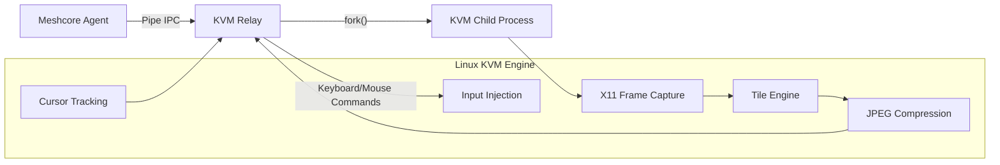
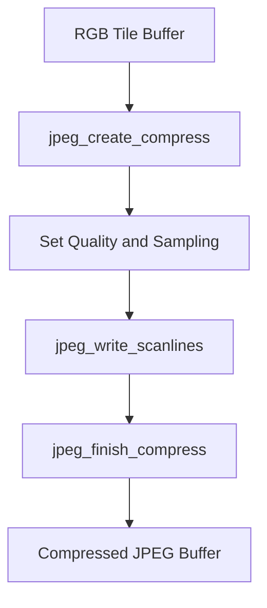
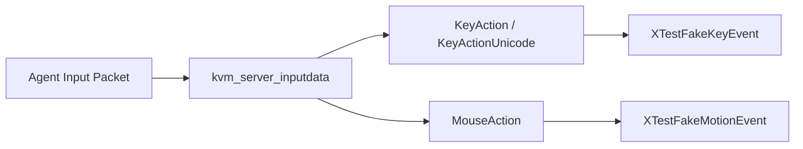
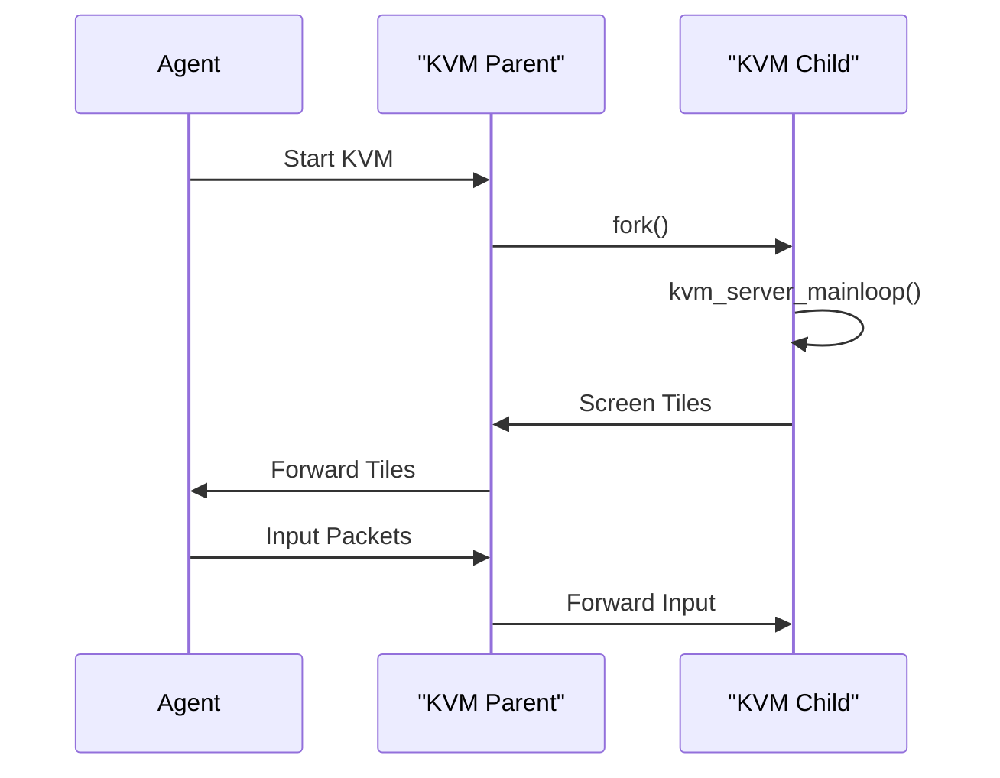
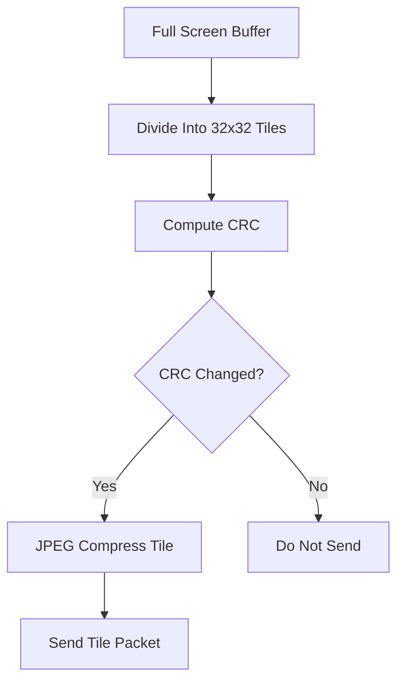

# Meshcore Kvm Linux

## Overview

The **Meshcore Kvm Linux** module implements the Linux-specific Keyboard, Video, and Mouse (KVM) engine for the MeshAgent platform. It enables remote desktop streaming and input injection on Linux systems using X11.

This module is responsible for:

- Capturing the Linux desktop framebuffer using X11 and XShm
- Splitting the screen into tiles for efficient change detection
- Compressing tiles using JPEG
- Injecting keyboard and mouse events via XTest and XKB
- Managing display switching and cursor tracking
- Running as a forked child process and communicating with the Meshcore Agent via pipes

Meshcore Kvm Linux works in conjunction with the core agent and microstack infrastructure. For the generic KVM abstractions, see the parent KVM modules in the repository structure.

---

## High-Level Architecture



### Key Concepts

- **Process Isolation**: The KVM engine runs in a forked child process.
- **Shared Memory Capture**: Uses XShm for high-performance framebuffer access.
- **Tile-Based Encoding**: Screen is divided into fixed-size tiles.
- **CRC Change Detection**: Tiles are only transmitted if changed.
- **Pipe-Based IPC**: Communication between agent and KVM child.

---

## Module Components

The Meshcore Kvm Linux module is composed of four major areas:

1. Linux Compression
2. Linux Events
3. Linux KVM Core
4. Linux Tile Engine

---

# Linux Compression

**Core components:**
- `jpeg_compress_struct`
- `jpeg_destination_mgr`

The Linux Compression layer provides JPEG encoding for tile image data.

### Responsibilities

- Configure libjpeg compression context
- Allocate and grow output buffers dynamically
- Encode RGB image buffers (4:4:4 sampling)
- Forward compression errors to the KVM layer

### Compression Flow



### Key Characteristics

- No chroma subsampling (1x1, 4:4:4)
- Configurable quality level
- Dynamic buffer expansion
- Hard tile size limit via `MAX_TILE_SIZE`

Compression is triggered by the tile engine after change detection.

---

# Linux Events

**Core components:**
- `keymap_t`
- `x11_struct`
- `x11tst_struct`
- `xkb_struct`

The Linux Events layer provides abstraction over X11 dynamic loading and input injection.

### Responsibilities

- Dynamically load X11, XTest, XKB libraries
- Translate virtual key codes to X11 keycodes
- Inject keyboard and mouse events
- Support Unicode key mapping
- Track modifier state (NumLock, CapsLock, ScrollLock)

### Input Injection Architecture



### Unicode Mapping Strategy

- Convert Unicode to `UXXXX` string
- Use `XStringToKeysym`
- Dynamically map to unused keycode
- Clean up mappings on shutdown

This allows full Unicode input injection even when no direct keycode mapping exists.

---

# Linux KVM Core

**Core components:**
- `XkbStateNotifyEvent`
- `_XkbStateNotifyEvent`
- `bitmapdata`
- `bitmapdata2`
- `kvm_keydata`
- `sigaction`
- `tileInfo_t`
- `x11ext_struct`
- `xfixes_struct`

The Linux KVM Core coordinates screen capture, event handling, IPC messaging, cursor detection, and process lifecycle.

## Process Model



## Screen Capture Pipeline

1. Open X11 display
2. Create shared memory image via XShm
3. Capture root window
4. Overlay cursor (optional)
5. Convert to internal buffer
6. Pass to tile engine

### Cursor Handling

- Uses XFixes to detect cursor changes
- Falls back to CRC-based alpha detection
- Sends cursor type updates to agent
- Optionally renders cursor directly into framebuffer

## Display Switching

- Supports multiple X11 screens
- Dynamically recalculates:
  - Screen width
  - Screen height
  - Tile grid dimensions
- Sends updated resolution packet

## IPC Message Types

Handled inside `kvm_server_inputdata()`:

- Key events
- Unicode key events
- Mouse movement/click
- Compression settings
- Refresh
- Pause
- Frame rate changes
- Display switching

---

# Linux Tile Engine

**Core component:**
- `tileInfo_t`

The Tile Engine optimizes bandwidth by dividing the screen into fixed-size tiles.

### Tile Structure

```text
struct tileInfo_t {
    int crc;
    enum TILE_FLAGS_ENUM flag;
}
```

### Tile Flags

- `TILE_TODO`
- `TILE_SENT`
- `TILE_MARKED_NOT_SENT`
- `TILE_DONT_SEND`

### Tile Workflow



### Characteristics

- Default tile size: 32x32
- CRC-based change detection
- Adjustable compression level
- Adjustable scaling factor
- Adjustable frame rate timer

---

## Cursor Rendering and BitBlt

The module includes custom alpha blending logic:

- Extract cursor bitmap
- Perform rectangle extraction
- Overlay onto framebuffer
- Optionally invert colors for visibility

This allows remote cursor display even when native cursor rendering is unavailable.

---

## Lifecycle Management

### Startup

1. `kvm_relay_setup()`
2. `fork()`
3. `kvm_server_mainloop()`
4. Initialize X11 and extensions
5. Send resolution and display info

### Shutdown

- Signal handler sets `g_shutdown`
- Unmap Unicode keys
- Close displays
- Free shared memory
- Free tile buffers
- Terminate child process

---

## Performance Characteristics

- Shared memory capture (XShm)
- Tile-level differential encoding
- JPEG compression per tile
- Adjustable frame pacing
- Non-blocking pipe I/O

This design enables efficient remote desktop streaming even on constrained systems.

---

## Interaction With Other Modules

Meshcore Kvm Linux integrates with:

- **Meshcore Agent** for command routing and transport
- **Microstack Core** for IPC and process pipe management
- **JPEG Turbo Core** for compression primitives

The Linux implementation parallels the macOS and Windows KVM modules but uses X11-specific mechanisms.

---

## Summary

The **Meshcore Kvm Linux** module provides a fully self-contained Linux remote desktop engine built on top of X11. Its architecture combines:

- Shared memory framebuffer capture
- Tile-based delta encoding
- JPEG compression
- XTest input injection
- Cursor tracking via XFixes
- Process isolation via fork
- Pipe-based IPC integration

This design ensures performance, modularity, and safe isolation from the main MeshAgent process while enabling full-featured remote desktop functionality on Linux systems.
