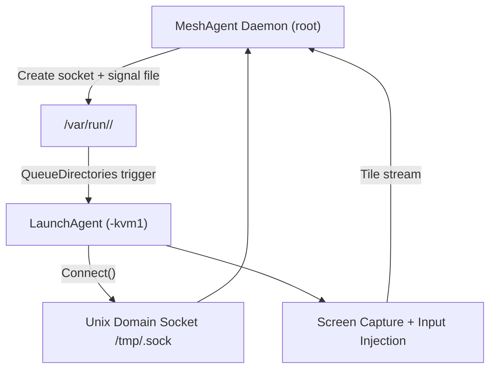
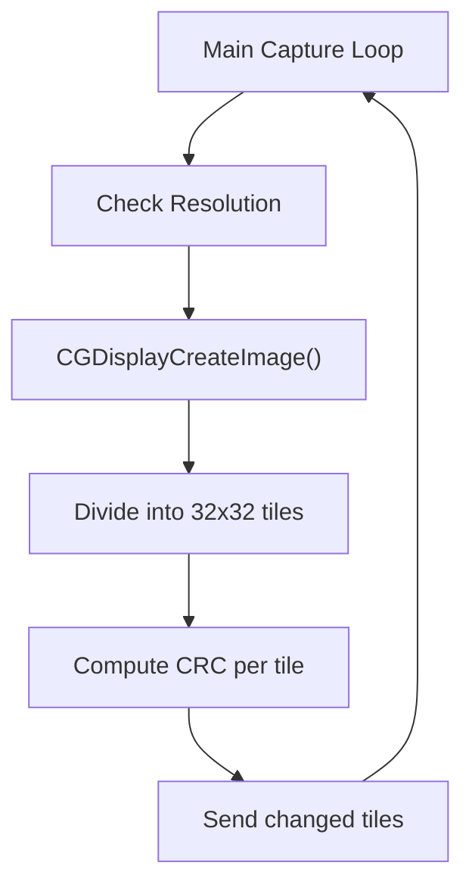
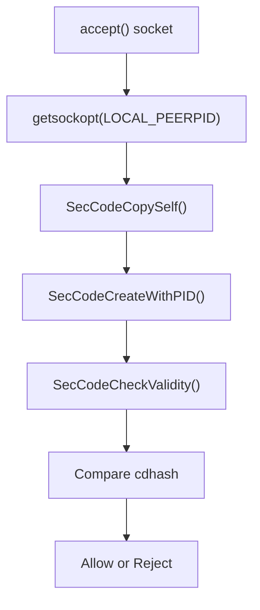
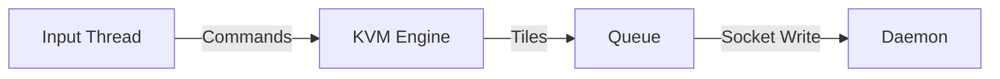

# Meshcore Kvm Macos

## Overview

The **Meshcore Kvm Macos** module implements the macOS-specific Keyboard, Video, and Mouse (KVM) remote desktop functionality for the MeshAgent platform. It is responsible for:

- Capturing the macOS desktop in real time
- Splitting the screen into tiles and streaming compressed updates
- Injecting keyboard and mouse input into the local system
- Managing a secure IPC channel between the main MeshAgent daemon and the `-kvm1` LaunchAgent process
- Enforcing code-signature validation for KVM socket connections
- Handling macOS privacy permissions (Screen Recording, Accessibility, Full Disk Access)

Unlike Linux and Windows implementations, macOS uses a **reversed architecture** to comply with Apple’s bootstrap namespace and session restrictions.

---

## Architectural Context

Within the overall MeshAgent architecture, the Meshcore Kvm Macos module works alongside:

- **meshcore-agent** – Core agent logic and remote desktop control plane
- **microstack-core** – Async socket, queue, and utility primitives (ILibAsyncSocket, ILibQueue, etc.)
- **meshcore-kvm-linux / windows** – Platform-specific KVM implementations

On macOS, KVM is implemented as a cooperative system between:

1. The main MeshAgent daemon (running as root).
2. A per-user LaunchAgent (`-kvm1`) process.

---

## Reversed KVM Architecture (macOS)

macOS restricts GUI and input operations to the active user session. To comply with this:

- The main daemon **does not spawn** the KVM process.
- Instead, it creates a Unix domain socket and a signal file.
- A LaunchAgent monitors a directory using `QueueDirectories`.
- When a signal file appears, the LaunchAgent starts `-kvm1`.
- The `-kvm1` process connects *back* to the daemon’s socket.

### High-Level Flow



This design:

- Ensures `-kvm1` runs in the correct GUI session (Aqua/LoginWindow).
- Avoids Apple bootstrap namespace issues.
- Keeps session lifecycle tied to directory state.

---

## Module Components

The Meshcore Kvm Macos module is composed of four primary areas:

1. **Event Injection Layer** (`mac_events.h`)
2. **Core KVM Engine** (`mac_kvm.c`)
3. **Tile Processing Layer** (`mac_tile.h`)
4. **Code-Signature Authentication** (`mac_kvm_auth.c`)

---

# 1. Event Injection Layer

**Core Component:**
- `meshagent.meshcore.KVM.MacOS.mac_events.keymap_t`

This layer maps virtual key codes to macOS key events and exposes:

- `MouseAction()` – Injects mouse position, button, and wheel events
- `KeyAction()` – Injects virtual key up/down
- `KeyActionUnicode()` – Injects Unicode key events

### Key Mapping Structure

```c
struct keymap_t {
  unsigned int keycode;
  unsigned char vk;
};
```

The file defines a full Windows-style `VK_*` virtual key mapping set so that the control plane can remain platform-neutral.

### Responsibilities

- Translate cross-platform virtual keys into macOS-compatible events.
- Normalize mouse button flags.
- Provide abstraction so upper layers do not depend on Carbon or CoreGraphics directly.

---

# 2. Core KVM Engine

**Core Components:**
- `meshagent.meshcore.KVM.MacOS.mac_kvm.dirent`
- `meshagent.meshcore.KVM.MacOS.mac_kvm.passwd`
- `meshagent.meshcore.KVM.MacOS.mac_kvm.sockaddr`
- `meshagent.meshcore.KVM.MacOS.mac_kvm.sockaddr_un`
- `meshagent.meshcore.KVM.MacOS.mac_kvm.tileInfo_t`

This is the heart of the module.

## Responsibilities

- Manage KVM session lifecycle
- Create and manage Unix domain sockets
- Capture screen frames via CoreGraphics
- Divide screen into tiles
- Send compressed tile updates
- Handle input messages from daemon
- Handle pause, refresh, and reconnection logic
- Manage macOS permissions

---

## Session Lifecycle

### Session Creation

`kvm_create_session()`:

1. Builds dynamic paths using `serviceID`
2. Creates listener socket `/tmp/<serviceId>.sock`
3. Creates queue directory `/var/run/<serviceId>/`
4. Creates signal file `session-active`
5. Forces LaunchAgent bootstrap
6. Waits for `accept()` from `-kvm1`

### Session Cleanup

`kvm_cleanup_session()`:

- Closes socket
- Removes signal file
- Clears queue directory
- Causes LaunchAgent to exit

---

## IPC Model

The daemon and `-kvm1` communicate using a Unix domain socket.

### Message Format

All messages are prefixed with:

```text
uint16 type
uint16 size
payload...
```

### Input Handling

`kvm_server_inputdata()` processes:

- `MNG_KVM_KEY`
- `MNG_KVM_KEY_UNICODE`
- `MNG_KVM_MOUSE`
- `MNG_KVM_REFRESH`
- `MNG_KVM_PAUSE`
- `MNG_KVM_COMPRESSION`

Each command triggers appropriate injection or tile reset behavior.

---

## Screen Capture Pipeline

### Capture Loop



### Key Concepts

- Screen captured via `CGDisplayCreateImage()`.
- Tile size: `32x32` pixels.
- CRC used to detect tile changes.
- Only changed tiles transmitted.
- Compression ratio configurable.
- Resolution always sent before tile stream.

---

# 3. Tile Processing Layer

**Core Component:**
- `meshagent.meshcore.KVM.MacOS.mac_tile.tileInfo_t`

### Tile Metadata

```c
struct tileInfo_t {
    int crc;
    enum TILE_FLAGS_ENUM flag;
};
```

### Tile States

- `TILE_TODO`
- `TILE_SENT`
- `TILE_MARKED_NOT_SENT`
- `TILE_DONT_SEND`

### Responsibilities

- Maintain per-tile CRC
- Track which tiles need transmission
- Extract tile buffers from full desktop frame
- Apply compression

This layer isolates image diffing from transport logic.

---

# 4. Code-Signature Authentication

**Core Component:**
- `meshagent.meshcore.KVM.MacOS.mac_kvm_auth.xucred`

The module enforces strict peer validation.

## Verification Flow



### Security Guarantees

- Only binaries signed with the same code directory hash can connect.
- Prevents rogue local processes from attaching to KVM socket.
- Mitigates PID reuse attacks.

---

# Permission Handling

macOS requires explicit user approval for:

- Screen Recording (10.15+)
- Accessibility (for input injection)
- Full Disk Access (optional)

### Screen Recording

- Checked with `CGPreflightScreenCaptureAccess()`
- Requested with `CGRequestScreenCaptureAccess()`

### Accessibility

- Requested via `AXIsProcessTrustedWithOptions()`

### Full Disk Access

- Checked by probing protected files
- GUI helper may be implemented separately

---

# Threading Model

The KVM engine uses:

- Main capture loop thread
- Input thread (`kvm_mainloopinput`)
- ILibQueue for outgoing message buffering

### Data Flow



---

# Differences from Linux and Windows

| Feature | macOS | Linux | Windows |
|----------|--------|--------|----------|
| Process model | LaunchAgent reverse connect | Child process | Child process |
| IPC | Unix domain socket | Pipe/socket | Pipe |
| Security | Code-sign validation | User/session checks | Session token checks |
| Screen capture | CoreGraphics | X11/Wayland | GDI/DXGI |
| Permissions | TCC (Screen Recording) | None (traditional) | UAC/Session |

---

# Error Handling & Recovery

The module supports:

- Automatic socket reconnect
- Resolution change detection
- Immediate resolution resend on refresh
- Graceful shutdown via signal
- Session restart via directory state

If socket breaks:

- `g_resetipc` triggers reconnect logic.
- Session remains active unless explicitly cleaned.

---

# Key Design Principles

1. **Session correctness over convenience** – Always run in correct GUI context.
2. **Security first** – Code-signature enforcement for IPC.
3. **Bandwidth efficiency** – Tile-based CRC diffing.
4. **Permission-aware** – Graceful handling of TCC restrictions.
5. **Clear separation of concerns** – Capture, compression, transport, injection.

---

# Summary

The **Meshcore Kvm Macos** module delivers a secure, high-performance remote desktop implementation tailored to macOS’s security and session constraints.

By combining:

- LaunchAgent-triggered reverse connections,
- Code-signature validation,
- Tile-based incremental updates,
- Native CoreGraphics capture,
- And strict permission management,

it provides a robust KVM backend fully aligned with Apple’s platform architecture while remaining compatible with MeshAgent’s cross-platform remote desktop protocol.
