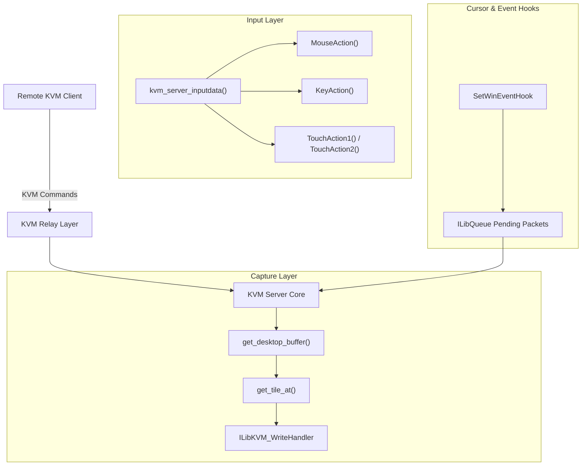
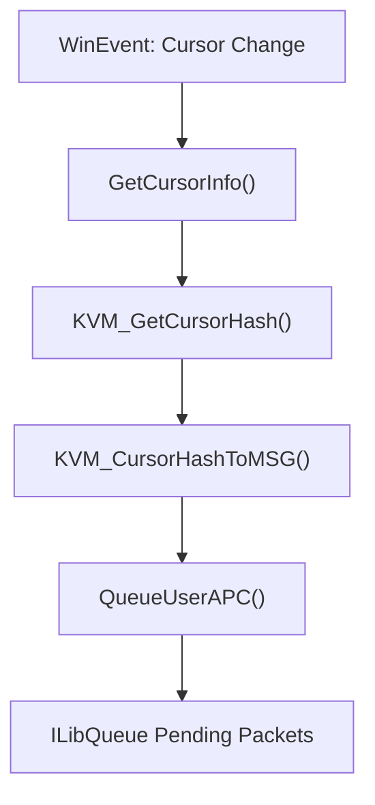
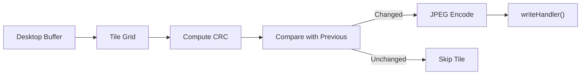
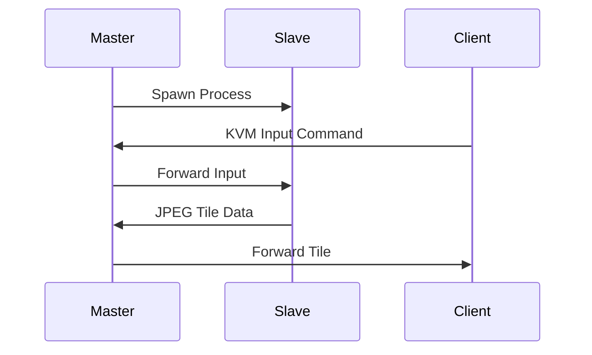
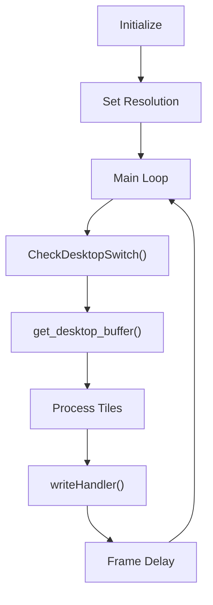

# Meshcore Kvm Windows

## Overview

The **Meshcore Kvm Windows** module implements the Windows-specific backend for MeshAgent's remote desktop (KVM – Keyboard, Video, Mouse) functionality. It is responsible for:

- Capturing the Windows desktop framebuffer
- Detecting screen changes using tile-based CRC comparison
- Encoding screen regions into compressed JPEG tiles
- Injecting keyboard, mouse, and touch input into the local session
- Handling multi-monitor environments
- Managing session lifecycle in both console and Windows Service modes

This module integrates tightly with:

- The agent core messaging layer
- The Microstack async networking and process pipeline
- The JPEG compression stack
- Windows APIs (GDI, User32, Desktop, Input, SAS)

It is the Windows counterpart to:

- Meshcore Kvm Linux
- Meshcore Kvm Macos

---

## High-Level Architecture

The module is organized around three primary responsibilities:

1. **Input Injection** (keyboard, mouse, touch)
2. **Screen Capture & Tile Encoding**
3. **Session & Relay Management**



---

## Core Components

The module is implemented across three primary source files:

- `input.c`
- `kvm.c`
- `tile.h`

Each is described below.

---

# Input Subsystem

**File:** `meshcore/KVM/Windows/input.c`

## Purpose

The input subsystem is responsible for:

- Injecting keyboard events
- Injecting mouse events
- Injecting Unicode keystrokes
- Injecting touch input (Windows 8+)
- Tracking cursor shape and position changes
- Synchronizing lock-key state (Caps, Num, Scroll)

---

## Key Data Structures

### POINTER_INFO
### POINTER_TOUCH_INFO
### tagPOINTER_INFO
### tagPOINTER_TOUCH_INFO

These structures mirror Windows pointer and touch injection APIs and are used when injecting touch input via dynamically loaded functions:

- `InitializeTouchInjection`
- `InjectTouchInput`

They allow multi-touch support with:

- Contact area
- Pressure
- Orientation
- Per-contact flags

---

## Mouse & Keyboard Injection

### MouseAction()

Uses the Windows `SendInput()` API with:

- `MOUSEEVENTF_ABSOLUTE`
- `MOUSEEVENTF_VIRTUALDESK`
- Optional wheel support

Coordinates are scaled relative to:

- Virtual desktop
- Selected monitor
- Active scaling factor

### KeyAction()

Injects virtual keycodes using:

- `SendInput()`
- `MapVirtualKey()`
- `KEYEVENTF_EXTENDEDKEY`

Ensures compatibility with:

- RDP sessions
- Secure desktop
- Foreground window enforcement

### KeyActionUnicode()

Supports full Unicode input using `KEYEVENTF_UNICODE`.

---

## Cursor Tracking

Cursor tracking is implemented using:

- `SetWinEventHook()`
- `EVENT_OBJECT_LOCATIONCHANGE`
- `EVENT_OBJECT_NAMECHANGE`

Cursor bitmaps are hashed using CRC to detect shape changes.



This ensures the client receives:

- Cursor type updates
- Cursor visibility changes
- Accurate cursor position

---

## Touch Injection

Touch support is dynamically enabled:

- Loads `User32.dll`
- Resolves `InitializeTouchInjection`
- Resolves `InjectTouchInput`

Two formats are supported:

1. Single-touch simplified structure
2. Multi-touch batched structure

If injection fails, the module signals a reset to the client.

---

# Tile & Screen Capture Subsystem

**Files:**

- `meshcore/KVM/Windows/kvm.c`
- `meshcore/KVM/Windows/tile.h`

---

## tileInfo_t

Defined in `tile.h`:

```text
struct tileInfo_t {
    int crc;
    char flags;
};
```

Each tile tracks:

- CRC of previously sent content
- Tile state (TODO, SENT, DONT_SEND)

This enables incremental screen updates.

---

## Tile-Based Rendering Model

The screen is divided into fixed-size tiles:

- `TILE_WIDTH`
- `TILE_HEIGHT`

The server:

1. Captures full desktop buffer
2. Iterates over tiles
3. Computes CRC
4. Sends only changed tiles



---

## Resolution & Scaling

The module supports:

- Full virtual desktop capture
- Per-monitor selection
- Dynamic resolution changes
- Adjustable scaling factor

Key variables:

- `SCREEN_WIDTH`
- `SCREEN_HEIGHT`
- `SCALING_FACTOR`
- `SCALED_WIDTH`
- `SCALED_HEIGHT`

When resolution changes:

- Tile buffers are freed
- Tile grid is recalculated
- Client is notified via `MNG_KVM_SCREEN`

---

## Multi-Monitor Support

Monitors are enumerated using:

- `EnumDisplayMonitors()`
- `GetMonitorInfo()`

The client can:

- Query available displays
- Select a specific display
- Request full virtual desktop

Display information is sent using `MNG_KVM_DISPLAY_INFO` and `MNG_KVM_GET_DISPLAYS`.

---

# Session & Relay Layer

The module operates in two modes:

1. **Direct mode** (console)
2. **Service relay mode** (Windows Service)

---

## Slave Mode (Service)

In service mode:

- A child KVM process is spawned
- Communication uses `ILibProcessPipe`
- Stdout carries tile and control messages
- Stderr carries debug logs



If the slave exits unexpectedly:

- It may be restarted (limited retries)
- Logging is forwarded

---

## Input Command Handling

All incoming KVM commands are processed by:

### kvm_server_inputdata()

Supported commands include:

- `MNG_KVM_KEY`
- `MNG_KVM_KEY_UNICODE`
- `MNG_KVM_MOUSE`
- `MNG_KVM_TOUCH`
- `MNG_KVM_REFRESH`
- `MNG_KVM_PAUSE`
- `MNG_KVM_SET_DISPLAY`
- `MNG_KVM_INPUT_LOCK`

Each command:

1. Validates length
2. Decodes payload
3. Applies OS-level action
4. Optionally replies to client

---

## Secure Attention Sequence

CTRL+ALT+DEL is implemented via:

- Dynamic load of `sas.dll`
- Calling `SendSAS()`
- Setting `SoftwareSASGeneration` registry key

This allows triggering secure desktop on supported Windows versions.

---

# Main Server Loop

The core capture loop runs in:

### kvm_server_mainloop_ex()

Responsibilities:

- Initialize GDI+ rendering
- Set initial resolution
- Start input hooks
- Poll desktop buffer
- Process cursor events
- Encode changed tiles
- Throttle via frame timer



The loop continues until:

- Shutdown requested
- Desktop switch detected
- Transport error occurs

---

# Desktop Switching & Isolation

The module monitors:

- Active desktop handle
- Desktop name
- Session transitions

If desktop changes (e.g., Winlogon, UAC prompt):

- `g_shutdown` is triggered
- Session restarts

This ensures correct rendering across:

- Secure desktop
- Login screen
- UAC elevation prompts

---

# Performance Characteristics

Key optimizations:

- Tile-level CRC comparison
- Incremental JPEG transmission
- Adjustable frame timer
- Dynamic scaling
- Cursor delta optimization
- APC-based event dispatch

This design minimizes:

- CPU overhead
- Bandwidth usage
- Latency spikes

---

# Integration with Other Modules

Meshcore Kvm Windows relies on:

- Microstack Async Socket
- ILibProcessPipe
- ILibRemoteLogging
- JPEG Turbo stack
- Agent core command routing

It acts as the Windows-specific execution backend for remote desktop features within the MeshAgent architecture.

---

# Summary

The **Meshcore Kvm Windows** module provides a full Windows-native remote desktop engine with:

- Tile-based screen capture
- Incremental JPEG encoding
- Multi-monitor awareness
- Input and touch injection
- Secure desktop support
- Service-mode relay architecture

It is a performance-optimized, production-grade KVM backend that integrates tightly with the MeshAgent core and Microstack networking layers to deliver efficient and secure remote desktop sessions on Windows systems.
