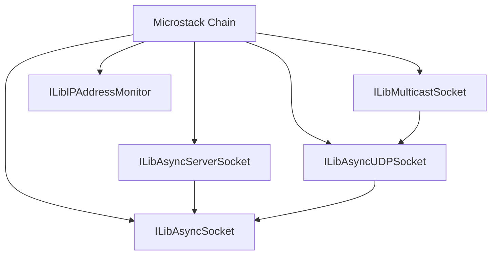
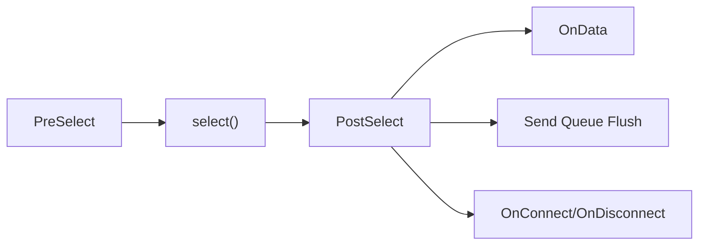
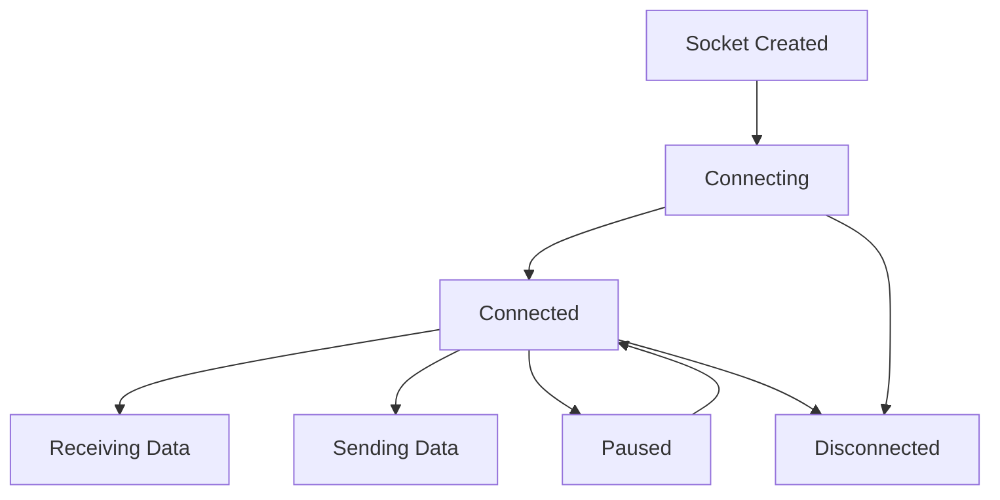
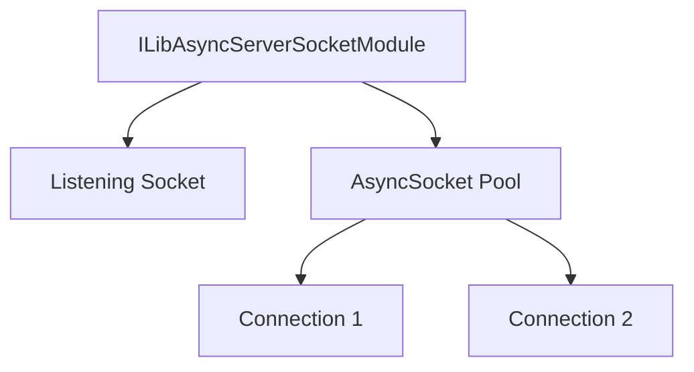
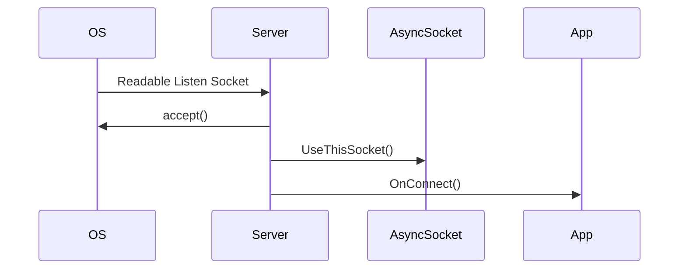
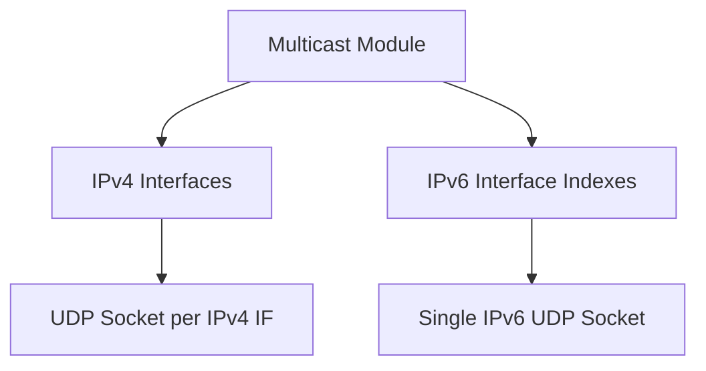
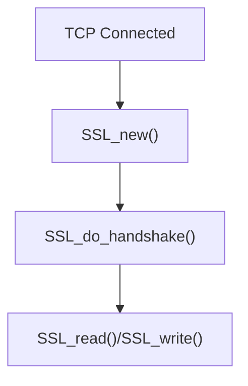

# Async Sockets

The **Async Sockets** module provides the non-blocking TCP and UDP networking foundation for the Microstack runtime. It implements an event-driven socket architecture built on top of the Microstack chain, enabling scalable servers, clients, multicast, and IP address monitoring across IPv4, IPv6, and Unix domain sockets.

This module is the transport backbone used by higher-level components such as Web Server, Web Client, WebRTC, and other networking subsystems in the Microstack.

---

## Architectural Overview

The Async Sockets module is composed of several tightly integrated components:

- **ILibAsyncSocket** – Core non-blocking TCP client socket
- **ILibAsyncServerSocket** – TCP server socket built on top of ILibAsyncSocket
- **ILibAsyncUDPSocket** – Non-blocking UDP socket wrapper
- **ILibMulticastSocket** – Multicast abstraction over UDP
- **ILibIPAddressMonitor** – Network interface change detection

All components are integrated into the Microstack event loop (chain) via `PreSelect` and `PostSelect` handlers.

---

## Event-Driven Execution Model

All sockets are non-blocking and processed through the Microstack chain:

1. **PreSelect** – Registers interest in read/write/error events
2. **select()** – OS-level readiness notification
3. **PostSelect** – Dispatches read/write/connect/disconnect logic

This model ensures:

- No blocking operations
- Single-threaded event dispatch
- Deterministic callback execution
- Scalable connection handling

---

# ILibAsyncSocket (Core TCP Engine)

`ILibAsyncSocketModule` is the fundamental non-blocking TCP implementation.

### Key Responsibilities

- Non-blocking connect
- Buffered send queue with backpressure
- Dynamic receive buffer growth
- Pause/Resume flow control
- TLS integration (OpenSSL)
- Timeout handling
- Transport abstraction (`ILibTransport`)

### Internal State Model

### Send Queue Architecture

Outgoing data is stored in a linked list of `ILibAsyncSocket_SendData` nodes.

- Immediate send if possible
- Partial send → remainder queued
- `OnSendOK` fired when queue drains

### Receive Buffer Strategy

- Initial buffer allocated at creation
- Grows in `MEMORYCHUNKSIZE` increments
- Compacts when data consumed
- Optional max buffer limit
- `OnBufferReAllocated` callback for pointer correction

---

# ILibAsyncServerSocket (TCP Server)

`ILibAsyncServerSocketModule` builds a scalable server on top of `ILibAsyncSocket`.

### Core Features

- IPv4 / IPv6 dual-stack binding
- Unix domain socket support (POSIX)
- Connection pooling
- Optional TLS server mode
- Connection tagging
- Resume/Stop listening dynamically

### Server Composition

### Accept Flow

### Connection Lifecycle

1. Socket accepted
2. Set non-blocking mode
3. Attach to AsyncSocket instance
4. Optional TLS handshake
5. `OnConnect` callback
6. Data events
7. `OnDisconnect` on close

---

# ILibAsyncUDPSocket (UDP Layer)

Provides asynchronous UDP built on ILibAsyncSocket.

### Capabilities

- IPv4 and IPv6 binding
- Shared or exclusive port reuse
- Broadcast support
- Multicast join/leave
- Send queue (limited practicality for UDP)

### UDP Data Flow

---

# ILibMulticastSocket (Multicast Abstraction)

`ILibMulticastSocket_StateModule` manages multicast traffic across all local interfaces.

### Responsibilities

- Maintains per-interface UDP sockets (IPv4)
- Single IPv6 socket with interface indices
- Auto-refresh on interface change
- TTL and loopback configuration
- Broadcast helpers
- Wake-on-LAN support

### Interface Strategy

---

# TLS Integration

TLS is optional and compiled out if `MICROSTACK_NOTLS` is defined.

### Server TLS

- `ILibAsyncServerSocket_SetSSL_CTX()`
- Per-connection `SSL*` created
- Supports TLS detection mode

### Client TLS

- `ILibAsyncSocket_SetSSLContextEx()`
- BIO memory buffers
- Handshake state machine

TLS handling is fully integrated into the existing non-blocking send/receive model.

---

# IP Address Monitoring

`ILibIPAddressMonitor` detects local interface changes.

- Windows: `SIO_ADDRESS_LIST_CHANGE`
- Linux: Netlink (`RTM_NEWADDR`, `RTM_DELADDR`)

Triggers user callback on change, allowing higher layers (e.g., multicast) to refresh bindings.

---

# Memory & Resource Management

The module follows strict lifecycle rules:

- All sockets closed in destroy handlers
- Send queues cleared on disconnect
- Buffers freed or preserved based on ownership enum
- TLS state freed via `SSL_free()`
- Chain-managed allocation via `ILibChain_Link_Allocate`

Ownership modes:

- `ILibAsyncSocket_MemoryOwnership_CHAIN`
- `ILibAsyncSocket_MemoryOwnership_STATIC`
- `ILibAsyncSocket_MemoryOwnership_USER`

---

# Integration Within Microstack

Async Sockets is a foundational transport layer used by:

- Web Server module
- Web Client module
- WebRTC module
- Multicast/Discovery subsystems

All higher-level protocols depend on this event-driven, non-blocking architecture.

---

# Key Design Characteristics

- ✅ Fully non-blocking
- ✅ Single-threaded event loop
- ✅ IPv4 / IPv6 dual-stack
- ✅ Unix domain socket support
- ✅ TLS optional and integrated
- ✅ Backpressure-aware send queue
- ✅ Dynamic receive buffering
- ✅ Interface change detection
- ✅ Multicast abstraction

---

# Summary

The **Async Sockets** module is the transport engine of the Microstack runtime. It provides:

- Scalable TCP client and server infrastructure
- Robust UDP and multicast capabilities
- Optional TLS security
- Deterministic event-driven execution
- Clean integration into the Microstack chain model

Every higher-level networking feature in the Microstack builds upon this module, making it one of the most critical architectural components in the system.
