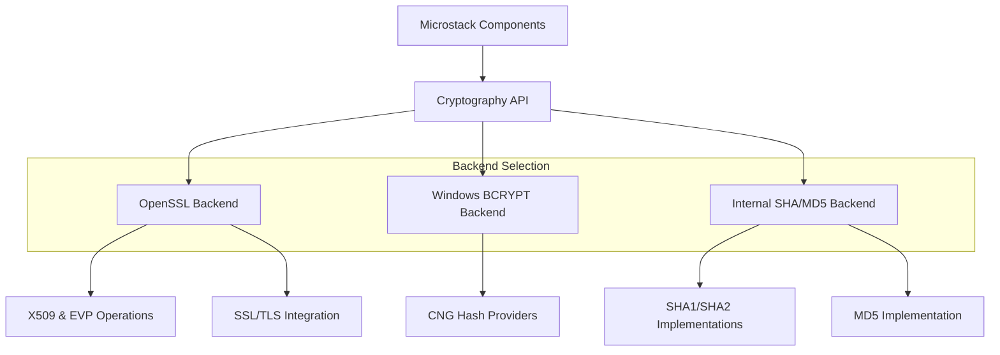
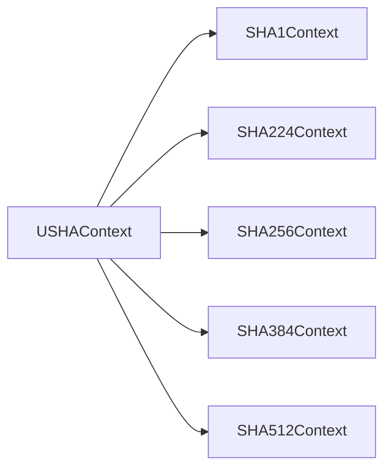
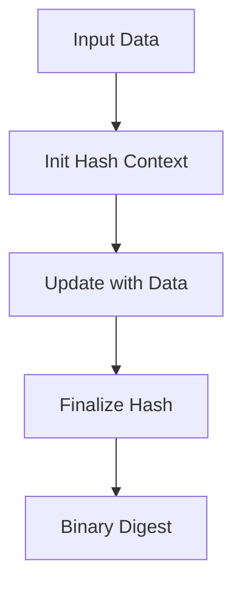
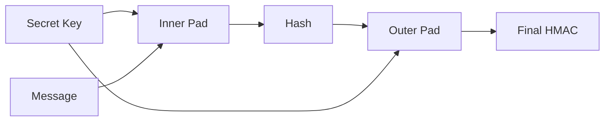
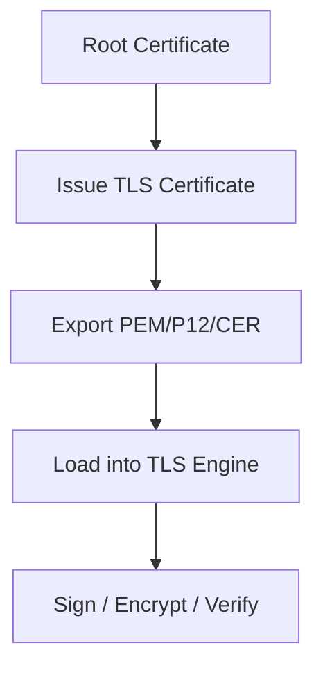
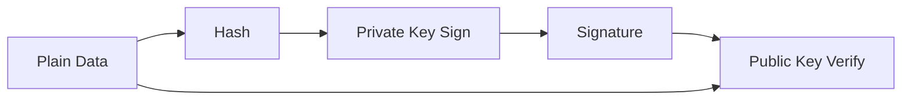
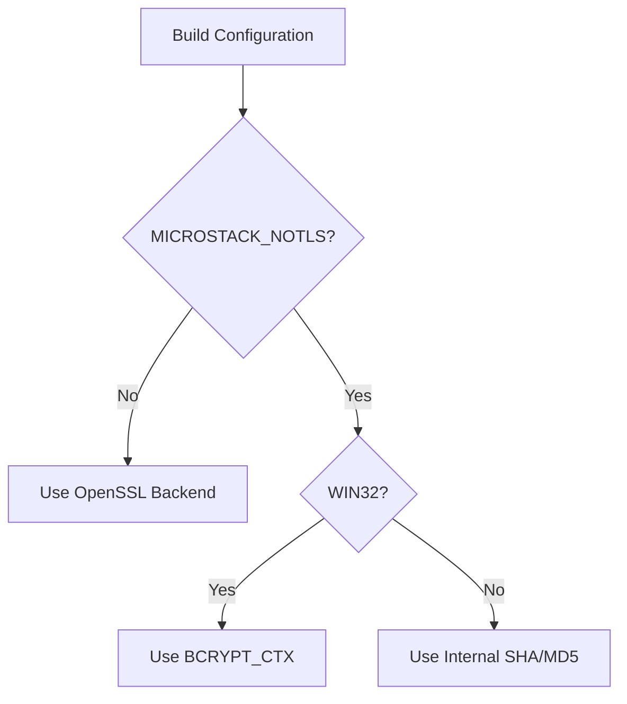
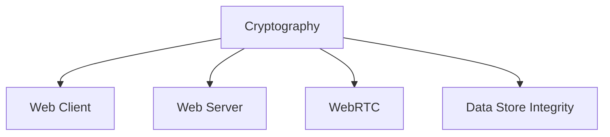

# Cryptography

The **Cryptography** module provides hashing, HMAC, random generation, certificate management, and public key cryptography services for the Microstack Core. It abstracts platform-specific cryptographic backends (OpenSSL, Windows CNG, or internal no-SSL implementations) behind a consistent API used by networking, WebRTC, and higher-level security features.

This module is a foundational security layer for:

- TLS enablement in Web Client and Server components
- WebRTC DTLS and certificate handling
- File and data integrity validation
- Authentication and digital signature verification
- Secure random generation

Cryptography is part of the [Microstack Core](../microstack-core.md) and is designed to operate in both TLS-enabled and TLS-disabled builds.

---

## 1. Architectural Overview

The module dynamically adapts to three execution environments:

1. **OpenSSL-enabled builds** (full TLS and X509 support)
2. **Windows CNG (BCRYPT) fallback** when TLS is disabled on Windows
3. **Internal no-SSL SHA/MD5 implementations** for minimal builds

### High-Level Architecture



The `ILibCrypto` interface ensures that callers do not need to know which backend is active.

---

## 2. Core Components

### 2.1 ILibCrypto (Primary Interface)

Defined in `ILibCrypto.h`, this is the main abstraction layer.

**Key Responsibilities:**

- Hashing utilities (MD5, SHA1, SHA256, SHA384)
- Hex encoding/decoding
- Random data generation
- File helpers
- Certificate parsing and generation
- RSA encryption/decryption
- Signing and verification

#### Hash Size Constants

```text
UTIL_MD5_HASHSIZE      = 16 bytes
UTIL_SHA1_HASHSIZE     = 20 bytes
UTIL_SHA256_HASHSIZE   = 32 bytes
UTIL_SHA384_HASHSIZE   = 48 bytes
UTIL_SHA512_HASHSIZE   = 64 bytes
```

---

### 2.2 util_cert Structure (OpenSSL Mode)

When TLS is enabled, certificates are represented by:

```c
typedef struct util_cert
{
    X509 *x509;
    EVP_PKEY *pkey;
    int flags;
} util_cert;
```

This structure binds:

- The X509 certificate
- The associated private key
- Ownership flags

It is used for:

- TLS server/client certificates
- Certificate-based encryption
- Digital signatures
- Certificate hashing

---

### 2.3 Windows BCRYPT Context

When `MICROSTACK_NOTLS` is defined on Windows, hashing is backed by CNG:

```c
typedef struct BCRYPT_CTX
{
    BCRYPT_ALG_HANDLE hAlg;
    BCRYPT_HASH_HANDLE hHash;
    DWORD cbData;
    DWORD cbHash;
    DWORD cbHashObject;
    PBYTE pbHashObject;
} BCRYPT_CTX;
```

This structure provides a unified replacement for:

- `SHA256_CTX`
- `SHA384_CTX`
- `SHA512_CTX`
- `SHA_CTX`
- `MD5_CTX`

Macros map standard hash APIs onto BCRYPT calls.

---

### 2.4 Internal No-SSL Implementations

When TLS is disabled and not on Windows, hashing falls back to built-in implementations:

- `MD5_CTX` (OpenSSL-compatible public domain implementation)
- `SHA1Context`
- `SHA224Context`
- `SHA256Context`
- `SHA384Context`
- `SHA512Context`
- `USHAContext` (Unified SHA wrapper)
- `HMACContext`

These implementations follow FIPS 180-2 specifications.

### Unified SHA Context



This allows runtime selection of hash algorithm via `SHAversion`.

---

## 3. Functional Areas

### 3.1 Hashing Utilities

The module provides convenience wrappers:

- `util_md5()`
- `util_sha1()`
- `util_sha256()`
- `util_sha384()`
- `util_sha384file()`

These functions:

1. Initialize context
2. Feed data
3. Finalize hash
4. Return fixed-length digest

### Hashing Flow



---

### 3.2 HMAC Support

Provided via `HMACContext` and helper functions:

- `hmac()`
- `hmacReset()`
- `hmacInput()`
- `hmacResult()`

HMAC combines:

- Selected SHA algorithm
- Secret key
- Message data



---

### 3.3 Random Generation

- `util_random()`
- `util_randomtext()`

Used for:

- Nonces
- Session IDs
- Temporary tokens
- Key material (non-cryptographic grade in no-SSL mode)

In TLS builds, OpenSSL-backed entropy is used implicitly where appropriate.

---

### 3.4 Certificate Lifecycle

Available only when TLS is enabled.

**Creation**
- `util_mkCertEx()`
- `util_mkCert()`

**Serialization**
- `util_to_p12()`
- `util_from_p12()`
- `util_to_cer()`
- `util_from_cer()`
- `util_from_pem()`
- `util_from_pem_string()`

**Inspection & Hashing**
- `util_printcert()`
- `util_certhash()`
- `util_keyhash()`

### Certificate Workflow



---

### 3.5 Signing and Verification

Supported operations:

- `util_sign()`
- `util_verify()`
- `util_rsaverify()`

**Process:**



Used by:

- WebRTC DTLS validation
- Agent authentication
- Certificate trust validation

---

### 3.6 Encryption and Decryption

Available in TLS builds:

- `util_encrypt()`
- `util_encrypt2()`
- `util_decrypt()`
- `util_rsaencrypt()`
- `util_rsadecrypt()`

These wrap OpenSSL EVP and RSA operations.

---

## 4. Conditional Compilation Model

Cryptography behavior is determined by compile-time flags.



This enables:

- Minimal footprint builds
- Embedded deployments
- Full TLS deployments

---

## 5. Integration Within Microstack Core

Cryptography is consumed by:

- TLS-enabled Web Client and Server components
- WebRTC (DTLS certificate handling)
- Remote authentication logic
- Secure data validation routines

### Dependency Position



It sits below protocol layers and above platform-specific crypto providers.

---

## 6. Security Considerations

- MD5 and SHA1 are provided for compatibility but should not be used for new security-sensitive designs.
- SHA256 or higher is recommended.
- RSA operations depend on OpenSSL correctness in TLS builds.
- Random generation quality depends on backend (OpenSSL vs internal fallback).
- Certificate ownership flags must be handled carefully to avoid double-free conditions.

---

## 7. Summary

The **Cryptography** module provides a portable, backend-agnostic security foundation for Microstack Core. It:

- Abstracts OpenSSL and platform hashing APIs
- Provides consistent hash and HMAC interfaces
- Enables certificate lifecycle management
- Supports RSA encryption and signing
- Adapts to constrained and full-featured builds

By isolating cryptographic complexity behind a unified interface, the module ensures that higher-level networking and communication layers remain clean, portable, and secure.
