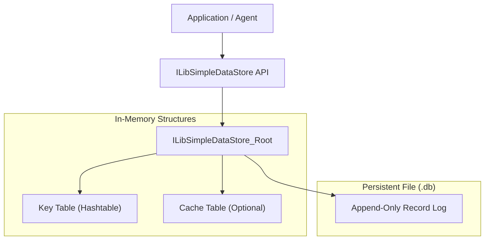
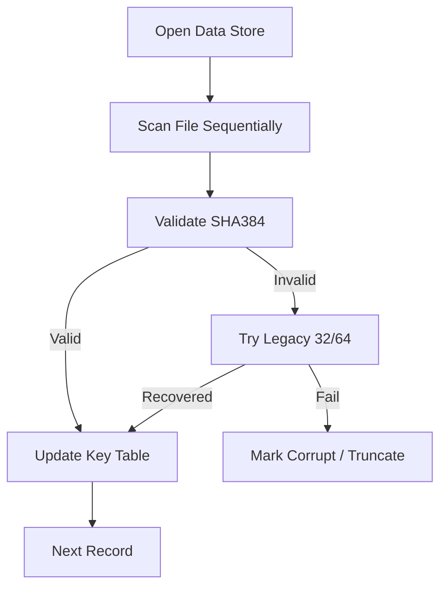
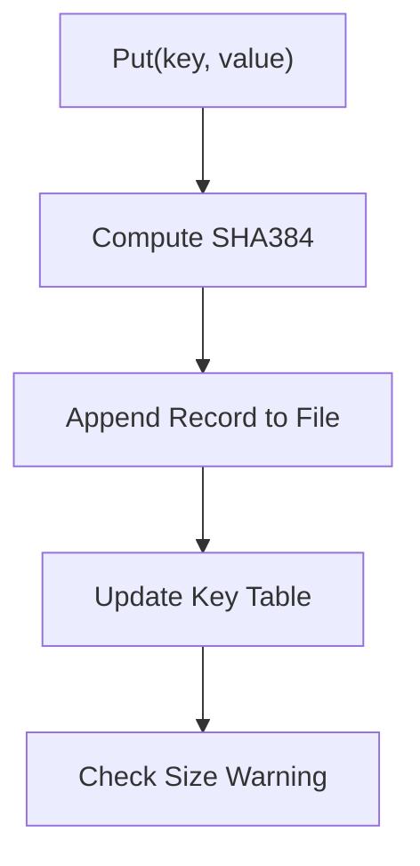
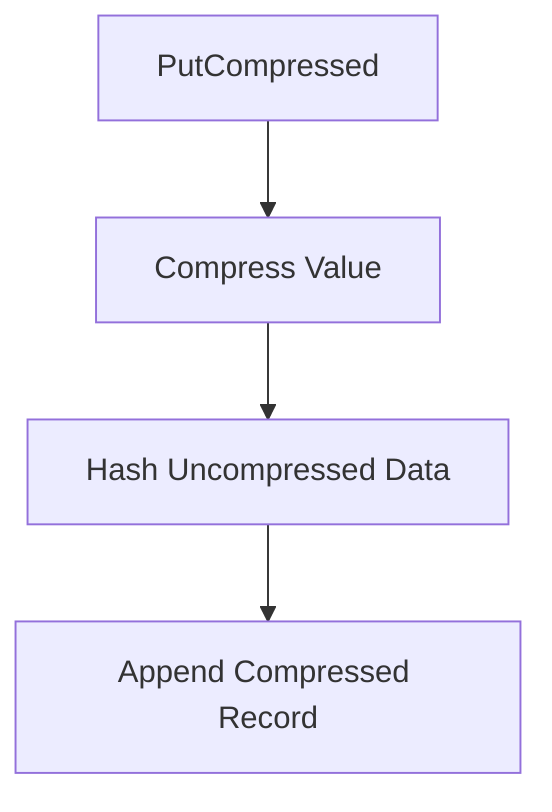
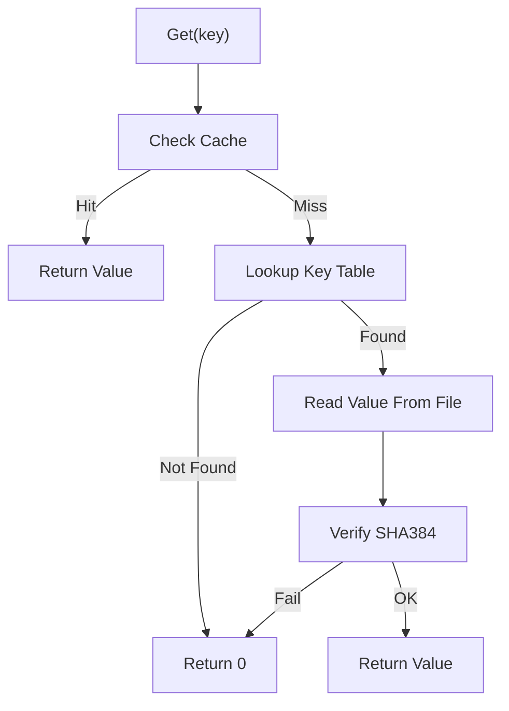
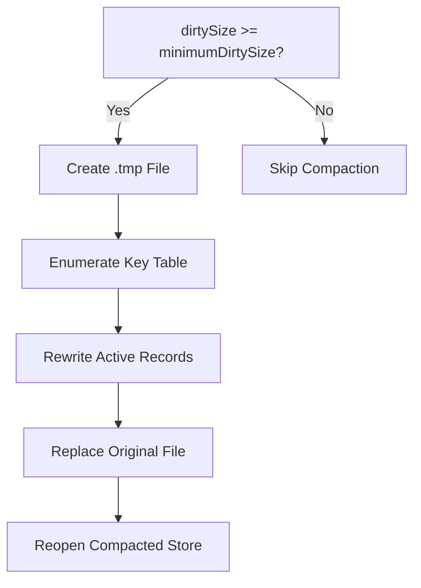

# Data Store

The **Data Store** module provides a lightweight, file-backed key–value persistence layer for the Microstack runtime. It is designed for embedded and agent scenarios where:

- A full database engine is unnecessary or too heavy
- Data integrity and corruption detection are critical
- Cross-platform compatibility (Windows, Linux, macOS) is required
- Optional compression and in-memory caching are desirable

The implementation is centered around `ILibSimpleDataStore` and operates as an append-only log-structured store with in-memory indexing and optional compaction.

---

## 1. Architectural Overview

At runtime, the Data Store maintains:

- A file handle for persistent storage
- An in-memory key table mapping keys to file offsets
- An optional cache table for memory-only or fallback writes
- Integrity metadata (SHA-384 hashes)



### Core Structures

- **ILibSimpleDataStore_Root**: Top-level container holding file pointer, tables, size tracking, and configuration.
- **ILibSimpleDataStore_TableEntry**: Maps a key to its value length, hash, and file offset.
- **ILibSimpleDataStore_CacheEntry**: Stores value and hash for memory-only or fallback writes.
- **RecordHeader (NG / 32 / 64)**: On-disk record metadata structures.

---

## 2. On-Disk Record Format

Each record is appended to the file and never modified in place.

```text
------------------------------------------
 4 Bytes   - Node size (network order)
 4 Bytes   - Key length
 4 Bytes   - Value length
48 Bytes   - SHA384 hash of value
Variable   - Key
Variable   - Value
------------------------------------------
```

Key properties:

- **Append-only**: Updates create new records.
- **Tombstones**: A record with `valueLength = 0` deletes a key.
- **Integrity validation**: SHA-384 hash ensures data consistency.
- **Legacy support**: Automatic detection of 32-bit and 64-bit legacy formats.

---

## 3. Initialization and Rebuild Process

When a Data Store is opened:

1. The file is opened with appropriate locking.
2. The file is scanned sequentially.
3. Each valid record updates the in-memory key table.
4. If corruption or legacy format is detected, fallback parsing is attempted.
5. If needed, automatic compaction converts the store to the NG format.



The result is a fully rebuilt in-memory index reflecting the latest state of each key.

---

## 4. Write Path (Put)

### Standard Put

When storing a key/value pair:

1. Compute SHA-384 hash of value.
2. Append a new record to file.
3. Update in-memory key table.
4. Increase dirty size if overwriting.
5. Trigger size warning if configured.



### Compressed Put

Compressed entries:

- Use `ILibDeflate()` to compress value
- Hash is calculated on **uncompressed data**
- Key is extended with CRC32C to differentiate compressed entries



If a disk write fails (e.g., low space):

- Record is stored in memory cache
- Store switches to read-only mode
- Optional write error handler is invoked

---

## 5. Read Path (Get)

Lookup order:

1. Check cache table
2. Check key table
3. If compressed, inflate before returning
4. Validate SHA-384 before returning value



Compressed records are automatically inflated and validated against the stored hash of the original data.

---

## 6. Deletion Model

Deletion is implemented as an append-only tombstone:

- A new record is written with `valueLength = 0`
- The in-memory entry is removed
- Dirty size increases

This preserves crash safety and avoids in-place mutation.

---

## 7. Compaction

Because the store is append-only, obsolete values accumulate. Compaction:

1. Creates a temporary file
2. Enumerates active keys
3. Rewrites only current values
4. Replaces original file atomically



Compaction is configurable via:

- `ILibSimpleDataStore_ConfigCompact()`
- `ILibSimpleDataStore_ConfigSizeLimit()`

---

## 8. Concurrency and Locking

- File locking is applied when opened for write.
- Hashtable locking functions allow thread-safe key operations:
  - `ILibSimpleDataStore_Lock()`
  - `ILibSimpleDataStore_UnLock()`
- No blocking file lock attempts (non-blocking exclusive lock).

The module is safe for multi-threaded access when properly synchronized.

---

## 9. Integrity and Corruption Handling

The Data Store provides multiple protection layers:

- SHA-384 value hashing
- CRC32C-based compressed key tagging
- Truncation recovery on partial writes
- Corruption detection during rebuild
- Automatic fallback to legacy format parsing

If corruption is detected:

- File may be truncated to last valid offset
- A copy may be written with a `.corrupt.db` suffix

---

## 10. Configuration Hooks

The Data Store exposes extensibility points:

- **Write error handler**: Triggered on disk write failure
- **Size warning handler**: Triggered when file exceeds threshold
- **Read-only reopen mode**
- **Cache-only mode** (no file backing)

Utility methods:

- `ILibSimpleDataStore_IsCacheOnly()`
- `ILibSimpleDataStore_WasCreatedAsNew()`
- `ILibSimpleDataStore_GetHashEx()`
- `ILibSimpleDataStore_EnumerateKeys()`

---

## 11. Design Characteristics

| Property | Behavior |
|----------|----------|
| Storage Model | Append-only log |
| Indexing | In-memory hash table |
| Integrity | SHA-384 per record |
| Compression | Optional (zlib/deflate) |
| Deletion | Tombstone record |
| Compaction | Manual / threshold-based |
| Cross-Platform | Windows + POSIX |
| Crash Safety | High (no in-place mutation) |

---

## 12. Role Within the System

Within the broader Microstack architecture, the Data Store:

- Persists configuration and runtime state
- Stores agent credentials and identifiers
- Maintains cached metadata
- Supports embedded and headless deployments

It intentionally avoids heavy dependencies while maintaining strong integrity guarantees and predictable performance.

---

# Summary

The **Data Store** module is a compact, robust, append-only key–value engine optimized for embedded agents and network services. By combining:

- File-backed persistence
- In-memory indexing
- SHA-384 integrity validation
- Optional compression
- Safe compaction

it delivers reliable storage without the complexity of a full database system.