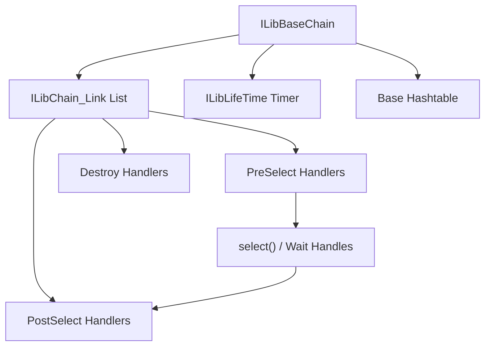
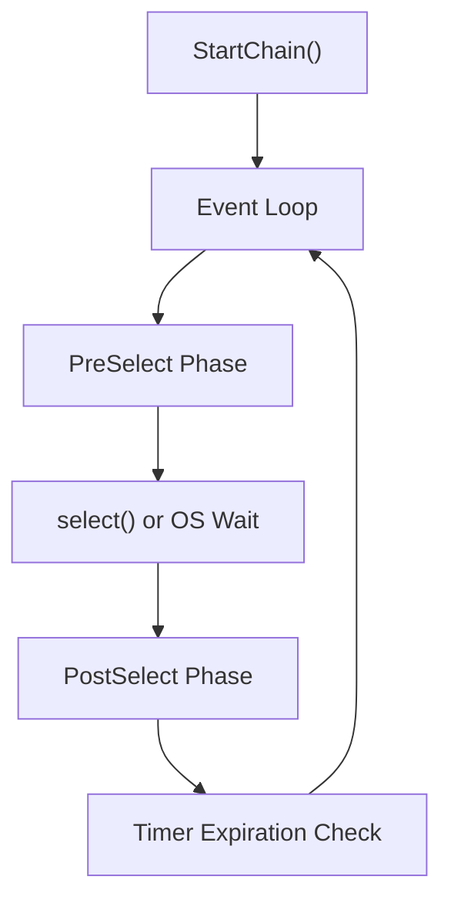
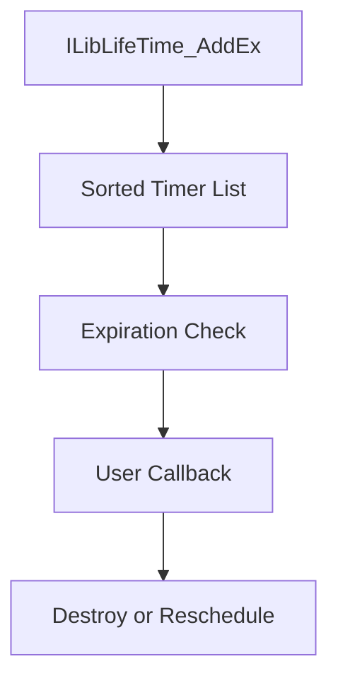
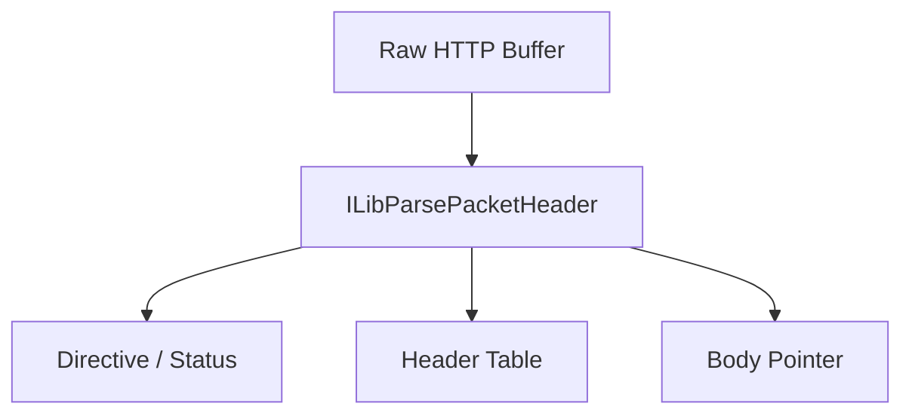
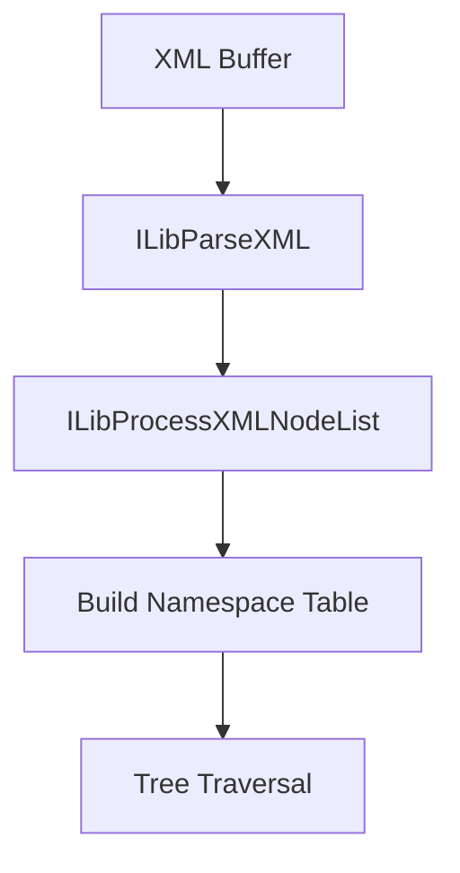
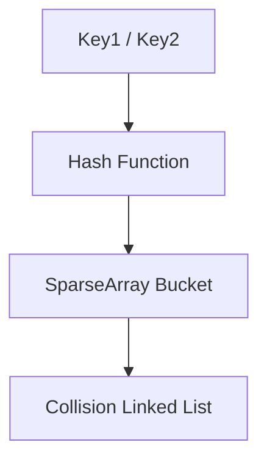
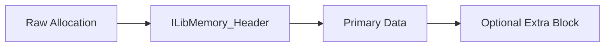
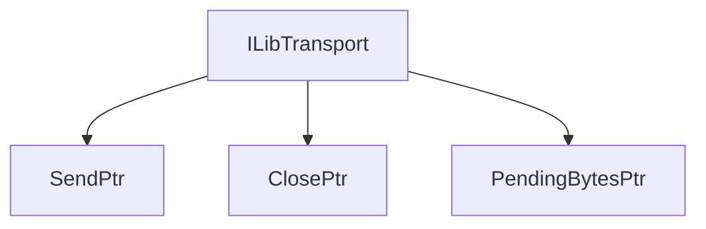
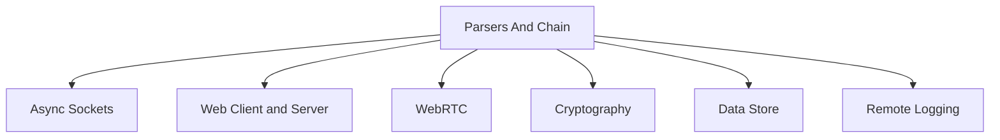

# Parsers And Chain

The **Parsers And Chain** module is the core runtime foundation of the Microstack architecture. It provides:

- The event-driven execution engine (**ILibBaseChain**)
- Core data structures (linked lists, hash tables, sparse arrays, queues, stacks)
- HTTP and XML parsing utilities
- Memory management helpers
- Timers and lifecycle management
- Cross-platform threading and synchronization primitives

Nearly every higher-level module (Web Client and Server, WebRTC, Async Sockets, Cryptography, Data Store, etc.) depends on this module for scheduling, parsing, and concurrency.

---

## 1. Architectural Overview

At its heart, Parsers And Chain implements a **single-threaded, event-driven loop** (the Chain) with pluggable modules called *links*.

### Key Concepts

| Concept | Purpose |
|----------|----------|
| ILibBaseChain | Event loop controller |
| ILibChain_Link | Pluggable module unit |
| PreSelectHandler | Register descriptors / timeouts |
| PostSelectHandler | React to ready descriptors |
| DestroyHandler | Cleanup logic |
| ILibLifeTime | Timer scheduling service |

The Chain is cooperative: each module registers interest in events, and the loop dispatches them sequentially.

---

## 2. The Chain Execution Model

The Chain runs in a single thread (the “Microstack thread”). Modules must never block this thread.

### Execution Cycle

### ILibChain_Link Structure

Each link provides:

- `PreSelectHandler`
- `PostSelectHandler`
- `DestroyHandler`
- Optional query and metadata support

This enables modular composition of networking stacks such as:

- Web Server
- Web Client
- WebRTC stack
- Process Pipe
- Remote Logging

---

## 3. Timer System (ILibLifeTime)

The **ILibLifeTime** subsystem provides millisecond-resolution scheduled callbacks.

### Characteristics

- Timers are ordered by expiration tick
- Executed on the Microstack thread
- Safe cross-thread removal
- Supports metadata tracking

Used extensively by networking and protocol layers.

---

## 4. HTTP Packet Model

The module defines a full HTTP parsing and serialization layer.

### Core Structures

- `packetheader`
- `packetheader_field_node`
- `ILibHTTPPacket`

### Parsing Flow

Key traits:

- Zero-copy parsing (strings reference original buffer)
- Case-insensitive header lookup
- Header table backed by hash tree
- Serialization via `ILibGetRawPacket`

Higher modules such as Web Client and Server build on this abstraction.

---

## 5. XML Parsing Model

The module includes a lightweight XML tokenizer and tree builder.

### XML Processing Steps

### Core Structures

- `ILibXMLNode`
- `ILibXMLAttribute`
- `parser_result`

Features:

- Zero-copy tokenization
- Namespace resolution
- Stack-based well-formed validation
- In-place XML unescape utilities

This is optimized for embedded systems and protocol parsers.

---

## 6. Core Data Structures

Parsers And Chain implements reusable containers used across the entire Microstack.

### Linked List

- Doubly linked
- Optional extended memory per node
- Thread-safe via spinlock

### Sparse Array

- Indexed buckets with custom bucketizer
- Efficient for sparse index sets

### Advanced Hashtable

Features:

- Dual-key support (pointer + string)
- Custom hash function
- Bucketizer abstraction
- Enumeration and destruction callbacks

### Queue and Stack

- Lockable queue
- Circular queue (fixed capacity)
- Lightweight stack

---

## 7. Memory Management Layer

The module introduces a **memory header system**:

- Canary validation
- Size tracking
- Optional extra memory region
- Secure zeroing for sensitive data

### Memory Layout

This provides:

- Corruption detection
- Smart reallocation
- Stack-backed allocations
- Safe cross-module ownership

---

## 8. Transport Abstraction

The `ILibTransport` abstraction unifies send/close/pending operations.

Modules such as Web Server, Web Client, and WebRTC use this abstraction.

---

## 9. Cross-Platform Support

The module abstracts:

- Windows vs POSIX threading
- Semaphores and spinlocks
- IPv4 / IPv6 detection
- Socket helpers
- File-backed linked lists
- Crash diagnostics

Platform-specific implementations are hidden behind uniform APIs.

---

## 10. How It Fits into Microstack

Parsers And Chain is the **foundation layer** of the Microstack.

Without this module:

- No event loop
- No timer scheduling
- No HTTP parsing
- No XML processing
- No shared data structures

It is the runtime kernel of the agent networking stack.

---

## 11. Design Philosophy

Parsers And Chain is designed for:

- Embedded and constrained systems
- Deterministic single-threaded execution
- Minimal allocations
- Zero-copy parsing
- High portability
- Explicit lifecycle control

It trades abstraction overhead for explicit control and performance.

---

## Summary

The **Parsers And Chain** module provides:

- The event-driven Chain runtime
- Timer scheduling via ILibLifeTime
- HTTP and XML parsers
- Core containers and hashing
- Memory safety infrastructure
- Cross-platform threading and networking helpers

It is the foundational infrastructure layer that enables all higher-level Microstack components to function.