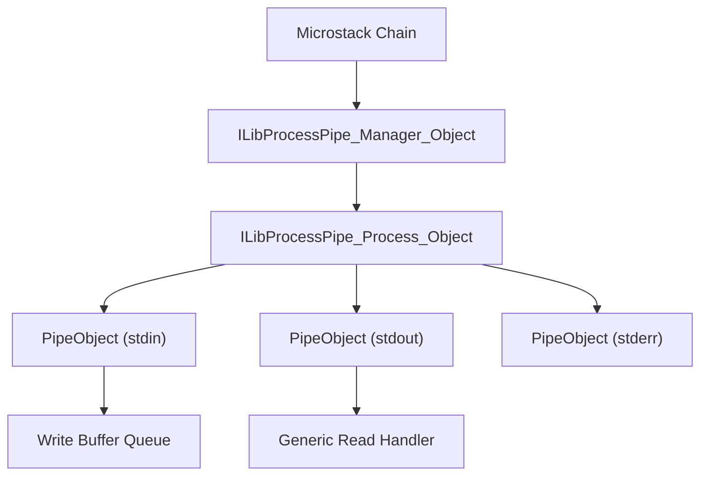
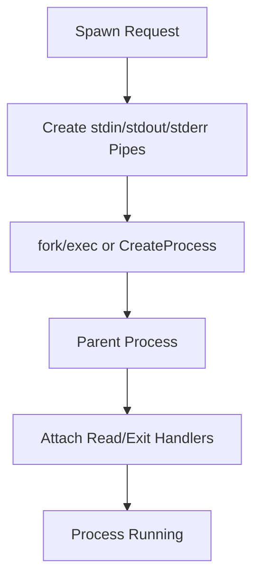
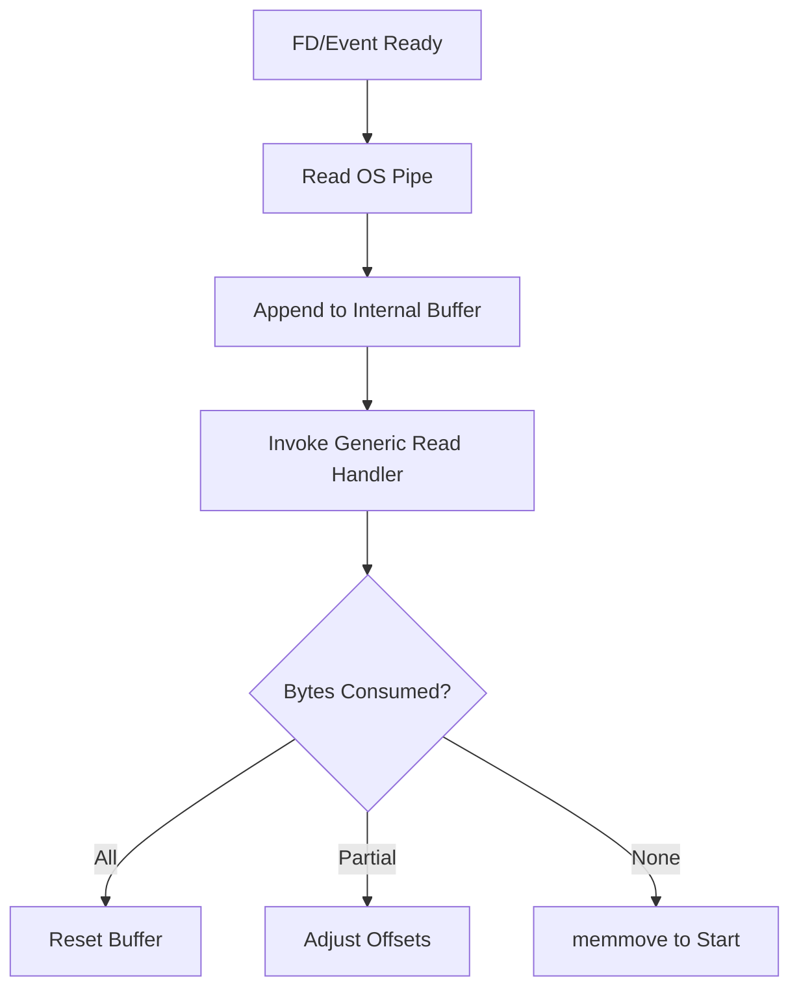
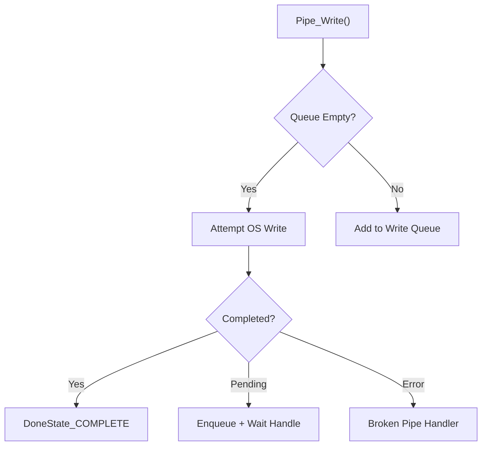
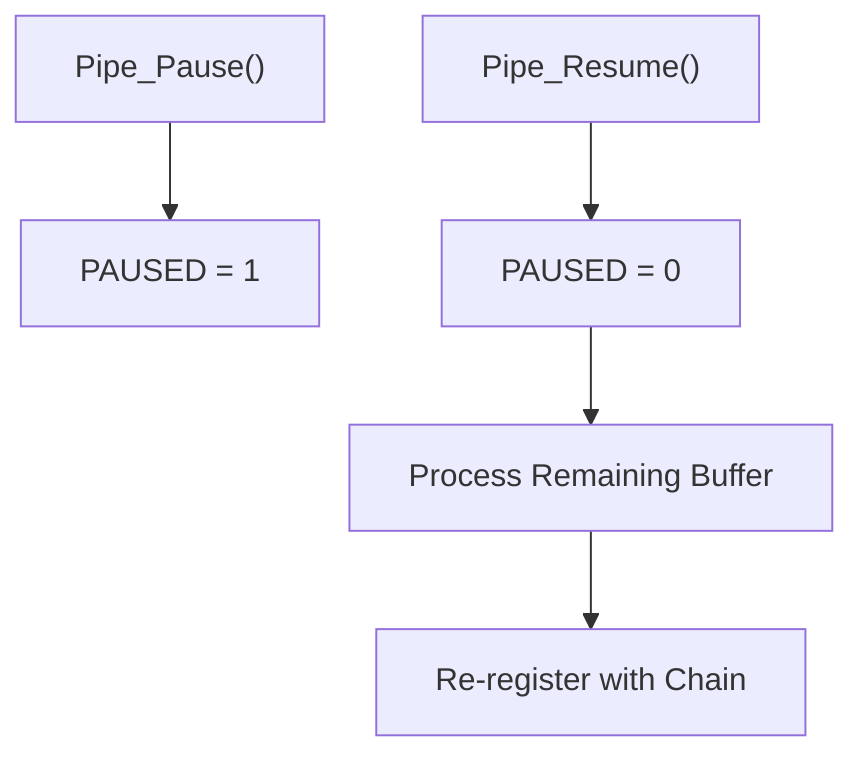
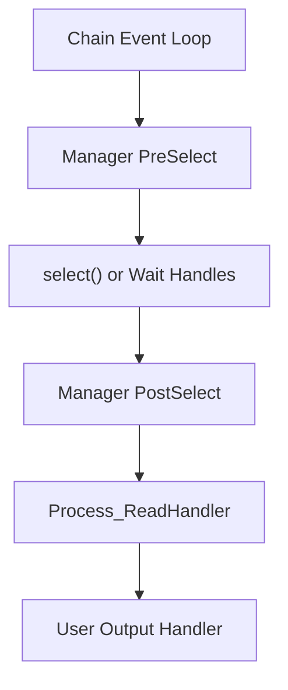

# Process Pipe

The **Process Pipe** module provides cross-platform process spawning and inter-process communication (IPC) for the Microstack runtime. It abstracts platform differences between Windows and POSIX systems and integrates tightly with the Microstack chain/event loop to deliver non-blocking, event-driven process I/O.

At its core, Process Pipe enables:

- Spawning child processes (interactive, detached, or terminal-backed)
- Asynchronous reading from `stdout` and `stderr`
- Asynchronous writing to `stdin`
- Cross-platform pipe management (Win32 overlapped I/O and POSIX non-blocking pipes)
- Graceful and forced process termination
- Integration with the Microstack chain scheduler

Process Pipe is part of the **Microstack Core** and builds on:

- [Parsers and Chain](../Parsers and Chain/Parsers and Chain.md)
- [Remote Logging](../Remote Logging/Remote Logging.md)

---

## Architecture Overview

Process Pipe is composed of three primary object types:

- **Manager** – Integrates with the chain and tracks active pipes
- **Process Object** – Represents a spawned OS process
- **Pipe Object** – Represents a single I/O channel (stdin, stdout, stderr, or custom pipe)



---

## Core Components

### ILibProcessPipe_Manager_Object

The Manager integrates Process Pipe into the Microstack chain.

**Responsibilities:**

- Maintains a linked list of active pipes
- Registers `PreSelect` / `PostSelect` handlers (POSIX)
- Registers wait handles (Windows)
- Cleans up pipe resources during destruction

On POSIX systems, the manager adds file descriptors to the `select()` read set and dispatches readable pipes during `PostSelect`.

On Windows, it uses overlapped I/O events and wait handles attached to the chain.

---

### ILibProcessPipe_Process_Object

Represents a spawned child process.

**Key Fields:**

- `PID` – OS process identifier
- `stdIn`, `stdOut`, `stdErr` – Associated Pipe objects
- `exitHandler` – Callback when process terminates
- `userObject` – Opaque user context
- `metadata` – Diagnostic label

**Capabilities:**

- Spawn (default, detached, terminal, specified user)
- Soft kill (`SIGTERM` then `SIGKILL` fallback on POSIX)
- Hard kill (terminate + destroy)
- Attach output handlers
- Attach exit handler

---

### ILibProcessPipe_PipeObject

Represents one side of a pipe.

**Key Fields:**

- `mPipe_ReadEnd`, `mPipe_WriteEnd` – OS handles
- `buffer`, `bufferSize` – Read buffer
- `WriteBuffer` – Outgoing write queue
- `handler` – Read or write completion callback
- `brokenPipeHandler` – Invoked on pipe failure
- `PAUSED` – Flow control flag

The Pipe object encapsulates:

- Read buffering and partial consumption
- Non-blocking writes
- Broken pipe detection
- Pause/resume semantics

---

## Process Lifecycle

### 1. Spawn

Spawning differs by platform.



**Windows:**
- Uses `CreateProcessW` or `CreateProcessAsUserW`
- Configures inherited handles
- Uses overlapped I/O for async reads

**POSIX:**
- Uses `fork()`, `vfork()`, or `forkpty()`
- Duplicates pipe FDs to `STDIN_FILENO`, `STDOUT_FILENO`, `STDERR_FILENO`
- Executes with `execv()` or `execve()`

---

### 2. Asynchronous Reading

When data becomes available:



The read handler receives:

- Pointer to buffer
- Available length
- Output parameter indicating bytes consumed

This allows streaming parsers to process partial data safely.

---

### 3. Writing to stdin

Writes are non-blocking and queued if necessary.



On Windows, overlapped writes trigger a wait handle callback.

On POSIX, incomplete writes re-schedule via the chain timer.

---

## Flow Control (Pause / Resume)

The Pipe object supports pausing reads.

- `Pipe_Pause()` removes the FD from active monitoring
- `Pipe_Resume()` re-registers it with the chain
- Buffered unread data is processed before resuming OS reads



This is critical for backpressure handling and streaming parsers.

---

## Terminal Mode (PTY Support)

On POSIX, `ILibProcessPipe_SpawnTypes_TERM` uses `forkpty()`.

Features:

- Allocates pseudo-terminal
- Configurable window size (`winsize`)
- Optional `termios` flags
- Unified stdin/stdout via PTY

This enables interactive shells or terminal-bound applications.

---

## Broken Pipe Handling

A broken pipe occurs when:

- The child process exits
- The write end is closed
- An I/O error occurs

When detected:

1. The pipe is removed from the manager
2. `brokenPipeHandler` is invoked
3. The Process object may trigger exit handling
4. Resources are freed

On POSIX, process exit status is retrieved via `waitpid()`.

On Windows, exit is detected via a wait handle on the process handle.

---

## Process Termination

### Soft Kill

- Windows: `TerminateProcess()`
- POSIX: `SIGTERM`, wait up to 500ms, then `SIGKILL`

The staged termination on POSIX prevents corruption of system state (e.g., macOS TCC permissions).

### Hard Kill

- Calls soft kill
- Immediately destroys process object

---

## Metadata and Diagnostics

Each pipe and process can store metadata strings used for:

- Chain diagnostics
- Wait handle labeling (Windows)
- Remote logging context

Metadata is surfaced via the Manager `QueryHandler`.

---

## Integration with Microstack Chain

Process Pipe is tightly integrated into the Microstack event model.



This design ensures:

- No dedicated polling threads (POSIX)
- Native overlapped I/O (Windows)
- Unified callback-driven model

---

## Public API Surface (Conceptual)

Typical usage pattern:

1. Create manager (once per chain)
2. Spawn process
3. Attach handlers
4. Write to stdin as needed
5. Handle output callbacks
6. Handle exit callback

Example lifecycle:

```text
Manager_Create()
  → SpawnProcessEx4()
      → Process_AddHandlers()
          → Output callbacks fire
          → Exit callback fires
```

---

## Cross-Platform Strategy Summary

| Feature | Windows | POSIX |
|----------|----------|----------|
| Spawn | CreateProcess | fork/exec |
| Async Read | Overlapped I/O | Non-blocking FD + select |
| Async Write | Overlapped I/O | Non-blocking write |
| Exit Detection | Wait handle on process | waitpid |
| Terminal Mode | N/A | forkpty |

The abstraction ensures callers do not need to manage platform-specific process semantics.

---

## Relationship to Other Modules

Process Pipe builds upon:

- [Parsers and Chain](../Parsers and Chain/Parsers and Chain.md) – Event scheduling and lifecycle
- [Remote Logging](../Remote Logging/Remote Logging.md) – Diagnostic output

It is frequently used by higher-level modules that require:

- Script execution
- Shell interaction
- External tool invocation
- Privilege-separated operations

---

## Key Design Principles

1. Event-driven, not thread-per-process (except legacy Windows background reader fallback)
2. Cross-platform parity
3. Safe buffering with explicit consumption semantics
4. Backpressure-aware pause/resume model
5. Deterministic cleanup via chain lifecycle

---

## Summary

The **Process Pipe** module provides a robust, event-driven abstraction over OS process management and inter-process communication. It bridges Windows overlapped I/O and POSIX non-blocking pipes into a unified Microstack chain-integrated model.

By encapsulating pipe management, buffering, and lifecycle control, Process Pipe enables reliable execution and supervision of child processes within the MeshAgent runtime.