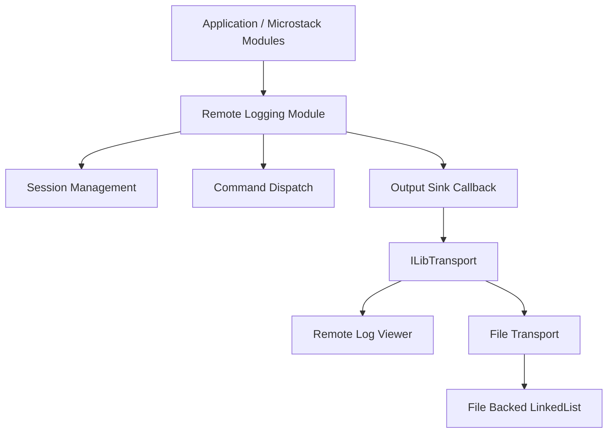
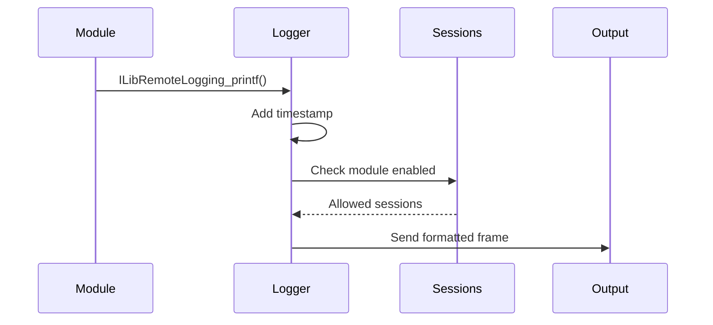
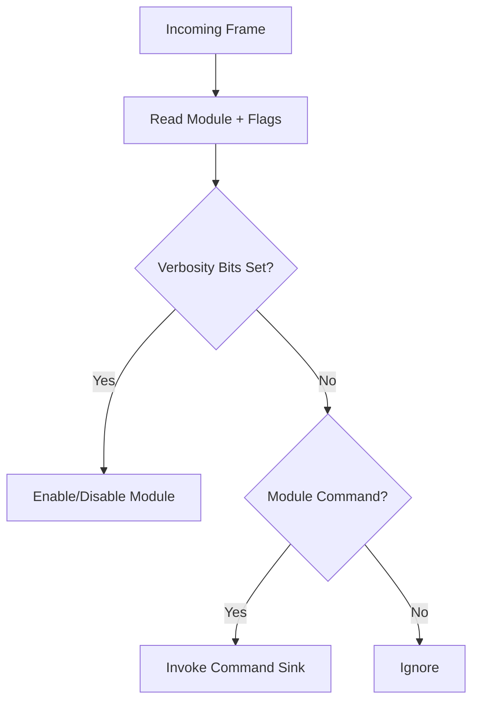
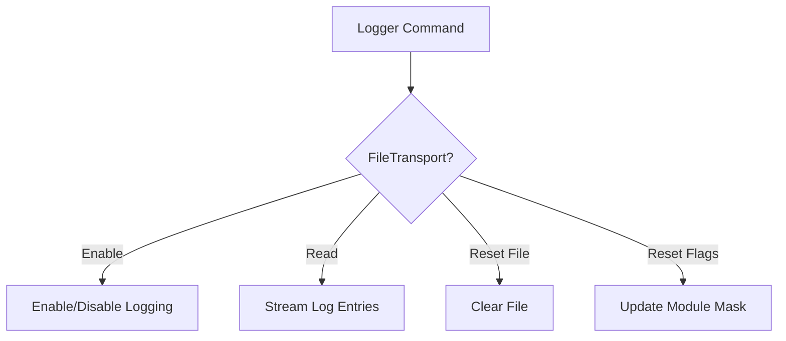
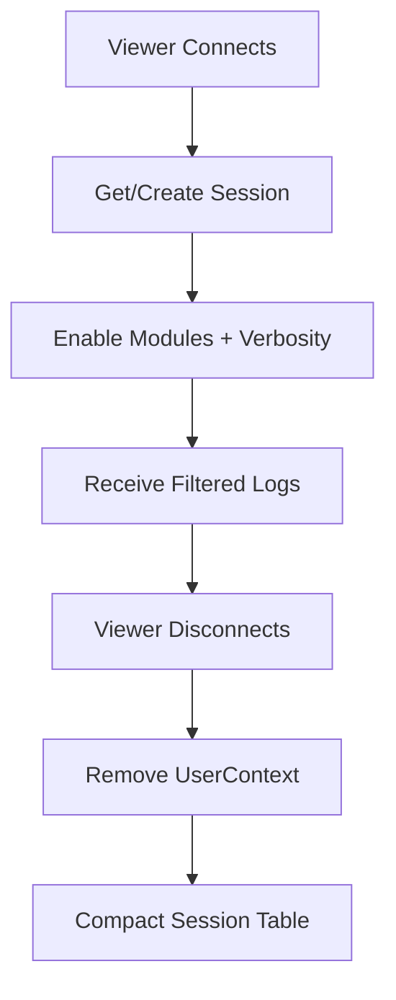

# Remote Logging

The **Remote Logging** module provides a structured, transport-agnostic logging framework for the Microstack and MeshAgent runtime. It enables runtime-configurable log streaming, per-module verbosity control, remote log viewers, and persistent file-backed logging.

This module is part of the **Microstack Core** and integrates with transports, async sockets, WebRTC, Web server/client components, and agent subsystems.

---

## Purpose and Responsibilities

Remote Logging is designed to:

- Provide **modular logging categories** (WebRTC, Agent, Microstack, etc.)
- Support **dynamic verbosity control per session**
- Allow **remote viewers to enable/disable modules at runtime**
- Forward logs to:
  - In-memory transports
  - Remote connections
  - File-backed persistent storage
- Maintain **thread safety** via semaphore synchronization
- Enable command-based interaction (enable, disable, read, reset)

The system is conditionally compiled using `_REMOTELOGGING`.

---

## High-Level Architecture



---

## Core Components

### ILibRemoteLogging_Module

Central logging controller.

**Responsibilities:**

- Maintains session table (max 5 sessions)
- Holds module flags and verbosity state
- Routes commands to registered sinks
- Synchronizes access via `sem_t LogSyncLock`
- Forwards formatted log output to the configured output sink

**Key Fields:**

- `LogSyncLock` – thread safety
- `OutputSink` – callback for sending log frames
- `RawForwardSink` – bypass formatted output
- `CommandSink[15]` – per-module command handlers
- `Sessions[5]` – active logging sessions

---

### ILibRemoteLogging_Session

Represents a remote logging subscriber.

**Fields:**

- `Flags` – enabled modules + verbosity level
- `UserContext` – transport or session pointer

Each session controls:

- Which modules are enabled
- Minimum verbosity level accepted

Session entries are compacted automatically when removed.

---

### ILibRemoteLogging_FileTransport

File-backed logging transport implementation.

**Responsibilities:**

- Persist logs using `ILibLinkedList_FileBacked`
- Reload saved flags on startup
- Support commands:
  - Enable/Disable logging
  - Reset file
  - Read file
  - Reset module flags
- Integrate as an `ILibTransport`

Logs are stored in a bounded file-backed linked list:

- Max size: 2 MB
- Entry block size: 4096 bytes

---

## Logging Modules

Remote Logging uses a bitmask to represent module categories:

```text
0x02  WebRTC STUN/ICE
0x04  WebRTC DTLS
0x08  WebRTC SCTP
0x10  Agent GuardPost
0x20  Agent Peer2Peer
0x200 Agent KVM
0x40  Microstack AsyncSocket
0x80  Microstack WebServer/WebClient
0x400 Microstack Pipe
0x100 Microstack Generic
0x4000 Console Print
```

Modules can be combined using bitwise OR.

---

## Verbosity Levels

Verbosity is encoded in flags:

```text
Level 1  0x02
Level 2  0x04
Level 3  0x08
Level 4  0x10
Level 5  0x20
```

Session filtering logic:

- A log is delivered only if:
  - Module is enabled in session flags
  - Log verbosity <= session verbosity level

---

## Logging Flow

### Standard Logging (`ILibRemoteLogging_printf`)



Steps:

1. Timestamp is prepended
2. Header written (module + flags)
3. Session table scanned
4. Matching sessions receive frame

If module includes `ConsolePrint`, output is printed locally via `printf()`.

---

## Command Dispatching

Remote viewers send control frames:



Command types include:

- Enable/Disable module
- Adjust verbosity
- File transport control

---

## File Transport Command Handling



File flags are persisted inside the file root metadata:

- Lower 16 bits → module mask
- Upper bits → verbosity + enabled state

---

## Raw Forward Mode

The logger can bypass formatting and forward raw buffers:

```c
void ILibRemoteLogging_SetRawForward(
    ILibRemoteLogging logger,
    int bufferOffset,
    ILibRemoteLogging_OnRawForward onRawForward
);
```

In raw mode:

- Timestamp and header formatting are skipped
- Consumer receives raw log payload

Used for advanced integrations (e.g., WebRTC diagnostics).

---

## Session Lifecycle



- Maximum of 5 concurrent sessions
- Session table is compacted after removal

---

## Thread Safety

All session and command operations are protected by:

```text
sem_wait(&LogSyncLock)
sem_post(&LogSyncLock)
```

Critical sections include:

- Session creation/removal
- Command sink registration
- Log dispatch iteration
- File transport command handling

---

## Integration with Microstack

Remote Logging integrates with:

- Async Sockets (network diagnostics)
- Web Server / Web Client
- WebRTC stack (ICE, DTLS, SCTP)
- Agent subsystems (KVM, P2P, GuardPost)
- Pipe subsystem

It depends on:

- `ILibTransport`
- `ILibParsers`
- `ILibWebServer`
- `ILibCrypto`
- `ILibLinkedList_FileBacked`

These are part of the broader Microstack Core.

---

## Utility Helpers

### Address Conversion

```c
char* ILibRemoteLogging_ConvertAddress(struct sockaddr* addr);
```

Converts a `sockaddr` to string form using static scratch buffer.

---

### Binary to Hex Conversion

```c
char* ILibRemoteLogging_ConvertToHex(char* data, int length);
```

Useful for logging cryptographic or protocol binary buffers.

---

## Behavior When Disabled

If `_REMOTELOGGING` is not defined:

- All logging macros become no-ops
- Zero runtime overhead
- No memory allocations

This ensures production builds can completely remove logging cost.

---

## Design Characteristics

| Characteristic | Implementation |
|---------------|---------------|
| Thread Safety | Semaphore locking |
| Transport Agnostic | Uses `ILibTransport` abstraction |
| Persistent Logging | File-backed linked list |
| Runtime Configurable | Command-based enable/disable |
| Modular | Bitmask-based module categories |
| Low Overhead | Disabled at compile time |

---

## Summary

The **Remote Logging** module provides a flexible, runtime-configurable, thread-safe logging system for the Microstack and MeshAgent environment.

It supports:

- Multi-session log streaming
- Per-module filtering
- Adjustable verbosity
- Persistent file logging
- Command-driven runtime configuration
- Raw forwarding mode

By decoupling formatting, transport, and persistence, Remote Logging enables robust diagnostics across networking, WebRTC, agent services, and system subsystems without tightly coupling logging logic to specific transports or outputs.
