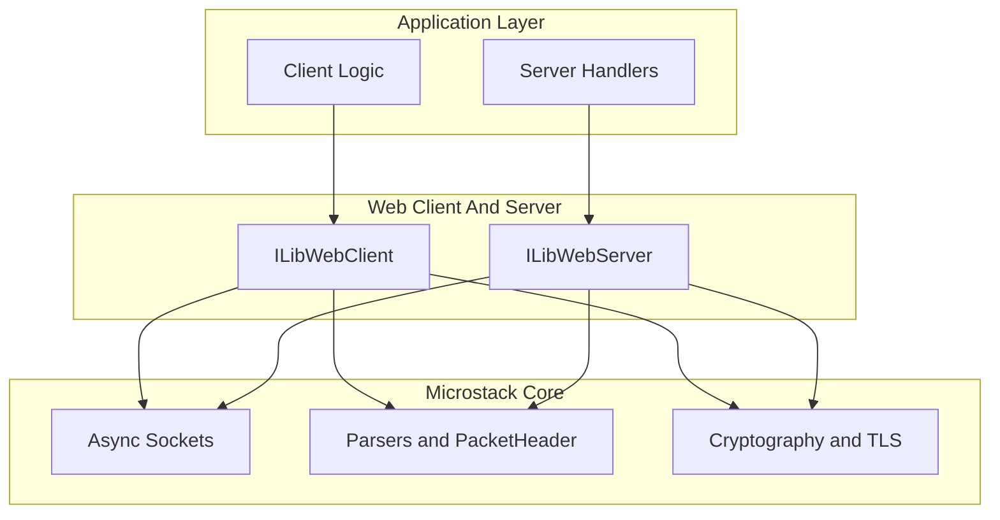
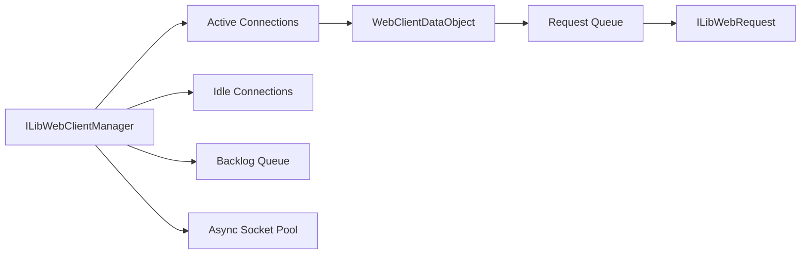
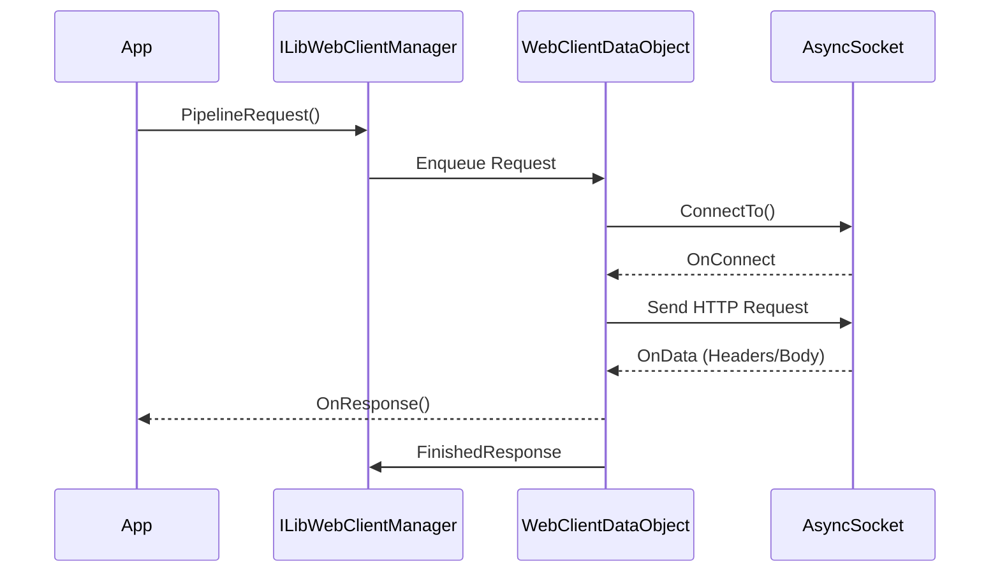
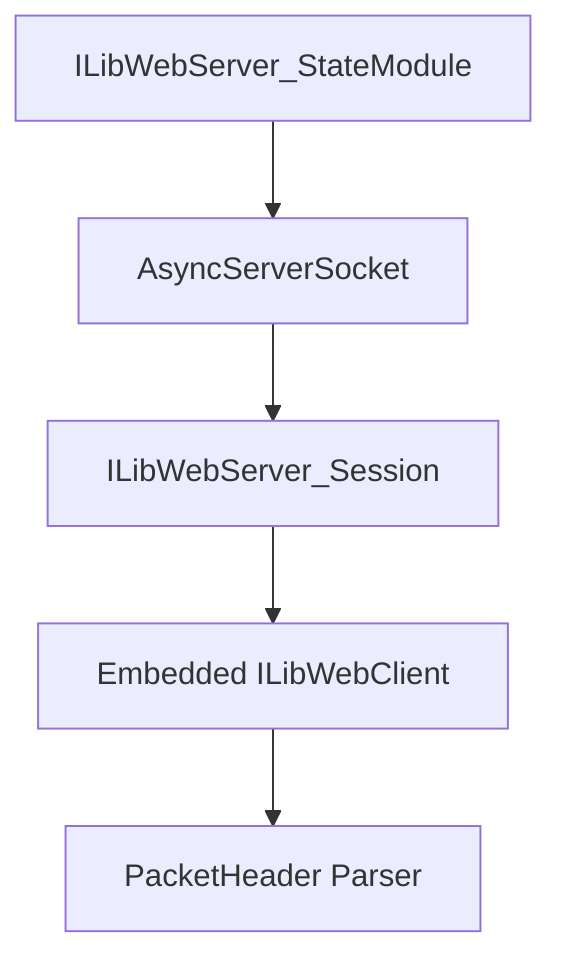
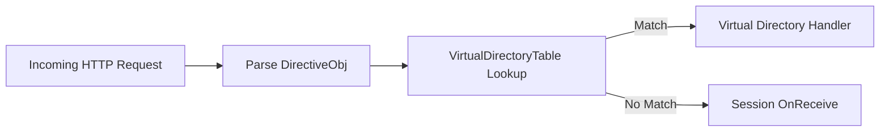
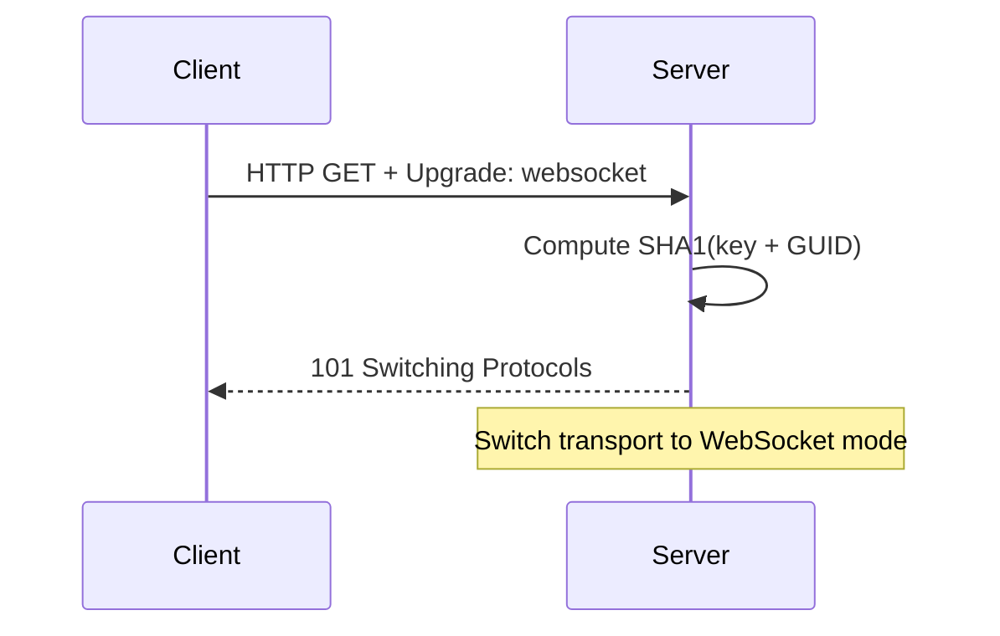
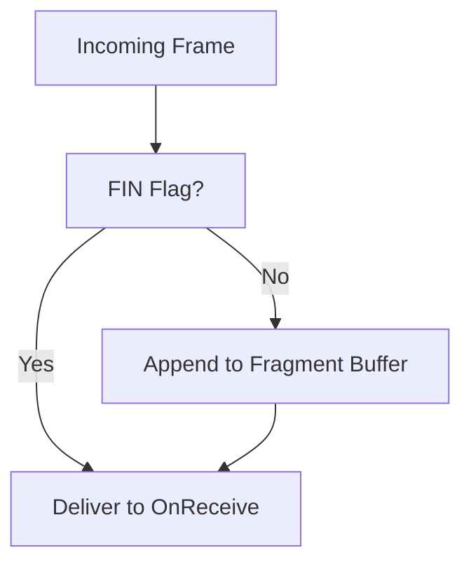
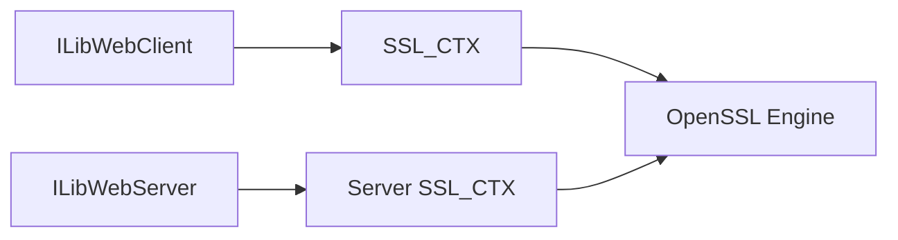
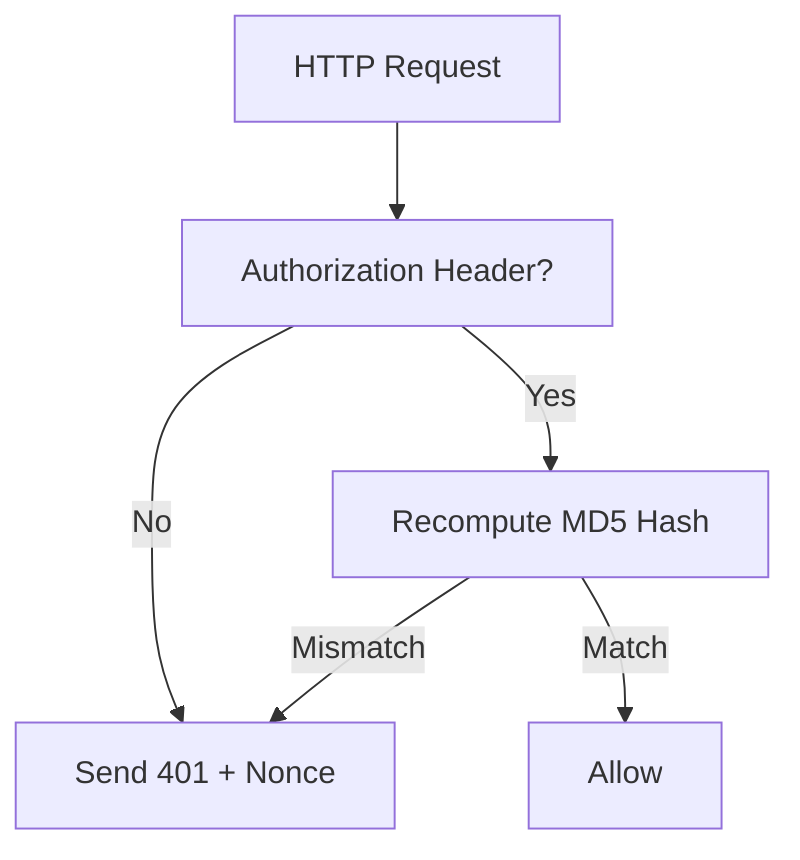
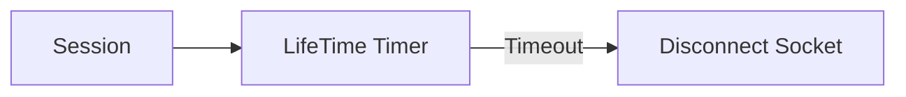

# Web Client And Server

The **Web Client And Server** module provides the HTTP and WebSocket networking layer for the Microstack runtime. It implements:

- An asynchronous, pooled **HTTP client** with pipelining and streaming support.
- A high-performance **HTTP server** with persistent connections and virtual directory routing.
- Full **WebSocket** client and server implementations.
- Optional **TLS (HTTPS)** integration using OpenSSL.
- Digest authentication helpers for both client and server flows.

This module builds directly on top of:

- [Async Sockets](async_sockets/async_sockets.md)
- [Parsers and Chain](parsers_and_chain/parsers_and_chain.md)
- [Cryptography](cryptography/cryptography.md)

It is the core transport layer used by higher-level protocols such as WebRTC and management APIs.

---

## 1. High-Level Architecture

At a high level, the module contains two major subsystems:

- **ILibWebClient** – outbound HTTP/WebSocket client
- **ILibWebServer** – inbound HTTP/WebSocket server

Both subsystems are built on top of the asynchronous socket engine and share common packet parsing utilities.

---

## 2. HTTP Client Architecture (ILibWebClient)

### 2.1 Core Structures

Key internal structures:

- `ILibWebClientManager` – global client manager with socket pool.
- `ILibWebClientDataObject` – per-connection state.
- `ILibWebRequest` – individual queued request.
- `ILibWebClient_PipelineRequestToken` – request handle returned to callers.
- `ILibWebClient_WebSocketState` – per-session WebSocket state.

### 2.2 Client Connection Model

The client uses a **socket pool** and maintains:

- A `DataTable` of active connections keyed by remote address.
- An `idleTable` for persistent idle connections.
- A `backlogQueue` for pending connections.

### 2.3 Request Lifecycle

1. Application calls `ILibWebClient_PipelineRequest()`.
2. A `ILibWebRequest` is created.
3. It is queued into the appropriate `ILibWebClientDataObject`.
4. If no connection exists, one is created from the socket pool.
5. Response data flows through `ILibWebClient_OnData()`.
6. Completion triggers `ILibWebClient_FinishedResponse()`.

### 2.4 Features

- **Persistent connections** (HTTP/1.1 keep-alive)
- **Chunked transfer decoding**
- **Streaming request bodies**
- **Digest authentication support**
- **WebSocket client mode**
- **HTTPS with SNI and certificate validation**

---

## 3. HTTP Server Architecture (ILibWebServer)

### 3.1 Core Structures

- `ILibWebServer_StateModule` – global server state.
- `ILibWebServer_Session` – per-connection session.
- `ILibWebServer_Session_SystemData` – internal session metadata.
- `ILibWebServer_VirDir_Data` – virtual directory mapping.

### 3.2 Server Connection Model

The server is built on top of `ILibAsyncServerSocket` and internally attaches a WebClient engine per session to reuse HTTP parsing logic.

Each session:

- Maintains reference counting.
- Tracks persistent vs non-persistent connections.
- Handles chunked transfer encoding.
- Can upgrade to WebSocket mode.

### 3.3 Virtual Directory Routing

The server supports path-based dispatch:

This enables modular API routing without embedding routing logic in a single handler.

---

## 4. WebSocket Support

Both client and server implement full WebSocket framing:

- Frame parsing (FIN, OPCODE, MASK, payload length)
- Fragment reassembly
- Control frames (PING, PONG, CLOSE)
- Automatic close handshake handling

### 4.1 WebSocket Upgrade (Server)

After upgrade:

- HTTP parsing is bypassed.
- `ILibWebServer_WebSocket_Send()` is used.
- Transport flags change from HTTP to WebSocket.

### 4.2 Fragment Reassembly Model

Applications may:

- Disable auto-reassembly (stream fragments directly).
- Set maximum reassembly buffer size.

---

## 5. TLS and HTTPS Integration

TLS is optional and enabled via:

- `ILibWebClient_EnableHTTPS()`
- `ILibWebServer_EnableHTTPS()`

Capabilities include:

- Certificate chain inspection
- Custom validation callbacks
- SNI (Server Name Indication)
- Client certificate verification (server side)

TLS state is attached to socket modules and linked back to session objects via OpenSSL `ex_data` indices.

---

## 6. Digest Authentication Flow

Both client and server support HTTP Digest authentication.

### Server-Side Validation

### Client-Side Handling

- Detect `401 Unauthorized`.
- Parse `WWW-Authenticate` header.
- Generate response hash.
- Resend request with `Authorization` header.

---

## 7. Persistent Connections and Idle Management

Both subsystems implement idle timeout logic:

- Idle sessions tracked via timer (`HTTP_SESSION_IDLE_TIMEOUT`).
- Client idle connections stored in `idleTable`.
- Server sessions closed if no request is received in time.

---

## 8. Integration with the Microstack Chain

The module integrates with the **ILibChain** event loop:

- PreSelect handler dispatches queued client connections.
- All network I/O is non-blocking.
- Timers handled via base chain timer.

This ensures:

- Single-threaded deterministic execution (unless otherwise configured).
- Safe interaction with other Microstack modules.

---

## 9. Summary

The **Web Client And Server** module is a fully asynchronous HTTP/WebSocket engine designed for embedded and agent-based systems. It provides:

- Scalable connection pooling
- HTTP/1.1 persistent connection handling
- Streaming and chunked transfer support
- Integrated WebSocket framing
- Digest authentication
- TLS integration

It forms the transport backbone for higher-level modules such as remote management APIs and WebRTC signaling layers.
