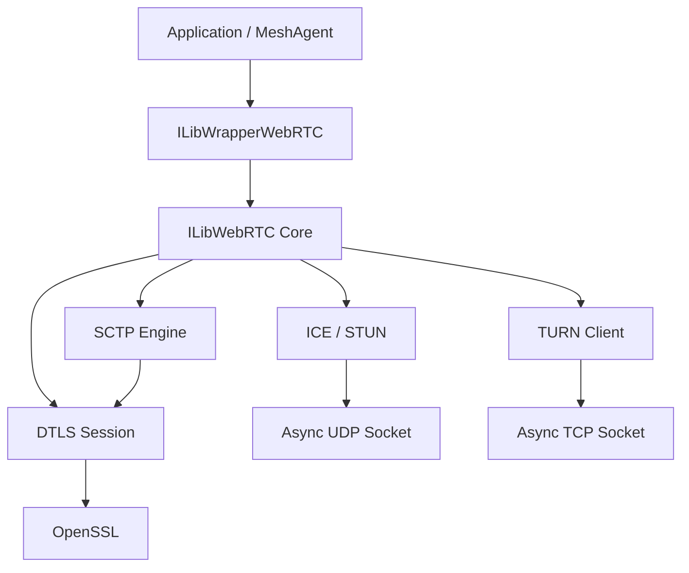
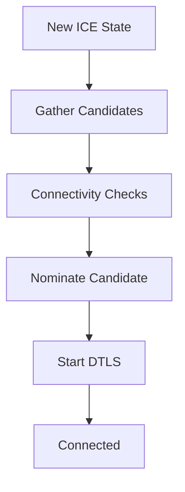
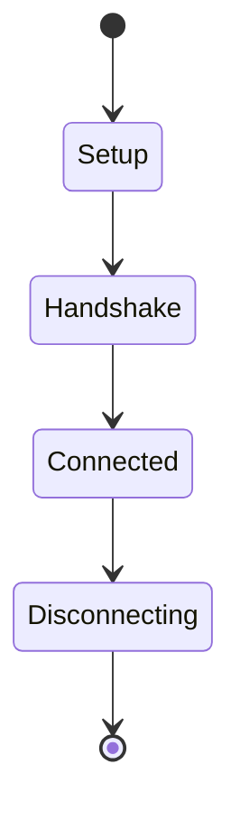
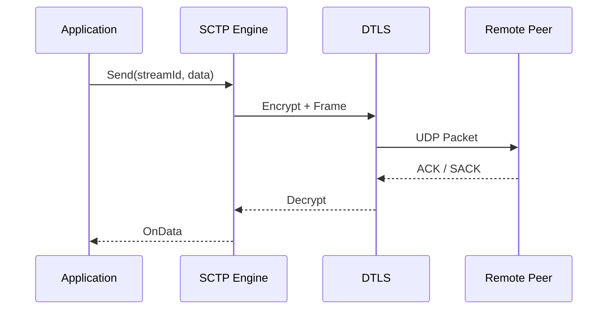
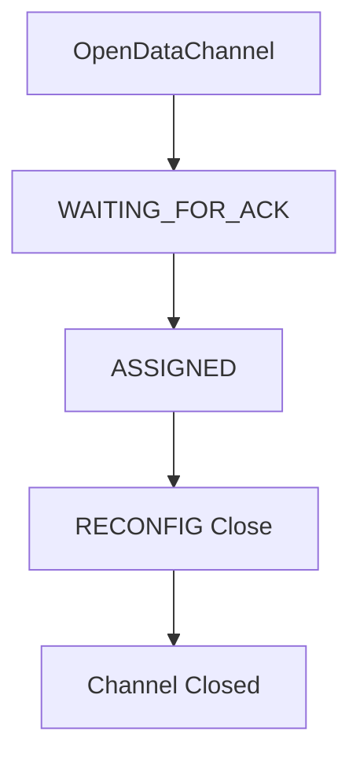
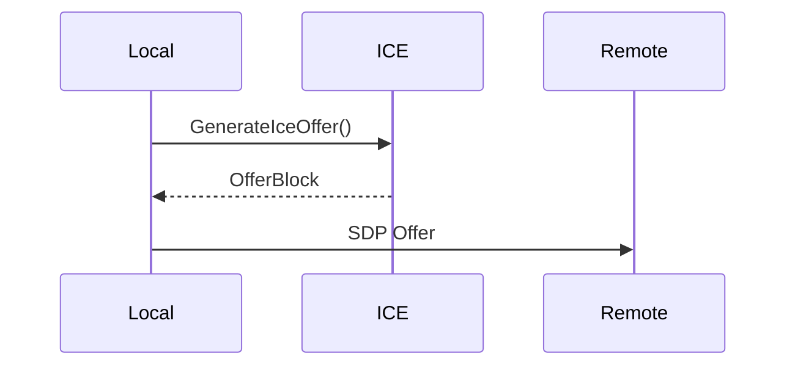

# Webrtc

The **Webrtc** module implements a full embedded WebRTC stack for MeshAgent, including:

- STUN (NAT discovery)
- ICE (candidate gathering and connectivity checks)
- DTLS (secure transport)
- SCTP (data transport over DTLS)
- WebRTC Data Channels
- TURN (relay support)

It is built on top of the Microstack event-driven networking core and OpenSSL, providing peer-to-peer connectivity with optional relay fallback.

---

## Architecture Overview

The Webrtc module sits above Async Sockets and Cryptography components and exposes high-level APIs for peer connections and data channels.

### Layers

| Layer | Responsibility |
|--------|----------------|
| ILibWrapperWebRTC | High-level API (SDP, connection management, data channels) |
| ILibWebRTC | Protocol engine (ICE, DTLS, SCTP, TURN) |
| ILibAsyncSocket | Non-blocking UDP/TCP I/O |
| OpenSSL | DTLS handshake, encryption |

---

## Core Components

### 1. STUN and ICE

Implemented primarily in `ILibStun_Module` and `ILibStun_IceState`.

Responsibilities:

- NAT type detection
- ICE offer generation
- ICE credential validation
- Connectivity checks
- Consent freshness monitoring

### ICE State Machine

Key structures:

- `ILibStun_IceState`
- `ILibICE_PeriodicState`
- `STUNHEADER`
- `STUN_MAPPED_ADDRESS`

---

### 2. DTLS Session

Encapsulated in `ILibStun_dTlsSession`.

Responsibilities:

- DTLS handshake (client or server role)
- Certificate verification
- Secure packet encapsulation
- Consent freshness timeout handling

DTLS state transitions:

Important fields:

- `ssl` (OpenSSL session)
- `iceStateSlot`
- `receiverCredits`
- `senderCredits`
- `RTO`, `SRTT`, `RTTVAR`

---

### 3. SCTP Engine

Implements RFC 4960 over DTLS for reliable and partially reliable data transport.

Core structures:

- `ILibSCTP_DataPayload`
- `ILibSCTP_RPACKET`
- `ILibSCTP_ReconfigChunk`
- `ILibSCTP_StreamAttributesStruct`

#### SCTP Data Flow

Features implemented:

- Congestion control (cwnd, ssthresh)
- Fast retransmit
- T3-RTX timer
- Selective ACK (SACK)
- Partial reliability (timed or retransmit-based)
- Stream reset via RECONFIG

---

### 4. WebRTC Data Channels

High-level abstraction over SCTP streams.

Managed by:

- `ILibWrapper_WebRTC_ConnectionStruct`
- `ILibWrapper_WebRTC_DataChannel`

Capabilities:

- Reliable ordered
- Reliable unordered
- Partial reliable (max retransmit)
- Partial reliable (timed)

Data channel lifecycle:

---

### 5. TURN Client

Encapsulated in `ILibTURN_TurnClientObject`.

Supports:

- Allocation
- Permission creation
- Channel binding
- Indication-based sending
- TCP relay transport

TURN is used when:

- Direct UDP fails
- Symmetric NAT blocks connectivity
- `ILibWebRTC_TURN_ALWAYS_RELAY` is enabled

---

## Offer and Answer Handling

Webrtc uses a compact binary "offer block" internally and converts it to/from SDP.

### Offer Generation

1. Generate ICE username/password
2. Embed DTLS fingerprint
3. Add host candidates
4. Optionally include TURN relay candidate

### Offer Processing

1. Parse SDP into internal block
2. Store remote credentials
3. Start connectivity checks
4. Establish DTLS
5. Initiate SCTP

---

## Consent Freshness

Webrtc implements consent freshness as required by WebRTC specifications.

- Periodic STUN binding requests
- Timeout: 15 seconds maximum
- DTLS session is closed if consent expires

---

## Integration Points

Webrtc integrates with:

- Async UDP sockets for ICE/STUN
- Async TCP sockets for TURN
- OpenSSL for DTLS
- Microstack timer system for retransmission and heartbeats

---

## Key Design Characteristics

- Fully event-driven (no blocking I/O)
- Fixed slot-based ICE and DTLS session management
- Sparse array structures for stream/channel tracking
- Memory-safe packet handling with alignment guarantees
- Supports up to 1024 SCTP streams

---

## Summary

The Webrtc module provides a complete embedded WebRTC stack optimized for agent-based peer connectivity:

- NAT traversal via ICE and STUN
- Secure transport via DTLS
- Reliable multiplexed transport via SCTP
- Application-level channels via Data Channels
- Relay fallback via TURN

It enables MeshAgent to establish secure peer-to-peer sessions across complex NAT environments with minimal external dependencies.