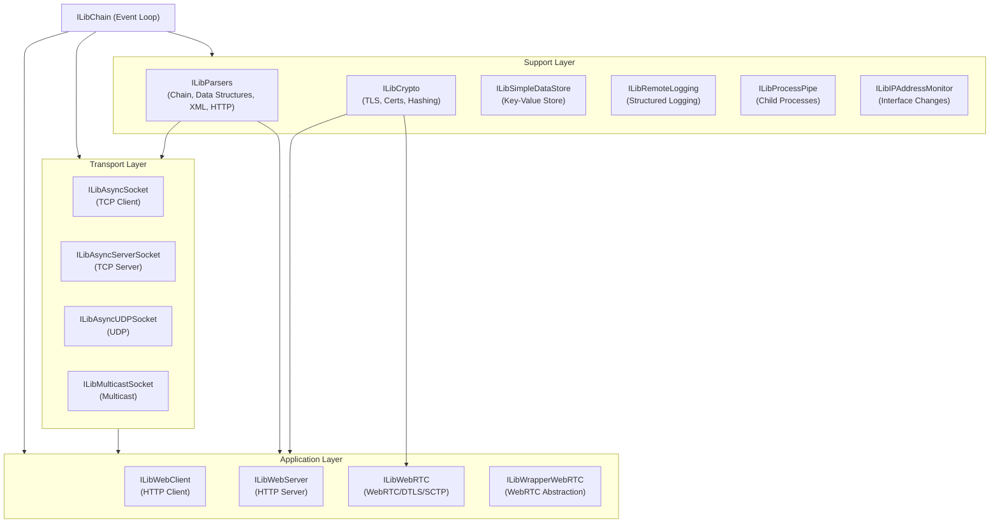
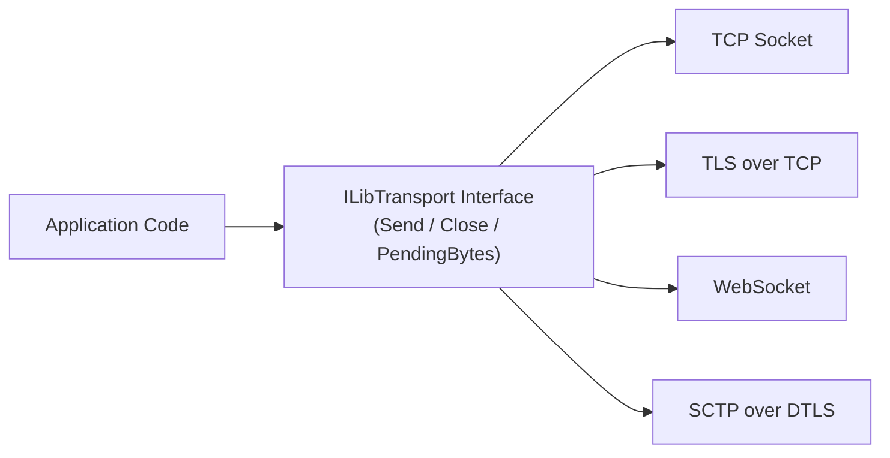
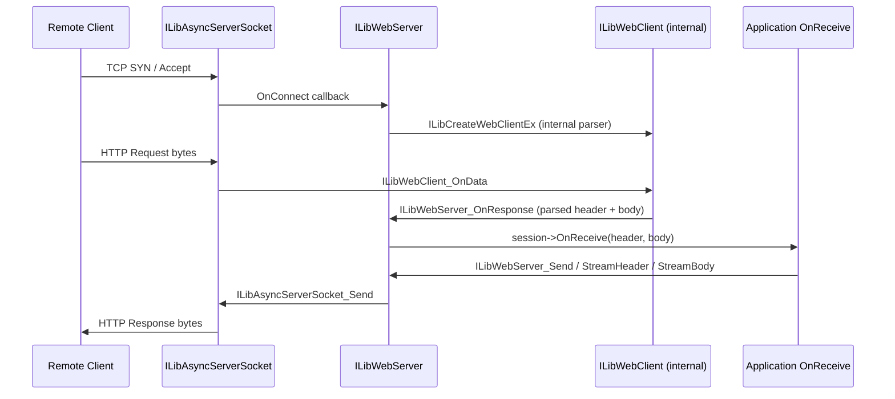
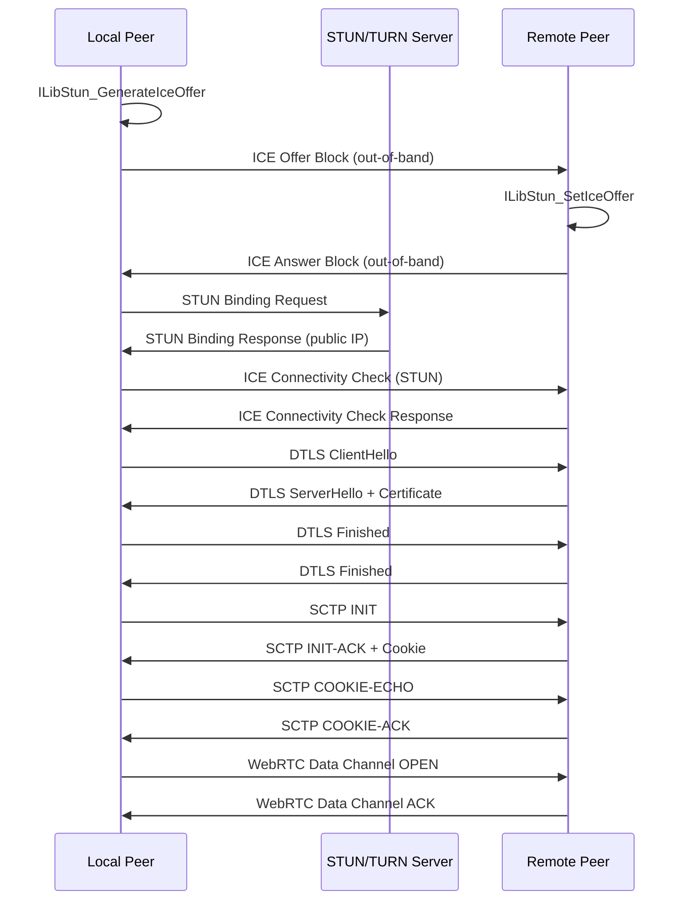

# Microstack Core

The Microstack Core module is the foundational networking and I/O layer of the MeshAgent platform. It provides a cross-platform, event-driven, non-blocking networking stack that underpins all higher-level communication, including HTTP, WebSocket, WebRTC, and SCTP data channels. Built on a chain-based reactor pattern, it enables efficient multiplexing of thousands of concurrent connections on a single thread without blocking.

## Overview

Microstack Core is a C-language library that implements:

- **Asynchronous TCP/UDP sockets** — non-blocking I/O with automatic buffer management
- **HTTP client and server** — full HTTP/1.1 with chunked transfer, persistent connections, WebSocket upgrade, and Digest authentication
- **WebRTC stack** — ICE, DTLS, SCTP data channels, and TURN relay support
- **Cryptographic primitives** — TLS via OpenSSL, SHA-1/256/384/512, MD5, HMAC, and certificate management
- **Data persistence** — a lightweight key-value data store with compaction
- **Remote logging** — structured, verbosity-controlled logging over WebSocket
- **Process pipe management** — spawning and communicating with child processes
- **IP address monitoring** — real-time detection of network interface changes
- **Multicast/UDP** — multicast group management and UDP broadcasting

The module is designed to run on Windows, Linux, and macOS, with platform-specific optimizations for each.

---

## Architecture

The entire stack is built around the **ILibChain** reactor pattern. A chain is a single-threaded event loop that drives all I/O through `select()` (POSIX) or `WaitForMultipleObjectsEx()` (Windows). Every module registers `PreSelect` and `PostSelect` handlers with the chain, enabling cooperative, non-blocking operation.



---

## Sub-modules

The Microstack Core module is organized into the following sub-modules, each documented in detail:

| Sub-module | Description |
|---|---|
| [Async Sockets](microstack-core/async_sockets/async_sockets.md) | Non-blocking TCP client, TCP server, and UDP socket abstractions |
| [Parsers and Chain](microstack-core/parsers_and_chain/parsers_and_chain.md) | Core event loop, data structures, HTTP/XML parsing, and memory management |
| [Web Client and Server](microstack-core/web_client_and_server/web_client_and_server.md) | HTTP/1.1 client and server with WebSocket and Digest authentication |
| [WebRTC](microstack-core/webrtc/webrtc.md) | Full WebRTC stack: ICE, STUN, TURN, DTLS, and SCTP data channels |
| [Cryptography](microstack-core/cryptography/cryptography.md) | TLS, certificate management, hashing, and no-SSL fallback primitives |
| [Data Store](microstack-core/data_store/data_store.md) | Persistent key-value store with SHA-384 integrity verification |
| [Remote Logging](microstack-core/remote_logging/remote_logging.md) | Structured, verbosity-controlled remote logging over WebSocket |
| [Process Pipe](microstack-core/process_pipe/process_pipe.md) | Cross-platform child process spawning and pipe I/O |
| [IP Address Monitor](microstack-core/ip_address_monitor/ip_address_monitor.md) | Real-time network interface change detection |
| [Multicast Socket](microstack-core/multicast_socket/multicast_socket.md) | IPv4/IPv6 multicast group management and UDP broadcasting |

> **Note:** The sub-module files above are located under `microstack-core/` relative to this document. Each sub-module directory contains a single documentation file with the same name as the directory.

---

## Key Design Principles

### Chain-Based Reactor

All modules integrate with the chain via three callbacks:

- **`PreSelectHandler`** — registers file descriptors into `readset`/`writeset`/`errorset` before `select()`
- **`PostSelectHandler`** — processes I/O events after `select()` returns
- **`DestroyHandler`** — cleans up resources when the chain shuts down

This design ensures that all I/O is handled on a single thread, eliminating the need for locks in most cases and making the stack highly predictable.

### ILibTransport Abstraction

Higher-level modules communicate through the `ILibTransport` interface, which provides a uniform `Send`, `Close`, and `PendingBytes` API regardless of whether the underlying transport is a raw TCP socket, a TLS session, a WebRTC SCTP channel, or a WebSocket.



### Memory Ownership Model

The stack uses an explicit memory ownership model for all send buffers:

| Flag | Meaning |
|---|---|
| `ILibAsyncSocket_MemoryOwnership_CHAIN` | The stack will free the buffer when done |
| `ILibAsyncSocket_MemoryOwnership_STATIC` | The buffer is static; the stack will not free it |
| `ILibAsyncSocket_MemoryOwnership_USER` | The stack will copy the buffer; the caller retains ownership |

### Smart Memory (`ILibMemory`)

The `ILibMemory` subsystem provides canary-protected heap allocations with optional extra memory regions. This enables safe detection of use-after-free bugs and simplifies co-allocation of related objects.

---

## Data Flow: HTTP Request Lifecycle

The following diagram illustrates how an inbound HTTP request flows through the stack:



---

## Data Flow: WebRTC Connection Establishment



---

## Platform Support

| Feature | Windows | Linux | macOS |
|---|---|---|---|
| TCP/UDP sockets | ✅ Winsock2 | ✅ POSIX | ✅ POSIX |
| TLS/DTLS | ✅ OpenSSL | ✅ OpenSSL | ✅ OpenSSL |
| No-SSL fallback | ✅ BCrypt | ✅ Custom SHA/MD5 | ✅ Custom SHA/MD5 |
| IP monitor | ✅ SIO_ADDRESS_LIST_CHANGE | ✅ Netlink | ✅ sysctl |
| Process pipes | ✅ Named pipes | ✅ POSIX pipes | ✅ POSIX pipes + PTY |
| WebRTC | ✅ | ✅ | ✅ |
| IPv6 | ✅ | ✅ | ✅ |

---

## Source Location

The Microstack Core source files are located in the [`microstack/`](https://github.com/flamingo-stack/meshagent/blob/main/microstack/) directory of the repository.

```bash
git clone https://github.com/flamingo-stack/meshagent.git
```

---

## Community

Questions and discussions are managed on the [OpenMSP Slack community](https://www.openmsp.ai/).

https://join.slack.com/t/openmsp/shared_invite/zt-36bl7mx0h-3~U2nFH6nqHqoTPXMaHEHA
