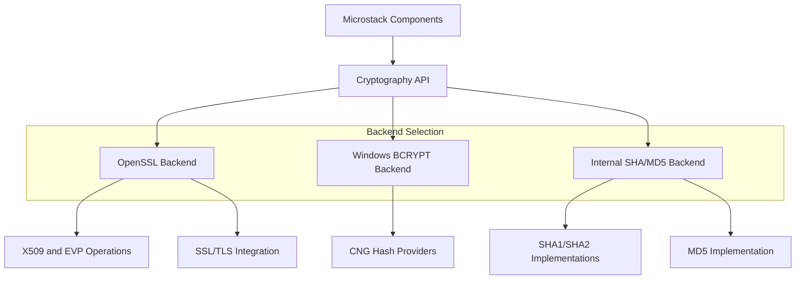
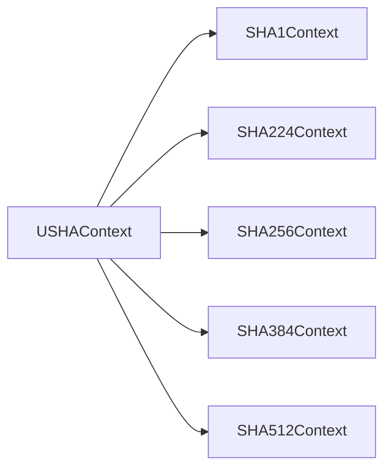
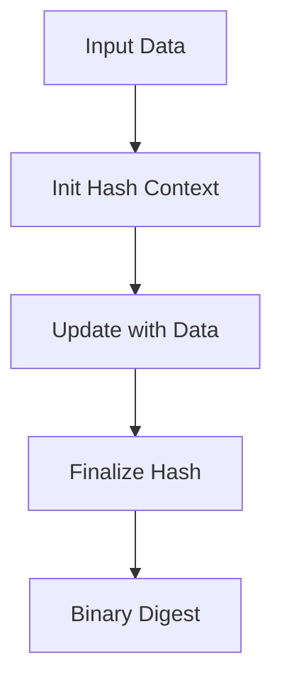
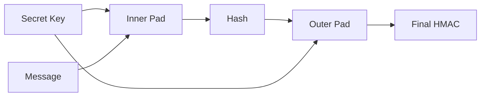
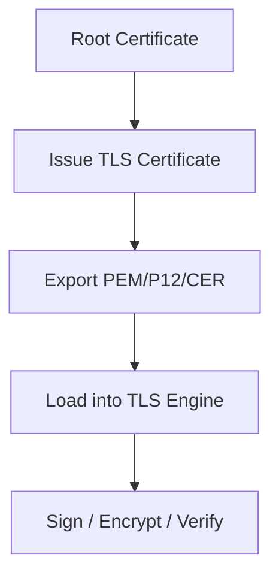
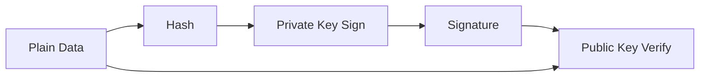
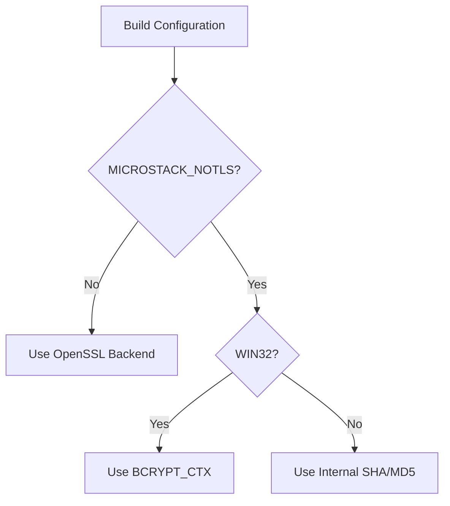

# Cryptography

The **Cryptography** module provides hashing, HMAC, random generation, certificate management, and public key cryptography services for the Microstack Core. It abstracts platform-specific cryptographic backends (OpenSSL, Windows CNG, or internal no-SSL implementations) behind a consistent API used by networking, WebRTC, and higher-level security features.

This module is a foundational security layer for:

- TLS enablement in Web Client and Server components
- WebRTC DTLS and certificate handling
- File and data integrity validation
- Authentication and digital signature verification
- Secure random generation

---

## Architectural Overview

The module dynamically adapts to three execution environments:

1. **OpenSSL-enabled builds** (full TLS and X509 support)
2. **Windows CNG (BCRYPT) fallback** when TLS is disabled on Windows
3. **Internal no-SSL SHA/MD5 implementations** for minimal builds



The `ILibCrypto` interface ensures that callers do not need to know which backend is active.

---

## Core Components

### ILibCrypto (Primary Interface)

Defined in `ILibCrypto.h`, this is the main abstraction layer.

**Key Responsibilities:**

- Hashing utilities (MD5, SHA1, SHA256, SHA384)
- Hex encoding/decoding
- Random data generation
- File helpers
- Certificate parsing and generation
- RSA encryption/decryption
- Signing and verification

**Hash Size Constants:**

```text
UTIL_MD5_HASHSIZE      = 16 bytes
UTIL_SHA1_HASHSIZE     = 20 bytes
UTIL_SHA256_HASHSIZE   = 32 bytes
UTIL_SHA384_HASHSIZE   = 48 bytes
UTIL_SHA512_HASHSIZE   = 64 bytes
```

---

### util_cert Structure (OpenSSL Mode)

When TLS is enabled, certificates are represented by:

```c
typedef struct util_cert
{
    X509 *x509;
    EVP_PKEY *pkey;
    int flags;
} util_cert;
```

This structure binds the X509 certificate, the associated private key, and ownership flags. It is used for TLS server/client certificates, certificate-based encryption, digital signatures, and certificate hashing.

---

### Windows BCRYPT Context

When `MICROSTACK_NOTLS` is defined on Windows, hashing is backed by CNG via `BCRYPT_CTX`. This structure provides a unified replacement for `SHA256_CTX`, `SHA384_CTX`, `SHA512_CTX`, `SHA_CTX`, and `MD5_CTX`. Macros map standard hash APIs onto BCRYPT calls.

---

### Internal No-SSL Implementations

When TLS is disabled and not on Windows, hashing falls back to built-in implementations:

| Structure | Algorithm |
|---|---|
| `MD5_CTX` | MD5 (public domain) |
| `SHA1Context` / `sha1nfo` | SHA-1 |
| `SHA224Context` | SHA-224 |
| `SHA256Context` | SHA-256 |
| `SHA384Context` | SHA-384 |
| `SHA512Context` | SHA-512 |
| `USHAContext` | Unified SHA wrapper |
| `HMACContext` | HMAC over any SHA variant |

These implementations follow FIPS 180-2 specifications.

### Unified SHA Context



This allows runtime selection of hash algorithm via `SHAversion`.

---

## Functional Areas

### Hashing Utilities

The module provides convenience wrappers:

- `util_md5()` — MD5 hash
- `util_sha1()` — SHA-1 hash
- `util_sha256()` — SHA-256 hash
- `util_sha384()` — SHA-384 hash
- `util_sha384file()` — SHA-384 hash of a file



### HMAC Support

Provided via `HMACContext` and helper functions:

- `hmac()` — single-call HMAC
- `hmacReset()` / `hmacInput()` / `hmacResult()` — streaming HMAC



### Random Generation

- `util_random()` — binary random bytes
- `util_randomtext()` — printable random text

Used for nonces, session IDs, temporary tokens, and key material.

### Certificate Lifecycle (TLS builds only)

**Creation:** `util_mkCertEx()`, `util_mkCert()`

**Serialization:** `util_to_p12()`, `util_from_p12()`, `util_to_cer()`, `util_from_cer()`, `util_from_pem()`, `util_from_pem_string()`

**Inspection:** `util_printcert()`, `util_certhash()`, `util_keyhash()`



### Signing and Verification

- `util_sign()` / `util_verify()` — CMS-based signing
- `util_rsaverify()` — RSA signature verification



### Encryption and Decryption (TLS builds only)

- `util_encrypt()` / `util_encrypt2()` / `util_decrypt()` — CMS envelope
- `util_rsaencrypt()` / `util_rsadecrypt()` — RSA direct

---

## Conditional Compilation Model



This enables minimal footprint builds, embedded deployments, and full TLS deployments from the same codebase.

---

## Integration Within Microstack Core

Cryptography is consumed by:

- [Web Client and Server](../web_client_and_server/web_client_and_server.md) — TLS certificates and Digest auth
- [WebRTC](../webrtc/webrtc.md) — DTLS certificate handling and fingerprint verification
- [Data Store](../data_store/data_store.md) — SHA-384 integrity verification
- Remote authentication logic and secure data validation

---

## Security Considerations

- MD5 and SHA1 are provided for compatibility but should not be used for new security-sensitive designs.
- SHA256 or higher is recommended for all new code.
- RSA operations depend on OpenSSL correctness in TLS builds.
- Random generation quality depends on backend (OpenSSL vs internal fallback).
- Certificate ownership flags (`ILibCrypto_Cert_Ownership_Other`) must be handled carefully to avoid double-free conditions.
