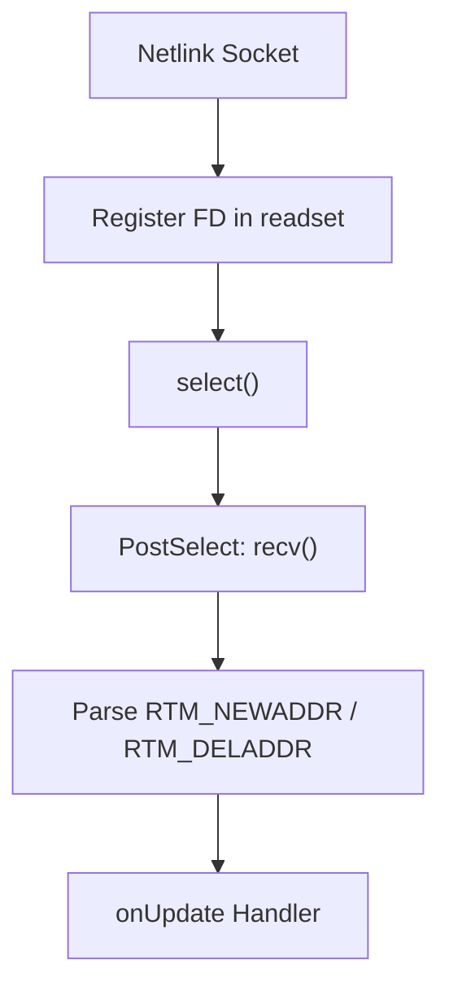
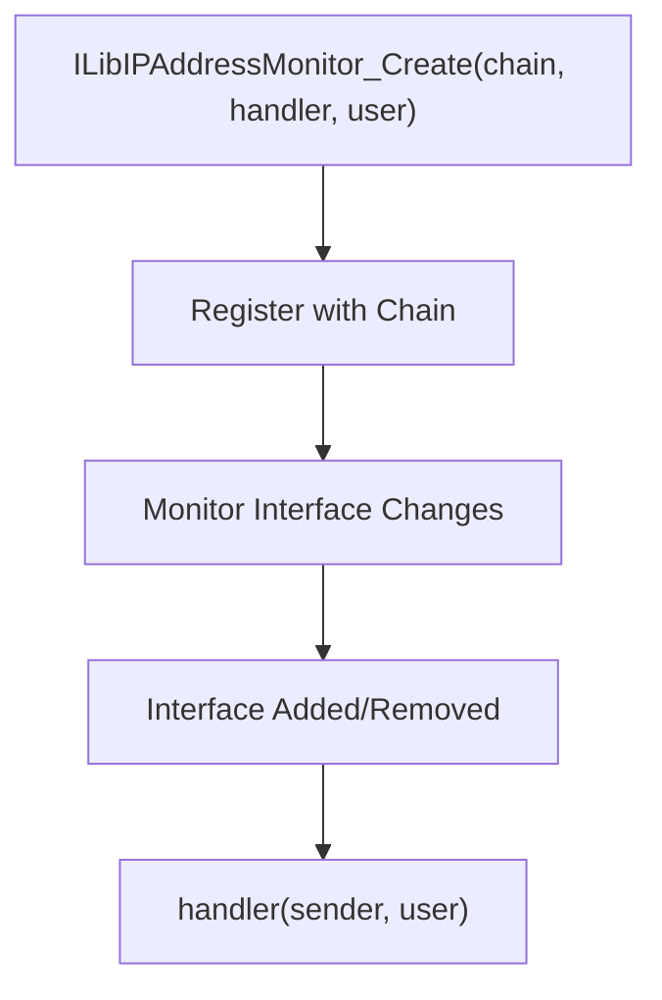

# IP Address Monitor

The **IP Address Monitor** module detects changes to local network interfaces in real time and notifies registered handlers. It is used by higher-level modules such as [Multicast Socket](../multicast_socket/multicast_socket.md) to refresh their interface bindings when the network topology changes.

---

## Core Component

### `_ILibIPAddressMonitor`

The central structure that integrates with the Microstack chain.

**Key Fields:**

| Field | Purpose |
|---|---|
| `chainLink` | Chain integration (PreSelect/PostSelect/Destroy) |
| `onUpdate` | Callback triggered on interface change |
| `user` | Custom user state |
| `mSocket` | OS-specific monitoring socket |
| `addr` | Netlink socket address (Linux) |

---

## Platform Implementations

### Linux

Uses a **Netlink socket** (`AF_NETLINK`, `NETLINK_ROUTE`) bound to `RTMGRP_IPV4_IFADDR`.

The socket is set to non-blocking mode and registered with the chain's `PreSelect`/`PostSelect` handlers.

### Windows

Uses `WSAIoctl` with `SIO_ADDRESS_LIST_CHANGE` to receive asynchronous notifications via an overlapped I/O callback (`ILibIPAddressMonitor_dispatch`). When a change is detected, the handler is dispatched on the Microstack thread via `ILibChain_RunOnMicrostackThread`.

### macOS / FreeBSD

Not actively monitored in the current implementation. Interface changes are not detected automatically on these platforms.

---

## Integration with Microstack Core

IP Address Monitor is used by:

- [Multicast Socket](../multicast_socket/multicast_socket.md) — refreshes multicast group memberships when interfaces change

It depends on:

- [Parsers and Chain](../parsers_and_chain/parsers_and_chain.md) — chain integration and thread dispatch

---

## Usage Pattern

The monitor is created once per chain and fires the `onUpdate` callback whenever a relevant interface change is detected.
