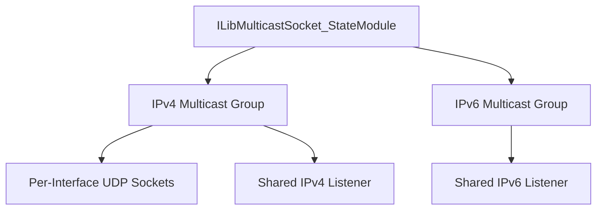
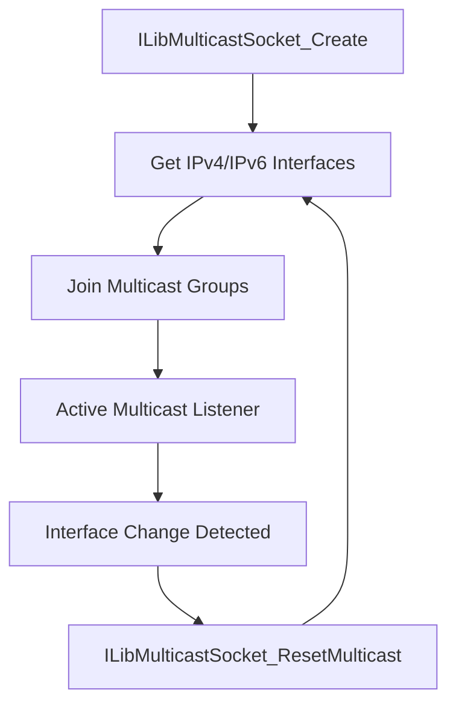
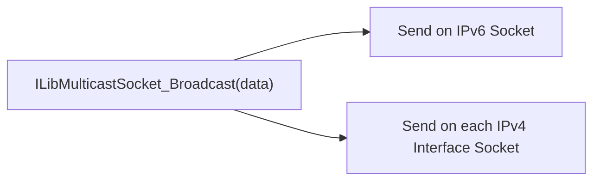

# Multicast Socket

The **Multicast Socket** module manages IPv4 and IPv6 multicast group memberships across all local network interfaces. It provides a unified API for sending and receiving multicast UDP traffic, broadcasting to all interfaces simultaneously, and performing Wake-on-LAN operations.

---

## Core Component

### `ILibMulticastSocket_StateModule`

The central structure that integrates with the Microstack chain.

**Key Fields:**

| Field | Purpose |
|---|---|
| `ChainLink` | Chain integration |
| `UDPServer` | Shared IPv4 UDP listener socket |
| `UDPServer6` | Shared IPv6 UDP listener socket |
| `UDPServers` | Per-interface IPv4 sockets for sending |
| `MulticastAddr` | IPv4 multicast group address |
| `MulticastAddr6` | IPv6 multicast group address |
| `AddressListV4` | Current IPv4 interface list |
| `IndexListV6` | Current IPv6 interface index list |
| `TTL` | Multicast TTL (default: 4) |
| `Loopback` | Multicast loopback flag |
| `LocalPort` | Bound local port |
| `OnData` | Data reception callback |

---

## Architecture

The module maintains:

- A **shared listener** for each address family to receive multicast traffic
- **Per-interface sockets** for IPv4 to send multicast packets on each interface independently

---

## Interface Management

The module automatically tracks local interfaces and refreshes multicast group memberships when they change.

`ILibMulticastSocket_ResetMulticast` compares the current interface list with the stored one and only rebuilds if a change is detected.

---

## Sending

### Broadcast to All Interfaces

### Unicast

`ILibMulticastSocket_Unicast(module, target, data, datalen)` sends directly to a specific endpoint using the appropriate socket (IPv4 or IPv6).

### Wake-on-LAN

`ILibMulticastSocket_WakeOnLan(module, mac)` constructs a magic packet and sends it via both IPv4 broadcast and multicast.

---

## Integration with Multicast Groups

### IPv4

- `ILibAsyncUDPSocket_JoinMulticastGroupV4()` — join a group on a specific interface
- `ILibAsyncUDPSocket_DropMulticastGroupV4()` — leave a group

### IPv6

- `ILibAsyncUDPSocket_JoinMulticastGroupV6()` — join using interface index
- `ILibAsyncUDPSocket_DropMulticastGroupV6()` — leave using interface index

---

## Integration with Microstack Core

Multicast Socket builds on:

- [Async Sockets](../async_sockets/async_sockets.md) — `ILibAsyncUDPSocket` for all I/O
- [Parsers and Chain](../parsers_and_chain/parsers_and_chain.md) — chain lifecycle and interface enumeration

It is used by discovery and service announcement subsystems that need to reach all devices on the local network segment.
