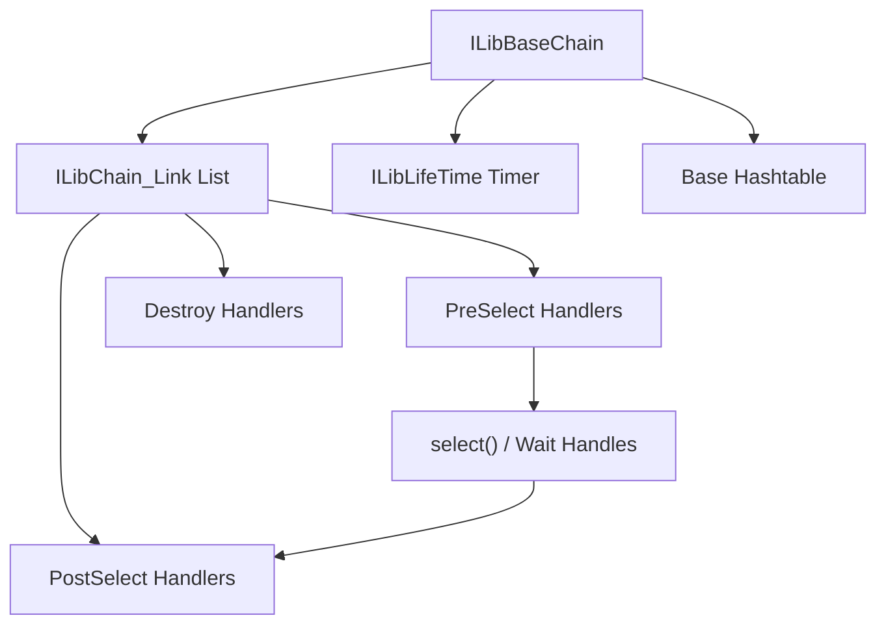
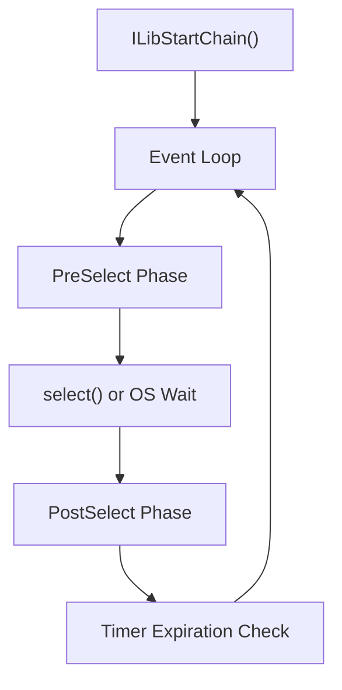
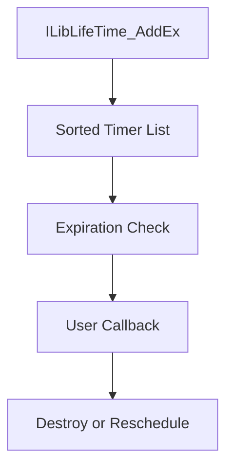
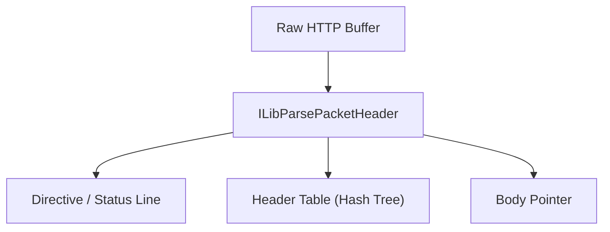
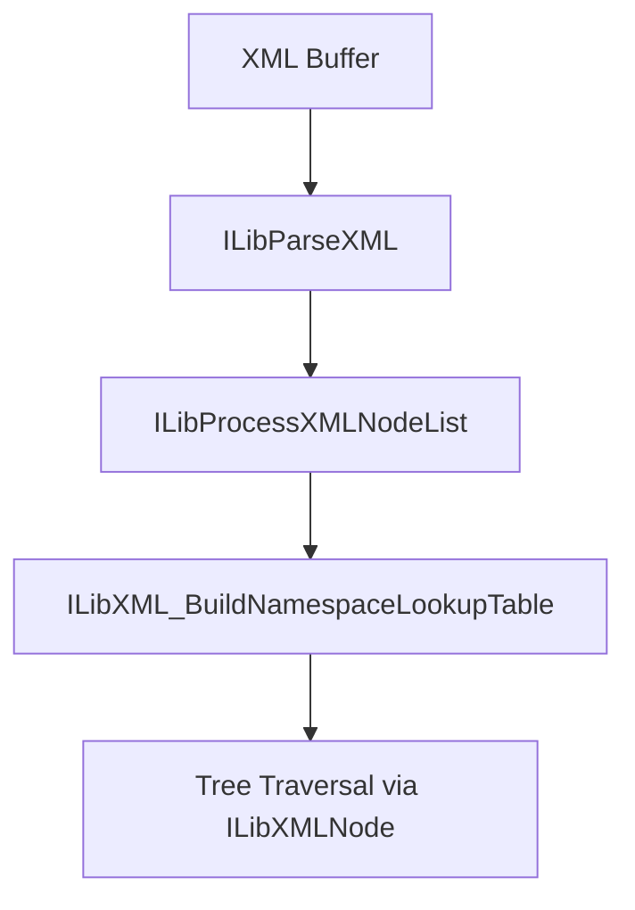
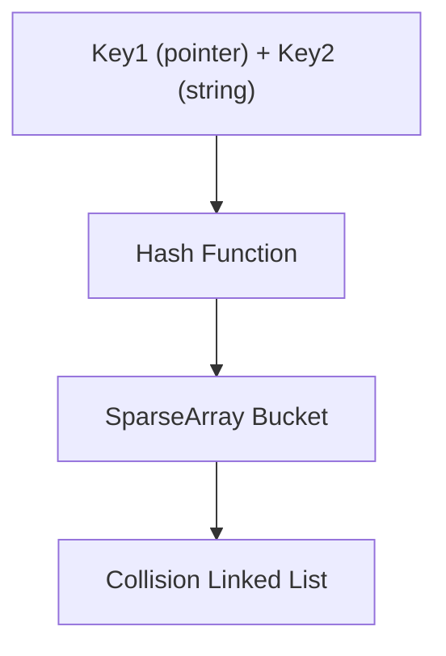
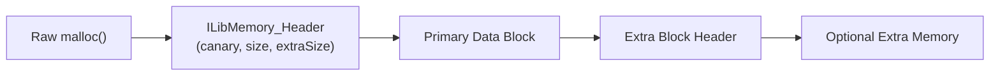
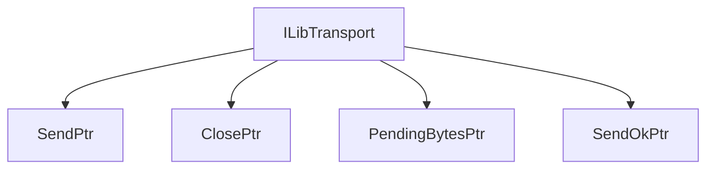
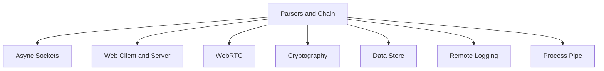

# Parsers and Chain

The **Parsers and Chain** module is the core runtime foundation of the Microstack architecture. It provides:

- The event-driven execution engine (**ILibBaseChain**)
- Core data structures (linked lists, hash tables, sparse arrays, queues, stacks)
- HTTP and XML parsing utilities
- Memory management helpers
- Timers and lifecycle management
- Cross-platform threading and synchronization primitives

Nearly every higher-level module (Web Client and Server, WebRTC, Async Sockets, Cryptography, Data Store, etc.) depends on this module for scheduling, parsing, and concurrency.

---

## Architectural Overview

At its heart, Parsers and Chain implements a **single-threaded, event-driven loop** (the Chain) with pluggable modules called *links*.

### Key Concepts

| Concept | Purpose |
|---|---|
| `ILibBaseChain` | Event loop controller |
| `ILibChain_Link` | Pluggable module unit |
| `PreSelectHandler` | Register descriptors / timeouts |
| `PostSelectHandler` | React to ready descriptors |
| `DestroyHandler` | Cleanup logic |
| `ILibLifeTime` | Timer scheduling service |

The Chain is cooperative: each module registers interest in events, and the loop dispatches them sequentially.

---

## The Chain Execution Model

The Chain runs in a single thread (the "Microstack thread"). Modules must never block this thread.

### Execution Cycle

### ILibChain_Link Structure

Each link provides:

- `PreSelectHandler` — registers file descriptors before `select()`
- `PostSelectHandler` — processes I/O events after `select()`
- `DestroyHandler` — cleans up resources on chain shutdown
- Optional `QueryHandler` and metadata support

This enables modular composition of networking stacks such as Web Server, Web Client, WebRTC, Process Pipe, and Remote Logging.

---

## Timer System (ILibLifeTime)

The **ILibLifeTime** subsystem provides millisecond-resolution scheduled callbacks.

### Characteristics

- Timers are ordered by expiration tick
- Executed on the Microstack thread (no locking needed)
- Safe cross-thread removal via deferred queue
- Supports metadata tracking for diagnostics

Used extensively by networking and protocol layers for retransmit timers, idle timeouts, and periodic tasks.

---

## HTTP Packet Model

The module defines a full HTTP parsing and serialization layer.

### Core Structures

| Structure | Purpose |
|---|---|
| `packetheader` | Full HTTP request or response |
| `packetheader_field_node` | Individual header field |
| `ILibHTTPPacket` | Alias for `packetheader` with stash support |
| `parser_result` | Tokenized string result |
| `parser_result_field` | Individual token |

### Parsing Flow

Key traits:

- **Zero-copy parsing** — strings reference the original buffer
- Case-insensitive header lookup via `ILibInitHashTree_CaseInSensitive`
- Header table backed by hash tree for O(1) lookup
- Serialization via `ILibGetRawPacket`
- Packet cloning via `ILibClonePacket` for lifetime extension

Higher modules such as Web Client and Server build on this abstraction.

---

## XML Parsing Model

The module includes a lightweight XML tokenizer and tree builder.

### XML Processing Steps

### Core Structures

| Structure | Purpose |
|---|---|
| `ILibXMLNode` | XML element node with parent/peer/child links |
| `ILibXMLAttribute` | XML attribute key-value pair |

Features:

- Zero-copy tokenization
- Namespace resolution via `ILibXML_LookupNamespace`
- Stack-based well-formed validation
- In-place XML unescape utilities (`ILibInPlaceXmlUnEscapeEx`)

---

## Core Data Structures

Parsers and Chain implements reusable containers used across the entire Microstack.

### Linked List (`ILibLinkedListNode`)

- Doubly linked with root sentinel
- Optional extended memory per node (`ILibLinkedList_CreateEx`)
- Thread-safe via spinlock
- Sorted insert with custom comparer
- File-backed variant (`ILibLinkedList_FileBacked_Root`) for persistence

### Sparse Array (`ILibSparseArray_Root`)

- Indexed buckets with custom bucketizer function
- Efficient for sparse index sets (e.g., stream IDs, connection slots)
- Lock/unlock for thread safety

### Advanced Hashtable (`ILibHashtable_Root`)

Features:

- Dual-key support (pointer + string)
- Custom hash function and bucketizer
- Enumeration and destruction callbacks
- Used for connection tables, virtual directory registries, and more

### Legacy Hash Tree (`HashNode_Root`)

- Simple string-keyed hash tree
- Case-sensitive or case-insensitive
- Used for HTTP header tables

### Queue and Stack

| Structure | Purpose |
|---|---|
| `ILibQueueNode` | FIFO queue backed by linked list |
| `ILibCircularQueue_Record` | Fixed-capacity circular queue |
| `ILibStackNode` | LIFO stack |

---

## Memory Management Layer

The module introduces a **memory header system** (`ILibMemory_Header`):

- Canary validation for use-after-free detection
- Primary size and optional extra memory region tracking
- Secure zeroing for sensitive data (`ILibMemory_SecureZero`)
- Smart reallocation (`ILibMemory_SmartReAllocate`)

### Memory Layout

This provides:

- Corruption detection via `ILibMemory_CanaryOK()`
- Smart reallocation preserving extra blocks
- Stack-backed allocations via `ILibMemory_AllocateA`
- Safe cross-module ownership

---

## Transport Abstraction (ILibTransport)

The `ILibTransport` abstraction unifies send/close/pending operations across all transport types.

Modules such as Web Server, Web Client, WebRTC, and Process Pipe all expose themselves as `ILibTransport` objects, enabling uniform handling by higher-level code.

---

## Cross-Platform Support

The module abstracts:

| Feature | Windows | Linux | macOS |
|---|---|---|---|
| Semaphores | `HANDLE` via `CreateSemaphore` | POSIX `sem_t` | `dispatch_semaphore_t` |
| Spinlocks | `InterlockedCompareExchange` | `__sync_bool_compare_and_swap` | Same as Linux |
| Thread spawn | `CreateThread` | `pthread_create` | `pthread_create` |
| Uptime | `GetTickCount64` | `clock_gettime(CLOCK_MONOTONIC)` | `sysctl(KERN_BOOTTIME)` |
| Crash handler | SEH + MiniDump | `SIGSEGV` + `backtrace` | N/A |
| Wait handles | `WaitForMultipleObjectsEx` | `select()` | `select()` |

---

## How It Fits into Microstack Core

Parsers and Chain is the **foundation layer** of the Microstack.

Without this module:

- No event loop
- No timer scheduling
- No HTTP parsing
- No XML processing
- No shared data structures

It is the runtime kernel of the agent networking stack.

---

## Design Philosophy

Parsers and Chain is designed for:

- Embedded and constrained systems
- Deterministic single-threaded execution
- Minimal allocations and zero-copy parsing
- High portability across Windows, Linux, and macOS
- Explicit lifecycle control

It trades abstraction overhead for explicit control and performance.
