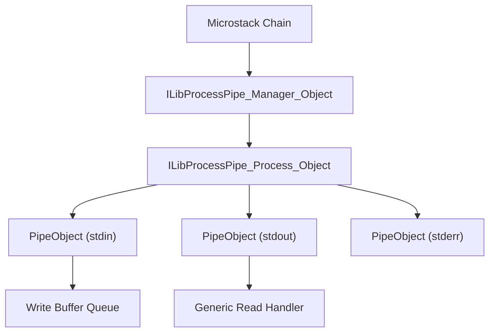
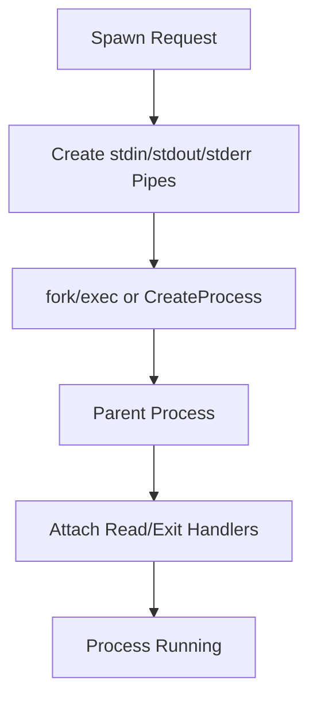
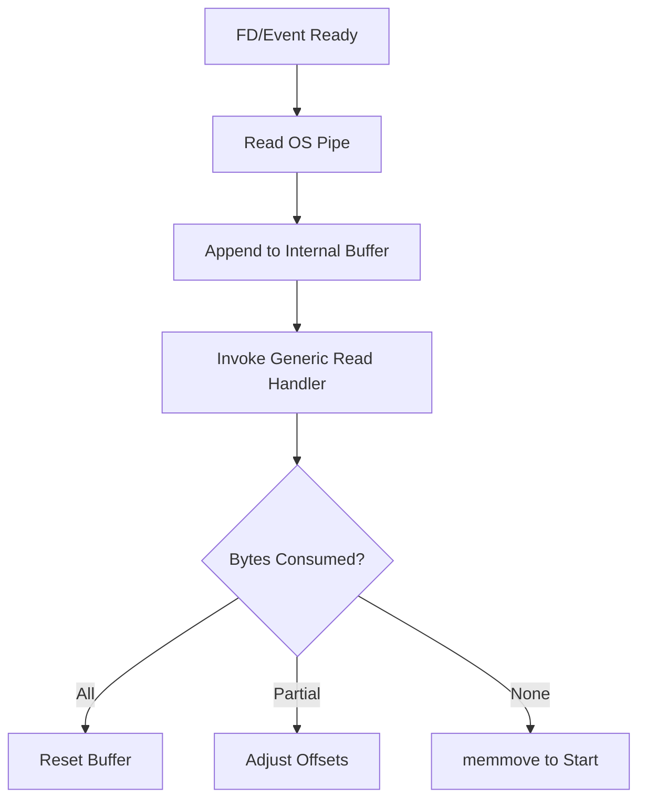
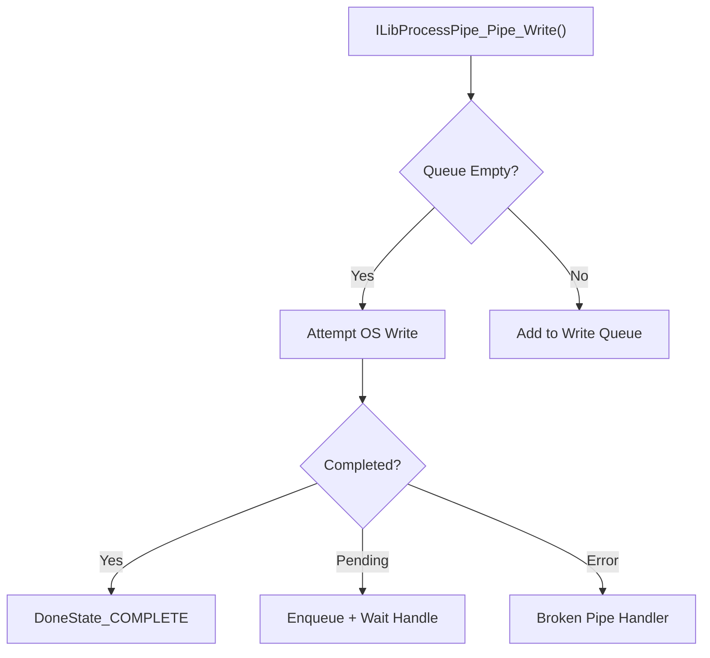
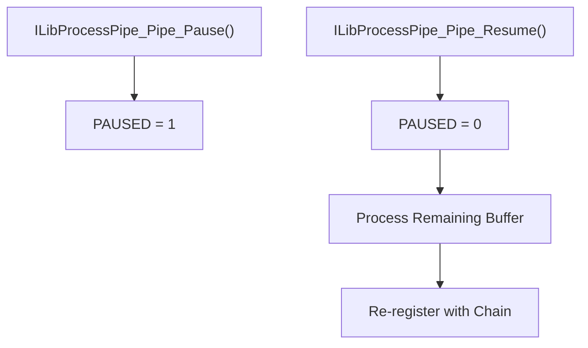
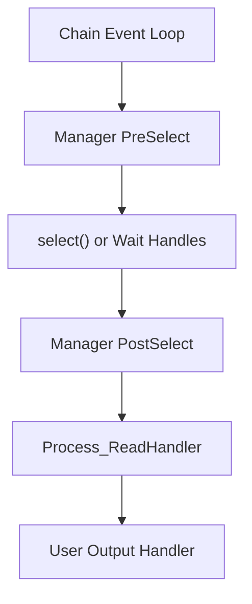

# Process Pipe

The **Process Pipe** module provides cross-platform process spawning and inter-process communication (IPC) for the Microstack runtime. It abstracts platform differences between Windows and POSIX systems and integrates tightly with the Microstack chain/event loop to deliver non-blocking, event-driven process I/O.

At its core, Process Pipe enables:

- Spawning child processes (interactive, detached, or terminal-backed)
- Asynchronous reading from `stdout` and `stderr`
- Asynchronous writing to `stdin`
- Cross-platform pipe management (Win32 overlapped I/O and POSIX non-blocking pipes)
- Graceful and forced process termination
- Integration with the Microstack chain scheduler

---

## Architecture Overview

Process Pipe is composed of three primary object types:

- **Manager** – Integrates with the chain and tracks active pipes
- **Process Object** – Represents a spawned OS process
- **Pipe Object** – Represents a single I/O channel (stdin, stdout, stderr, or custom pipe)

---

## Core Components

### ILibProcessPipe_Manager_Object

The Manager integrates Process Pipe into the Microstack chain.

**Responsibilities:**

- Maintains a linked list of active pipes
- Registers `PreSelect` / `PostSelect` handlers (POSIX)
- Registers wait handles (Windows)
- Cleans up pipe resources during destruction

On POSIX systems, the manager adds file descriptors to the `select()` read set and dispatches readable pipes during `PostSelect`. On Windows, it uses overlapped I/O events and wait handles attached to the chain.

---

### ILibProcessPipe_Process_Object

Represents a spawned child process.

**Key Fields:**

| Field | Purpose |
|---|---|
| `PID` | OS process identifier |
| `stdIn`, `stdOut`, `stdErr` | Associated Pipe objects |
| `exitHandler` | Callback when process terminates |
| `userObject` | Opaque user context |
| `metadata` | Diagnostic label |
| `PTY` | PTY file descriptor (POSIX terminal mode) |

**Capabilities:**

- Spawn (default, detached, terminal, specified user)
- Soft kill (`SIGTERM` then `SIGKILL` fallback on POSIX)
- Hard kill (terminate + destroy)
- Attach output handlers
- Attach exit handler

---

### ILibProcessPipe_PipeObject

Represents one side of a pipe.

**Key Fields:**

| Field | Purpose |
|---|---|
| `mPipe_ReadEnd`, `mPipe_WriteEnd` | OS handles/FDs |
| `buffer`, `bufferSize` | Read buffer |
| `WriteBuffer` | Outgoing write queue |
| `handler` | Read or write completion callback |
| `brokenPipeHandler` | Invoked on pipe failure |
| `PAUSED` | Flow control flag |

The Pipe object encapsulates read buffering and partial consumption, non-blocking writes, broken pipe detection, and pause/resume semantics.

---

### ILibProcessPipe_WriteData

Represents a single pending write operation in the write queue.

**Fields:**

- `buffer` — data to write
- `bufferLen` — data length
- `ownership` — memory ownership flag

---

## Process Lifecycle

### Spawn

Spawning differs by platform.

**Windows:**
- Uses `CreateProcessW` or `CreateProcessAsUserW`
- Configures inherited handles
- Uses overlapped I/O for async reads

**POSIX:**
- Uses `fork()`, `vfork()`, or `forkpty()`
- Duplicates pipe FDs to `STDIN_FILENO`, `STDOUT_FILENO`, `STDERR_FILENO`
- Executes with `execv()` or `execve()`

### Asynchronous Reading

When data becomes available:

The read handler receives a pointer to buffer, available length, and an output parameter indicating bytes consumed. This allows streaming parsers to process partial data safely.

### Writing to stdin

Writes are non-blocking and queued if necessary.

On Windows, overlapped writes trigger a wait handle callback. On POSIX, incomplete writes re-schedule via the chain timer.

---

## Flow Control (Pause / Resume)

The Pipe object supports pausing reads.

This is critical for backpressure handling and streaming parsers.

---

## Terminal Mode (PTY Support)

On POSIX, `ILibProcessPipe_SpawnTypes_TERM` uses `forkpty()`.

Features:

- Allocates pseudo-terminal
- Configurable window size (`winsize`)
- Optional `termios` flags
- Unified stdin/stdout via PTY

This enables interactive shells or terminal-bound applications.

---

## Broken Pipe Handling

A broken pipe occurs when the child process exits, the write end is closed, or an I/O error occurs.

When detected:

1. The pipe is removed from the manager
2. `brokenPipeHandler` is invoked
3. The Process object may trigger exit handling
4. Resources are freed

On POSIX, process exit status is retrieved via `waitpid()`. On Windows, exit is detected via a wait handle on the process handle.

---

## Process Termination

### Soft Kill

- **Windows**: `TerminateProcess()`
- **POSIX**: `SIGTERM`, wait up to 500ms, then `SIGKILL`

The staged termination on POSIX prevents corruption of system state (e.g., macOS TCC permissions for screen recording).

### Hard Kill

- Calls soft kill
- Immediately destroys process object

---

## Integration with Microstack Chain

This design ensures no dedicated polling threads (POSIX), native overlapped I/O (Windows), and a unified callback-driven model.

---

## Cross-Platform Strategy Summary

| Feature | Windows | POSIX |
|---|---|---|
| Spawn | `CreateProcess` | `fork`/`exec` |
| Async Read | Overlapped I/O | Non-blocking FD + `select` |
| Async Write | Overlapped I/O | Non-blocking write |
| Exit Detection | Wait handle on process | `waitpid` |
| Terminal Mode | N/A | `forkpty` |

---

## Integration with Microstack Core

Process Pipe builds upon:

- [Parsers and Chain](../parsers_and_chain/parsers_and_chain.md) — Event scheduling and lifecycle
- [Remote Logging](../remote_logging/remote_logging.md) — Diagnostic output

It is frequently used by higher-level modules that require script execution, shell interaction, external tool invocation, and privilege-separated operations.
