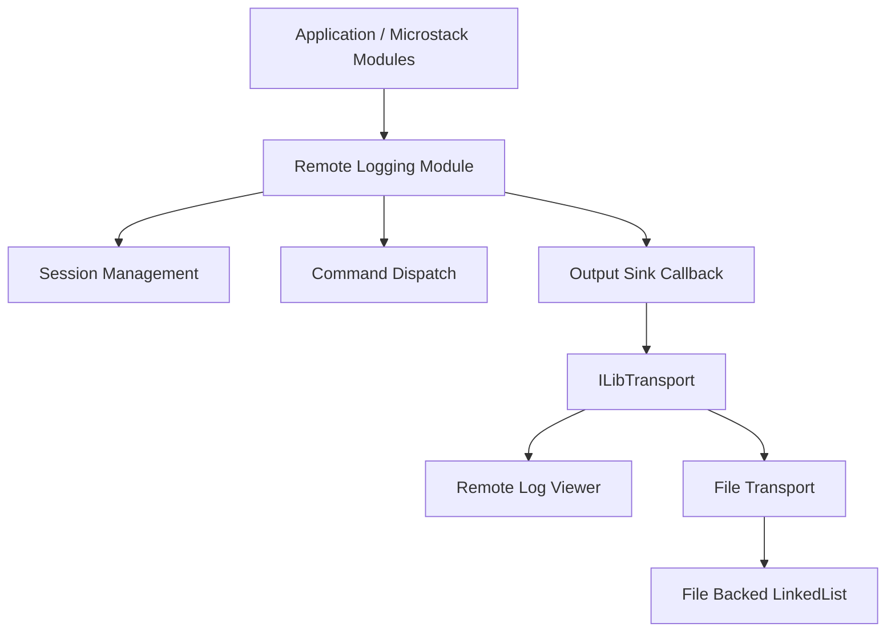
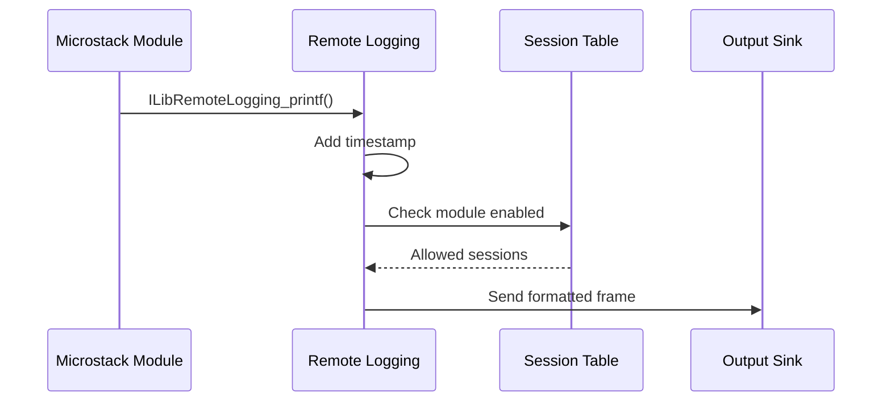
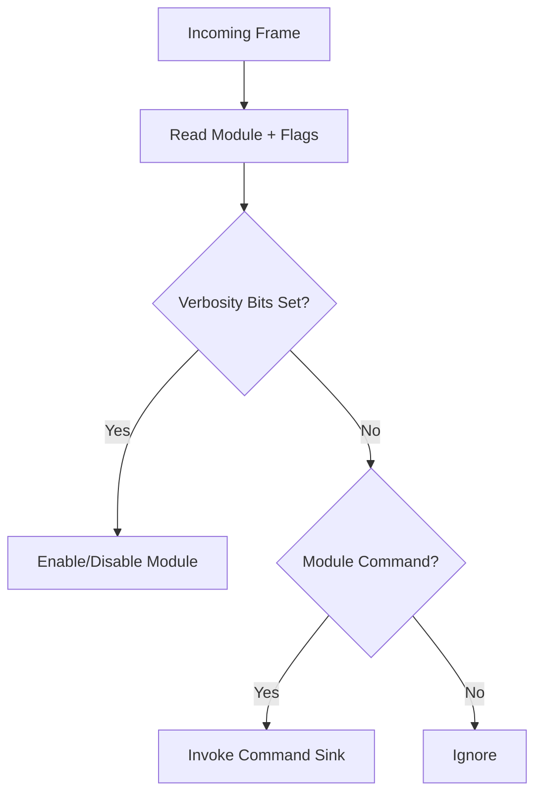
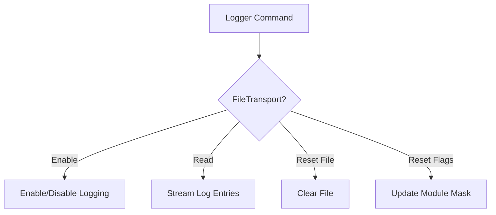
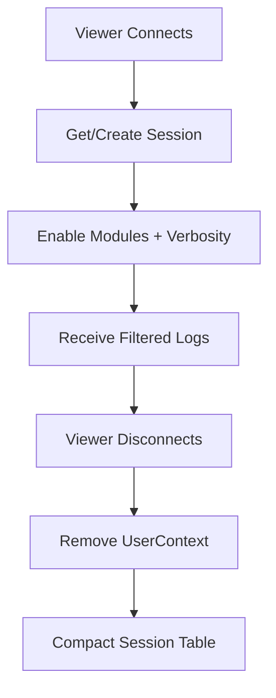

# Remote Logging

The **Remote Logging** module provides a structured, transport-agnostic logging framework for the Microstack and MeshAgent runtime. It enables runtime-configurable log streaming, per-module verbosity control, remote log viewers, and persistent file-backed logging.

This module integrates with transports, async sockets, WebRTC, Web server/client components, and agent subsystems.

---

## Purpose and Responsibilities

Remote Logging is designed to:

- Provide **modular logging categories** (WebRTC, Agent, Microstack, etc.)
- Support **dynamic verbosity control per session**
- Allow **remote viewers to enable/disable modules at runtime**
- Forward logs to in-memory transports, remote connections, and file-backed persistent storage
- Maintain **thread safety** via semaphore synchronization
- Enable command-based interaction (enable, disable, read, reset)

The system is conditionally compiled using `_REMOTELOGGING`. When disabled, all logging macros become no-ops with zero runtime overhead.

---

## High-Level Architecture

---

## Core Components

### ILibRemoteLogging_Module

Central logging controller.

**Key Fields:**

| Field | Purpose |
|---|---|
| `LogSyncLock` | Semaphore for thread safety |
| `OutputSink` | Callback for sending log frames |
| `RawForwardSink` | Bypass formatted output |
| `CommandSink[15]` | Per-module command handlers |
| `Sessions[5]` | Active logging sessions |

**Responsibilities:**

- Maintains session table (max 5 sessions)
- Holds module flags and verbosity state
- Routes commands to registered sinks
- Forwards formatted log output to the configured output sink

---

### ILibRemoteLogging_Session

Represents a remote logging subscriber.

**Fields:**

- `Flags` — enabled modules + verbosity level (upper 16 bits = verbosity, lower 16 bits = module mask)
- `UserContext` — transport or session pointer

Each session controls which modules are enabled and the minimum verbosity level accepted. Session entries are compacted automatically when removed.

---

### ILibRemoteLogging_FileTransport

File-backed logging transport implementation.

**Responsibilities:**

- Persist logs using `ILibLinkedList_FileBacked`
- Reload saved flags on startup
- Support commands: Enable/Disable, Reset file, Read file, Reset module flags
- Integrate as an `ILibTransport`

Logs are stored in a bounded file-backed linked list:

- Max size: 2 MB
- Entry block size: 4096 bytes

---

## Logging Modules

Remote Logging uses a bitmask to represent module categories:

| Bitmask | Module |
|---|---|
| `0x02` | WebRTC STUN/ICE |
| `0x04` | WebRTC DTLS |
| `0x08` | WebRTC SCTP |
| `0x10` | Agent GuardPost |
| `0x20` | Agent Peer2Peer |
| `0x200` | Agent KVM |
| `0x40` | Microstack AsyncSocket |
| `0x80` | Microstack WebServer/WebClient |
| `0x400` | Microstack Pipe |
| `0x100` | Microstack Generic |
| `0x4000` | Console Print (local stdout) |

Modules can be combined using bitwise OR.

---

## Verbosity Levels

| Level | Flag |
|---|---|
| Level 1 (minimal) | `0x02` |
| Level 2 | `0x04` |
| Level 3 | `0x08` |
| Level 4 | `0x10` |
| Level 5 (verbose) | `0x20` |

A log is delivered only if the module is enabled in session flags AND the log verbosity is ≤ the session verbosity level.

---

## Logging Flow

### Standard Logging (`ILibRemoteLogging_printf`)

Steps:

1. Timestamp is prepended
2. Header written (module bitmask + flags)
3. Session table scanned under lock
4. Matching sessions receive frame via `OutputSink`

If module includes `ConsolePrint`, output is also printed locally via `printf()`.

---

## Command Dispatching

Remote viewers send control frames:

---

## File Transport Command Handling

File flags are persisted inside the file root metadata:

- Lower 16 bits → module mask
- Upper bits → verbosity + enabled state

---

## Session Lifecycle

- Maximum of 5 concurrent sessions
- Session table is compacted after removal

---

## Thread Safety

All session and command operations are protected by `sem_wait`/`sem_post` on `LogSyncLock`. Critical sections include:

- Session creation/removal
- Command sink registration
- Log dispatch iteration
- File transport command handling

---

## Integration with Microstack Core

Remote Logging integrates with:

- [Async Sockets](../async_sockets/async_sockets.md) — network diagnostics
- [Web Client and Server](../web_client_and_server/web_client_and_server.md) — HTTP/WebSocket transport
- [WebRTC](../webrtc/webrtc.md) — ICE, DTLS, SCTP diagnostics
- [Parsers and Chain](../parsers_and_chain/parsers_and_chain.md) — `ILibTransport`, `ILibLinkedList_FileBacked`

---

## Design Characteristics

| Characteristic | Implementation |
|---|---|
| Thread Safety | Semaphore locking |
| Transport Agnostic | Uses `ILibTransport` abstraction |
| Persistent Logging | File-backed linked list |
| Runtime Configurable | Command-based enable/disable |
| Modular | Bitmask-based module categories |
| Low Overhead | Disabled at compile time via `_REMOTELOGGING` |
