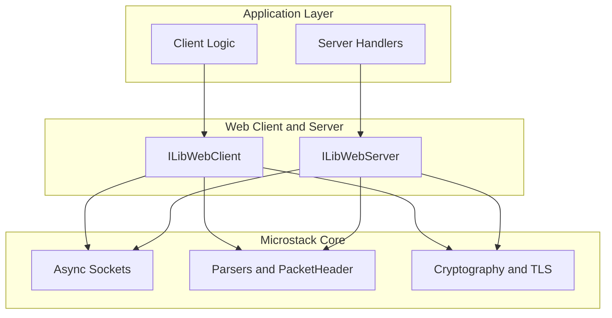
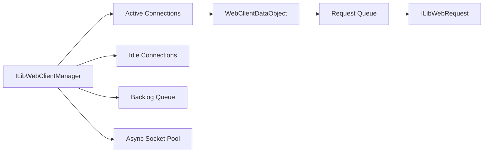
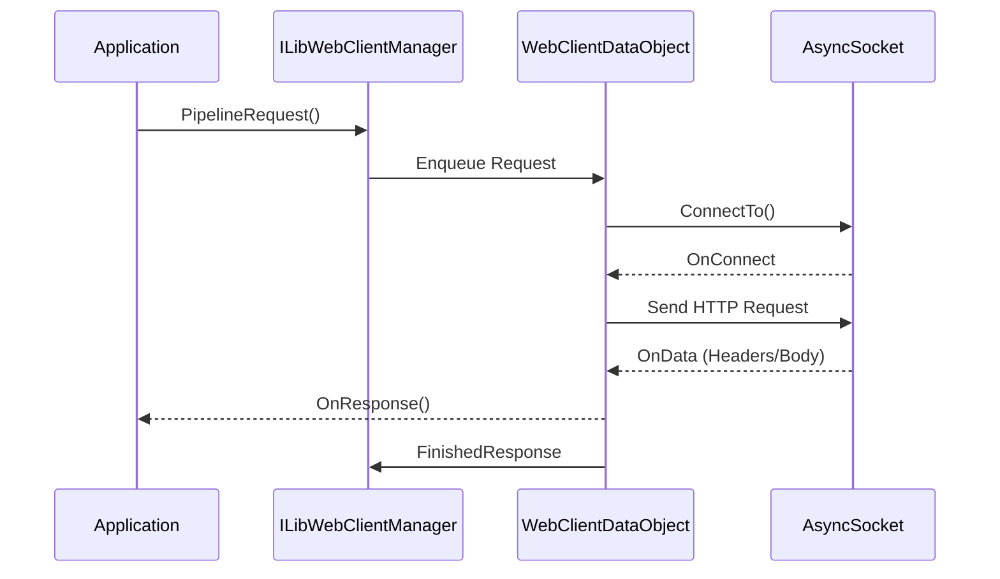
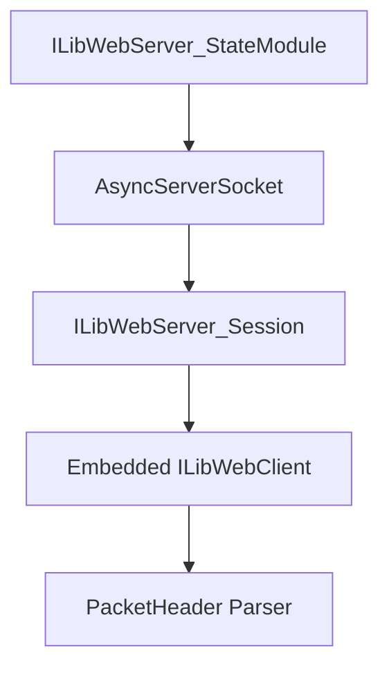
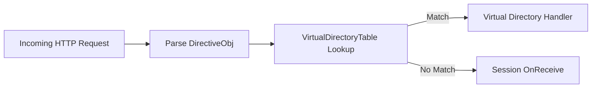
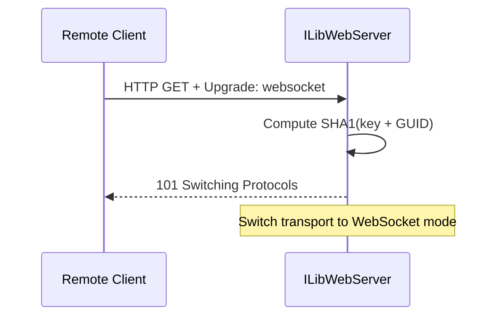
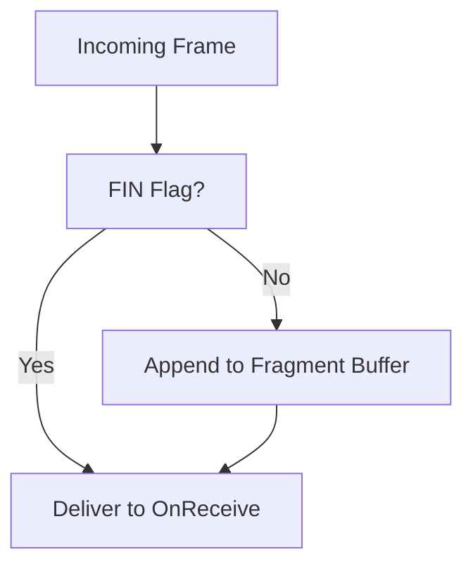
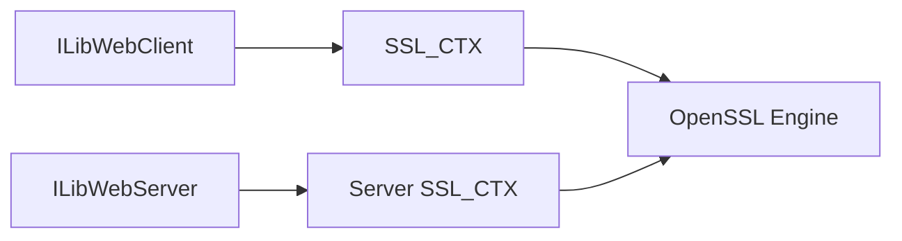
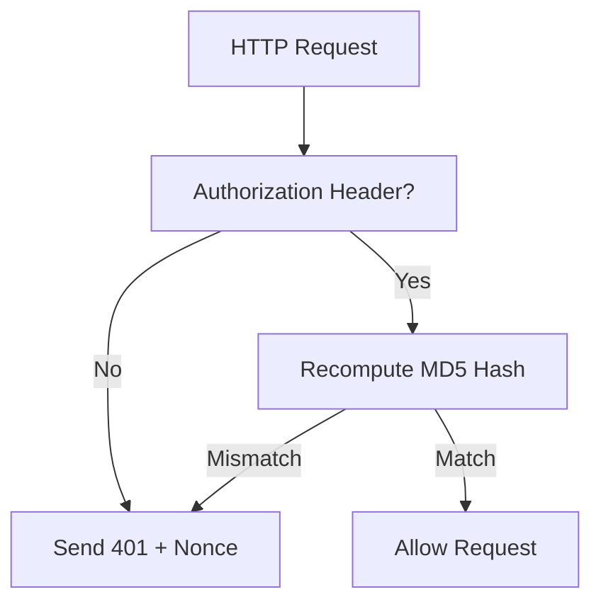
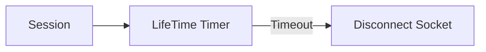

# Web Client and Server

The **Web Client and Server** module provides the HTTP and WebSocket networking layer for the Microstack runtime. It implements:

- An asynchronous, pooled **HTTP client** with pipelining and streaming support.
- A high-performance **HTTP server** with persistent connections and virtual directory routing.
- Full **WebSocket** client and server implementations.
- Optional **TLS (HTTPS)** integration using OpenSSL.
- Digest authentication helpers for both client and server flows.

This module builds directly on top of:

- [Async Sockets](../async_sockets/async_sockets.md)
- [Parsers and Chain](../parsers_and_chain/parsers_and_chain.md)
- [Cryptography](../cryptography/cryptography.md)

It is the core transport layer used by higher-level protocols such as WebRTC and management APIs.

---

## High-Level Architecture

At a high level, the module contains two major subsystems:

- **ILibWebClient** – outbound HTTP/WebSocket client
- **ILibWebServer** – inbound HTTP/WebSocket server

Both subsystems are built on top of the asynchronous socket engine and share common packet parsing utilities.

---

## HTTP Client Architecture (ILibWebClient)

### Core Structures

| Structure | Purpose |
|---|---|
| `ILibWebClientManager` | Global client manager with socket pool |
| `ILibWebClientDataObject` | Per-connection state |
| `ILibWebRequest` | Individual queued request |
| `ILibWebClient_PipelineRequestToken` | Request handle returned to callers |
| `ILibWebClient_WebSocketState` | Per-session WebSocket state |
| `ILibWebClient_ChunkData` | Chunked transfer decoder state |
| `ILibWebClient_StreamedRequestState` | Streaming request body state |

### Client Connection Model

The client uses a **socket pool** and maintains:

- A `DataTable` of active connections keyed by remote address.
- An `idleTable` for persistent idle connections.
- A `backlogQueue` for pending connections.

### Request Lifecycle

1. Application calls `ILibWebClient_PipelineRequest()`.
2. A `ILibWebRequest` is created and queued into the appropriate `ILibWebClientDataObject`.
3. If no connection exists, one is created from the socket pool.
4. Response data flows through `ILibWebClient_OnData()`.
5. Completion triggers `ILibWebClient_FinishedResponse()`.

### Client Features

- **Persistent connections** (HTTP/1.1 keep-alive)
- **Chunked transfer decoding**
- **Streaming request bodies** via `ILibWebClient_PipelineStreamedRequest`
- **Digest authentication support**
- **WebSocket client mode** with fragment reassembly
- **HTTPS with SNI and certificate validation**
- **HTTPS proxy support** (`MICROSTACK_PROXY`)

---

## HTTP Server Architecture (ILibWebServer)

### Core Structures

| Structure | Purpose |
|---|---|
| `ILibWebServer_StateModule` | Global server state |
| `ILibWebServer_Session` | Per-connection session (public API) |
| `ILibWebServer_Session_SystemData` | Internal session metadata |
| `ILibWebServer_VirDir_Data` | Virtual directory mapping |

### Server Connection Model

The server is built on top of `ILibAsyncServerSocket` and internally attaches a WebClient engine per session to reuse HTTP parsing logic.

Each session:

- Maintains reference counting for safe async lifetime management.
- Tracks persistent vs non-persistent connections.
- Handles chunked transfer encoding.
- Can upgrade to WebSocket mode.

### Virtual Directory Routing

The server supports path-based dispatch:

This enables modular API routing without embedding routing logic in a single handler. Virtual directories are registered via `ILibWebServer_RegisterVirtualDirectory()`.

---

## WebSocket Support

Both client and server implement full WebSocket framing:

- Frame parsing (FIN, OPCODE, MASK, payload length)
- Fragment reassembly with configurable max buffer size
- Control frames (PING, PONG, CLOSE)
- Automatic close handshake handling

### WebSocket Upgrade (Server)

After upgrade:

- HTTP parsing is bypassed.
- `ILibWebServer_WebSocket_Send()` is used for outbound frames.
- Transport flags change from `ILibTransports_WebServer` to `ILibTransports_WebSocket`.

### Fragment Reassembly Model

Applications may:

- Disable auto-reassembly (stream fragments directly).
- Set maximum reassembly buffer size via `ILibWebServer_UpgradeWebSocket(session, maxBufferSize)`.

---

## TLS and HTTPS Integration

TLS is optional and enabled via:

- `ILibWebClient_EnableHTTPS()` — client-side HTTPS
- `ILibWebServer_EnableHTTPS()` — server-side HTTPS

Capabilities include:

- Certificate chain inspection
- Custom validation callbacks (`ILibWebServer_OnHttpsConnection`, `ILibWebClient_OnHttpsConnection`)
- SNI (Server Name Indication) via `ILibWebClient_Request_SetSNI()`
- Client certificate verification (server side)

TLS state is attached to socket modules and linked back to session objects via OpenSSL `ex_data` indices (`ILibWebServerSSLCTXIndex`, `ILibWebServerConnectionSSLCTXIndex`).

---

## Digest Authentication Flow

Both client and server support HTTP Digest authentication.

### Server-Side Validation

Key server APIs:

- `ILibWebServer_Digest_IsAuthenticated()` — check if request is authenticated
- `ILibWebServer_Digest_GetUsername()` — retrieve authenticated username
- `ILibWebServer_Digest_ValidatePassword()` — validate password against stored hash
- `ILibWebServer_Digest_SendUnauthorized()` — send 401 with nonce

### Client-Side Handling

- Detect `401 Unauthorized`.
- Parse `WWW-Authenticate` header via `ILibWebClient_Digest_GenerateTableEx`.
- Generate response hash via `ILibWebClient_GenerateAuthenticationHeader`.
- Resend request with `Authorization` header.

---

## Persistent Connections and Idle Management

Both subsystems implement idle timeout logic:

- Idle sessions tracked via timer (`HTTP_SESSION_IDLE_TIMEOUT`).
- Client idle connections stored in `idleTable`.
- Server sessions closed if no request is received in time.

---

## Integration with the Microstack Chain

The module integrates with the **ILibChain** event loop:

- `PreSelectHandler` dispatches queued client connections from the backlog queue.
- All network I/O is non-blocking.
- Timers handled via base chain timer (`ILibGetBaseTimer`).

This ensures:

- Single-threaded deterministic execution.
- Safe interaction with other Microstack modules.
- No locking required for most operations.
