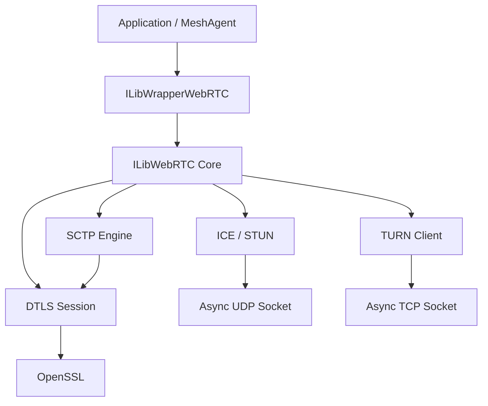
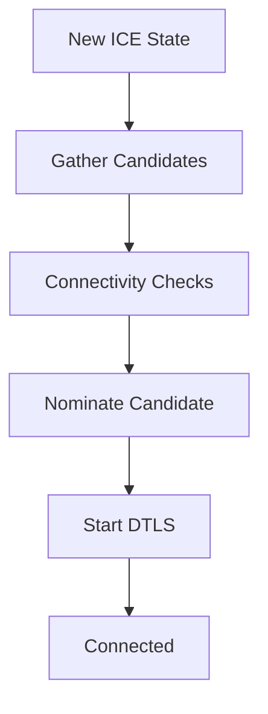
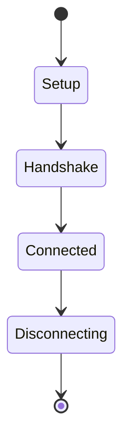
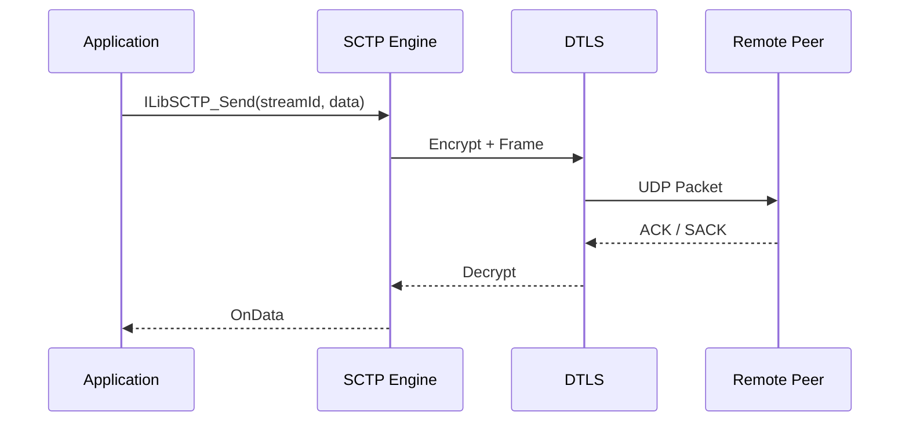
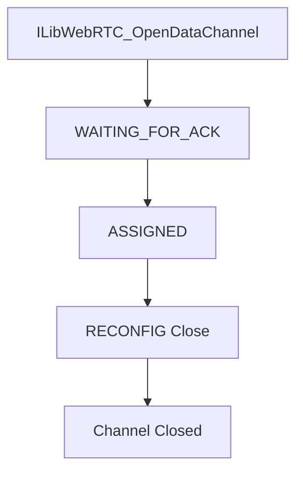
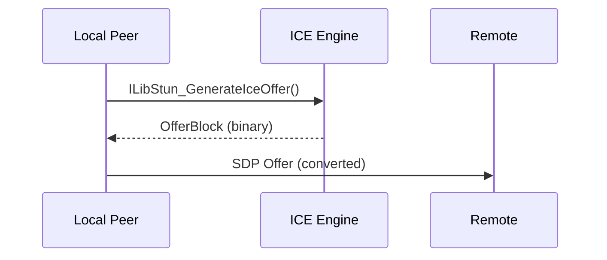

# WebRTC

The **WebRTC** module implements a full embedded WebRTC stack for MeshAgent, including:

- STUN (NAT discovery)
- ICE (candidate gathering and connectivity checks)
- DTLS (secure transport)
- SCTP (data transport over DTLS)
- WebRTC Data Channels
- TURN (relay support)

It is built on top of the Microstack event-driven networking core and OpenSSL, providing peer-to-peer connectivity with optional relay fallback.

---

## Architecture Overview

The WebRTC module sits above Async Sockets and Cryptography components and exposes high-level APIs for peer connections and data channels.

### Layers

| Layer | Responsibility |
|---|---|
| `ILibWrapperWebRTC` | High-level API (SDP, connection management, data channels) |
| `ILibWebRTC` | Protocol engine (ICE, DTLS, SCTP, TURN) |
| `ILibAsyncSocket` | Non-blocking UDP/TCP I/O |
| OpenSSL | DTLS handshake, encryption |

---

## Core Components

### STUN and ICE

Implemented primarily in `ILibStun_Module` and `ILibStun_IceState`.

Responsibilities:

- NAT type detection (Full Cone, Symmetric, Restricted, Port Restricted)
- ICE offer generation with local candidates
- ICE credential validation (HMAC-SHA1 message integrity)
- Connectivity checks with role negotiation (Controlling/Controlled)
- Consent freshness monitoring (RFC 7675)

### ICE State Machine

Key structures:

| Structure | Purpose |
|---|---|
| `ILibStun_IceState` | Per-offer ICE state (credentials, candidates, DTLS slot) |
| `ILibStun_IceStateCandidate` | IPv4 address + port pair |
| `ILibICE_PeriodicState` | Periodic ICE check state |
| `STUNHEADER` | STUN packet header |
| `STUN_MAPPED_ADDRESS` | STUN mapped address attribute |
| `TLV` | Generic STUN attribute TLV |

---

### DTLS Session

Encapsulated in `ILibStun_dTlsSession`.

Responsibilities:

- DTLS handshake (client or server role)
- Certificate verification against ICE fingerprint
- Secure packet encapsulation/decapsulation
- Consent freshness timeout handling
- SCTP packet delivery over DTLS

DTLS state transitions:

Important fields:

- `ssl` — OpenSSL session object
- `iceStateSlot` — linked ICE state slot
- `receiverCredits` / `senderCredits` — SCTP flow control
- `RTO`, `SRTT`, `RTTVAR` — retransmission timing
- `writeBIO` / `writeBIOBuffer` — OpenSSL memory BIO for DTLS output

---

### SCTP Engine

Implements RFC 4960 over DTLS for reliable and partially reliable data transport.

Core structures:

| Structure | Purpose |
|---|---|
| `ILibSCTP_DataPayload` | SCTP DATA chunk |
| `ILibSCTP_RPACKET` | Retransmittable packet with metadata |
| `ILibSCTP_InitAckChunk` | SCTP INIT-ACK chunk |
| `ILibSCTP_ReconfigChunk` | SCTP RECONFIG chunk (stream reset) |
| `ILibSCTP_Reconfig_OutgoingSSNResetRequest` | Outgoing stream reset request |
| `ILibSCTP_Reconfig_IncomingSSNResetRequest` | Incoming stream reset request |
| `ILibSCTP_Reconfig_Response` | RECONFIG response |
| `ILibSCTP_StreamAttributesStruct` | Stream reliability flags |
| `ILibSCTP_StreamAttributesStruct_Data` | Stream sequence number and reliability value |
| `ILibSCTP_Accumulator` | Fragment reassembly buffer |
| `ILibSCTP_FwdTSNPayload` | Forward TSN chunk |
| `ILibSCTP_HoldingQueueFlags` | Receive hold buffer flags |

#### SCTP Data Flow

Features implemented:

- Congestion control (cwnd, ssthresh, slow start, fast recovery)
- Fast retransmit (3 GAP ACK threshold)
- T3-RTX timer with exponential backoff
- Selective ACK (SACK) with GAP block encoding
- Partial reliability (timed or retransmit-based)
- Stream reset via RECONFIG chunk
- Forward TSN (FWD-TSN) for abandoned packets
- Pause/Resume flow control

---

### WebRTC Data Channels

High-level abstraction over SCTP streams.

Managed by:

- `ILibWrapper_WebRTC_ConnectionStruct` — peer connection state
- `ILibWrapper_WebRTC_ConnectionFactoryStruct` — factory managing multiple connections

Capabilities:

- Reliable ordered (default)
- Reliable unordered
- Partial reliable (max retransmit)
- Partial reliable (timed)

Data channel lifecycle:

---

### TURN Client

Encapsulated in `ILibTURN_TurnClientObject`.

Supports:

- Allocation (`TURN_ALLOCATE`)
- Permission creation (`TURN_CREATE_PERMISSION`)
- Channel binding (`TURN_CHANNEL_BIND`)
- Indication-based sending (`TURN_SEND`)
- Channel data sending (binary framing)
- TCP relay transport

TURN is used when:

- Direct UDP fails due to symmetric NAT
- `ILibWebRTC_TURN_ALWAYS_RELAY` is enabled
- `ILibWebRTC_TURN_ENABLED` is set and direct connectivity fails

---

## Offer and Answer Handling

WebRTC uses a compact binary "offer block" internally and converts it to/from SDP.

### Offer Generation

1. Generate ICE username/password (slot-encoded)
2. Embed DTLS fingerprint (SHA-256)
3. Add host candidates (local IPv4 interfaces)
4. Optionally include TURN relay candidate

### Offer Processing

1. Parse SDP into internal block via `ILibWrapper_SdpToBlock`
2. Store remote credentials and DTLS fingerprint
3. Start connectivity checks via `ILibStun_ICE_Start`
4. Establish DTLS via `ILibStun_InitiateDTLS`
5. Initiate SCTP via `ILibStun_InitiateSCTP`

---

## Consent Freshness

WebRTC implements consent freshness as required by the WebRTC specification.

- Periodic STUN binding requests sent every `ILibStun_MaxConsentFreshnessTimeoutSeconds` (15 seconds)
- 500ms response window per probe
- DTLS session is closed if consent expires

---

## Integration Points

WebRTC integrates with:

- [Async Sockets](../async_sockets/async_sockets.md) — UDP for ICE/STUN, TCP for TURN
- [Cryptography](../cryptography/cryptography.md) — OpenSSL for DTLS
- [Parsers and Chain](../parsers_and_chain/parsers_and_chain.md) — timer system for retransmission and heartbeats

---

## Key Design Characteristics

- Fully event-driven (no blocking I/O)
- Fixed slot-based ICE and DTLS session management (`ILibSTUN_MaxSlots = 10`)
- Sparse array structures for stream/channel tracking
- Memory-safe packet handling with 4-byte alignment guarantees
- Supports up to 1024 SCTP streams (`ILibSCTP_Stream_MaximumCount`)
- CRC32c checksum for SCTP packet integrity
