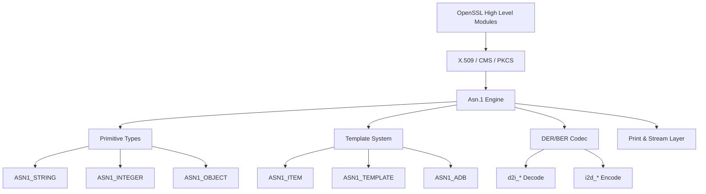
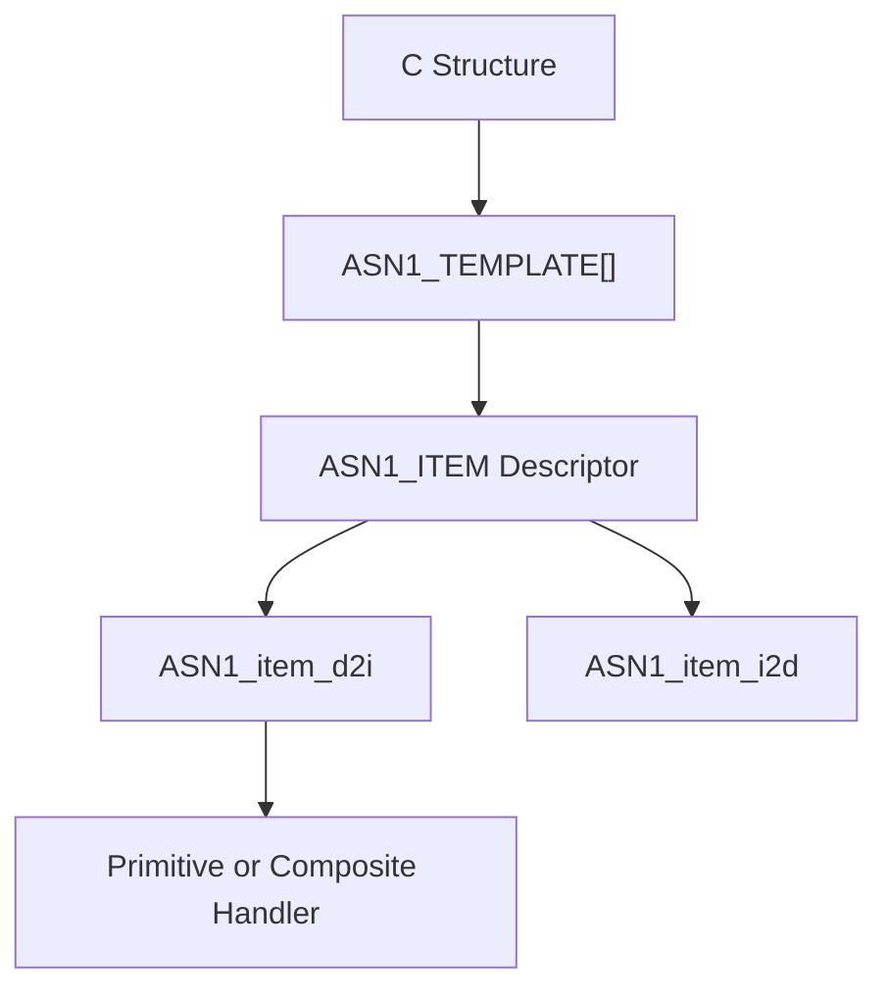
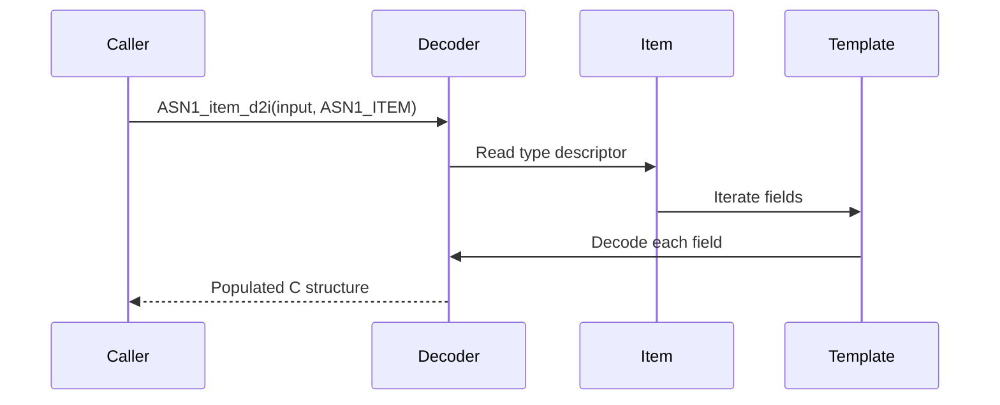

# Asn.1 Engine

The **Asn.1 Engine** module provides the core Abstract Syntax Notation One (ASN.1) type system, template framework, and DER/BER encoding–decoding machinery used throughout OpenSSL within MeshAgent. It underpins X.509, CMS, PKCS#7/#12, OCSP, and many other cryptographic data structures by defining how complex objects are described, serialized, parsed, and validated.

This module is part of the OpenSSL core and works closely with:
- [Type System](Type System/Type System.md)
- [X.509 and Certificate Management](X.509 and Certificate Management/X.509 and Certificate Management.md)
- [Public Key Infrastructure](Public Key Infrastructure/Public Key Infrastructure.md)
- [Digest and MAC](Digest and MAC/Digest and MAC.md)

---

## 1. Architectural Overview

At a high level, the Asn.1 Engine consists of:

- **Primitive Types** – INTEGER, BIT STRING, OCTET STRING, TIME, etc.
- **Generic Container Types** – `ASN1_TYPE`, `ASN1_STRING`, `ASN1_OBJECT`
- **Template System** – `ASN1_ITEM`, `ASN1_TEMPLATE`, `ASN1_ADB`
- **Encoding/Decoding Core** – `ASN1_item_d2i`, `ASN1_item_i2d`
- **Printing and Streaming** – `ASN1_item_print`, NDEF streaming helpers

### Module Architecture

The **Asn.1 Engine** acts as a meta-framework: higher-level modules define structures using macros from `asn1t.h`, which are compiled into `ASN1_ITEM` descriptors. The generic codec then uses these descriptors to serialize and deserialize data.

---

## 2. Core Data Structures

### 2.1 ASN1_STRING (`asn1_string_st`)

Represents a generic ASN.1 string-like object.

Key fields:
- `length` – Number of bytes
- `type` – Tag (e.g., `V_ASN1_UTF8STRING`)
- `data` – Raw encoded value
- `flags` – Encoding hints (e.g., NDEF, embedded, time format)

Used for:
- UTF8String, IA5String, BMPString
- OCTET STRING, BIT STRING
- Time types (UTCTIME, GENERALIZEDTIME)

### 2.2 ASN1_ENCODING

Stores cached DER encoding for structures (e.g., for signature validation):

- `enc` – Original DER bytes
- `len` – Length
- `modified` – Marks invalidation if structure changed

This is critical for:
- Signature verification (must preserve original encoding)
- X.509 certificate validation

### 2.3 ASN1_TYPE

A tagged union wrapper for dynamic ASN.1 values:

- `type` – Tag identifier
- `value` – Union of supported ASN.1 primitives

Used for:
- `ANY` fields
- Runtime-selected types
- Flexible extension structures

---

## 3. Template System (asn1t.h)

The template system allows C structures to be declaratively mapped to ASN.1 definitions.

### 3.1 ASN1_ITEM

Defines a complete ASN.1 type descriptor:

- `itype` – Primitive, SEQUENCE, CHOICE, etc.
- `templates` – Field definitions
- `size` – C structure size
- `funcs` – Custom handlers (optional)

### 3.2 ASN1_TEMPLATE

Describes a single field in a SEQUENCE or CHOICE:

- Offset in structure
- Tagging mode (IMPLICIT, EXPLICIT)
- Optional/SET OF/SEQUENCE OF flags
- Associated `ASN1_ITEM`

### 3.3 ASN1_ADB (ANY DEFINED BY)

Supports dynamic type resolution based on:
- Object Identifier (OID)
- Integer selector

Used heavily in:
- AlgorithmIdentifier
- CMS and PKCS structures

### Template Resolution Flow

---

## 4. Encoding and Decoding Pipeline

The Asn.1 Engine provides generic functions:

- `ASN1_item_d2i` – Decode DER/BER to C structure
- `ASN1_item_i2d` – Encode structure to DER
- `ASN1_item_ndef_i2d` – Indefinite-length encoding (streaming)

### Decode Sequence

### Key Internal Concepts

- **Tag parsing** – `ASN1_get_object`
- **Length calculation** – `ASN1_object_size`
- **Indefinite-length handling** – NDEF streaming
- **Type masking** – `ASN1_tag2bit`

---

## 5. Primitive Type Support

Implemented primitives include:

- `ASN1_INTEGER`
- `ASN1_ENUMERATED`
- `ASN1_BIT_STRING`
- `ASN1_OCTET_STRING`
- `ASN1_OBJECT`
- `ASN1_TIME`, `ASN1_UTCTIME`, `ASN1_GENERALIZEDTIME`

These primitives integrate with:
- Big number conversion (`BIGNUM`)
- BIO streaming
- Text printing and RFC 2253 formatting

Example conversion helpers:
- `ASN1_INTEGER_to_BN`
- `ASN1_STRING_to_UTF8`
- `ASN1_TIME_to_tm`

---

## 6. Printing and Context Control

Printing behavior is configurable via `ASN1_PCTX`:

- Show or hide optional fields
- Include type annotations
- RFC 2253 escaping flags

Relevant structures:
- `ASN1_PRINT_ARG`
- `ASN1_STREAM_ARG`
- `ASN1_AUX`

Used by:
- Certificate text output
- CMS debugging
- ASN.1 parse dumps

---

## 7. Streaming and NDEF Encoding

For large content (e.g., CMS signed data):

- Indefinite-length encoding is supported
- Streaming via BIO filters
- Boundary-aware encoding

Functions:
- `BIO_new_NDEF`
- `SMIME_write_ASN1`
- `i2d_ASN1_bio_stream`

This enables processing of large signed payloads without buffering entire content in memory.

---

## 8. Interaction with Other Modules

### With Type System

The Asn.1 Engine depends on core opaque types defined in:
- [Type System](Type System/Type System.md)

These provide forward declarations for:
- `ASN1_STRING`
- `ASN1_OBJECT`
- `EVP_PKEY`
- `X509`

### With X.509 and PKI

The following modules define ASN.1 templates using this engine:

- [X.509 and Certificate Management](X.509 and Certificate Management/X.509 and Certificate Management.md)
- [Public Key Infrastructure](Public Key Infrastructure/Public Key Infrastructure.md)

They declare structures using macros like:
- `ASN1_SEQUENCE`
- `ASN1_CHOICE`
- `IMPLEMENT_ASN1_FUNCTIONS`

---

## 9. Design Characteristics

### 9.1 Descriptor-Driven Architecture

All encoding and decoding is driven by `ASN1_ITEM` descriptors. This avoids per-structure custom parsing logic.

### 9.2 Separation of Concerns

- `asn1.h` – Public primitives and APIs
- `asn1t.h` – Template metaprogramming layer
- Higher modules – Structure definitions only

### 9.3 Backward Compatibility

The API supports:
- DER
- BER
- Indefinite-length encoding
- Legacy compatibility modes

---

## 10. Summary

The **Asn.1 Engine** is the serialization backbone of OpenSSL in MeshAgent. It provides:

- A complete ASN.1 primitive type system
- A powerful template-based meta-framework
- Generic DER/BER encode–decode logic
- Streaming support for large cryptographic payloads
- Configurable printing and debugging facilities

Nearly all certificate handling, cryptographic container parsing, and protocol message processing in OpenSSL ultimately relies on this module.

Without the Asn.1 Engine, higher-level modules such as X.509, CMS, TLS certificate parsing, and PKCS processing would not be possible.