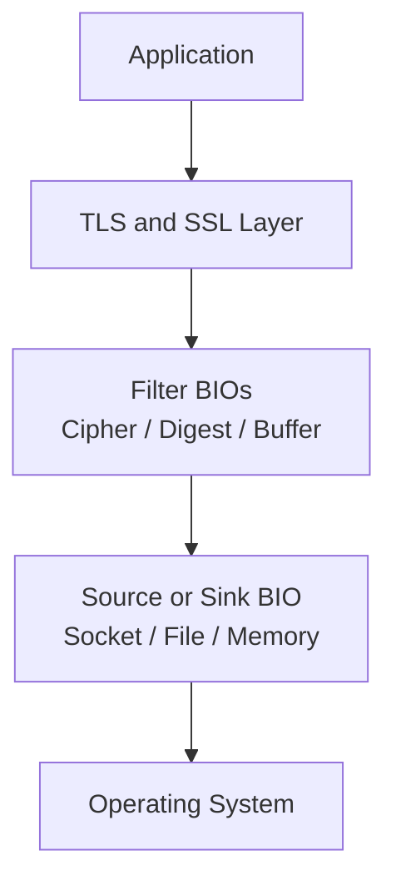
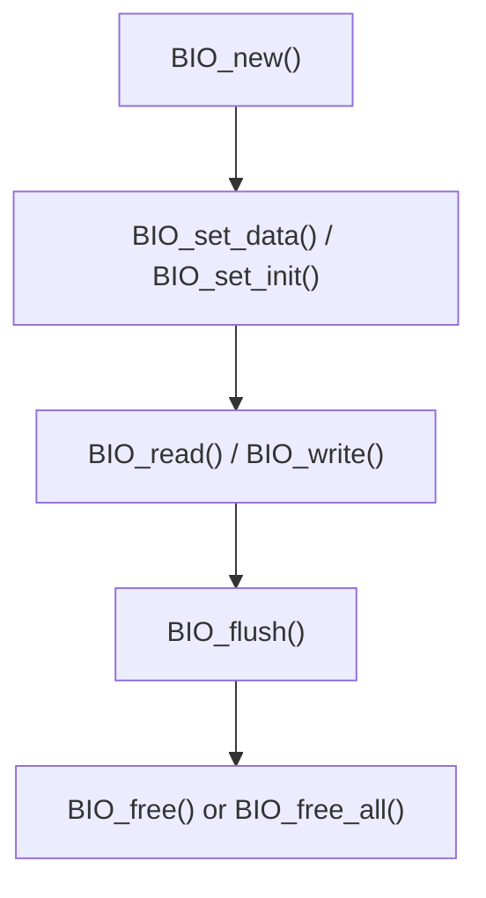
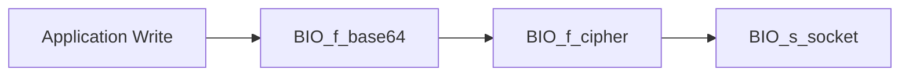
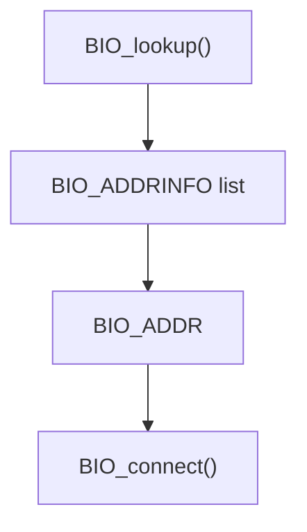
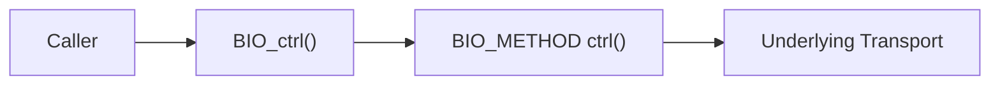
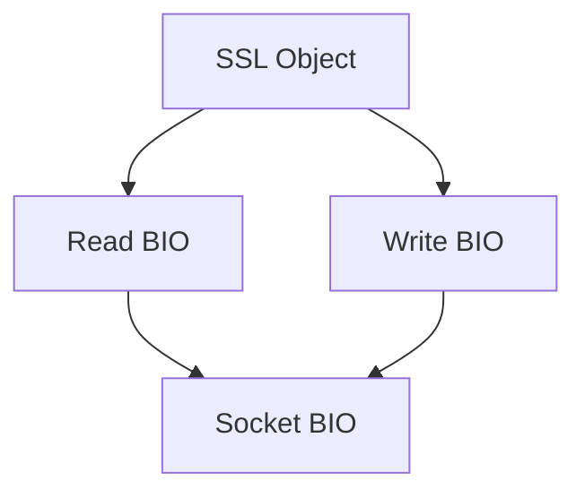
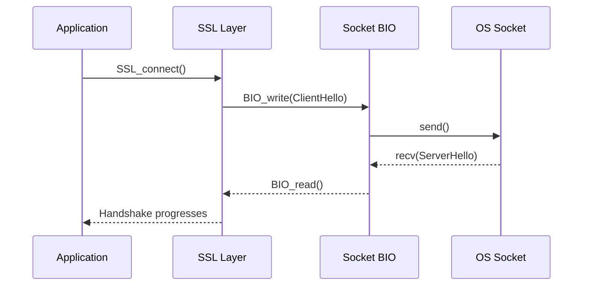

# Bio And Io

The **Bio And Io** module provides OpenSSL’s abstraction layer for input/output operations. It is built around the BIO (Basic Input/Output) framework, which unifies file, memory, socket, datagram, and filter-based I/O under a common interface.  

This module is the foundation for how TLS, cryptographic filters, and higher-level protocols interact with operating system resources without being tightly coupled to platform-specific APIs.

Within the OpenSSL architecture, Bio And Io sits between:

- Low-level OS descriptors (files, sockets, SCTP, memory)
- Cryptographic layers (cipher, digest, compression filters)
- TLS/SSL state machines

For TLS handshake and secure channel integration, see the sibling module [TLS and SSL](../TLS and SSL/TLS and SSL.md).

---

## 1. Architectural Overview

At the core of this module are:

- `BIO` – Runtime I/O object
- `BIO_METHOD` – Defines behavior for a BIO type
- `BIO_ADDR` and `BIO_ADDRINFO` – Address abstraction
- `buf_mem_st` – Dynamic memory buffer structure

### 1.1 High-Level Layering



### BIO Classes

OpenSSL defines three BIO class categories:

- **Descriptor BIOs** – Wrap OS-level handles (sockets, file descriptors)
- **Source/Sink BIOs** – Data endpoints (memory, file, socket)
- **Filter BIOs** – Transform data (SSL, base64, buffer, cipher)

---

## 2. Core Structures

### 2.1 BIO_METHOD

Defined as `bio_method_st`, this structure describes the behavior of a BIO type.

It contains function pointers for:

- Read / Read_ex
- Write / Write_ex
- Gets / Puts
- Ctrl
- Create / Destroy
- Callback control

Custom BIO types are created using:

- `BIO_meth_new()`
- `BIO_meth_set_write()`
- `BIO_meth_set_read()`
- `BIO_meth_set_ctrl()`

This allows applications or engines to inject new transport layers.

### 2.2 BIO Object Lifecycle



Important lifecycle functions:

- `BIO_new()`
- `BIO_free()`
- `BIO_up_ref()`
- `BIO_push()` / `BIO_pop()` (stacking)
- `BIO_free_all()` (frees chained BIOs)

---

## 3. BIO Chaining (Filter Architecture)

BIOs can be stacked to create transformation pipelines.



When writing:
1. Application calls `BIO_write()`
2. Data flows down the chain
3. Each filter transforms data
4. Final source/sink BIO sends to OS

This design decouples cryptographic operations from transport.

---

## 4. Built-in BIO Types

### 4.1 Memory BIO

- `BIO_s_mem()`
- `BIO_new_mem_buf()`
- `BIO_get_mem_data()`

Used for in-memory TLS, testing, and non-network crypto pipelines.

Internally uses `buf_mem_st`.

### 4.2 buf_mem_st Structure

Defined in `buffer.h`.

```text
struct buf_mem_st {
    size_t length;
    char *data;
    size_t max;
    unsigned long flags;
};
```

Key behaviors:

- Dynamic growth via `BUF_MEM_grow()`
- Secure memory support (`BUF_MEM_FLAG_SECURE`)
- Optional zeroing on resize

Memory BIOs rely on this structure for buffering.

---

### 4.3 File BIO

- `BIO_s_file()`
- `BIO_new_file()`
- `BIO_set_fp()`

Wraps `FILE *` or file descriptors.

---

### 4.4 Socket BIO

- `BIO_s_socket()`
- `BIO_new_socket()`
- `BIO_set_fd()`

Handles TCP connections and integrates with TLS state machines.

---

### 4.5 Connect and Accept BIOs

High-level connection wrappers:

- `BIO_s_connect()`
- `BIO_s_accept()`
- `BIO_do_connect()`
- `BIO_do_accept()`

Provide hostname parsing and socket lifecycle management.

---

### 4.6 Datagram and SCTP BIO

Supports:

- `BIO_s_datagram()`
- `BIO_s_datagram_sctp()`

Includes SCTP parameter structures:

- `bio_dgram_sctp_sndinfo`
- `bio_dgram_sctp_rcvinfo`
- `bio_dgram_sctp_prinfo`

These are critical for DTLS and advanced transport behaviors.

---

## 5. Address Abstraction

### 5.1 BIO_ADDR

Encapsulates raw socket addresses.

Capabilities:

- IPv4 / IPv6 support
- Raw address extraction
- Port retrieval
- Host/service string generation

### 5.2 BIO_ADDRINFO

Linked-list style result from DNS lookups.



Used by connect and accept BIO implementations.

---

## 6. Control Interface (BIO_ctrl)

The BIO control API enables extensible command-based interaction.

Examples of control commands:

- `BIO_CTRL_RESET`
- `BIO_CTRL_FLUSH`
- `BIO_CTRL_PENDING`
- `BIO_CTRL_SET_CLOSE`
- `BIO_CTRL_DGRAM_CONNECT`

Control flow example:



This design avoids large switch statements in public APIs and keeps implementation modular.

---

## 7. Retry and Non-Blocking Behavior

BIOs support non-blocking I/O and retry signaling.

Important flags:

- `BIO_FLAGS_READ`
- `BIO_FLAGS_WRITE`
- `BIO_FLAGS_SHOULD_RETRY`

Common pattern:

1. `BIO_read()` returns ≤ 0
2. Check `BIO_should_retry()`
3. Retry based on `BIO_should_read()` or `BIO_should_write()`

This is heavily used by the TLS engine during handshake negotiation.

---

## 8. Callback and Debug Support

BIO supports instrumentation via:

- `BIO_set_callback()`
- `BIO_set_callback_ex()`
- `BIO_debug_callback()`

Used for:

- Tracing I/O
- Debugging TLS sessions
- Measuring throughput

---

## 9. Interaction with Other OpenSSL Modules

### 9.1 TLS Integration

TLS uses BIO as its transport abstraction.



See: [TLS and SSL](../TLS and SSL/TLS and SSL.md)

### 9.2 Cryptographic Filters

Cipher and digest filters plug into BIO chains:

- `BIO_f_cipher`
- `BIO_f_md`
- `BIO_f_base64`

These rely on cryptographic primitives defined in:

- [Digest and MAC](../Digest and MAC/Digest and MAC.md)
- [Symmetric Ciphers](../Symmetric Ciphers/Symmetric Ciphers.md)

---

## 10. Data Flow Example: TLS Handshake Over TCP



This illustrates how Bio And Io decouples TLS logic from system calls.

---

## 11. Design Principles

- **Abstraction First** – No direct socket/file calls in higher layers
- **Composable Pipelines** – BIO chaining enables flexible processing
- **Extensible** – Custom BIO methods supported
- **Transport-Agnostic TLS** – TLS works over memory, files, sockets, SCTP
- **Retry-Aware** – Built-in non-blocking semantics

---

## 12. Summary

The **Bio And Io** module is the transport abstraction backbone of OpenSSL. It enables:

- Flexible I/O composition
- Transport-independent TLS
- Pluggable filters for crypto transformations
- Secure and dynamic memory buffering
- Advanced networking support (IPv6, SCTP, DTLS)

Without Bio And Io, higher-level modules like TLS and certificate handling would be tightly coupled to operating system APIs. Instead, OpenSSL achieves portability, modularity, and composability through the BIO framework.
