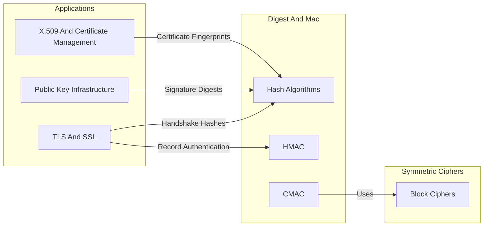
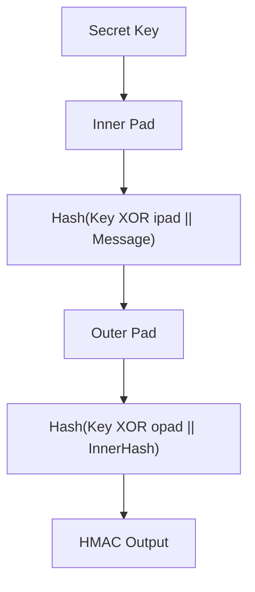
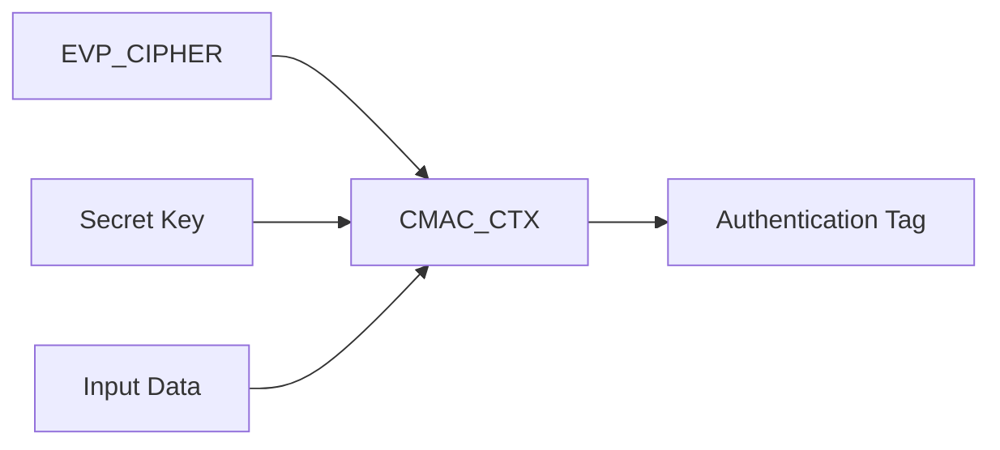
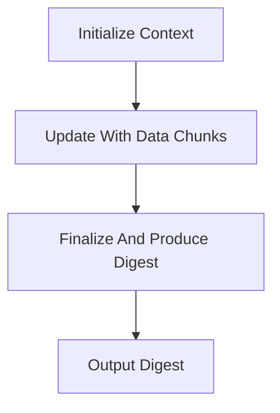

# Digest And Mac

The **Digest And Mac** module provides message digest (hash) algorithms and message authentication code (MAC) primitives used throughout the OpenSSL integration in MeshAgent. It exposes low-level context structures and streaming APIs for computing cryptographic hashes (MD2, MD4, MD5, SHA family, RIPEMD-160, Whirlpool) and MACs (HMAC and CMAC).

This module is a foundational building block for higher-level security features including TLS handshakes, certificate validation, digital signatures, integrity verification, and secure key derivation.

---

## 1. Purpose and Scope

The Digest And Mac module is responsible for:

- Providing **incremental hash computation APIs** (`Init` → `Update` → `Final`).
- Defining **digest context structures** for each algorithm.
- Supporting both **legacy algorithms** (MD2, MD4, MD5) and modern SHA-2 family digests.
- Exposing **MAC primitives**:
  - HMAC (Hash-based MAC)
  - CMAC (Cipher-based MAC)
- Enabling integration with higher-level abstractions such as `EVP_MD`, `EVP_CIPHER`, TLS, PKCS7, CMS, and X.509.

This module operates at a lower abstraction level than EVP but is frequently wrapped by EVP-based APIs in other modules.

---

## 2. Architectural Context

Digest and MAC primitives are core cryptographic services used by many OpenSSL subsystems.

### Related Modules

- [Symmetric Ciphers](../Symmetric Ciphers/Symmetric Ciphers.md)
- [Public Key Infrastructure](../Public Key Infrastructure/Public Key Infrastructure.md)
- [X.509 and Certificate Management](../X.509 and Certificate Management/X.509 and Certificate Management.md)
- [TLS and SSL](../TLS and SSL/TLS and SSL.md)

These modules depend on Digest And Mac for integrity and authentication primitives.

---

## 3. Supported Hash Algorithms

### 3.1 MD2

**Context Structure:** `MD2_CTX`  
**Digest Length:** 16 bytes  
**Block Size:** 16 bytes  

Structure:

- `num` — number of buffered bytes
- `data[16]` — block buffer
- `cksm[16]` — checksum state
- `state[16]` — internal state

Streaming API pattern:

- `MD2_Init()`
- `MD2_Update()`
- `MD2_Final()`
- One-shot: `MD2()`

> MD2 is considered cryptographically broken and retained only for legacy compatibility.

---

### 3.2 MD4

**Context Structure:** `MD4_CTX`  
**Digest Length:** 16 bytes  
**Block Size:** 64 bytes  

Internal state:

- 4-word chaining variables: `A, B, C, D`
- Bit counters: `Nl, Nh`
- Data buffer: `data[16]`

Functions:

- `MD4_Init()`
- `MD4_Update()`
- `MD4_Final()`
- `MD4_Transform()`

> MD4 is insecure and provided only for legacy protocol compatibility.

---

### 3.3 MD5

**Context Structure:** `MD5_CTX`  
**Digest Length:** 16 bytes  
**Block Size:** 64 bytes  

Internal layout mirrors MD4 but with a different compression function.

Functions:

- `MD5_Init()`
- `MD5_Update()`
- `MD5_Final()`
- `MD5_Transform()`

> MD5 is collision-broken and should not be used for security-critical applications.

---

### 3.4 SHA Family

Defined in `sha.h`.

#### SHA-1

**Context:** `SHA_CTX`  
**Digest Length:** 20 bytes  

State fields:

- `h0..h4`
- `Nl, Nh`
- `data[16]`

API:

- `SHA1_Init()`
- `SHA1_Update()`
- `SHA1_Final()`

> SHA-1 is deprecated for collision resistance but still appears in legacy signatures.

---

#### SHA-224 / SHA-256

**Context:** `SHA256_CTX`  
**Digest Length:** 28 / 32 bytes  

State:

- `h[8]`
- `Nl, Nh`
- `data[16]`
- `num`, `md_len`

API:

- `SHA224_Init()` / `SHA256_Init()`
- `Update()`
- `Final()`

Widely used in:

- TLS
- Certificate signatures
- Code signing
- HMAC constructions

---

#### SHA-384 / SHA-512

**Context:** `SHA512_CTX`  
**Digest Length:** 48 / 64 bytes  

Key characteristics:

- Uses 64-bit state (`SHA_LONG64`)
- 1024-bit block size
- 8-word state array

API:

- `SHA384_Init()` / `SHA512_Init()`
- `Update()`
- `Final()`

Used in high-security environments and modern TLS configurations.

---

### 3.5 RIPEMD-160

**Context:** `RIPEMD160_CTX`  
**Digest Length:** 20 bytes  

Structure:

- Five-word state: `A, B, C, D, E`
- Bit counters
- Block buffer

API:

- `RIPEMD160_Init()`
- `RIPEMD160_Update()`
- `RIPEMD160_Final()`

Primarily used in legacy or blockchain-related systems.

---

### 3.6 Whirlpool

**Context:** `WHIRLPOOL_CTX`  
**Digest Length:** 64 bytes  

Characteristics:

- 512-bit digest
- 512-bit block size
- 256-bit counter

API:

- `WHIRLPOOL_Init()`
- `WHIRLPOOL_Update()`
- `WHIRLPOOL_Final()`

Whirlpool provides a large digest size and strong theoretical design.

---

## 4. Message Authentication Codes (MAC)

### 4.1 HMAC

**Context Type:** `HMAC_CTX` (opaque typedef from `ossl_typ.h`)  

HMAC combines:

- A cryptographic hash function (e.g., SHA-256)
- A secret key
- Inner and outer padding constructions

High-level construction:

Used extensively in:

- TLS record authentication
- Token signing
- API request signing
- Integrity verification

---

### 4.2 CMAC

**Context Type:** `CMAC_CTX` (opaque)  

CMAC is a block-cipher-based MAC defined over symmetric ciphers.

Key APIs:

- `CMAC_CTX_new()` / `CMAC_CTX_free()`
- `CMAC_Init()`
- `CMAC_Update()`
- `CMAC_Final()`

CMAC depends on the **EVP cipher layer** and underlying symmetric cipher implementations.

Used in:

- Hardware security modules
- Embedded secure systems
- AES-based authentication schemes

---

## 5. Common Processing Pattern

All digest implementations follow the same streaming lifecycle:

This enables:

- Large file hashing
- Streaming network verification
- Incremental TLS handshake hashing

---

## 6. Internal Design Patterns

Across algorithms, context structures typically include:

- **Chaining variables** (internal state words)
- **Bit-length counters** (`Nl`, `Nh`)
- **Block-sized data buffer**
- **Buffered byte count** (`num`)

This reflects the Merkle–Damgård construction used by MDx, SHA-1, SHA-2, and RIPEMD.

MAC contexts extend this model by:

- Maintaining key-derived state
- Wrapping digest or cipher primitives
- Producing fixed-length authentication tags

---

## 7. Security Considerations

| Algorithm | Status | Recommendation |
|------------|---------|----------------|
| MD2 | Broken | Do not use |
| MD4 | Broken | Do not use |
| MD5 | Collision-broken | Avoid |
| SHA-1 | Deprecated | Avoid for new designs |
| SHA-256 | Secure | Recommended |
| SHA-384/512 | Secure | Recommended |
| RIPEMD-160 | Legacy | Use cautiously |
| Whirlpool | Secure | Acceptable but uncommon |
| HMAC-SHA256 | Secure | Recommended |
| CMAC-AES | Secure | Recommended |

Modern deployments should prefer:

- SHA-256 or stronger
- HMAC-SHA256 or HMAC-SHA512
- CMAC with AES

---

## 8. Role in the Overall System

Digest And Mac underpins:

- TLS handshake transcript hashing
- Certificate fingerprint computation
- Digital signature verification
- Secure message authentication
- Integrity validation in data stores

Without this module, higher-level security modules such as TLS, PKI, and X.509 cannot function.

It forms the **integrity and authentication foundation** of the OpenSSL subsystem embedded within MeshAgent.

---

## 9. Summary

The Digest And Mac module:

- Implements core hashing algorithms.
- Provides standardized streaming APIs.
- Supports both legacy and modern cryptographic primitives.
- Supplies HMAC and CMAC for authenticated integrity.
- Serves as a dependency for TLS, PKI, and certificate management.

It is a low-level but critical component in the cryptographic architecture of the OpenSSL integration.