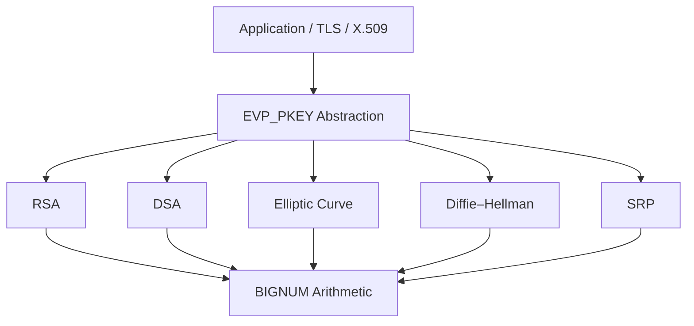
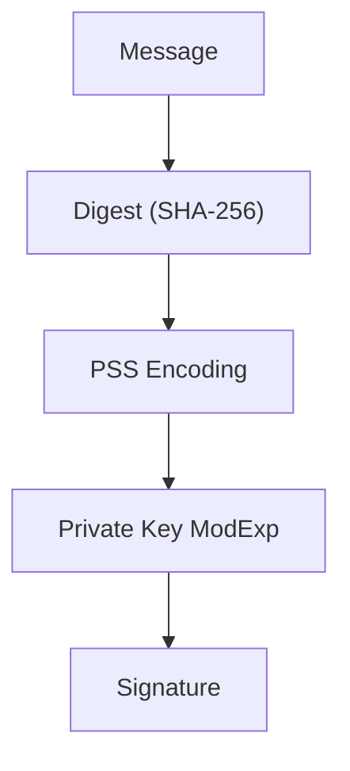
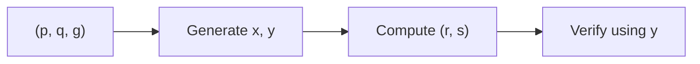
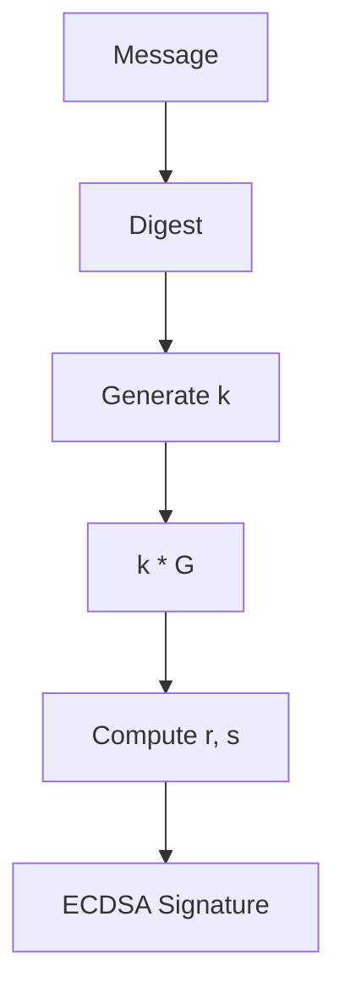
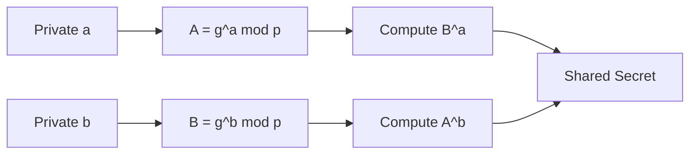
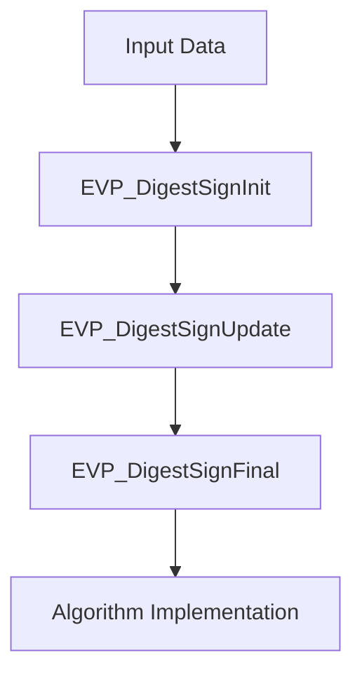
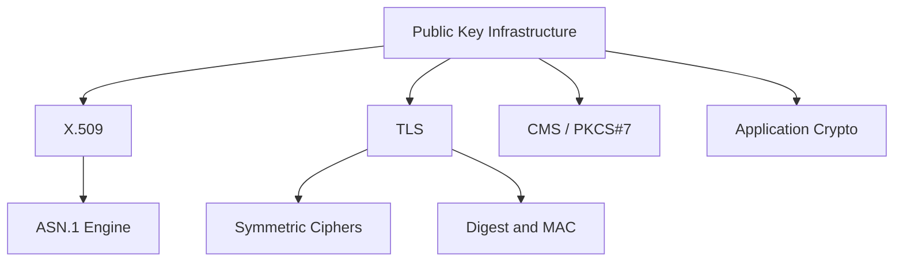

# Public Key Infrastructure

The **Public Key Infrastructure** module provides the asymmetric cryptography foundation for OpenSSL within MeshAgent. It implements RSA, DSA, Elliptic Curve (EC), Diffie–Hellman (DH), and Secure Remote Password (SRP) primitives, along with the method abstraction layers used by the high‑level EVP framework.

This module is responsible for:

- Public/private key generation and validation  
- Digital signatures (RSA, DSA, ECDSA)  
- Public key encryption (RSA)  
- Key exchange (DH, ECDH, SRP)  
- Algorithm abstraction via `EVP_PKEY` and method tables  

It integrates closely with:

- [Type System](../Type System/Type System.md)  
- [ASN.1 Engine](../ASN.1 Engine/ASN.1 Engine.md)  
- [X.509 and Certificate Management](../X.509 and Certificate Management/X.509 and Certificate Management.md)  
- [TLS and SSL](../TLS and SSL/TLS and SSL.md)  
- [Digest and MAC](../Digest and MAC/Digest and MAC.md)

---

## 1. Architectural Overview

The Public Key Infrastructure module sits between low-level big number math and high-level protocol layers such as TLS and X.509.

### Layers

1. **Algorithm Implementations**  
   - RSA (`rsa_st`, `rsa_meth_st`, `RSA_PSS_PARAMS`)  
   - DSA (`dsa_st`, `DSA_SIG_st`)  
   - EC (`EC_GROUP`, `EC_POINT`, `ECDSA_SIG_st`)  
   - DH (`dh_st`, `dh_method`)  
   - SRP (`SRP_VBASE_st`, `SRP_user_pwd_st`)  

2. **Method Abstraction Layer**  
   - `RSA_METHOD`  
   - `DSA_METHOD`  
   - `EC_KEY_METHOD`  
   - `EVP_PKEY_METHOD`  
   - `EVP_PKEY_ASN1_METHOD`  

3. **EVP High-Level Interface**  
   - `EVP_PKEY`  
   - `EVP_PKEY_CTX`  
   - Algorithm-agnostic sign/verify/encrypt/decrypt APIs  

---

## 2. RSA Subsystem

### Core Structures

- `rsa_st` – Core RSA key structure  
- `rsa_meth_st` – Pluggable RSA implementation  
- `rsa_pss_params_st` – RSASSA-PSS parameters  
- `rsa_oaep_params_st` – RSA-OAEP parameters  

### Capabilities

- Key generation (`RSA_generate_key_ex`)  
- Multi-prime RSA  
- PKCS#1 v1.5 and PSS signatures  
- OAEP encryption  
- CRT optimization and blinding  

### RSA Signing Flow (PSS)

RSA integrates with the [Digest and MAC](../Digest and MAC/Digest and MAC.md) module for hashing and with the [ASN.1 Engine](../ASN.1 Engine/ASN.1 Engine.md) for parameter encoding.

---

## 3. DSA Subsystem

### Core Structures

- `DSA` – Key and parameters (p, q, g)  
- `DSA_SIG_st` – Signature container (r, s)  
- `dsa_method` – Method table  

### Capabilities

- Parameter generation (`DSA_generate_parameters_ex`)  
- Key generation (`DSA_generate_key`)  
- Signature generation and verification  

### DSA Signature Model

DSA is primarily used for legacy compatibility and certain certificate types in [X.509 and Certificate Management](../X.509 and Certificate Management/X.509 and Certificate Management.md).

---

## 4. Elliptic Curve Subsystem

The EC subsystem provides modern asymmetric cryptography with improved performance and smaller key sizes.

### Core Structures

- `EC_METHOD` – Curve arithmetic implementation  
- `EC_GROUP` – Curve definition  
- `EC_POINT` – Point on curve  
- `ec_key_st` – EC key pair  
- `ECDSA_SIG_st` – ECDSA signature  

### Supported Operations

- ECDSA signing and verification  
- ECDH key agreement  
- Curve parameter encoding (named or explicit)  
- Built-in curves (`EC_builtin_curve`)  

### ECDSA Signing Flow

EC is heavily used by [TLS and SSL](../TLS and SSL/TLS and SSL.md) for ECDHE and ECDSA-based cipher suites.

---

## 5. Diffie–Hellman (DH) and Key Exchange

### Core Structures

- `dh_st` – DH parameters and key material  
- `dh_method` – Implementation abstraction  

### Flow

The derived secret is fed into KDFs and symmetric encryption primitives from the [Symmetric Ciphers](../Symmetric Ciphers/Symmetric Ciphers.md) module.

---

## 6. Secure Remote Password (SRP)

The SRP subsystem enables password-authenticated key exchange.

### Core Structures

- `SRP_VBASE_st` – Verifier database  
- `SRP_user_pwd_st` – User record  
- `SRP_gN_st` – Group parameters  

SRP is primarily used in secure authentication flows and optionally integrated into TLS-SRP modes.

---

## 7. EVP Integration Layer

The EVP layer abstracts algorithm-specific logic behind a uniform interface.

### Key Abstractions

- `EVP_PKEY` – Generic public/private key container  
- `EVP_PKEY_CTX` – Operation context  
- `EVP_PKEY_METHOD` – Operation dispatch table  
- `EVP_PKEY_ASN1_METHOD` – Encoding/decoding handlers  

### Generic Sign Flow

This design allows TLS, CMS, and X.509 to operate without directly depending on RSA, DSA, or EC internals.

---

## 8. ASN.1 and Parameter Encoding

Many public key structures are encoded in ASN.1 for interoperability.

Examples:

- `RSA_PSS_PARAMS`  
- `ECPARAMETERS` and `ECPKPARAMETERS`  
- DSA and DH parameter encodings  

Encoding and decoding are handled in cooperation with the [ASN.1 Engine](../ASN.1 Engine/ASN.1 Engine.md).

---

## 9. Security and Compliance Features

The module includes:

- Constant-time exponentiation  
- Blinding (`BN_BLINDING`)  
- FIPS method flags (`RSA_FLAG_FIPS_METHOD`, `DSA_FLAG_FIPS_METHOD`)  
- Key validation (`RSA_check_key`, `EC_KEY_check_key`)  
- Security strength reporting (`EVP_PKEY_security_bits`)  

These mechanisms protect against timing attacks, fault attacks, and weak parameter usage.

---

## 10. How It Fits Into the System

The Public Key Infrastructure module is the asymmetric cryptographic backbone of the OpenSSL stack. It enables secure authentication, encryption, and key exchange across certificate handling, TLS communication, and application-level cryptographic operations.

---

## Summary

The **Public Key Infrastructure** module provides:

- Full asymmetric algorithm implementations (RSA, DSA, EC, DH, SRP)  
- Pluggable method architecture  
- High-level EVP abstraction  
- Secure parameter encoding via ASN.1  
- Integration with TLS, X.509, and CMS  

It forms the core trust and identity layer for secure communication within MeshAgent’s OpenSSL-based cryptographic stack.
