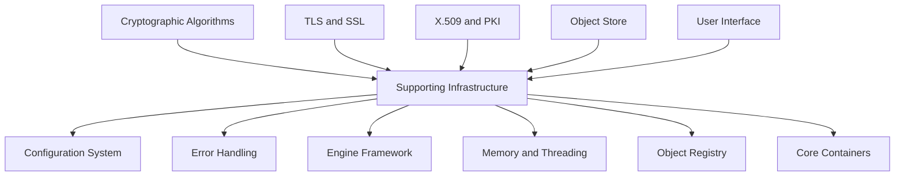
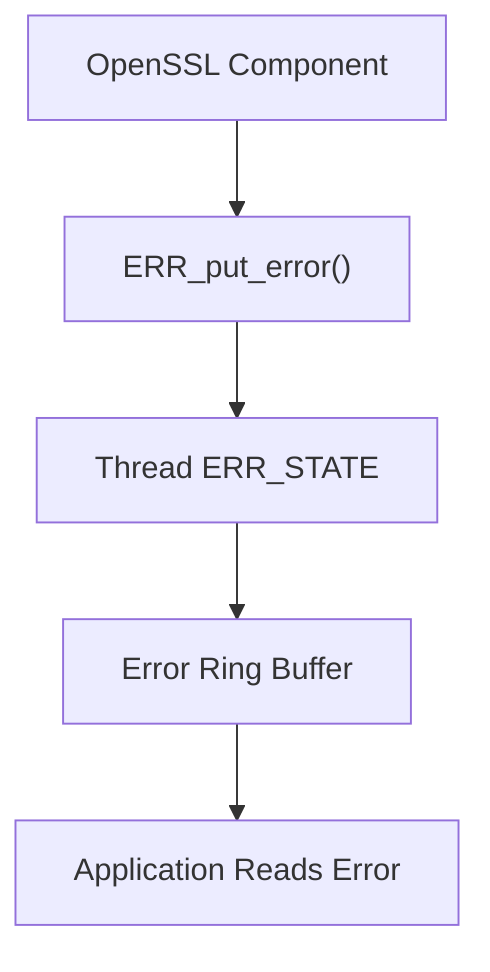
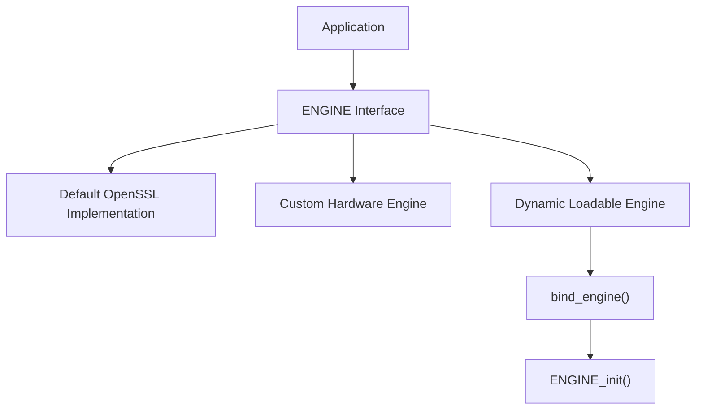
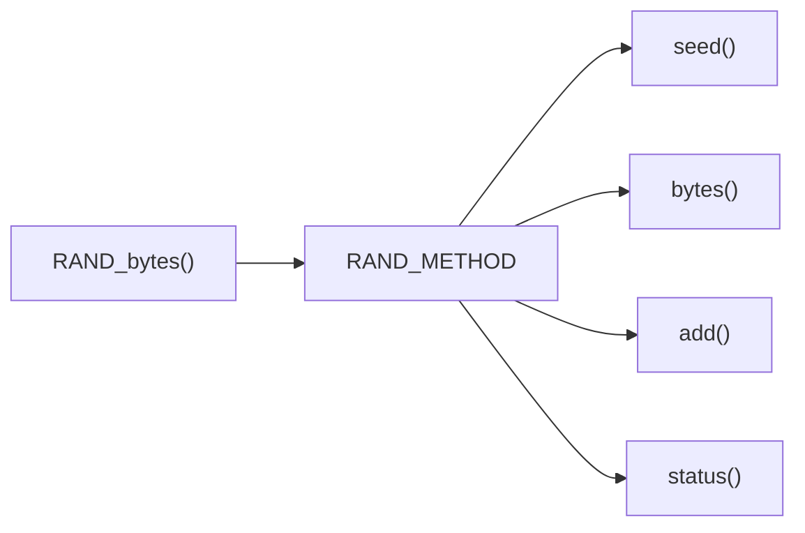
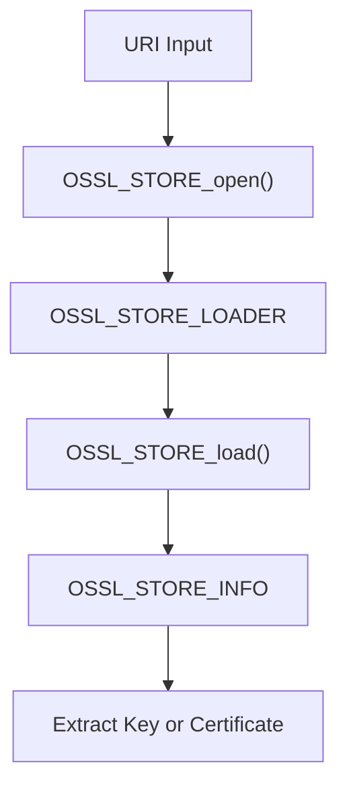
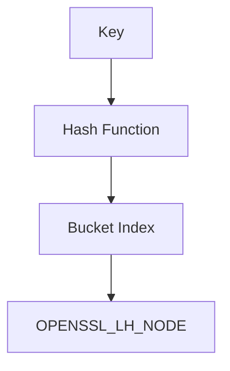
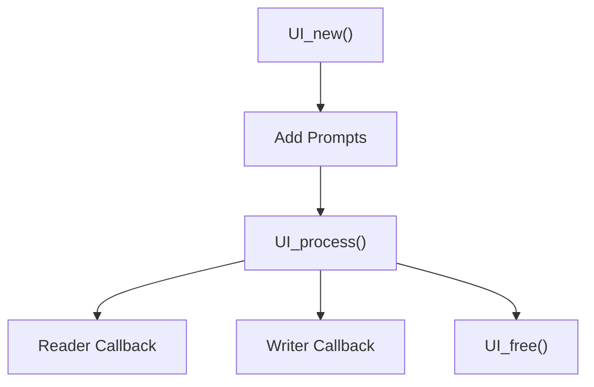
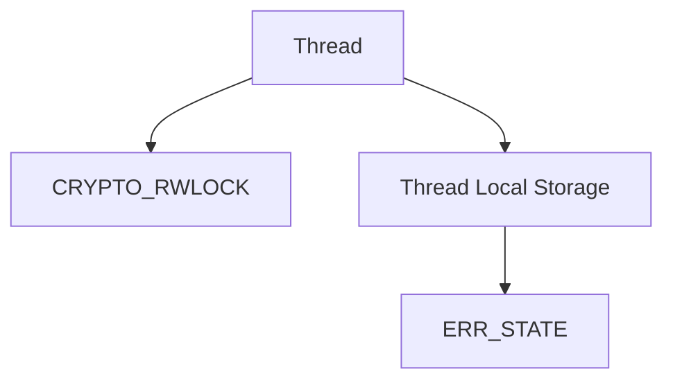
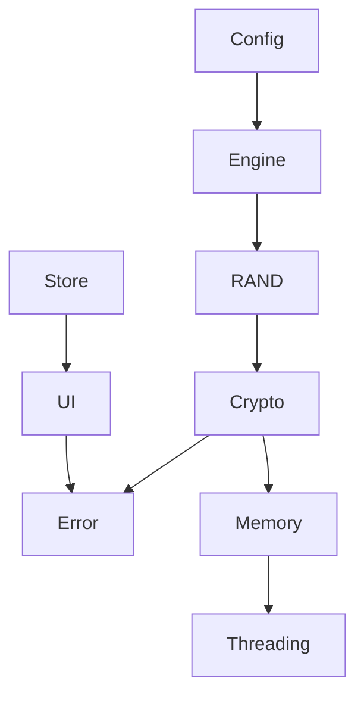

# Supporting Infrastructure

The **Supporting Infrastructure** module provides the foundational runtime services that enable OpenSSL’s higher-level cryptographic, TLS, PKI, and storage components to function reliably. While it does not implement cryptographic algorithms directly, it delivers the configuration system, error handling framework, pluggable engine architecture, object registry, storage abstraction, memory management, threading, and utility containers required by the rest of the OpenSSL stack.

This module acts as the operational backbone of OpenSSL, ensuring that cryptographic primitives and protocols are configurable, extensible, debuggable, and thread-safe.

---

## Architectural Overview

At a high level, the Supporting Infrastructure module sits beneath all OpenSSL functional subsystems and provides cross-cutting services.

### Core Responsibilities

- Runtime configuration loading and module initialization
- Centralized error recording and reporting
- Pluggable cryptographic engine abstraction
- Secure random method integration
- Generic object loading via URI schemes
- Memory allocation and secure memory handling
- Thread synchronization and thread-local storage
- Generic container primitives (hash tables and stacks)
- Object naming and identifier registry
- Text database utilities
- User interaction abstraction layer

---

## Configuration System

**Primary Structures:**
- `CONF`
- `CONF_METHOD`
- `CONF_MODULE`
- `CONF_IMODULE`
- `CONF_VALUE`

The configuration subsystem parses and manages OpenSSL configuration files. It enables dynamic initialization of engines, modules, providers, and application-specific settings.

### Configuration Data Model

### Key Capabilities

- Section-based configuration lookup
- Dynamic module loading
- Flag-based behavior control
- Module initialization and teardown lifecycle
- Application-specific configuration scopes

This system is used extensively during `OPENSSL_init_crypto()` and engine initialization.

---

## Error Handling Framework

**Primary Structures:**
- `ERR_STATE`
- `ERR_STRING_DATA`

OpenSSL uses a thread-local error queue to track and report errors across all subsystems.

### Error Queue Model

### Design Characteristics

- Fixed-size per-thread circular buffer
- Error codes encoded as library, function, and reason
- Optional associated error data
- Lazy string resolution
- Non-throwing model (error queue inspection required)

Each library (RSA, EVP, SSL, etc.) has a numeric identifier, enabling consistent classification and debugging.

---

## Engine Framework

**Primary Structures:**
- `ENGINE_CMD_DEFN`
- `dynamic_fns`
- `dynamic_MEM_fns`

The engine framework provides a plugin system for substituting or augmenting cryptographic implementations.

### Engine Abstraction

### Capabilities

- Method substitution (RSA, DSA, EC, RAND, Ciphers, Digests)
- Dynamic shared library loading
- Command-driven configuration via control interface
- Engine-specific command discovery
- Optional per-engine memory hooks

This mechanism enables hardware acceleration (HSMs, TPMs), platform crypto APIs, or custom providers.

---

## Random Number Method Abstraction

**Primary Structure:**
- `rand_meth_st`

The random subsystem supports pluggable entropy providers and random generators.

### RAND Method Interface

### Highlights

- Replaceable RNG implementation
- Engine-integrated random support
- Secure and private random generation
- File-based seeding and entropy accumulation

---

## Object Store Framework

**Primary Structures:**
- `OSSL_STORE_CTX`
- `OSSL_STORE_LOADER`
- `OSSL_STORE_LOADER_CTX`

The store subsystem provides a uniform API for loading cryptographic objects (keys, certificates, CRLs) from various URI schemes.

### Store Abstraction

### Supported Concepts

- Scheme-based loader registration
- Search filters (by name, fingerprint, issuer)
- UI callback integration for passwords
- Iterative object retrieval
- Pluggable backend implementations

This allows uniform handling of files, PKCS12 bundles, hardware stores, and custom storage backends.

---

## Core Containers and Data Structures

### 1. Hash Table (LHASH)

**Primary Structures:**
- `OPENSSL_LHASH`
- `OPENSSL_LH_NODE`

A generic dynamically resizing hash table used internally for:

- Configuration entries
- Object registries
- Error string tables
- TXT database indexing

---

### 2. Stack (OPENSSL_STACK)

**Primary Structure:**
- `OPENSSL_STACK`

A type-agnostic stack abstraction with type-safe macros.

Used for:

- Certificate chains
- UI strings
- Extension lists
- Configuration modules

---

## Object Naming and Registry

**Primary Structure:**
- `OBJ_NAME`

The object registry maps algorithm names and aliases to internal identifiers (NIDs).

### Registry Flow

This enables dynamic resolution of:

- Message digests
- Ciphers
- Public key methods
- Compression methods

---

## Text Database (TXT_DB)

**Primary Structure:**
- `TXT_DB`

A simple structured flat-file database abstraction used primarily by certificate authority utilities.

Features include:

- Indexed column lookups
- Duplicate detection
- Validation hooks
- Error tracking per row

Internally leverages LHASH for index construction.

---

## User Interface Abstraction

**Primary Structure:**
- `UI_STRING`

The UI subsystem abstracts interactive input/output operations.

### UI Lifecycle

### Capabilities

- Prompt input and verification
- Boolean input handling
- Pluggable UI_METHOD implementations
- Secure password entry
- Application-defined data callbacks

This abstraction decouples cryptographic operations from terminal or GUI specifics.

---

## Memory Management and Threading

**Primary Structures:**
- `crypto_ex_data_st`
- `CRYPTO_THREADID`
- `CRYPTO_dynlock`

### Memory System

OpenSSL wraps standard allocation functions to:

- Track memory usage
- Enable debugging and leak detection
- Support secure memory regions
- Allow custom allocator injection

### Threading Model

Capabilities include:

- Platform-agnostic read/write locks
- Thread-local storage abstraction
- One-time initialization guards
- Atomic operations

These features ensure correctness in multi-threaded TLS servers and cryptographic applications.

---

## Cross-Cutting Integration

The Supporting Infrastructure module integrates with all other OpenSSL subsystems:

Key integration points:

- Configuration initializes engines and modules
- Engines override RAND and algorithm implementations
- Errors propagate across all layers
- Store relies on UI and configuration
- All subsystems rely on memory and thread safety

---

## Design Characteristics

1. **Modular** – Services are independently replaceable.
2. **Pluggable** – Engines and loaders extend functionality dynamically.
3. **Thread-Safe** – Centralized locking and TLS abstractions.
4. **Backward Compatible** – Extensive macro compatibility layers.
5. **Low-Level and C-Oriented** – Designed for portability and ABI stability.

---

## Summary

The **Supporting Infrastructure** module forms the operational foundation of OpenSSL. It does not implement cryptography directly; instead, it provides:

- Configuration and module lifecycle management
- Centralized error handling
- Pluggable engine architecture
- Generic object loading and storage
- Memory management and thread abstraction
- Core container primitives
- Algorithm registry and object mapping
- User interaction abstraction

Without this infrastructure layer, higher-level components such as TLS, PKI, and cryptographic algorithms would lack configurability, extensibility, robustness, and runtime coordination.

This module ensures that OpenSSL operates as a cohesive, extensible, and production-ready cryptographic framework.