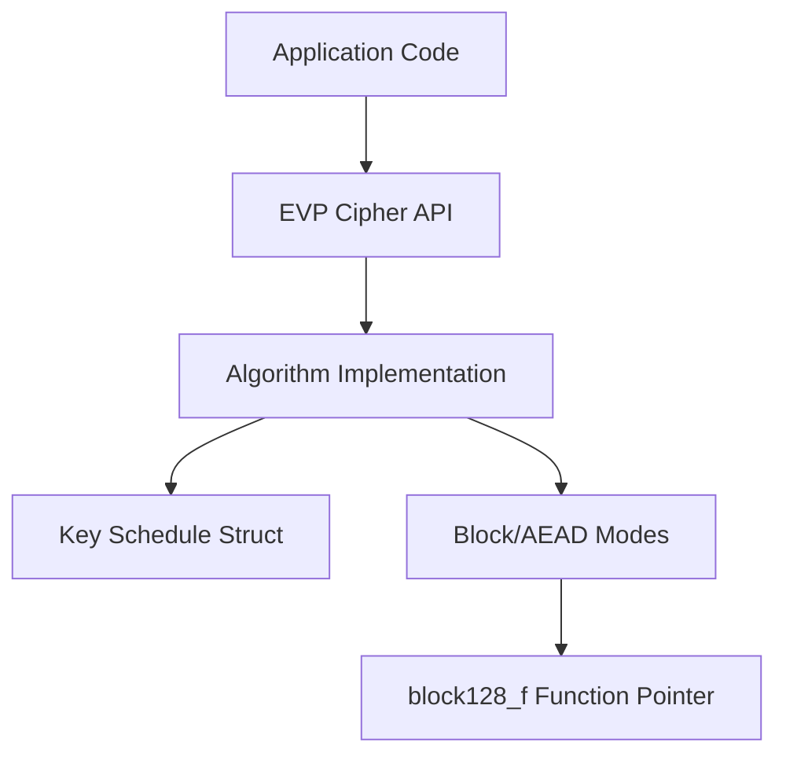
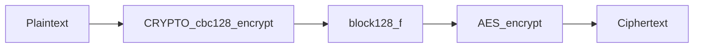
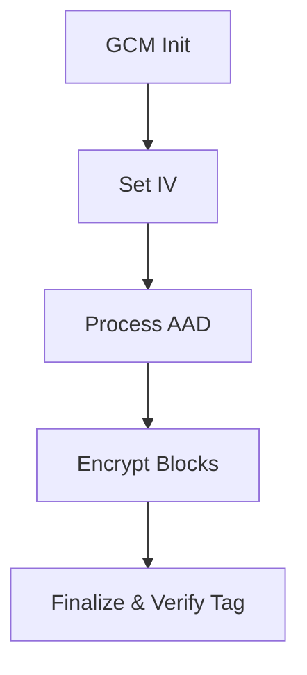
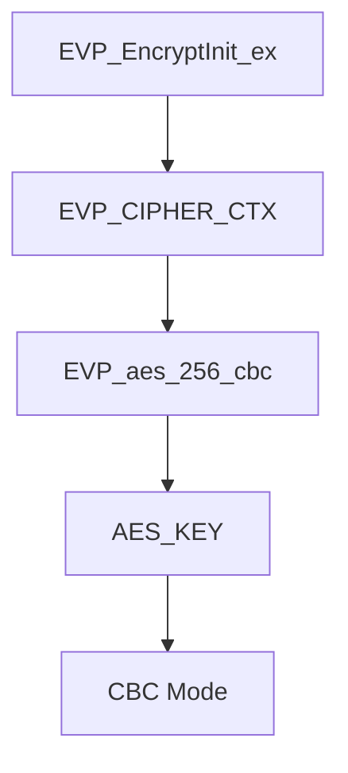

# Symmetric Ciphers

The **Symmetric Ciphers** module provides the concrete block and stream cipher implementations used throughout the OpenSSL core in MeshAgent. It includes classic and modern symmetric algorithms (AES, DES, Blowfish, Camellia, CAST, RC2/RC4/RC5, IDEA, SEED) as well as authenticated and advanced block cipher modes (GCM, CCM, OCB, XTS).

This module forms the cryptographic backbone for higher-level services such as TLS, PKCS#7/CMS encryption, secure storage, and key wrapping. It works closely with the [Type System](../Type System/Type System.md), [Digest and MAC](../Digest and MAC/Digest and MAC.md), [TLS and SSL](../TLS and SSL/TLS and SSL.md), and [BIO and IO](../BIO and IO/BIO and IO.md) modules.

---

## 1. Purpose and Scope

The Symmetric Ciphers module provides:

- Low-level algorithm-specific key schedules (e.g., `AES_KEY`, `DES_key_schedule`)
- Raw block encryption and decryption primitives
- Standard block cipher modes (ECB, CBC, CFB, OFB, CTR)
- Authenticated encryption modes (GCM, CCM, OCB)
- Disk encryption mode (XTS)
- Key wrapping utilities (RFC 3394-style AES wrap)
- Integration with the high-level `EVP_CIPHER` abstraction

It is designed to support both:

- **Direct algorithm use** (e.g., `AES_encrypt`, `DES_cbc_encrypt`)
- **Abstracted use via EVP** (recommended for most applications)

---

## 2. High-Level Architecture

At a high level, symmetric encryption in OpenSSL is layered:



### Layers Explained

1. **Application Code**
   - Uses `EVP_EncryptInit_ex`, `EVP_EncryptUpdate`, etc.

2. **EVP Cipher API**
   - Provides algorithm-agnostic encryption interface.
   - Encapsulates IV handling, padding, AEAD control, and mode selection.

3. **Algorithm Implementation**
   - AES, DES, Blowfish, Camellia, etc.
   - Defines key schedules and block encrypt/decrypt functions.

4. **Modes Layer**
   - Implemented in `modes.h`.
   - Provides CBC, CTR, GCM, CCM, OCB, XTS wrappers around block ciphers.

---

## 3. Core Algorithm Families

### 3.1 AES (Advanced Encryption Standard)

**Core types:**
- `AES_KEY`
- `aes_key_st`

Key characteristics:
- Block size: 16 bytes
- Key sizes: 128, 192, 256 bits
- Max rounds: 14 (`AES_MAXNR`)

Key schedule structure:

```c
struct aes_key_st {
    unsigned int rd_key[4 * (AES_MAXNR + 1)];
    int rounds;
};
```

Capabilities:
- ECB, CBC, CFB (1/8/128), OFB
- IGE and BI-IGE
- AES key wrap / unwrap
- Used as backend for GCM, CCM, OCB, XTS

AES is the primary symmetric primitive used by TLS, CMS, and modern secure storage.

---

### 3.2 DES and Triple DES

**Core types:**
- `DES_key_schedule`
- `DES_ks`

Characteristics:
- Block size: 8 bytes
- 16 rounds
- Supports single DES and 3DES (EDE2, EDE3)

Features:
- Parity checks and weak key detection
- CBC, CFB, OFB, ECB
- Triple-DES variants

DES is legacy and retained for compatibility (e.g., older PKCS#12 or TLS configurations).

---

### 3.3 Blowfish, CAST, RC2, RC4, RC5, IDEA, SEED, Camellia

Each algorithm defines:

- A key schedule structure (`BF_KEY`, `CAST_KEY`, `RC2_KEY`, etc.)
- A set of block or stream primitives
- Standard modes (CBC, CFB, OFB, ECB)

Example (Blowfish):

```c
typedef struct bf_key_st {
    BF_LONG P[BF_ROUNDS + 2];
    BF_LONG S[4 * 256];
} BF_KEY;
```

These algorithms are:

- Mostly retained for backward compatibility
- Exposed through EVP
- Optional at build time via `OPENSSL_NO_*` flags

Camellia and SEED are modern block ciphers with 128-bit blocks and are often enabled in compliance-focused environments.

---

## 4. Block Cipher Modes (modes.h)

The `modes.h` layer abstracts block processing from algorithm logic.

### 4.1 Generic Mode Functions

Examples:

- `CRYPTO_cbc128_encrypt`
- `CRYPTO_ctr128_encrypt`
- `CRYPTO_cfb128_encrypt`
- `CRYPTO_ofb128_encrypt`

These functions operate on:

- A `block128_f` function pointer
- An opaque `key` pointer
- IV and state buffers



This design allows:

- Reuse of mode logic for different block ciphers
- Clean separation of block transform and chaining logic

---

## 5. Authenticated Encryption (AEAD)

The module defines context types for modern AEAD modes:

- `GCM128_CONTEXT`
- `CCM128_CONTEXT`
- `OCB128_CONTEXT`
- `XTS128_CONTEXT`

### 5.1 GCM (Galois/Counter Mode)

Key functions:
- `CRYPTO_gcm128_init`
- `CRYPTO_gcm128_setiv`
- `CRYPTO_gcm128_encrypt`
- `CRYPTO_gcm128_finish`

Workflow:



Used heavily in:
- TLS (AES-GCM)
- Secure messaging
- CMS encrypted content

---

### 5.2 CCM and OCB

- CCM combines CTR mode with CBC-MAC.
- OCB integrates offset-based encryption with authentication.

Both are supported via dedicated context structures and integrated into EVP as AEAD ciphers.

---

### 5.3 XTS Mode

`XTS128_CONTEXT` is designed for disk encryption.

- Requires two AES keys.
- Provides tweak-based block encryption.

Used in:
- Full-disk encryption systems
- Storage-layer cryptography

---

## 6. EVP Integration

The EVP layer (see `EVP_CIPHER_INFO` and cipher registration in `evp.h`) abstracts algorithm details.

Example flow using AES-256-CBC:



Key integration points:

- `EVP_CIPHER` structures bind:
  - Key length
  - IV length
  - Mode flags (`EVP_CIPH_CBC_MODE`, `EVP_CIPH_GCM_MODE`, etc.)
- AEAD control via `EVP_CTRL_AEAD_*`
- TLS-specific optimizations via `EVP_CTRL_TLS1_1_MULTIBLOCK_PARAM`

The Symmetric Ciphers module provides the concrete implementations behind these abstractions.

---

## 7. Key Schedule Structures

Each cipher defines a dedicated key schedule struct:

| Algorithm  | Key Struct | Purpose |
|------------|-----------|---------|
| AES        | `AES_KEY` | Round keys and round count |
| DES        | `DES_key_schedule` | 16-round key schedule |
| Blowfish   | `BF_KEY` | P-array and S-boxes |
| RC2        | `RC2_KEY` | Expanded key table |
| RC4        | `RC4_KEY` | Stream state (x, y, S-array) |
| Camellia   | `CAMELLIA_KEY` | Key tables + rounds |
| SEED       | `SEED_KEY_SCHEDULE` | 32-word key state |

These are:

- Algorithm-specific
- Typically initialized via `*_set_key` functions
- Passed into block or mode functions

---

## 8. Interaction with Other Modules

### 8.1 Type System

The Symmetric Ciphers module relies on:

- `EVP_CIPHER`
- `EVP_CIPHER_CTX`
- `ENGINE`

Defined in the [Type System](../Type System/Type System.md).

---

### 8.2 Digest and MAC

Authenticated modes (GCM, CCM, OCB) conceptually combine:

- Symmetric encryption
- MAC or polynomial authentication

For traditional HMAC-based constructions, see [Digest and MAC](../Digest and MAC/Digest and MAC.md).

---

### 8.3 TLS and SSL

TLS uses symmetric ciphers for:

- Record encryption
- AEAD authentication tags
- Key wrapping and session ticket protection

See [TLS and SSL](../TLS and SSL/TLS and SSL.md).

---

### 8.4 BIO and IO

Encrypted BIO chains use symmetric ciphers for streaming encryption.

See [BIO and IO](../BIO and IO/BIO and IO.md).

---

## 9. Security Considerations

1. **Prefer EVP API**
   - Avoid direct low-level cipher calls unless necessary.

2. **Use AEAD modes**
   - Prefer GCM or CCM over raw CBC.

3. **Avoid legacy algorithms**
   - DES, RC4, RC2, IDEA are legacy and insecure for modern use.

4. **Correct IV handling**
   - Unique IVs are mandatory for CTR/GCM/CCM.

5. **Constant-time implementations**
   - Many primitives are optimized to reduce timing side channels.

---

## 10. Summary

The Symmetric Ciphers module provides:

- Concrete symmetric algorithm implementations
- Mode logic for chaining and AEAD
- Key schedule and state management
- Integration with EVP abstraction

It serves as the foundational layer for secure communication (TLS), encrypted content (CMS/PKCS#7), password-based encryption, and storage encryption within the OpenSSL core of MeshAgent.

For higher-level usage patterns, refer to the EVP-based documentation in the [Type System](../Type System/Type System.md) and protocol-level integration in [TLS and SSL](../TLS and SSL/TLS and SSL.md).