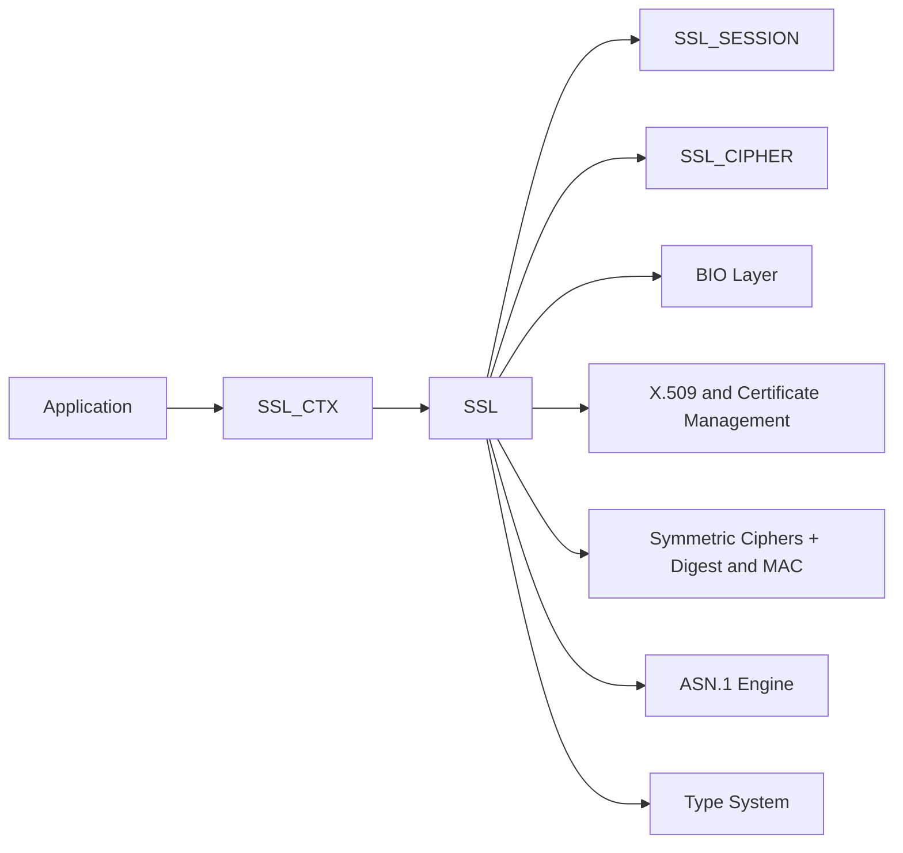
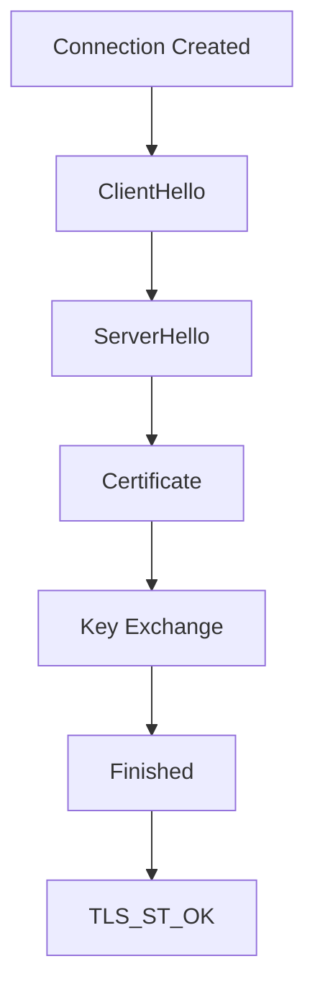
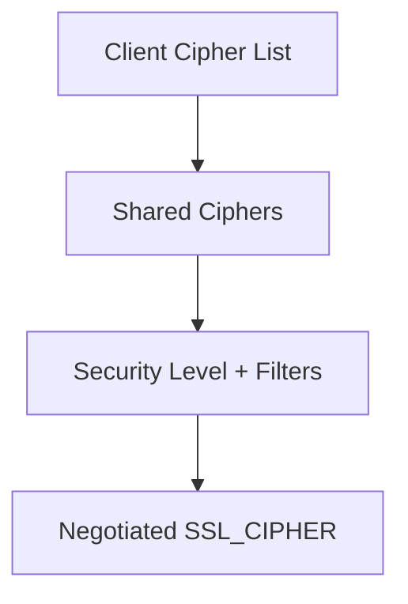
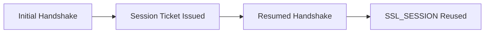
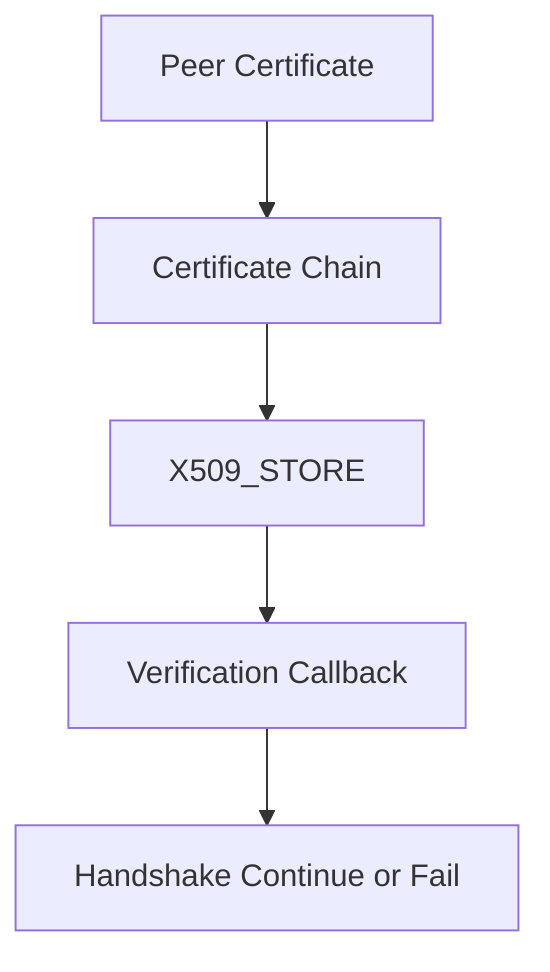
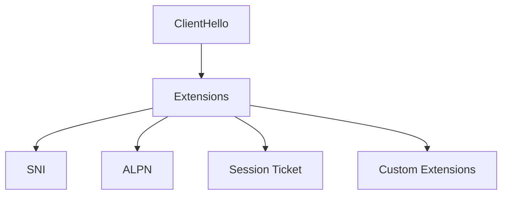
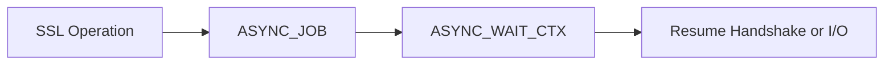
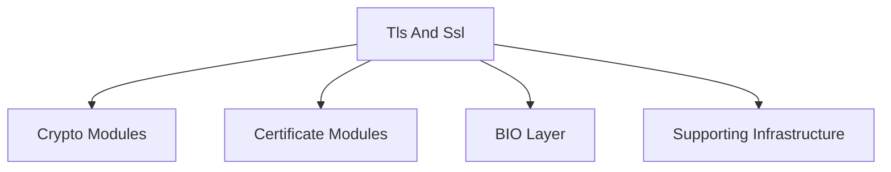

# Tls And Ssl

The **Tls And Ssl** module provides the Transport Layer Security (TLS) and Secure Sockets Layer (SSL) protocol implementation built on top of OpenSSL 1.1.1. It is responsible for secure session establishment, cipher negotiation, certificate verification, encrypted data transport, session resumption, and advanced TLS 1.3 features such as early data and key updates.

This module centers around the core OpenSSL structures `SSL`, `SSL_CTX`, `SSL_SESSION`, `SSL_CIPHER`, and `SSL_METHOD`, and integrates with cryptographic primitives, X.509 certificate handling, BIO-based I/O, and asynchronous execution.

---

## 1. Purpose and Responsibilities

The Tls And Ssl module is responsible for:

- Managing TLS/SSL contexts and connections
- Performing protocol negotiation (TLS 1.0–1.3, DTLS)
- Selecting and validating cipher suites
- Handling certificate chains and peer verification
- Managing session tickets and session resumption
- Supporting ALPN, SNI, SRTP, and custom extensions
- Enabling asynchronous crypto operations
- Enforcing security policies and levels

It acts as the secure transport layer that binds together cryptography, certificate infrastructure, and network I/O.

---

## 2. Core Data Structures

### 2.1 SSL_CTX (Context Level)

`SSL_CTX` represents a reusable configuration container for TLS connections. It holds:

- Protocol version constraints
- Cipher configuration
- Certificate and private key material
- Verification settings
- Session cache configuration
- Security level and callback policies

An application typically creates one `SSL_CTX` and uses it to spawn multiple `SSL` objects.

### 2.2 SSL (Connection Level)

`SSL` represents a single TLS/SSL connection. It contains:

- Handshake state machine
- Negotiated cipher and protocol version
- Record layer state
- Associated BIOs (network I/O)
- Session reference
- Early data and key update state

### 2.3 SSL_SESSION

`SSL_SESSION` encapsulates resumable session state:

- Session ID
- Master secret or resumption secret
- Cipher suite
- Ticket data
- ALPN and SNI metadata

### 2.4 SSL_CIPHER

`SSL_CIPHER` describes a negotiated cipher suite:

- Key exchange algorithm
- Authentication method
- Bulk cipher (e.g., AES, CHACHA20)
- MAC or AEAD digest

### 2.5 SSL_METHOD

`SSL_METHOD` defines protocol behavior:

- TLS client/server negotiation strategy
- Version-specific state machine behavior
- DTLS vs TLS distinctions

---

## 3. High-Level Architecture

### Related Modules

- [Type System](../type_system/type_system.md)
- [ASN.1 Engine](../asn_1_engine/asn_1_engine.md)
- [Symmetric Ciphers](../symmetric_ciphers/symmetric_ciphers.md)
- [Digest and MAC](../digest_and_mac/digest_and_mac.md)
- [Public Key Infrastructure](../public_key_infrastructure/public_key_infrastructure.md)
- [X.509 and Certificate Management](../x_509_and_certificate_management/x_509_and_certificate_management.md)
- [BIO and IO](../bio_and_io/bio_and_io.md)
- [Supporting Infrastructure](../supporting_infrastructure/supporting_infrastructure.md)

---

## 4. TLS Handshake Flow

The handshake is implemented as a state machine (`OSSL_HANDSHAKE_STATE`).

### TLS 1.3 Enhancements

- Encrypted extensions
- Post-handshake authentication
- KeyUpdate messages
- 0-RTT early data

The module exposes:

- `SSL_read_early_data()`
- `SSL_write_early_data()`
- `SSL_key_update()`
- `SSL_get_early_data_status()`

---

## 5. Cipher Suite Negotiation

Cipher negotiation uses string-based policies and internal filtering.

Examples:

- `SSL_CTX_set_cipher_list()` for TLS 1.2 and below
- `SSL_CTX_set_ciphersuites()` for TLS 1.3

Default policies:

- `SSL_DEFAULT_CIPHER_LIST`
- `TLS_DEFAULT_CIPHERSUITES`

Security enforcement is handled via:

- `SSL_set_security_level()`
- Security callbacks
- Signature algorithm filtering

---

## 6. Session Management

The module supports both:

- Session ID–based resumption
- Session ticket–based resumption (RFC 5077)

### Session Ticket Structure

Defined in `tls_session_ticket_ext_st`:

- `length`
- `data`

Callbacks:

- `SSL_CTX_set_session_ticket_cb()`
- `SSL_CTX_set_generate_session_id()`

---

## 7. Certificate Verification

Certificate validation integrates with the X.509 subsystem.

Key APIs:

- `SSL_set_verify()`
- `SSL_get_verify_result()`
- `SSL_CTX_load_verify_locations()`
- `SSL_set1_host()` for hostname validation

Verification modes:

- `SSL_VERIFY_NONE`
- `SSL_VERIFY_PEER`
- `SSL_VERIFY_POST_HANDSHAKE`

---

## 8. Extensions and Protocol Features

The module supports numerous TLS extensions:

- Server Name Indication (SNI)
- Application Layer Protocol Negotiation (ALPN)
- OCSP stapling
- SRTP profiles
- Certificate Transparency (CT)
- Custom extensions via callback registration

Custom extension APIs:

- `SSL_CTX_add_custom_ext()`
- `SSL_extension_supported()`

---

## 9. Asynchronous Operation

The module integrates with OpenSSL's async subsystem:

- `ASYNC_JOB`
- `ASYNC_WAIT_CTX`

Used when:

- Hardware accelerators are involved
- Long-running cryptographic operations are offloaded

Control functions:

- `ASYNC_start_job()`
- `SSL_want_async()`

---

## 10. BIO and Transport Integration

`SSL` objects use BIO abstractions for I/O.

- `SSL_set_fd()` for socket binding
- `SSL_set_bio()` for custom transport layers
- `BIO_new_ssl()` for SSL-over-BIO chaining

This design decouples:

- Protocol logic
- Record encryption
- Underlying transport mechanism

See [BIO and IO](../bio_and_io/bio_and_io.md) for details.

---

## 11. DTLS Support

The module also provides Datagram TLS:

- `DTLS_method()`
- MTU control
- Timeout handling
- Cookie exchange

DTLS adds retransmission and timer-based state transitions.

---

## 12. Security Model

Security enforcement is layered:

1. Protocol version constraints
2. Cipher suite filtering
3. Security level enforcement
4. Certificate validation
5. Extension validation
6. Session resumption validation

Security callbacks allow custom policy enforcement:

- `SSL_set_security_callback()`
- `SSL_CTX_set_security_callback()`

---

## 13. How Tls And Ssl Fits in the System

Within the overall OpenSSL-based architecture:

- Relies on cryptographic primitives from Symmetric Ciphers and Digest and MAC
- Uses Public Key Infrastructure for key exchange and signatures
- Uses X.509 and Certificate Management for identity validation
- Uses ASN.1 Engine for encoding/decoding protocol structures
- Uses BIO and IO for transport abstraction
- Uses Supporting Infrastructure for configuration and error handling

The Tls And Ssl module is therefore the orchestration layer that binds cryptography, certificates, and transport into a complete secure communication channel.

---

## 14. Summary

The **Tls And Ssl** module provides:

- Complete TLS/SSL protocol implementation
- Stateful connection management
- Advanced TLS 1.3 features
- Secure session resumption
- Certificate-based authentication
- Policy-driven cipher negotiation
- Extensibility via callbacks
- Async and DTLS support

It is the central secure transport component of the OpenSSL subsystem, enabling encrypted, authenticated communication across the system.
