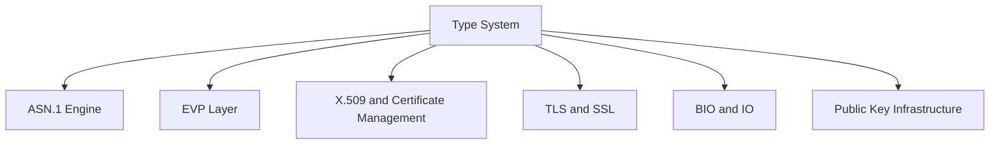
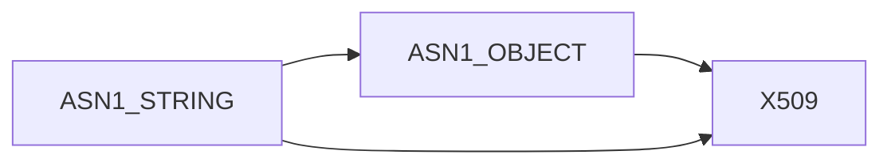
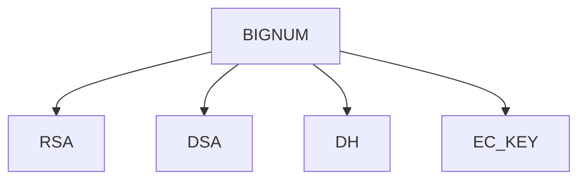
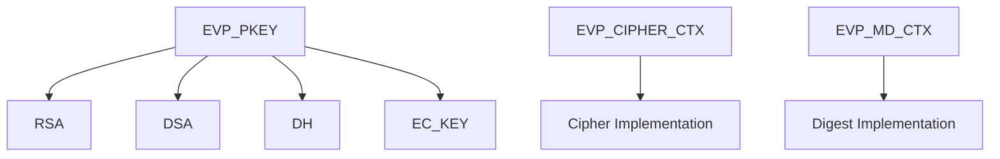
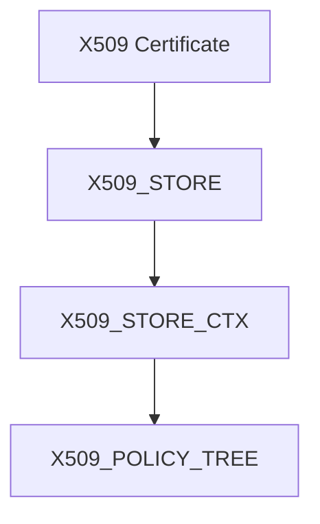
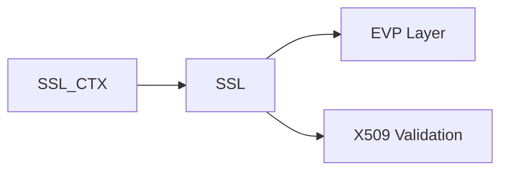
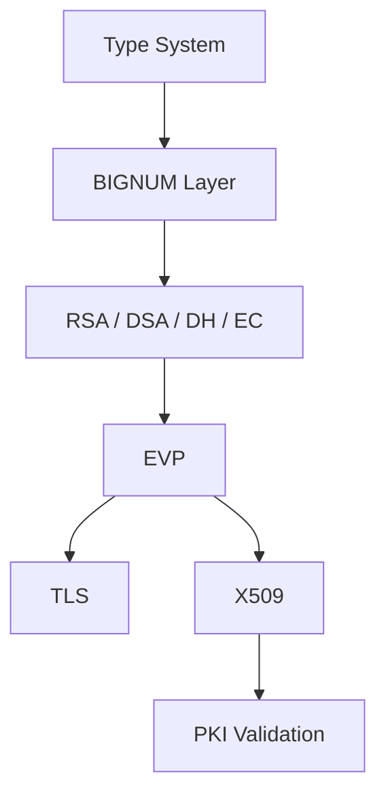
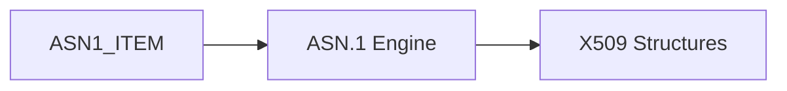
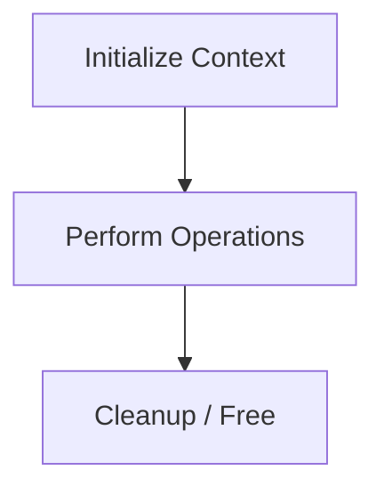

# Type System

The **Type System** module defines the foundational data types used throughout the OpenSSL core embedded in MeshAgent. It provides forward declarations and canonical typedefs for cryptographic primitives, ASN.1 objects, X.509 structures, TLS contexts, and supporting infrastructure.

Rather than implementing algorithms directly, this module establishes the *type contracts* that enable loose coupling, ABI stability, and opaque structure design across the OpenSSL ecosystem.

---

## 1. Purpose and Design Principles

The Type System module is built around three core principles:

1. **Opaque Structures** – Most types are forward-declared (`struct xxx_st`) and exposed via typedefs. Internal layouts remain hidden.
2. **Binary Compatibility** – Consumers compile against stable type definitions while implementation evolves internally.
3. **Cross-Subsystem Interoperability** – Shared types allow ASN.1, EVP, TLS, X.509, and PKI layers to interoperate safely.

All core definitions originate from:

```
openssl-1.1.1f/include/openssl/ossl_typ.h
```

---

## 2. High-Level Architectural Role

The Type System sits at the bottom of the OpenSSL abstraction stack.



All higher-level modules depend on the canonical types defined here.

Related modules:

- [ASN.1 Engine](ASN.1 Engine/ASN.1 Engine.md)
- [Symmetric Ciphers](Symmetric Ciphers/Symmetric Ciphers.md)
- [Digest and MAC](Digest and MAC/Digest and MAC.md)
- [Public Key Infrastructure](Public Key Infrastructure/Public Key Infrastructure.md)
- [X.509 and Certificate Management](X.509 and Certificate Management/X.509 and Certificate Management.md)
- [TLS and SSL](TLS and SSL/TLS and SSL.md)
- [BIO and IO](BIO and IO/BIO and IO.md)

---

## 3. Core Type Categories

The module defines opaque types grouped into functional domains.

### 3.1 ASN.1 Core Types

These types represent generic ASN.1 encodable structures:

- `ASN1_STRING`
- `ASN1_BIT_STRING`
- `ASN1_OBJECT`
- `ASN1_ITEM`
- `ASN1_PCTX`, `ASN1_SCTX`

These types underpin certificate parsing, PKCS structures, and CMS/OCSP objects.



---

### 3.2 Big Number Arithmetic (BN Layer)

Cryptographic algorithms rely on arbitrary-precision integers.

Key types:

- `BIGNUM`
- `BN_CTX`
- `BN_BLINDING`
- `BN_MONT_CTX`
- `BN_RECP_CTX`
- `BN_GENCB`



All asymmetric cryptography builds on these primitives.

---

### 3.3 EVP High-Level Abstraction Layer

The EVP layer provides algorithm-agnostic cryptographic interfaces.

Core types:

- `EVP_CIPHER`, `EVP_CIPHER_CTX`
- `EVP_MD`, `EVP_MD_CTX`
- `EVP_PKEY`, `EVP_PKEY_CTX`
- `EVP_PKEY_METHOD`, `EVP_PKEY_ASN1_METHOD`
- `EVP_ENCODE_CTX`
- `HMAC_CTX`



The Type System ensures these contexts remain opaque and interchangeable.

---

### 3.4 Asymmetric Key Structures

Forward-declared key structures:

- `RSA`, `RSA_METHOD`, `RSA_PSS_PARAMS`
- `DSA`, `DSA_METHOD`
- `DH`, `DH_METHOD`
- `EC_KEY`, `EC_KEY_METHOD`

These types integrate with EVP and X.509 layers.

---

### 3.5 X.509 and Certificate Infrastructure

Certificate-related types:

- `X509`
- `X509_STORE`, `X509_STORE_CTX`
- `X509_NAME`
- `X509_CRL`
- `X509_VERIFY_PARAM`
- Policy structures (`X509_POLICY_TREE`, `X509_POLICY_NODE`, etc.)



These types enable certificate validation pipelines.

---

### 3.6 TLS / SSL Context Types

TLS session management depends on:

- `SSL`
- `SSL_CTX`
- `SSL_DANE`



TLS leverages EVP for cryptography and X.509 for trust evaluation.

---

### 3.7 BIO and I/O Abstractions

I/O abstraction types:

- `BIO`
- `BUF_MEM`

These enable flexible transport layers (memory, socket, file, TLS tunnel).

---

### 3.8 Randomness and Initialization

- `RAND_METHOD`
- `RAND_DRBG`
- `OPENSSL_INIT_SETTINGS`

These types coordinate entropy sources and global initialization.

---

### 3.9 Engine and UI Infrastructure

- `ENGINE`
- `UI`, `UI_METHOD`
- `CRYPTO_EX_DATA`

These allow pluggable cryptographic providers and custom user interaction.

---

## 4. Opaque Type Pattern

Most definitions follow this pattern:

```c
typedef struct rsa_st RSA;
```

This means:

- The structure layout is hidden.
- Consumers manipulate pointers only.
- Memory management and invariants are controlled internally.

### Benefits

- ABI stability
- Reduced compile-time dependencies
- Security through encapsulation

---

## 5. Cross-Module Dependency Flow

The Type System enables layered architecture:



Each layer depends only on type contracts from lower layers.

---

## 6. Interaction with ASN.1 Engine

The Type System defines base ASN.1 types while encoding/decoding logic resides in:

- [ASN.1 Engine](ASN.1 Engine/ASN.1 Engine.md)

Relationship:



The ASN.1 Engine consumes the structural definitions declared here.

---

## 7. Memory and Context Management

Many context types exist to maintain execution state:

- `EVP_MD_CTX`
- `EVP_CIPHER_CTX`
- `EVP_PKEY_CTX`
- `X509_STORE_CTX`
- `SSL_CTX`

These represent lifecycle-bound state machines.



The Type System ensures consistent naming and layering across these contexts.

---

## 8. Integration within MeshAgent

Within MeshAgent, OpenSSL types are:

- Used by TLS channels for secure communication
- Used by PKI components for certificate validation
- Used by cryptographic modules for encryption and signing
- Used by WebRTC and secure transport subsystems

The Type System module acts as the contract boundary between:

- OpenSSL core
- Microstack networking
- WebRTC components
- Agent security infrastructure

---

## 9. Summary

The **Type System** module is the structural backbone of the OpenSSL integration in MeshAgent.

It:

- Defines all fundamental opaque cryptographic types
- Enables abstraction through forward declarations
- Maintains binary compatibility
- Connects ASN.1, EVP, PKI, TLS, and BIO layers
- Provides the foundation for secure communications and certificate handling

Without this module, higher-level cryptographic systems would lack the stable structural contracts required for safe interoperability.
