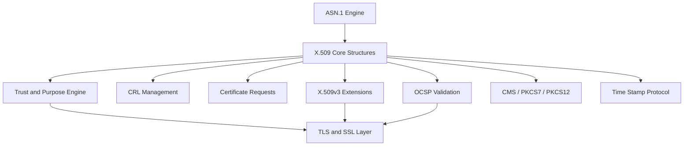
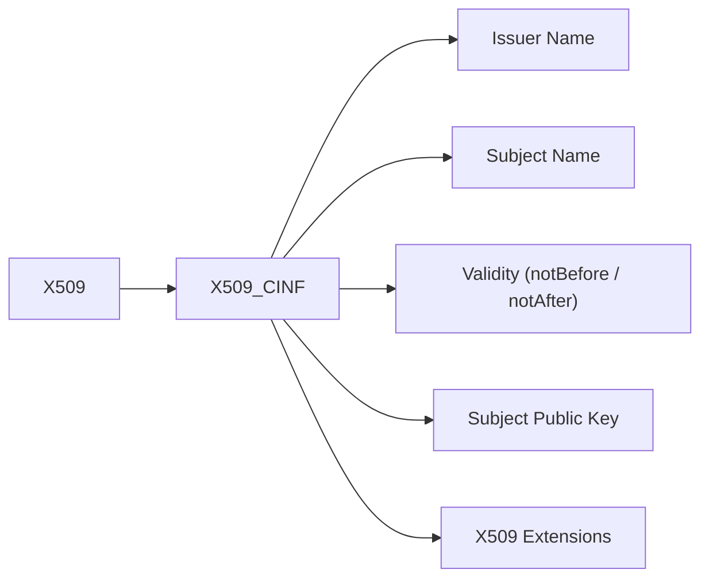
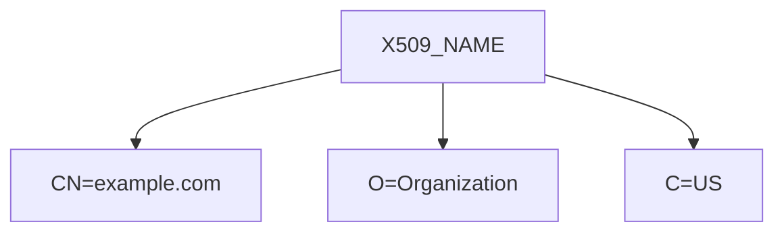
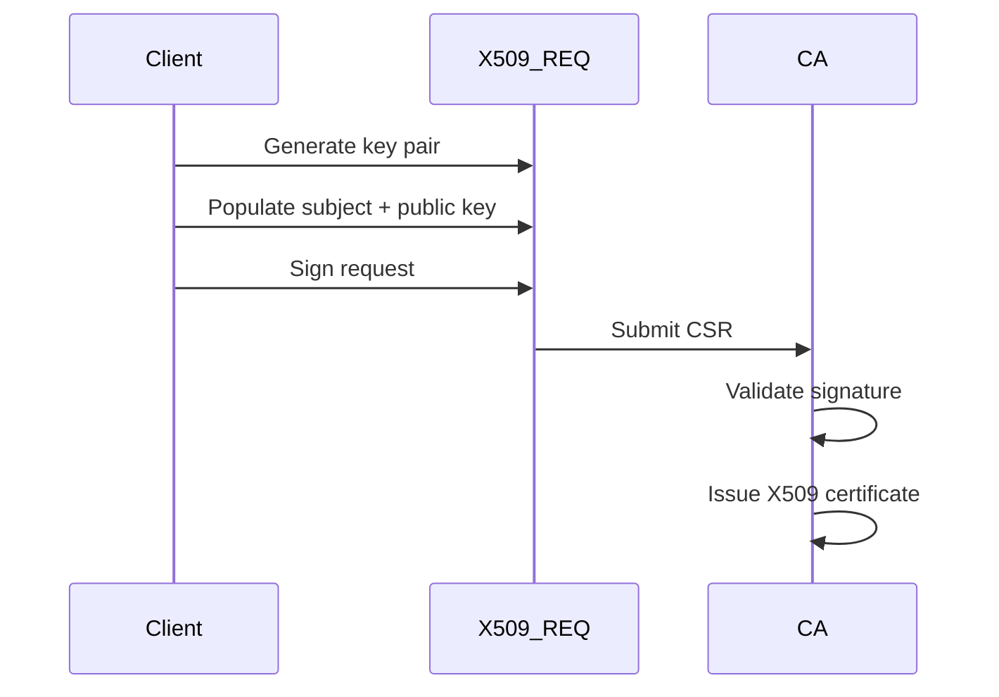
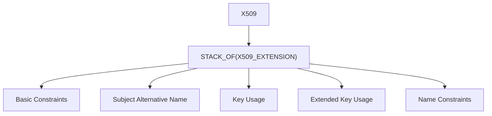
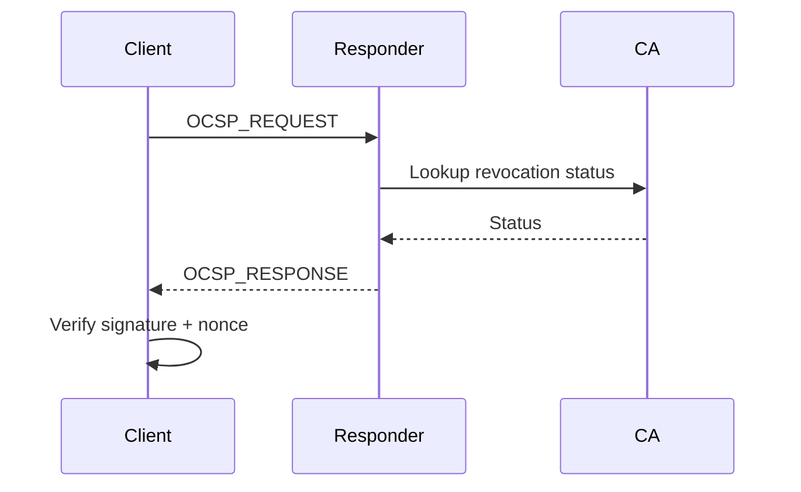
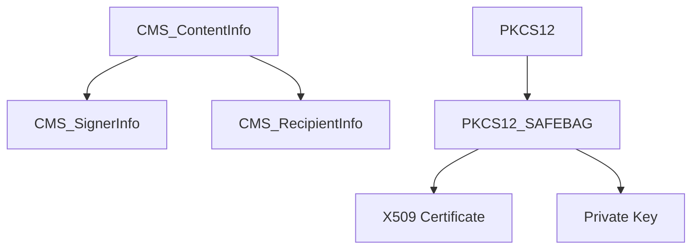
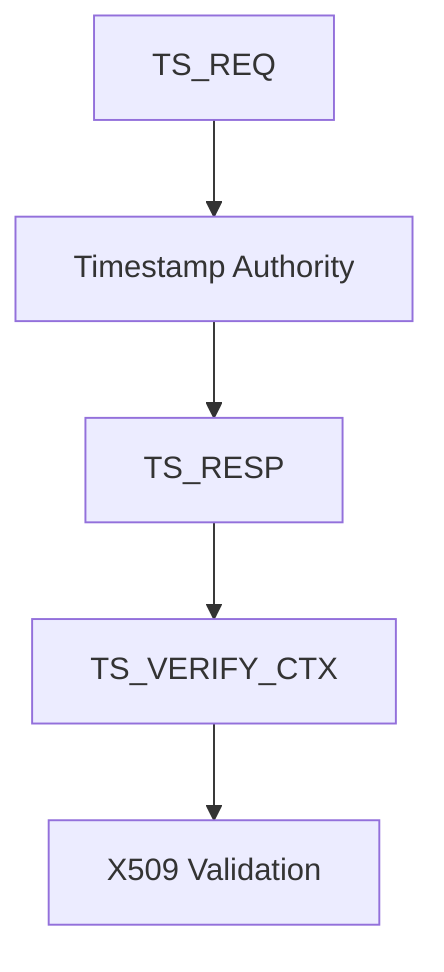
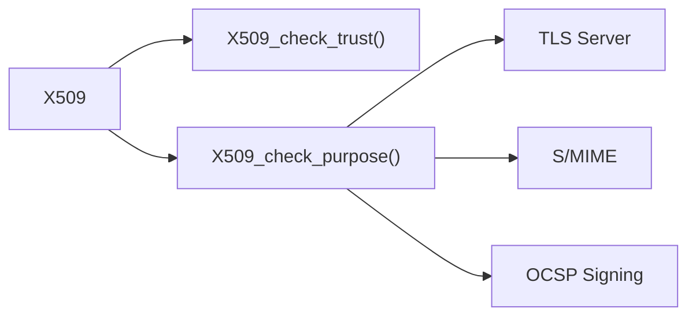

# X.509 And Certificate Management

The **X.509 And Certificate Management** module provides the full certificate lifecycle implementation for the OpenSSL integration inside MeshAgent. It defines the core ASN.1 structures, parsing logic, verification routines, and extension handling required to support:

- X.509 certificates (v1/v3)
- Certificate Signing Requests (CSR)
- Certificate Revocation Lists (CRL)
- Online Certificate Status Protocol (OCSP)
- CMS / PKCS#7 / PKCS#12 containers
- Time-Stamp Protocol (TSP)
- X.509v3 extensions and policy constraints

This module acts as the structural and semantic foundation for TLS, PKI validation, secure bootstrapping, identity verification, and encrypted communications across the platform.

---

## 1. Architectural Overview

At a high level, this module sits between the ASN.1 engine and higher-level TLS / CMS / OCSP consumers.

### Responsibilities

| Area | Responsibility |
|------|----------------|
| Core X.509 | Certificate parsing, encoding, validation |
| X.509v3 | Extension processing and policy constraints |
| CRL | Revocation list management |
| OCSP | Online revocation validation |
| CMS / PKCS | Signed and encrypted container handling |
| TS | Trusted timestamp validation |
| Trust Engine | Purpose checking and policy enforcement |

---

## 2. Core Certificate Structures

### 2.1 X509_CINF (Certificate Information)

`X509_CINF` represents the "To Be Signed" (TBS) certificate structure. It includes:

- Version
- Serial number
- Signature algorithm
- Issuer
- Validity (X509_VAL)
- Subject
- Subject public key
- Extensions (v3)

The `X509` object wraps `X509_CINF` and adds:

- Signature algorithm metadata
- Signature value
- Auxiliary trust data (`X509_CERT_AUX`)

---

### 2.2 X509_NAME and X509_NAME_ENTRY

Distinguished Names (DNs) are composed of multiple `X509_NAME_ENTRY` objects.

These structures enable:

- Issuer comparison
- Subject comparison
- Name hashing for certificate lookup

---

### 2.3 X509_VAL (Validity)

`X509_VAL` encapsulates:

- `notBefore`
- `notAfter`

Time comparison utilities such as `X509_cmp_time()` and `X509_cmp_current_time()` enforce certificate validity windows.

---

## 3. Certificate Signing Requests (CSR)

CSR handling is implemented using:

- `X509_REQ`
- `X509_REQ_INFO`

### CSR Flow

Key APIs:

- `X509_REQ_sign()`
- `X509_REQ_verify()`
- `X509_REQ_get_pubkey()`

---

## 4. X.509v3 Extension Engine

Extensions are represented by `X509_EXTENSION` and processed via `X509V3_EXT_METHOD`.

### Common Extensions

- `BASIC_CONSTRAINTS`
- `GENERAL_NAME`
- `POLICYINFO`
- `PROXY_CERT_INFO_EXTENSION`
- `NAME_CONSTRAINTS`

### Extension Context (v3_ext_ctx)

Provides runtime context for:

- Issuer certificate
- Subject certificate
- CRL
- Configuration database

This allows policy-aware extension validation.

---

## 5. Certificate Revocation Lists (CRL)

CRL structures include:

- `X509_CRL_INFO`
- `X509_REVOKED`

Key capabilities:

- Add revoked entries
- Verify CRL signature
- Check certificate against CRL
- Diff CRLs (`X509_CRL_diff()`)

---

## 6. OCSP (Online Certificate Status Protocol)

OCSP structures:

- `OCSP_CERTID`
- `OCSP_REQUEST`
- `OCSP_BASICRESP`
- `OCSP_SINGLERESP`

### OCSP Validation Flow

Capabilities:

- Nonce support
- Signature validation
- Revocation reason parsing
- Certificate ID comparison

---

## 7. CMS / PKCS#7 / PKCS#12 Integration

The module defines the certificate integration structures for:

- `CMS_ContentInfo`
- `PKCS7`
- `PKCS12`

Use cases:

- S/MIME signing
- Certificate bundling
- Encrypted key storage
- Secure provisioning

---

## 8. Time Stamp Protocol (TSP)

Time stamping support includes:

- `TS_REQ`
- `TS_TST_INFO`
- `TS_RESP`
- `TS_VERIFY_CTX`

### Timestamp Verification

Ensures:

- Message imprint integrity
- Trusted signing certificate
- Policy compliance

---

## 9. Trust and Purpose Engine

Trust logic is encapsulated in:

- `X509_TRUST`
- `X509_PURPOSE`

Trust IDs include:

- SSL client/server
- Email protection
- Code signing
- OCSP signing
- Timestamp signing

The engine evaluates:

- Key Usage bits
- Extended Key Usage
- Basic Constraints
- Policy constraints

---

## 10. Data Encoding and Serialization

The module provides:

- DER encoding (`i2d_*`)
- DER decoding (`d2i_*`)
- PEM read/write
- BIO-based streaming

Supported formats:

- PEM
- ASN.1 DER
- PKCS#8
- PKCS#12

---

## 11. Security Considerations

The module enforces:

- Signature validation via `X509_verify()`
- Certificate chain validation via `X509_verify_cert()`
- Revocation checking (CRL / OCSP)
- Name constraints enforcement
- Policy mapping validation
- Suite B and cryptographic strength checks

Critical extensions are honored and validated. Unsupported critical extensions cause verification failure.

---

## 12. How It Fits Into the System

The **X.509 And Certificate Management** module underpins:

- TLS authentication
- Remote identity verification
- Secure software distribution
- Agent-server trust establishment
- Signed configuration validation
- Encrypted credential storage

It provides the cryptographic identity layer on top of which secure communications are built.

---

# Summary

The **X.509 And Certificate Management** module is the structural heart of PKI functionality within the OpenSSL integration. It:

- Defines certificate and revocation data models
- Implements ASN.1 encoding/decoding
- Validates signatures and chains of trust
- Processes X.509v3 extensions and policies
- Integrates with OCSP, CMS, PKCS, and TSP

This module enables secure identity, trust establishment, and cryptographic validation across the entire platform.