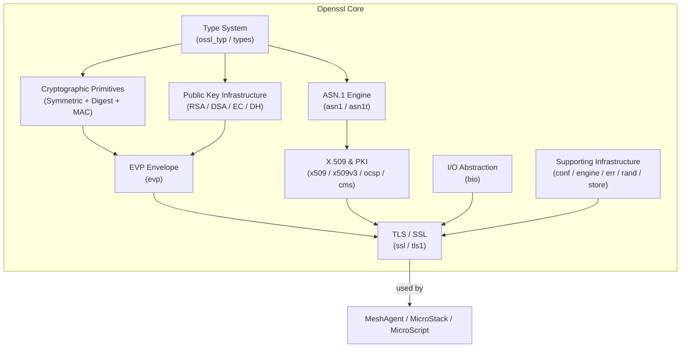

# Openssl Core

The Openssl Core module provides the complete OpenSSL 1.1.1f cryptographic library headers integrated into the MeshAgent platform. It exposes the full OpenSSL C API surface — symmetric ciphers, asymmetric key algorithms, digest functions, TLS/SSL protocol structures, certificate management, and supporting infrastructure — that underpins all secure communications, certificate validation, and cryptographic operations across the MeshAgent stack.

This module ships two parallel header trees:

| Tree | Path prefix | Purpose |
|---|---|---|
| **openssl-1.1.1f** | `openssl-1.1.1f/include/openssl/` | Pinned OpenSSL 1.1.1f headers used by the bundled build |
| **openssl-include** | `openssl/include/openssl/` | Symlinked / current headers consumed by the rest of the codebase |

Both trees expose the same logical API surface. The sub-module breakdown below applies equally to both.

---

## Architecture Overview



---

## Sub-modules

The Openssl Core module is organized into the following sub-modules, each documented in detail:

| Sub-module | Description |
|---|---|
| [Type System](openssl-core/type_system/type_system.md) | Forward declarations and opaque type aliases (`ossl_typ.h`) that form the shared vocabulary for all other headers — BIGNUM, EVP, RSA, DSA, EC, DH, SSL, X509, BIO, and more |
| [ASN.1 Engine](openssl-core/asn1_engine/asn1_engine.md) | DER/BER encoding and decoding framework (`asn1.h`, `asn1t.h`) including template machinery (`ASN1_ITEM`, `ASN1_TEMPLATE`, `ASN1_ADB`), string types, and codec helpers |
| [Symmetric Ciphers](openssl-core/symmetric_ciphers/symmetric_ciphers.md) | Block and stream cipher key structures: AES, Blowfish, Camellia, CAST, DES, IDEA, RC2/4/5, SEED, and authenticated-encryption mode contexts (GCM, CCM, OCB, XTS) |
| [Digest and MAC](openssl-core/digest_and_mac/digest_and_mac.md) | Hash algorithm contexts (MD2/4/5, MDC2, SHA-1/224/256/384/512, RIPEMD-160, Whirlpool) and MAC primitives (CMAC, HMAC) |
| [Public Key Infrastructure](openssl-core/public_key_infrastructure/public_key_infrastructure.md) | Asymmetric algorithm structures: RSA (PSS, OAEP), DSA, EC (groups, points, ECDSA), DH, SRP, and the EVP unified key interface |
| [X.509 and Certificate Management](openssl-core/x509_and_certificate_management/x509_and_certificate_management.md) | Certificate, CRL, and CSR structures; X.509v3 extensions; OCSP; CMS; PKCS#7, PKCS#12, and Time-Stamp Protocol |
| [TLS and SSL](openssl-core/tls_and_ssl/tls_and_ssl.md) | SSL/TLS session, context, cipher, and method structures; DTLS; SRTP profiles; async job support (`ASYNC_JOB`, `ASYNC_WAIT_CTX`) |
| [BIO and IO](openssl-core/bio_and_io/bio_and_io.md) | Pluggable I/O abstraction layer (`bio.h`) including network, file, memory, SCTP datagram, and filter BIOs; dynamic buffer (`buf_mem_st`) |
| [Supporting Infrastructure](openssl-core/supporting_infrastructure/supporting_infrastructure.md) | Configuration (`conf.h`), error handling (`err.h`), random number generation (`rand.h`), engine framework (`engine.h`), object store (`store.h`), LHASH, stack, object registry, TXT_DB, UI abstraction, and threading utilities |

---

## Key Design Patterns

### Opaque Struct / Typedef Pattern

OpenSSL consistently separates the public typedef from the private struct definition. Consumer code uses only the typedef; the struct body is defined in internal headers or in the implementation `.c` files:

```c
/* Public API — consumers see only the typedef */
typedef struct ssl_st SSL;
typedef struct ssl_ctx_st SSL_CTX;

/* Internal — struct body defined in ssl_local.h */
struct ssl_st { ... };
```

This pattern appears throughout `ossl_typ.h` / `types.h` and is the reason most structures in this module are listed as both a `typedef` alias and a `_st` struct.

### EVP Envelope

The `EVP_*` family (`EVP_CIPHER`, `EVP_MD`, `EVP_PKEY`, `EVP_PKEY_CTX`, …) provides algorithm-agnostic wrappers over all cipher, digest, and key operations. Higher-level code (TLS, CMS, PKCS#12) always goes through EVP rather than calling algorithm-specific functions directly.

### ASN.1 Template Engine

`asn1t.h` defines a macro-driven template system (`ASN1_SEQUENCE`, `ASN1_CHOICE`, `ASN1_ITEM_st`, …) that auto-generates DER encode/decode functions for any C struct. All X.509 and CMS structures are built on top of this engine.

### BIO Chain

BIO objects can be chained (filter BIOs wrapping source/sink BIOs), enabling transparent layering of buffering, base64 encoding, SSL encryption, and compression over any underlying transport.

---

## Integration with MeshAgent

The Openssl Core module is consumed by several other modules in the MeshAgent platform:

- **Microstack Core** — uses `util_cert` (wrapping `X509` / `EVP_PKEY`) for TLS handshakes in `ILibCrypto`, `ILibWebClient`, `ILibWebServer`, and `ILibWebRTC`. See the [Microstack Core](../microstack-core/microstack-core.md) documentation.
- **MicroScript (Duktape bindings)** — exposes OpenSSL digest and signing operations to JavaScript via `ILibDuktape_SHA256`, `ILibDuktape_net`, and `ILibDuktape_WebRTC`. See the [Microscript Duk](../microscript-duk/microscript-duk.md) documentation.
- **MeshCore Agent** — uses `util_cert` for agent authentication (`MeshCommand_BinaryPacket_AuthInfo`, `signcheck`). See the [Meshcore Agent](../meshcore-agent/meshcore-agent.md) documentation.
- **MeshCore KVM (Linux)** — uses `jpeg_compress_struct` / `jpeg_destination_mgr` from the companion [Jpeg Turbo Core](../jpeg-turbo-core/jpeg-turbo-core.md) module for screen capture compression.

---

## Source Locations

| File | GitHub |
|---|---|
| `openssl-1.1.1f/include/openssl/aes.h` | [View](https://github.com/flamingo-stack/meshagent/blob/main/openssl-1.1.1f/include/openssl/aes.h) |
| `openssl-1.1.1f/include/openssl/ssl.h` | [View](https://github.com/flamingo-stack/meshagent/blob/main/openssl-1.1.1f/include/openssl/ssl.h) |
| `openssl-1.1.1f/include/openssl/x509.h` | [View](https://github.com/flamingo-stack/meshagent/blob/main/openssl-1.1.1f/include/openssl/x509.h) |
| `openssl-1.1.1f/include/openssl/evp.h` | [View](https://github.com/flamingo-stack/meshagent/blob/main/openssl-1.1.1f/include/openssl/evp.h) |
| `openssl-1.1.1f/include/openssl/ossl_typ.h` | [View](https://github.com/flamingo-stack/meshagent/blob/main/openssl-1.1.1f/include/openssl/ossl_typ.h) |

For the full repository, visit: https://github.com/flamingo-stack/meshagent

---

## Community and Support

Questions and discussions are managed on the **OpenMSP Slack community**:
https://www.openmsp.ai/
