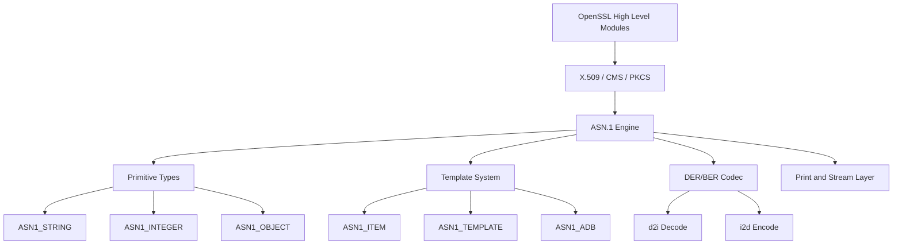
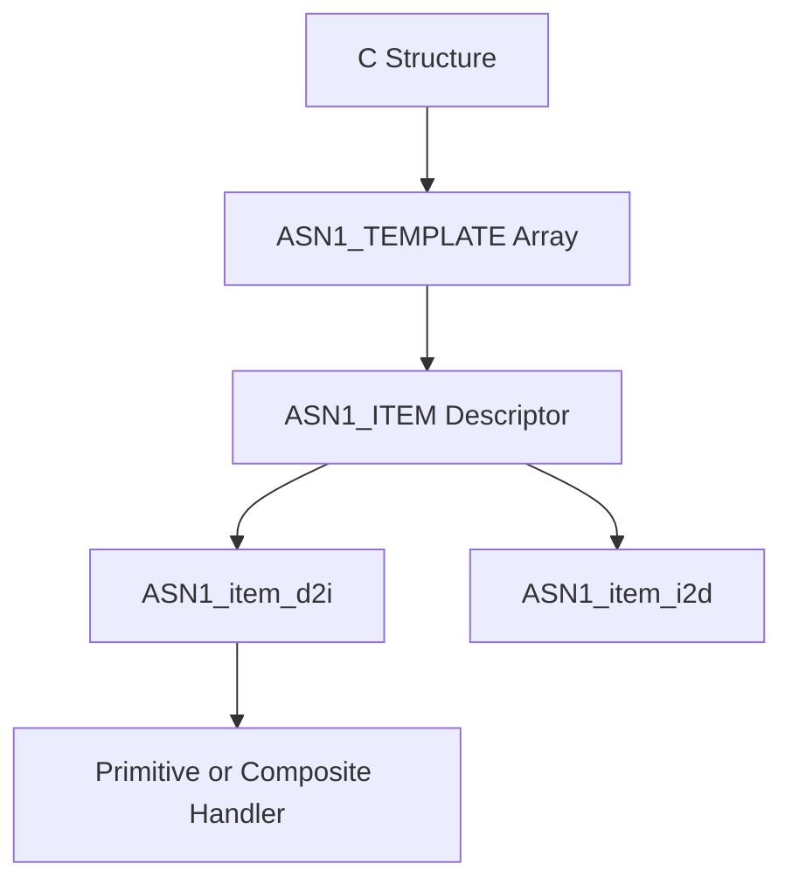
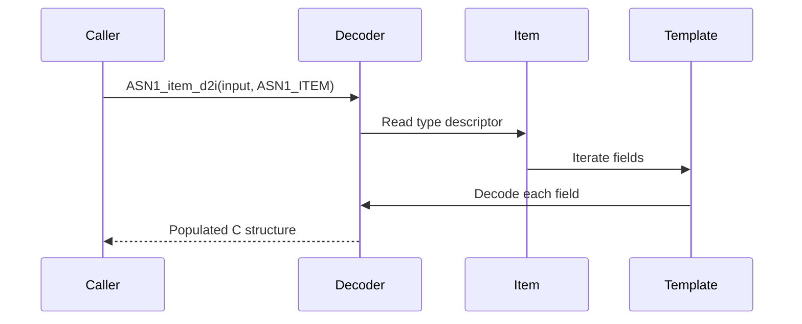

# ASN.1 Engine

The **ASN.1 Engine** sub-module provides the core Abstract Syntax Notation One (ASN.1) type system, template framework, and DER/BER encoding–decoding machinery used throughout OpenSSL within MeshAgent. It underpins X.509, CMS, PKCS#7/#12, OCSP, and many other cryptographic data structures by defining how complex objects are described, serialized, parsed, and validated.

Source files:

```text
openssl-1.1.1f/include/openssl/asn1.h
openssl-1.1.1f/include/openssl/asn1t.h
```

---

## Architectural Overview

At a high level, the ASN.1 Engine consists of:

- **Primitive Types** — INTEGER, BIT STRING, OCTET STRING, TIME, etc.
- **Generic Container Types** — `ASN1_TYPE`, `ASN1_STRING`, `ASN1_OBJECT`
- **Template System** — `ASN1_ITEM`, `ASN1_TEMPLATE`, `ASN1_ADB`
- **Encoding/Decoding Core** — `ASN1_item_d2i`, `ASN1_item_i2d`
- **Printing and Streaming** — `ASN1_item_print`, NDEF streaming helpers



The ASN.1 Engine acts as a meta-framework: higher-level modules define structures using macros from `asn1t.h`, which are compiled into `ASN1_ITEM` descriptors. The generic codec then uses these descriptors to serialize and deserialize data.

---

## Core Data Structures

### ASN1_STRING (`asn1_string_st`)

Represents a generic ASN.1 string-like object.

Key fields:
- `length` — Number of bytes
- `type` — Tag (e.g., `V_ASN1_UTF8STRING`)
- `data` — Raw encoded value
- `flags` — Encoding hints (e.g., NDEF, embedded, time format)

Used for: UTF8String, IA5String, BMPString, OCTET STRING, BIT STRING, and time types (UTCTIME, GENERALIZEDTIME).

### ASN1_ENCODING (`ASN1_ENCODING_st`)

Stores cached DER encoding for structures (e.g., for signature validation):

- `enc` — Original DER bytes
- `len` — Length
- `modified` — Marks invalidation if structure changed

Critical for signature verification (must preserve original encoding) and X.509 certificate validation.

### ASN1_STRING_TABLE (`asn1_string_table_st`)

Defines constraints for string types by NID:

- `nid` — Object identifier
- `minsize`, `maxsize` — Length bounds
- `mask`, `flags` — Encoding constraints

### BIT_STRING_BITNAME (`BIT_STRING_BITNAME_st`)

Maps named bits in a BIT STRING to their positions:

- `bitnum` — Bit position
- `lname` — Long name
- `sname` — Short name

---

## Template System (asn1t.h)

The template system allows C structures to be declaratively mapped to ASN.1 definitions.

### ASN1_ITEM (`ASN1_ITEM_st`)

Defines a complete ASN.1 type descriptor:

- `itype` — Primitive, SEQUENCE, CHOICE, EXTERN, MSTRING, NDEF_SEQUENCE
- `utype` — Underlying tag or mask
- `templates` — Field definitions
- `tcount` — Number of templates
- `funcs` — Custom handlers (optional)
- `size` — C structure size
- `sname` — Structure name

### ASN1_TEMPLATE (`ASN1_TEMPLATE_st`)

Describes a single field in a SEQUENCE or CHOICE:

- `flags` — Tagging mode (IMPLICIT, EXPLICIT), OPTIONAL, SET OF, SEQUENCE OF
- `tag` — Tag value
- `offset` — Offset in C structure
- `field_name` — Field name string
- `item` — Associated `ASN1_ITEM`

### ASN1_ADB (`ASN1_ADB_st`) and ASN1_ADB_TABLE (`ASN1_ADB_TABLE_st`)

Supports dynamic type resolution based on OID or integer selector. Used heavily in AlgorithmIdentifier, CMS, and PKCS structures.

### ASN1_AUX (`ASN1_AUX_st`)

Provides miscellaneous customization for SEQUENCE types:

- Reference counting support
- Encoding caching
- Informational callbacks

### ASN1_EXTERN_FUNCS (`ASN1_EXTERN_FUNCS_st`)

Callback table for externally implemented types:

- `asn1_ex_new`, `asn1_ex_free`, `asn1_ex_clear`
- `asn1_ex_d2i`, `asn1_ex_i2d`
- `asn1_ex_print`

### ASN1_PRIMITIVE_FUNCS (`ASN1_PRIMITIVE_FUNCS_st`)

Callback table for custom primitive types:

- `prim_new`, `prim_free`, `prim_clear`
- `prim_c2i`, `prim_i2c`, `prim_print`

### ASN1_PRINT_ARG (`ASN1_PRINT_ARG_st`) and ASN1_STREAM_ARG (`ASN1_STREAM_ARG_st`)

Context structures passed to print and streaming callbacks.

### ASN1_TLC (`ASN1_TLC_st`)

Cache for ASN.1 tag and length to avoid repeated parsing:

- `valid` — Cache validity flag
- `ret`, `plen`, `ptag`, `pclass`, `hdrlen`

---

## Template Resolution Flow



---

## Encoding and Decoding Pipeline

The ASN.1 Engine provides generic functions:

- `ASN1_item_d2i` — Decode DER/BER to C structure
- `ASN1_item_i2d` — Encode structure to DER
- `ASN1_item_ndef_i2d` — Indefinite-length encoding (streaming)

### Decode Sequence



---

## Primitive Type Support

Implemented primitives include:

- `ASN1_INTEGER`, `ASN1_ENUMERATED`
- `ASN1_BIT_STRING`, `ASN1_OCTET_STRING`
- `ASN1_OBJECT`
- `ASN1_TIME`, `ASN1_UTCTIME`, `ASN1_GENERALIZEDTIME`

Conversion helpers:
- `ASN1_INTEGER_to_BN`
- `ASN1_STRING_to_UTF8`
- `ASN1_TIME_to_tm`

---

## Streaming and NDEF Encoding

For large content (e.g., CMS signed data):

- Indefinite-length encoding is supported
- Streaming via BIO filters
- Boundary-aware encoding

Functions:
- `BIO_new_NDEF`
- `SMIME_write_ASN1`
- `i2d_ASN1_bio_stream`

This enables processing of large signed payloads without buffering entire content in memory.

---

## Design Characteristics

- **Descriptor-Driven Architecture** — All encoding and decoding is driven by `ASN1_ITEM` descriptors, avoiding per-structure custom parsing logic.
- **Separation of Concerns** — `asn1.h` provides public primitives and APIs; `asn1t.h` provides the template metaprogramming layer.
- **Backward Compatibility** — Supports DER, BER, indefinite-length encoding, and legacy compatibility modes.

---

## Related Sub-modules

- [Type System](../type_system/type_system.md)
- [X.509 and Certificate Management](../x509_and_certificate_management/x509_and_certificate_management.md)
- [Public Key Infrastructure](../public_key_infrastructure/public_key_infrastructure.md)
- [Digest and MAC](../digest_and_mac/digest_and_mac.md)

Parent: [Openssl Core](../../openssl-core.md)
