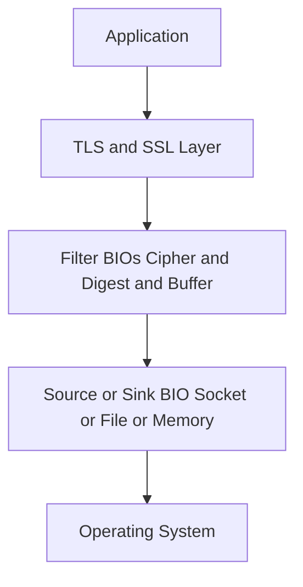
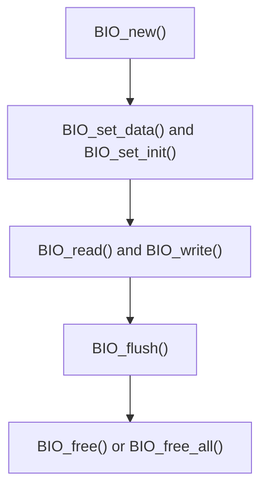
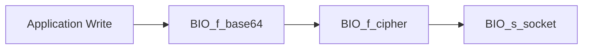
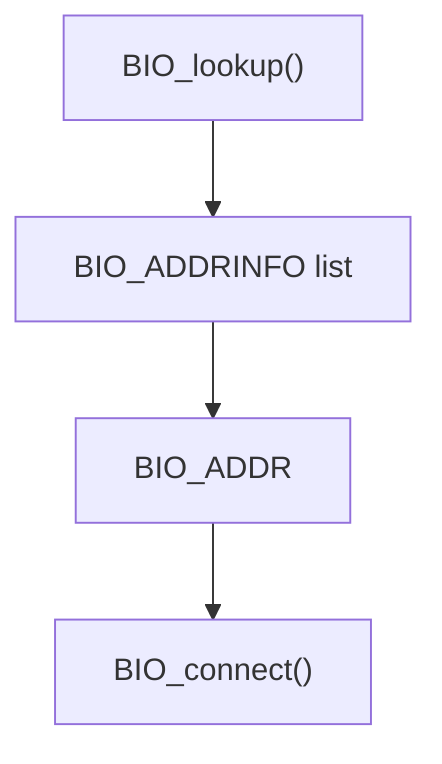
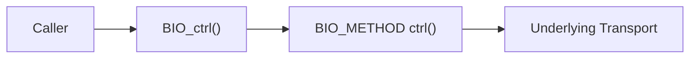
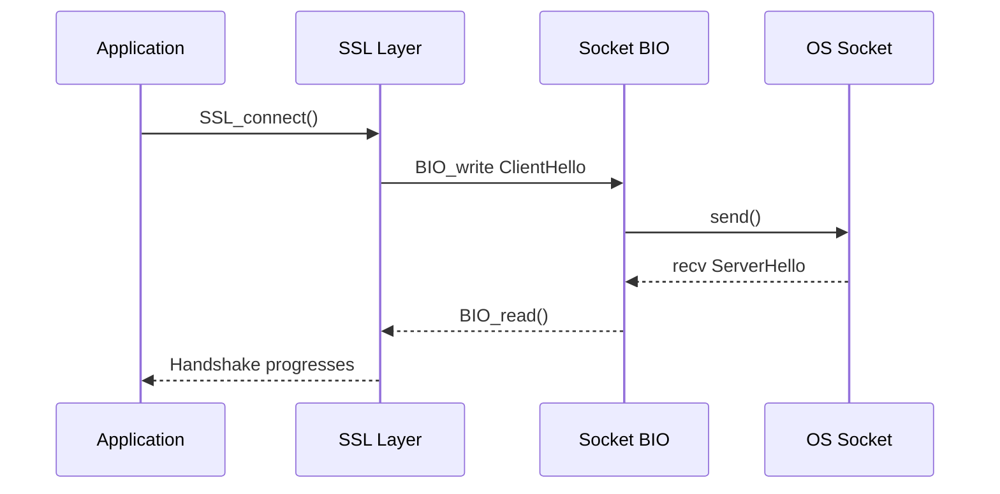

# BIO and IO

The **BIO and IO** sub-module provides OpenSSL's abstraction layer for input/output operations. It is built around the BIO (Basic Input/Output) framework, which unifies file, memory, socket, datagram, and filter-based I/O under a common interface.

This sub-module is the foundation for how TLS, cryptographic filters, and higher-level protocols interact with operating system resources without being tightly coupled to platform-specific APIs.

Source files:

```text
openssl-1.1.1f/include/openssl/bio.h
openssl-1.1.1f/include/openssl/buffer.h
```

---

## Architectural Overview



### BIO Classes

OpenSSL defines three BIO class categories:

- **Descriptor BIOs** — Wrap OS-level handles (sockets, file descriptors)
- **Source/Sink BIOs** — Data endpoints (memory, file, socket)
- **Filter BIOs** — Transform data (SSL, base64, buffer, cipher)

---

## Core Structures

### BIO_METHOD (`bio_method_st`)

Describes the behavior of a BIO type via function pointers:

- Read / Read_ex
- Write / Write_ex
- Gets / Puts
- Ctrl
- Create / Destroy
- Callback control

Custom BIO types are created using `BIO_meth_new()`, `BIO_meth_set_write()`, `BIO_meth_set_read()`, `BIO_meth_set_ctrl()`.

### BIO Object Lifecycle



Key lifecycle functions: `BIO_new()`, `BIO_free()`, `BIO_up_ref()`, `BIO_push()` / `BIO_pop()` (stacking), `BIO_free_all()`.

### BIO_ADDRINFO (`bio_addrinfo_st`)

Linked-list style result from DNS lookups. Used by connect and accept BIO implementations.

### SCTP Structures

For DTLS-over-SCTP support:

- `bio_dgram_sctp_sndinfo` — SCTP send info (sid, flags, ppid, context)
- `bio_dgram_sctp_rcvinfo` — SCTP receive info (sid, ssn, flags, ppid, tsn, cumtsn, context)
- `bio_dgram_sctp_prinfo` — SCTP partial reliability info (pr_policy, pr_value)

### buf_mem_st (BUF_MEM)

Dynamic memory buffer used by memory BIOs:

```text
struct buf_mem_st {
    size_t length;
    char *data;
    size_t max;
    unsigned long flags;
};
```

Key behaviors: dynamic growth via `BUF_MEM_grow()`, secure memory support (`BUF_MEM_FLAG_SECURE`), optional zeroing on resize.

---

## BIO Chaining (Filter Architecture)

BIOs can be stacked to create transformation pipelines.



This design decouples cryptographic operations from transport.

---

## Built-in BIO Types

### Memory BIO

- `BIO_s_mem()`, `BIO_new_mem_buf()`, `BIO_get_mem_data()`
- Used for in-memory TLS, testing, and non-network crypto pipelines
- Internally uses `buf_mem_st`

### File BIO

- `BIO_s_file()`, `BIO_new_file()`, `BIO_set_fp()`
- Wraps `FILE *` or file descriptors

### Socket BIO

- `BIO_s_socket()`, `BIO_new_socket()`, `BIO_set_fd()`
- Handles TCP connections and integrates with TLS state machines

### Connect and Accept BIOs

- `BIO_s_connect()`, `BIO_s_accept()`, `BIO_do_connect()`, `BIO_do_accept()`
- Provide hostname parsing and socket lifecycle management

### Datagram and SCTP BIO

- `BIO_s_datagram()`, `BIO_s_datagram_sctp()`
- Critical for DTLS and advanced transport behaviors

---

## Address Abstraction

### BIO_ADDR

Encapsulates raw socket addresses. Capabilities: IPv4/IPv6 support, raw address extraction, port retrieval, host/service string generation.

### BIO_ADDRINFO (`bio_addrinfo_st`)



---

## Control Interface (BIO_ctrl)

The BIO control API enables extensible command-based interaction.

Examples: `BIO_CTRL_RESET`, `BIO_CTRL_FLUSH`, `BIO_CTRL_PENDING`, `BIO_CTRL_SET_CLOSE`, `BIO_CTRL_DGRAM_CONNECT`.



---

## Retry and Non-Blocking Behavior

BIOs support non-blocking I/O and retry signaling.

Important flags: `BIO_FLAGS_READ`, `BIO_FLAGS_WRITE`, `BIO_FLAGS_SHOULD_RETRY`.

Common pattern:
1. `BIO_read()` returns ≤ 0
2. Check `BIO_should_retry()`
3. Retry based on `BIO_should_read()` or `BIO_should_write()`

---

## Data Flow Example: TLS Handshake Over TCP



---

## Design Principles

- **Abstraction First** — No direct socket/file calls in higher layers
- **Composable Pipelines** — BIO chaining enables flexible processing
- **Extensible** — Custom BIO methods supported
- **Transport-Agnostic TLS** — TLS works over memory, files, sockets, SCTP
- **Retry-Aware** — Built-in non-blocking semantics

---

## Related Sub-modules

- [TLS and SSL](../tls_and_ssl/tls_and_ssl.md)
- [Digest and MAC](../digest_and_mac/digest_and_mac.md)
- [Symmetric Ciphers](../symmetric_ciphers/symmetric_ciphers.md)

Parent: [Openssl Core](../../openssl-core.md)
