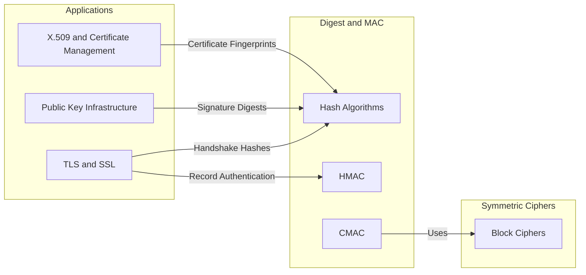
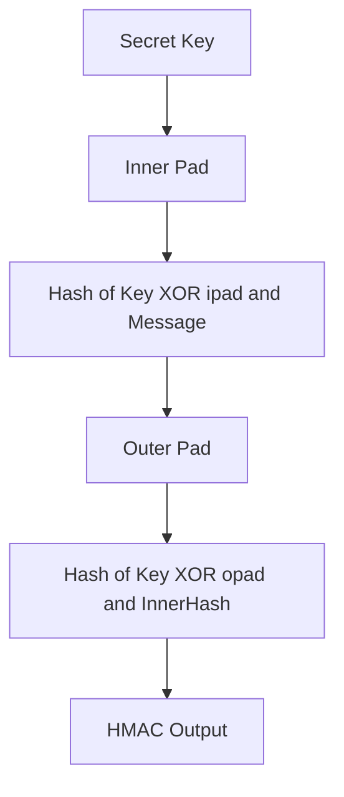
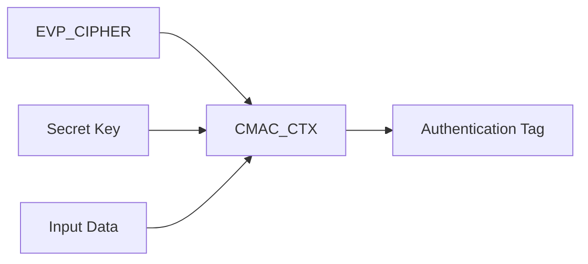
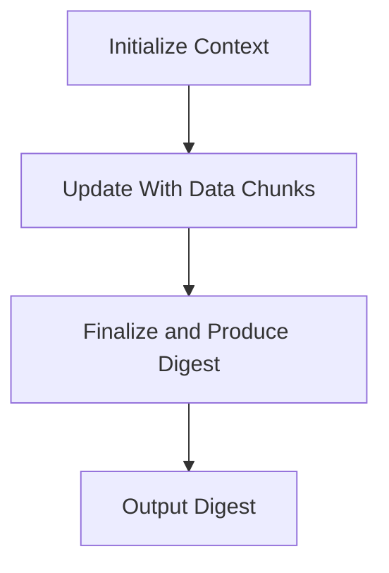

# Digest and MAC

The **Digest and MAC** sub-module provides message digest (hash) algorithms and message authentication code (MAC) primitives used throughout the OpenSSL integration in MeshAgent. It exposes low-level context structures and streaming APIs for computing cryptographic hashes (MD2, MD4, MD5, SHA family, RIPEMD-160, MDC2, Whirlpool) and MACs (HMAC and CMAC).

This sub-module is a foundational building block for TLS handshakes, certificate validation, digital signatures, integrity verification, and secure key derivation.

---

## Architectural Context

---

## Supported Hash Algorithms

### MD2 — `MD2_CTX` / `MD2state_st`

- Digest length: 16 bytes, block size: 16 bytes
- Fields: `num`, `data[16]`, `cksm[16]`, `state[16]`
- API: `MD2_Init()`, `MD2_Update()`, `MD2_Final()`, `MD2()`

> MD2 is cryptographically broken and retained only for legacy compatibility.

---

### MD4 — `MD4_CTX` / `MD4state_st`

- Digest length: 16 bytes, block size: 64 bytes
- State: 4-word chaining variables `A, B, C, D`; bit counters `Nl, Nh`; data buffer `data[16]`
- API: `MD4_Init()`, `MD4_Update()`, `MD4_Final()`, `MD4_Transform()`

> MD4 is insecure and provided only for legacy protocol compatibility.

---

### MD5 — `MD5_CTX` / `MD5state_st`

- Digest length: 16 bytes, block size: 64 bytes
- Internal layout mirrors MD4 with a different compression function
- API: `MD5_Init()`, `MD5_Update()`, `MD5_Final()`, `MD5_Transform()`

> MD5 is collision-broken and should not be used for security-critical applications.

---

### MDC2 — `MDC2_CTX` / `mdc2_ctx_st`

- Digest length: 16 bytes, block size: 8 bytes
- Fields: `num`, `data[8]`, `h`, `hh` (DES cblocks), `pad_type`
- API: `MDC2_Init()`, `MDC2_Update()`, `MDC2_Final()`

---

### SHA-1 — `SHA_CTX` / `SHAstate_st`

- Digest length: 20 bytes
- State: `h0..h4`, `Nl`, `Nh`, `data[16]`
- API: `SHA1_Init()`, `SHA1_Update()`, `SHA1_Final()`

> SHA-1 is deprecated for collision resistance but still appears in legacy signatures.

---

### SHA-224 / SHA-256 — `SHA256_CTX` / `SHA256state_st`

- Digest length: 28 / 32 bytes
- State: `h[8]`, `Nl`, `Nh`, `data[16]`, `num`, `md_len`
- API: `SHA224_Init()` / `SHA256_Init()`, `Update()`, `Final()`

Widely used in TLS, certificate signatures, code signing, and HMAC constructions.

---

### SHA-384 / SHA-512 — `SHA512_CTX` / `SHA512state_st`

- Digest length: 48 / 64 bytes
- Uses 64-bit state (`SHA_LONG64`), 1024-bit block size, 8-word state array
- API: `SHA384_Init()` / `SHA512_Init()`, `Update()`, `Final()`

Used in high-security environments and modern TLS configurations.

---

### RIPEMD-160 — `RIPEMD160_CTX` / `RIPEMD160state_st`

- Digest length: 20 bytes
- State: five-word `A, B, C, D, E`; bit counters; block buffer
- API: `RIPEMD160_Init()`, `RIPEMD160_Update()`, `RIPEMD160_Final()`

Primarily used in legacy or blockchain-related systems.

---

### Whirlpool — `WHIRLPOOL_CTX`

- Digest length: 64 bytes (512-bit)
- Block size: 512 bits, counter: 256 bits
- API: `WHIRLPOOL_Init()`, `WHIRLPOOL_Update()`, `WHIRLPOOL_Final()`

---

## Message Authentication Codes (MAC)

### HMAC — `HMAC_CTX` / `hmac_ctx_st`

HMAC combines a cryptographic hash function with a secret key using inner and outer padding constructions.

Used extensively in TLS record authentication, token signing, API request signing, and integrity verification.

---

### CMAC — `CMAC_CTX` / `CMAC_CTX_st`

CMAC is a block-cipher-based MAC defined over symmetric ciphers.

Key APIs: `CMAC_CTX_new()`, `CMAC_CTX_free()`, `CMAC_Init()`, `CMAC_Update()`, `CMAC_Final()`

Used in hardware security modules, embedded secure systems, and AES-based authentication schemes.

---

## Common Processing Pattern

All digest implementations follow the same streaming lifecycle:

This enables large file hashing, streaming network verification, and incremental TLS handshake hashing.

---

## Security Considerations

| Algorithm | Status | Recommendation |
|---|---|---|
| MD2 | Broken | Do not use |
| MD4 | Broken | Do not use |
| MD5 | Collision-broken | Avoid |
| SHA-1 | Deprecated | Avoid for new designs |
| SHA-256 | Secure | Recommended |
| SHA-384/512 | Secure | Recommended |
| RIPEMD-160 | Legacy | Use cautiously |
| Whirlpool | Secure | Acceptable but uncommon |
| HMAC-SHA256 | Secure | Recommended |
| CMAC-AES | Secure | Recommended |

---

## Related Sub-modules

- [Symmetric Ciphers](../symmetric_ciphers/symmetric_ciphers.md)
- [Public Key Infrastructure](../public_key_infrastructure/public_key_infrastructure.md)
- [X.509 and Certificate Management](../x509_and_certificate_management/x509_and_certificate_management.md)
- [TLS and SSL](../tls_and_ssl/tls_and_ssl.md)

Parent: [Openssl Core](../../openssl-core.md)
