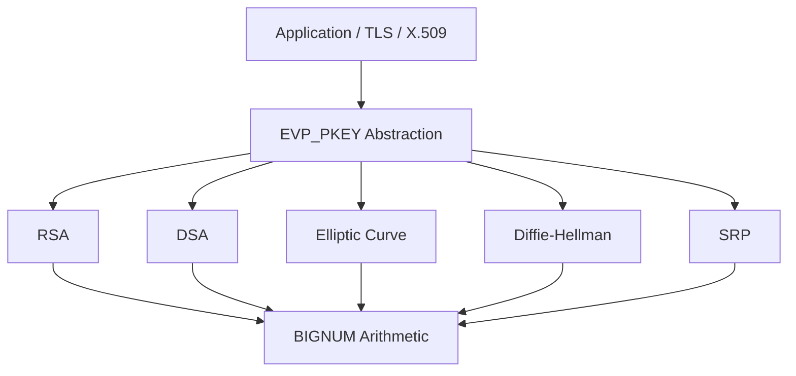
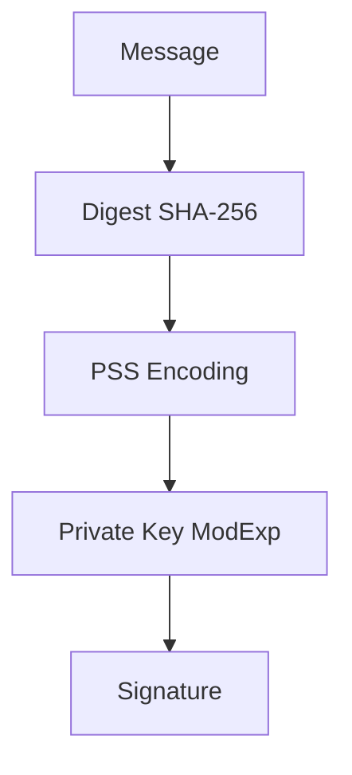
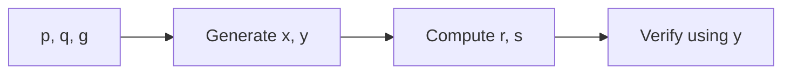
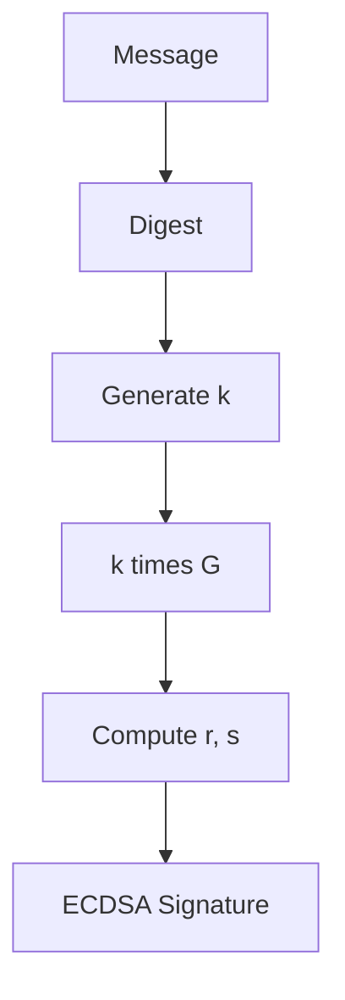
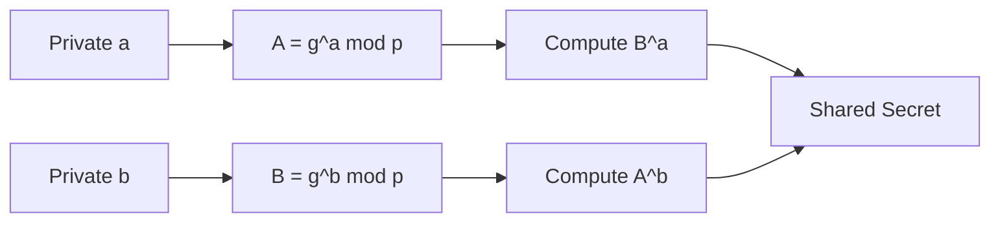
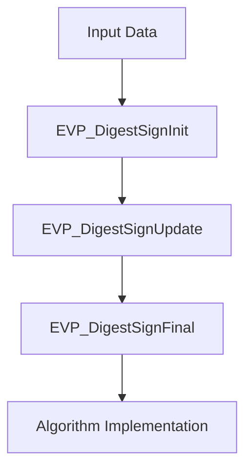

# Public Key Infrastructure

The **Public Key Infrastructure** sub-module provides the asymmetric cryptography foundation for OpenSSL within MeshAgent. It implements RSA, DSA, Elliptic Curve (EC), Diffie–Hellman (DH), and Secure Remote Password (SRP) primitives, along with the method abstraction layers used by the high-level EVP framework.

This sub-module is responsible for public/private key generation and validation, digital signatures (RSA, DSA, ECDSA), public key encryption (RSA), key exchange (DH, ECDH, SRP), and algorithm abstraction via `EVP_PKEY` and method tables.

---

## Architectural Overview

---

## RSA Subsystem

### Core Structures

- `rsa_st` — Core RSA key structure (n, e, d, p, q, CRT parameters)
- `rsa_meth_st` — Pluggable RSA implementation (function pointers for encrypt, decrypt, sign, verify, keygen)
- `rsa_pss_params_st` — RSASSA-PSS parameters (hashAlgorithm, maskGenAlgorithm, saltLength, trailerField)
- `rsa_oaep_params_st` — RSA-OAEP parameters (hashFunc, maskGenFunc, pSourceFunc)

### Capabilities

- Key generation (`RSA_generate_key_ex`), multi-prime RSA
- PKCS#1 v1.5 and PSS signatures
- OAEP encryption
- CRT optimization and blinding (`BN_BLINDING` / `bn_blinding_st`)
- Montgomery context (`BN_MONT_CTX` / `bn_mont_ctx_st`)
- Reciprocal context (`BN_RECP_CTX` / `bn_recp_ctx_st`)

### RSA Signing Flow (PSS)

---

## DSA Subsystem

### Core Structures

- `dsa_st` — Key and parameters (p, q, g, pub_key, priv_key)
- `DSA_SIG_st` — Signature container (r, s)
- `dsa_method` — Method table

### Capabilities

- Parameter generation (`DSA_generate_parameters_ex`)
- Key generation (`DSA_generate_key`)
- Signature generation and verification

---

## Elliptic Curve Subsystem

### Core Structures

- `EC_METHOD` / `ec_method_st` — Curve arithmetic implementation (field operations, point arithmetic)
- `EC_GROUP` / `ec_group_st` — Curve definition (field, generator, order, cofactor)
- `EC_POINT` / `ec_point_st` — Point on curve (projective or affine coordinates)
- `ec_key_st` — EC key pair (group, private key, public key)
- `ECDSA_SIG_st` — ECDSA signature (r, s)
- `ECPARAMETERS` / `ec_parameters_st` — Explicit curve parameters
- `ECPKPARAMETERS` / `ecpk_parameters_st` — Named or explicit curve encoding
- `EC_builtin_curve` — Built-in curve descriptor (nid, comment)

### Supported Operations

- ECDSA signing and verification
- ECDH key agreement
- Curve parameter encoding (named or explicit)
- Built-in curves (P-256, P-384, P-521, etc.)

### ECDSA Signing Flow

---

## Diffie–Hellman (DH) and Key Exchange

### Core Structures

- `dh_st` — DH parameters and key material (p, g, pub_key, priv_key)
- `dh_method` — Implementation abstraction

---

## Secure Remote Password (SRP)

### Core Structures

- `SRP_VBASE_st` — Verifier database (users_pwd, gN_cache, seed_key, default_g, default_N)
- `SRP_user_pwd_st` — User record (id, s, v, g, N, info)
- `SRP_gN_st` — Group parameters (id, g, N)
- `SRP_gN_cache_st` — Cached group parameters (b64_bn, bn)

SRP is primarily used in secure authentication flows and optionally integrated into TLS-SRP modes.

---

## EVP Integration Layer

The EVP layer abstracts algorithm-specific logic behind a uniform interface.

### Key Abstractions

- `EVP_PKEY` / `evp_pkey_st` — Generic public/private key container
- `EVP_PKEY_CTX` / `evp_pkey_ctx_st` — Operation context
- `EVP_PKEY_METHOD` / `evp_pkey_method_st` — Operation dispatch table (sign, verify, encrypt, decrypt, derive, keygen)
- `EVP_PKEY_ASN1_METHOD` / `evp_pkey_asn1_method_st` — Encoding/decoding handlers

### Generic Sign Flow

---

## ASN.1 and Parameter Encoding

Many public key structures are encoded in ASN.1 for interoperability:

- `RSA_PSS_PARAMS` / `rsa_pss_params_st`
- `ECPARAMETERS` and `ECPKPARAMETERS`
- DSA and DH parameter encodings

Encoding and decoding are handled in cooperation with the [ASN.1 Engine](../asn1_engine/asn1_engine.md).

---

## Security and Compliance Features

- Constant-time exponentiation
- Blinding (`BN_BLINDING`)
- FIPS method flags (`RSA_FLAG_FIPS_METHOD`, `DSA_FLAG_FIPS_METHOD`)
- Key validation (`RSA_check_key`, `EC_KEY_check_key`)
- Security strength reporting (`EVP_PKEY_security_bits`)

---

## Related Sub-modules

- [Type System](../type_system/type_system.md)
- [ASN.1 Engine](../asn1_engine/asn1_engine.md)
- [Digest and MAC](../digest_and_mac/digest_and_mac.md)
- [X.509 and Certificate Management](../x509_and_certificate_management/x509_and_certificate_management.md)
- [TLS and SSL](../tls_and_ssl/tls_and_ssl.md)

Parent: [Openssl Core](../../openssl-core.md)
