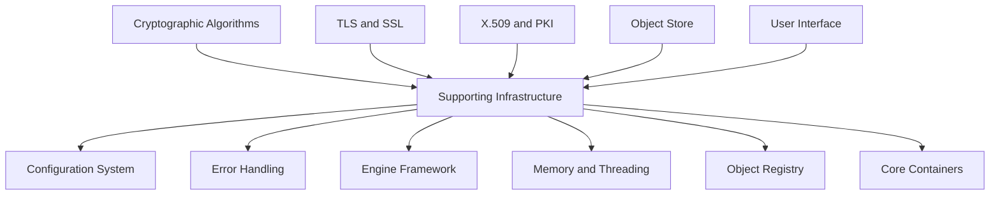
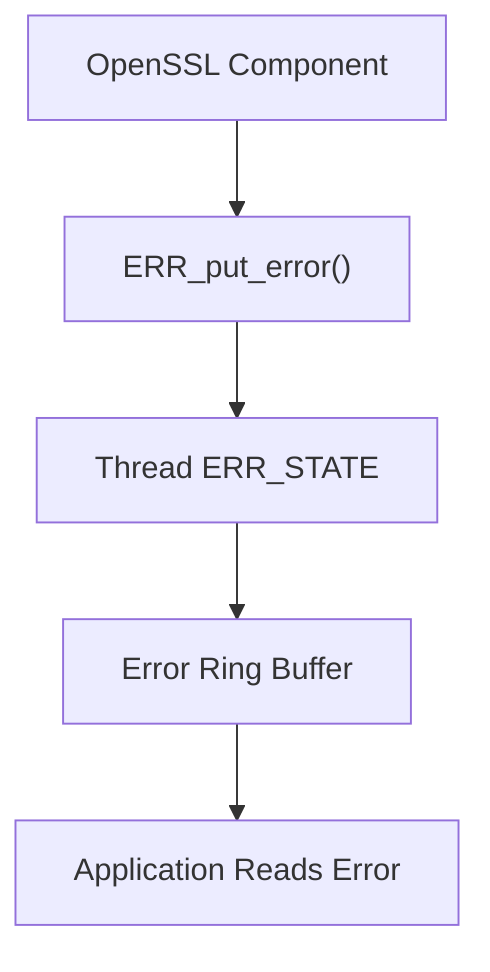
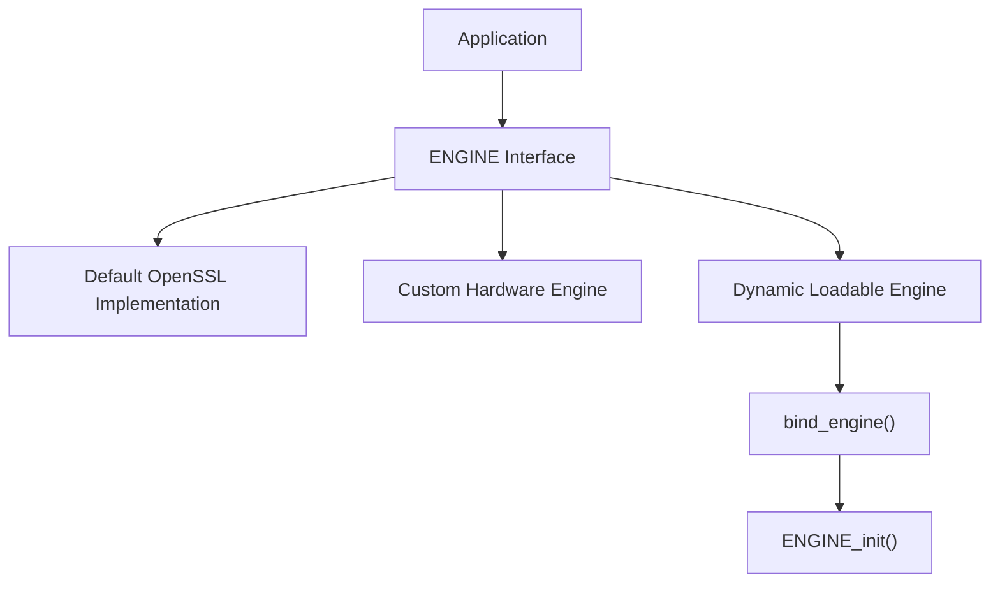
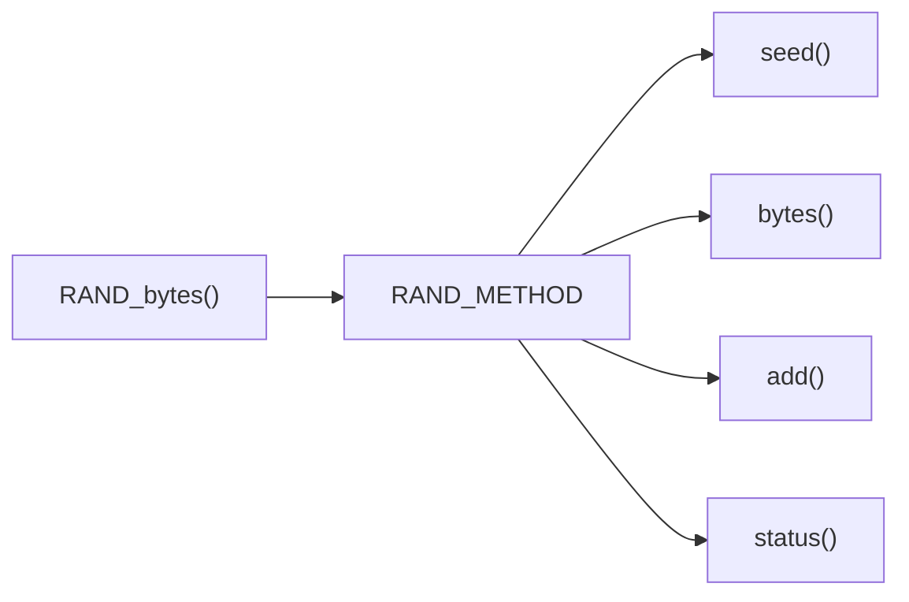
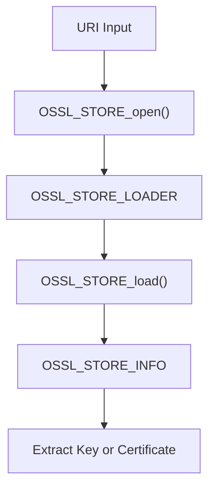
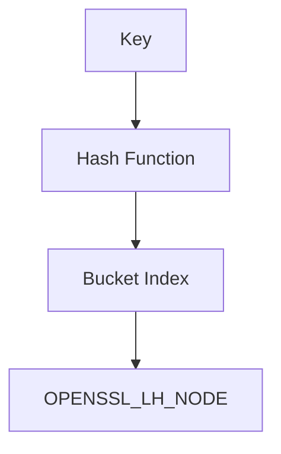
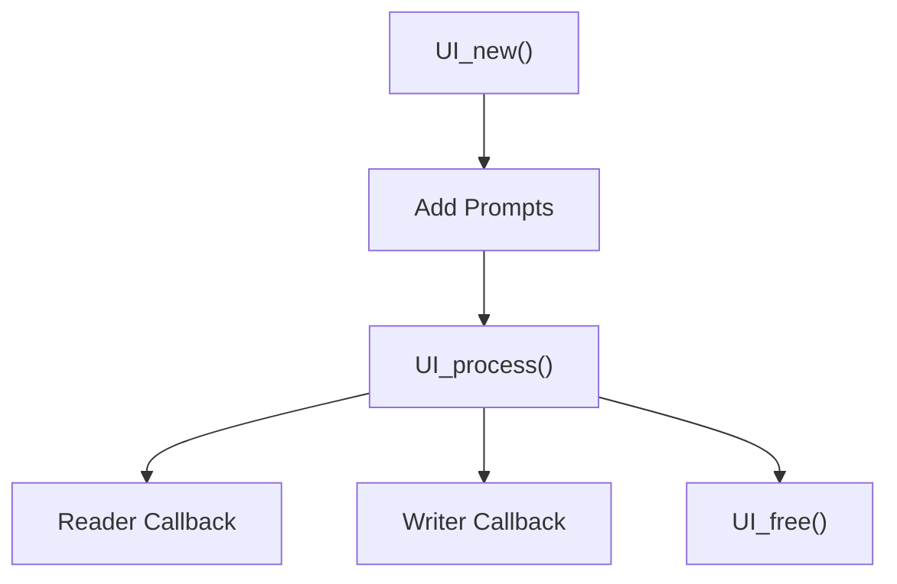
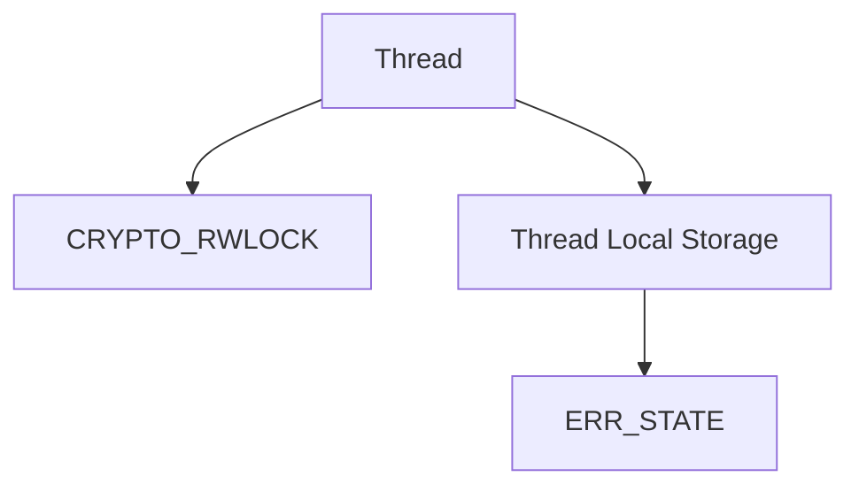
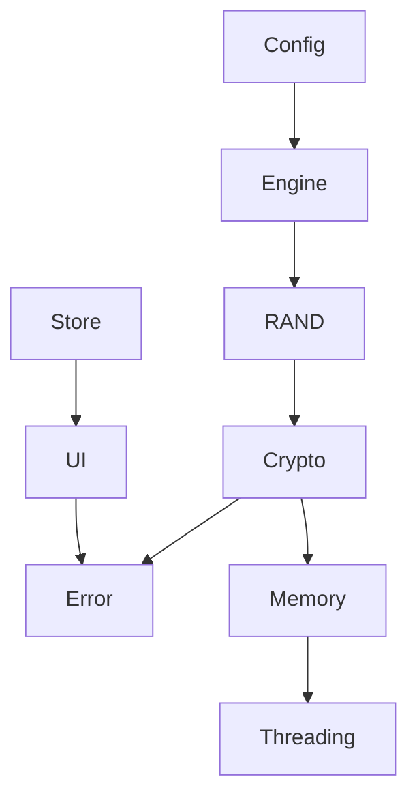

# Supporting Infrastructure

The **Supporting Infrastructure** sub-module provides the foundational runtime services that enable OpenSSL's higher-level cryptographic, TLS, PKI, and storage components to function reliably. While it does not implement cryptographic algorithms directly, it delivers the configuration system, error handling framework, pluggable engine architecture, object registry, storage abstraction, memory management, threading, and utility containers required by the rest of the OpenSSL stack.

Source files:

```text
openssl-1.1.1f/include/openssl/conf.h
openssl-1.1.1f/include/openssl/err.h
openssl-1.1.1f/include/openssl/rand.h
openssl-1.1.1f/include/openssl/engine.h
openssl-1.1.1f/include/openssl/store.h
openssl-1.1.1f/include/openssl/lhash.h
openssl-1.1.1f/include/openssl/stack.h
openssl-1.1.1f/include/openssl/objects.h
openssl-1.1.1f/include/openssl/txt_db.h
openssl-1.1.1f/include/openssl/ui.h
openssl-1.1.1f/include/openssl/crypto.h
```

---

## Architectural Overview



---

## Configuration System

**Primary Structures:**

- `CONF` / `conf_st` — Configuration object (method, data, LHASH)
- `CONF_METHOD` / `conf_method_st` — Pluggable parser (create, init, destroy, load_bio, dump, is_number, to_int, load)
- `CONF_MODULE` / `conf_module_st` — Loaded module descriptor
- `CONF_IMODULE` / `conf_imodule_st` — Module instance (name, value, flags, user data)
- `CONF_VALUE` — Key-value pair (section, name, value)


Used extensively during `OPENSSL_init_crypto()` and engine initialization.

---

## Error Handling Framework

**Primary Structures:**

- `ERR_STATE` / `err_state_st` — Per-thread error queue (ring buffer of 16 entries: flags, error codes, data, file, line)
- `ERR_STRING_DATA` / `ERR_string_data_st` — Error code to string mapping (error code + string)



Design characteristics:
- Fixed-size per-thread circular buffer
- Error codes encoded as library, function, and reason
- Optional associated error data
- Lazy string resolution
- Non-throwing model (error queue inspection required)

---

## Engine Framework

**Primary Structures:**

- `ENGINE_CMD_DEFN` / `ENGINE_CMD_DEFN_st` — Command definition (cmd_num, cmd_name, cmd_desc, cmd_flags)
- `dynamic_fns` / `st_dynamic_fns` — Dynamic engine function table (static_state, mem_fns)
- `dynamic_MEM_fns` / `st_dynamic_MEM_fns` — Memory function pointers (malloc_fn, realloc_fn, free_fn)



Capabilities: method substitution (RSA, DSA, EC, RAND, Ciphers, Digests), dynamic shared library loading, command-driven configuration, engine-specific command discovery, optional per-engine memory hooks.

---

## Random Number Method Abstraction

**Primary Structure:** `rand_meth_st`

Fields: `seed`, `bytes`, `cleanup`, `add`, `pseudorand`, `status` — all function pointers.



---

## Object Store Framework

**Primary Structures:**

- `OSSL_STORE_CTX` / `ossl_store_ctx_st` — Store context (loader, post_process, expected_type, search criteria)
- `OSSL_STORE_LOADER` / `ossl_store_loader_st` — Loader descriptor (engine, scheme, open/ctrl/expect/find/load/eof/error/close callbacks)
- `OSSL_STORE_LOADER_CTX` / `ossl_store_loader_ctx_st` — Opaque loader-specific context



Supported concepts: scheme-based loader registration, search filters (by name, fingerprint, issuer), UI callback integration for passwords, iterative object retrieval, pluggable backend implementations.

---

## Core Containers and Data Structures

### Hash Table (LHASH)

**Primary Structures:**
- `OPENSSL_LHASH` / `lhash_st` — Dynamic hash table (nodes, num_nodes, num_alloc_nodes, p, pmax, up_load, down_load, num_items, stats)
- `OPENSSL_LH_NODE` / `lhash_node_st` — Hash node (data, next, hash)

Used internally for configuration entries, object registries, error string tables, and TXT database indexing.



### Stack (OPENSSL_STACK)

**Primary Structure:** `OPENSSL_STACK` / `stack_st`

A type-agnostic stack abstraction with type-safe macros (`DEFINE_STACK_OF`). Used for certificate chains, UI strings, extension lists, and configuration modules.

---

## Object Naming and Registry

**Primary Structure:** `OBJ_NAME` / `obj_name_st` — (type, alias, name, data)

The object registry maps algorithm names and aliases to internal identifiers (NIDs).


Enables dynamic resolution of message digests, ciphers, public key methods, and compression methods.

---

## Text Database (TXT_DB)

**Primary Structure:** `TXT_DB` / `txt_db_st` — (num_fields, data stack, index LHASH array, qual callbacks, error tracking)

A simple structured flat-file database abstraction used primarily by certificate authority utilities. Features: indexed column lookups, duplicate detection, validation hooks, error tracking per row.

---

## User Interface Abstraction

**Primary Structure:** `UI_STRING` / `ui_string_st` — (type, input_flags, result_buf, test_buf, minsize, maxsize, output_string, action_string)



Capabilities: prompt input and verification, boolean input handling, pluggable `UI_METHOD` implementations, secure password entry, application-defined data callbacks.

---

## Memory Management and Threading

**Primary Structures:**

- `crypto_ex_data_st` — Per-object extensible data (stack of void pointers)
- `CRYPTO_THREADID` / `crypto_threadid_st` — Thread identifier (legacy compatibility)
- `CRYPTO_dynlock` — Dynamic lock (legacy compatibility)
- `tm` — Standard C time structure (used in `OPENSSL_gmtime`)

### Memory System

OpenSSL wraps standard allocation functions to track memory usage, enable debugging and leak detection, support secure memory regions, and allow custom allocator injection.

### Threading Model



Capabilities: platform-agnostic read/write locks, thread-local storage abstraction, one-time initialization guards, atomic operations.

---

## Cross-Cutting Integration



---

## Related Sub-modules

- [Type System](../type_system/type_system.md)
- [TLS and SSL](../tls_and_ssl/tls_and_ssl.md)
- [X.509 and Certificate Management](../x509_and_certificate_management/x509_and_certificate_management.md)

Parent: [Openssl Core](../../openssl-core.md)
