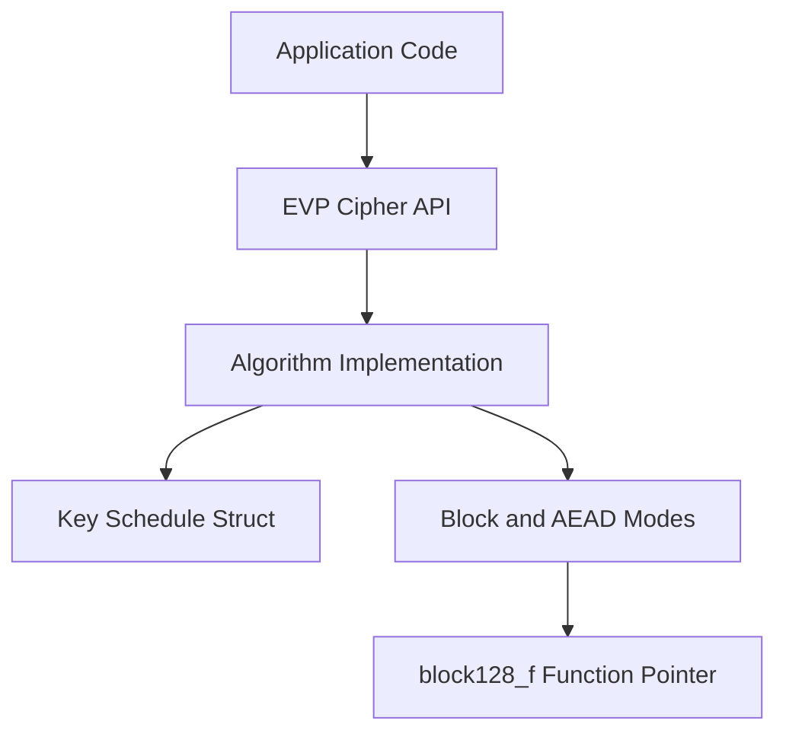
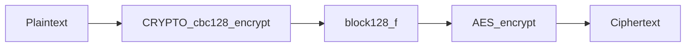
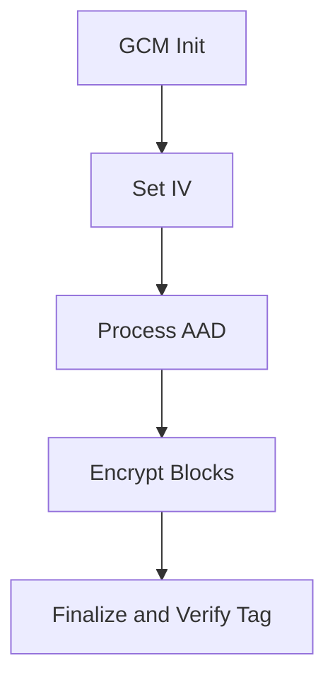
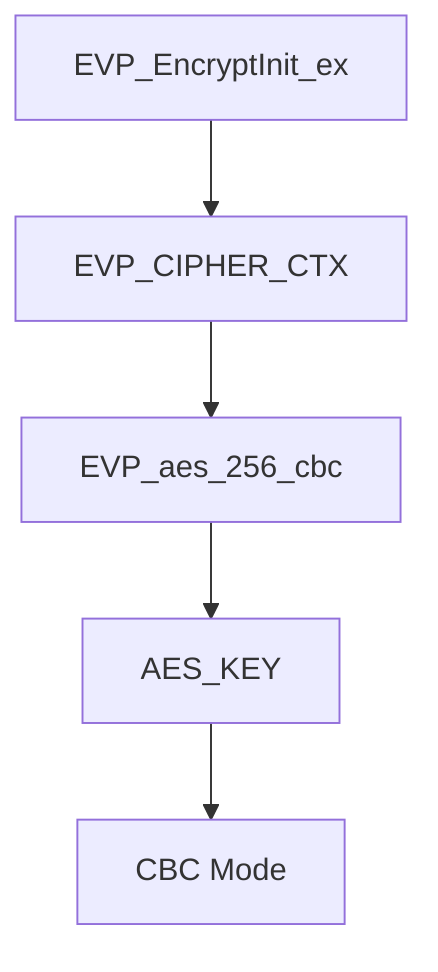

# Symmetric Ciphers

The **Symmetric Ciphers** sub-module provides the concrete block and stream cipher implementations used throughout the OpenSSL core in MeshAgent. It includes classic and modern symmetric algorithms (AES, DES, Blowfish, Camellia, CAST, RC2/RC4/RC5, IDEA, SEED) as well as authenticated and advanced block cipher modes (GCM, CCM, OCB, XTS).

This sub-module forms the cryptographic backbone for higher-level services such as TLS, PKCS#7/CMS encryption, secure storage, and key wrapping.

---

## Purpose and Scope

The Symmetric Ciphers sub-module provides:

- Low-level algorithm-specific key schedules (e.g., `AES_KEY`, `DES_key_schedule`)
- Raw block encryption and decryption primitives
- Standard block cipher modes (ECB, CBC, CFB, OFB, CTR)
- Authenticated encryption modes (GCM, CCM, OCB)
- Disk encryption mode (XTS)
- Key wrapping utilities (RFC 3394-style AES wrap)
- Integration with the high-level `EVP_CIPHER` abstraction

---

## High-Level Architecture



---

## Core Algorithm Families

### AES (Advanced Encryption Standard)

**Core types:** `AES_KEY` / `aes_key_st`

Key characteristics:
- Block size: 16 bytes
- Key sizes: 128, 192, 256 bits
- Max rounds: 14 (`AES_MAXNR`)

```c
struct aes_key_st {
    unsigned int rd_key[4 * (AES_MAXNR + 1)];
    int rounds;
};
```

Capabilities: ECB, CBC, CFB (1/8/128), OFB, IGE, BI-IGE, AES key wrap/unwrap. Used as backend for GCM, CCM, OCB, XTS.

AES is the primary symmetric primitive used by TLS, CMS, and modern secure storage.

---

### DES and Triple DES

**Core types:** `DES_key_schedule` / `DES_ks`

Characteristics:
- Block size: 8 bytes
- 16 rounds
- Supports single DES and 3DES (EDE2, EDE3)

DES is legacy and retained for compatibility (e.g., older PKCS#12 or TLS configurations).

---

### Blowfish, CAST, RC2, RC4, RC5, IDEA, SEED, Camellia

Each algorithm defines a key schedule structure and a set of block or stream primitives:

| Algorithm | Key Struct | Block Size | Notes |
|---|---|---|---|
| Blowfish | `BF_KEY` / `bf_key_st` | 8 bytes | P-array + S-boxes |
| CAST | `CAST_KEY` / `cast_key_st` | 8 bytes | Variable key length |
| RC2 | `RC2_KEY` / `rc2_key_st` | 8 bytes | Legacy |
| RC4 | `RC4_KEY` / `rc4_key_st` | Stream | Insecure, legacy |
| RC5 | `RC5_32_KEY` / `rc5_key_st` | 8 bytes | Variable rounds |
| IDEA | `IDEA_KEY_SCHEDULE` / `idea_key_st` | 8 bytes | Legacy |
| SEED | `SEED_KEY_SCHEDULE` / `seed_key_st` | 16 bytes | Korean standard |
| Camellia | `CAMELLIA_KEY` / `camellia_key_st` | 16 bytes | Modern, compliance |

These algorithms are mostly retained for backward compatibility and exposed through EVP.

---

## Block Cipher Modes (modes.h)

The `modes.h` layer abstracts block processing from algorithm logic.

### Generic Mode Functions

- `CRYPTO_cbc128_encrypt` / `CRYPTO_cbc128_decrypt`
- `CRYPTO_ctr128_encrypt`
- `CRYPTO_cfb128_encrypt`
- `CRYPTO_ofb128_encrypt`

These functions operate on a `block128_f` function pointer, an opaque `key` pointer, and IV/state buffers.



---

## Authenticated Encryption (AEAD)

The sub-module defines context types for modern AEAD modes:

### GCM128_CONTEXT (`gcm128_context`)

Key functions: `CRYPTO_gcm128_init`, `CRYPTO_gcm128_setiv`, `CRYPTO_gcm128_encrypt`, `CRYPTO_gcm128_finish`



Used heavily in TLS (AES-GCM), secure messaging, and CMS encrypted content.

### CCM128_CONTEXT (`ccm128_context`)

Combines CTR mode with CBC-MAC. Integrated into EVP as an AEAD cipher.

### OCB128_CONTEXT (`ocb128_context`)

Integrates offset-based encryption with authentication. Supported via dedicated context structure.

### XTS128_CONTEXT (`xts128_context`)

Designed for disk encryption. Requires two AES keys and provides tweak-based block encryption.

---

## EVP Integration

The `EVP_CIPHER_INFO` / `evp_cipher_info_st` structure binds a cipher with its IV:

```c
typedef struct evp_cipher_info_st {
    const EVP_CIPHER *cipher;
    unsigned char iv[EVP_MAX_IV_LENGTH];
} EVP_CIPHER_INFO;
```

The `EVP_CTRL_TLS1_1_MULTIBLOCK_PARAM` structure supports TLS 1.1 multi-block optimization:

```c
typedef struct {
    unsigned char *out;
    const unsigned char *inp;
    size_t len;
    unsigned int interleave;
} EVP_CTRL_TLS1_1_MULTIBLOCK_PARAM;
```



---

## Security Considerations

1. **Prefer EVP API** — Avoid direct low-level cipher calls unless necessary.
2. **Use AEAD modes** — Prefer GCM or CCM over raw CBC.
3. **Avoid legacy algorithms** — DES, RC4, RC2, IDEA are insecure for modern use.
4. **Correct IV handling** — Unique IVs are mandatory for CTR/GCM/CCM.
5. **Constant-time implementations** — Many primitives are optimized to reduce timing side channels.

---

## Related Sub-modules

- [Type System](../type_system/type_system.md)
- [Digest and MAC](../digest_and_mac/digest_and_mac.md)
- [TLS and SSL](../tls_and_ssl/tls_and_ssl.md)
- [BIO and IO](../bio_and_io/bio_and_io.md)

Parent: [Openssl Core](../../openssl-core.md)
