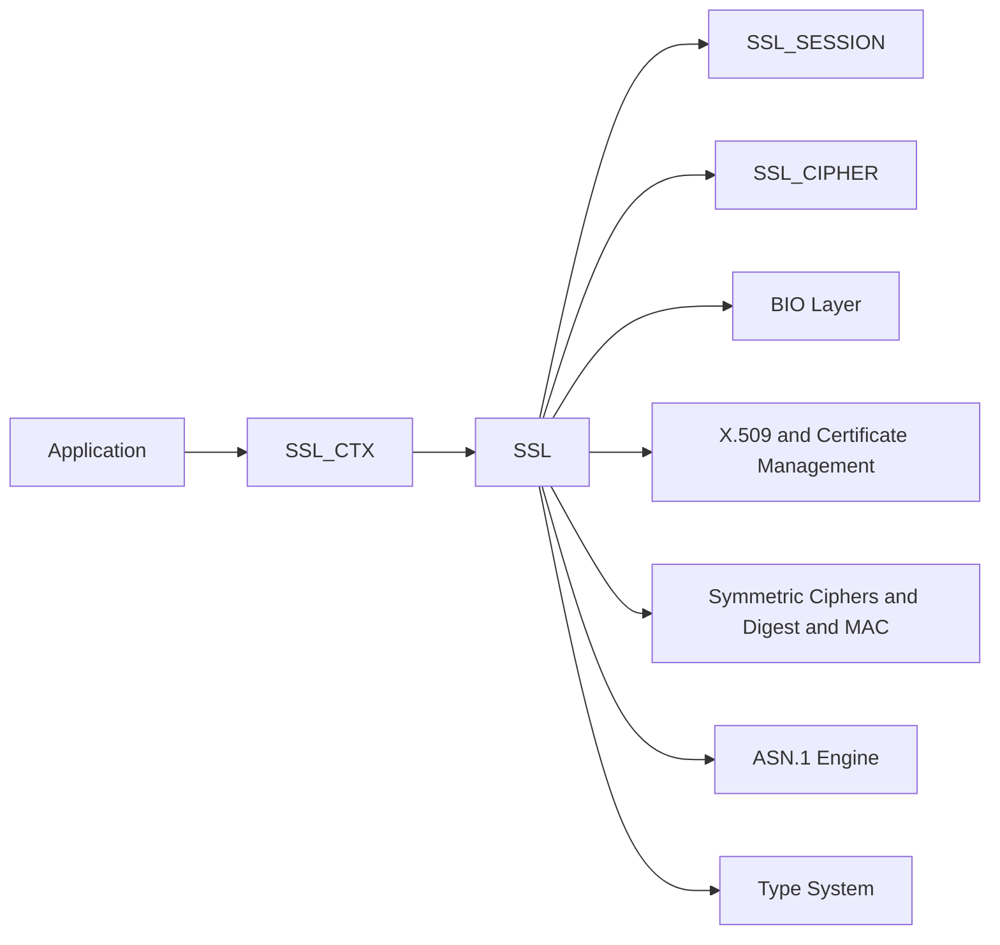
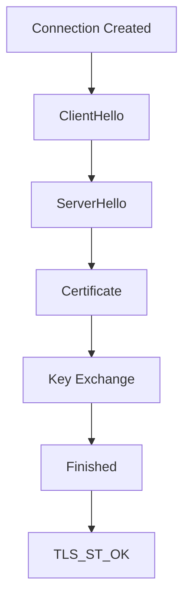
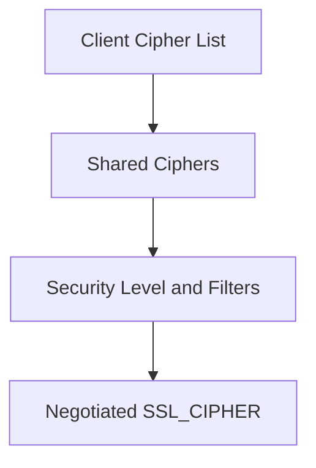
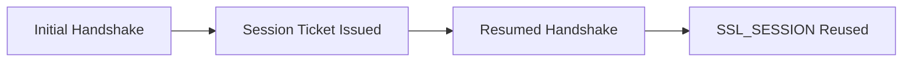
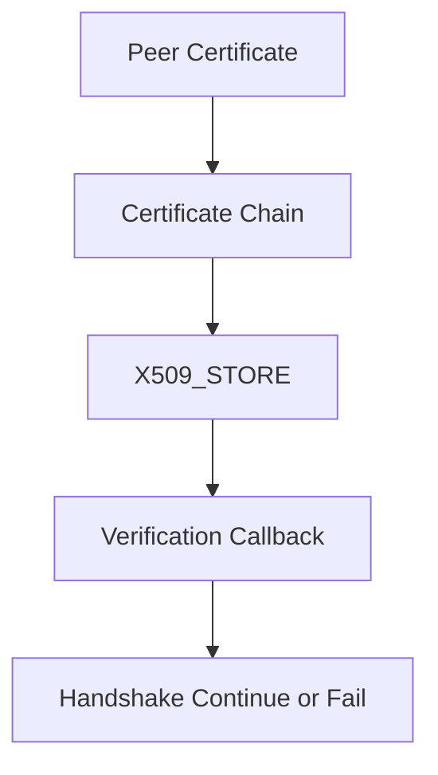
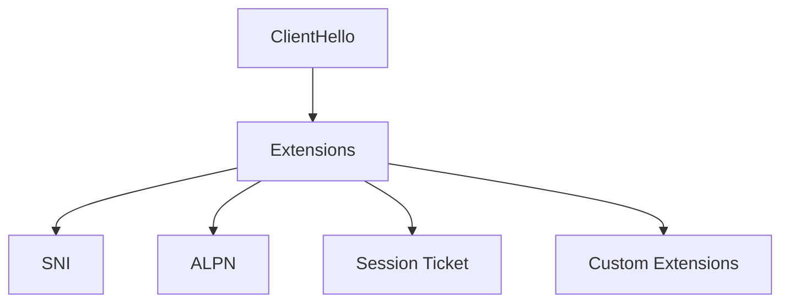
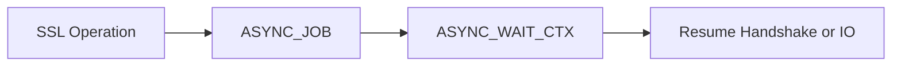

# TLS and SSL

The **TLS and SSL** sub-module provides the Transport Layer Security (TLS) and Secure Sockets Layer (SSL) protocol implementation built on top of OpenSSL 1.1.1f. It is responsible for secure session establishment, cipher negotiation, certificate verification, encrypted data transport, session resumption, and advanced TLS 1.3 features such as early data and key updates.

Source files:

```text
openssl-1.1.1f/include/openssl/ssl.h
openssl-1.1.1f/include/openssl/tls1.h
openssl-1.1.1f/include/openssl/async.h
```

---

## Purpose and Responsibilities

The TLS and SSL sub-module is responsible for:

- Managing TLS/SSL contexts and connections
- Performing protocol negotiation (TLS 1.0–1.3, DTLS)
- Selecting and validating cipher suites
- Handling certificate chains and peer verification
- Managing session tickets and session resumption
- Supporting ALPN, SNI, SRTP, and custom extensions
- Enabling asynchronous crypto operations
- Enforcing security policies and levels

---

## Core Data Structures

### SSL_CTX (`ssl_ctx_st`) — Context Level

Reusable configuration container for TLS connections:

- Protocol version constraints
- Cipher configuration
- Certificate and private key material
- Verification settings and callbacks
- Session cache configuration
- Security level and callback policies
- ALPN, SNI, CT, and PSK callbacks

An application typically creates one `SSL_CTX` and uses it to spawn multiple `SSL` objects.

### SSL (`ssl_st`) — Connection Level

Represents a single TLS/SSL connection:

- Handshake state machine (`OSSL_HANDSHAKE_STATE`)
- Negotiated cipher and protocol version
- Record layer state
- Associated BIOs (network I/O)
- Session reference
- Early data and key update state

### SSL_SESSION (`ssl_session_st`)

Encapsulates resumable session state:

- Session ID and context
- Master secret or resumption secret
- Cipher suite
- Ticket data (`TLS_SESSION_TICKET_EXT` / `tls_session_ticket_ext_st`)
- ALPN and SNI metadata
- Max early data size

### SSL_CIPHER (`ssl_cipher_st`)

Describes a negotiated cipher suite:

- Key exchange algorithm
- Authentication method
- Bulk cipher (e.g., AES, CHACHA20)
- MAC or AEAD digest
- Protocol version constraints

### SSL_METHOD (`ssl_method_st`)

Defines protocol behavior:

- TLS client/server negotiation strategy
- Version-specific state machine behavior
- DTLS vs TLS distinctions

### SSL_COMP (`ssl_comp_st`)

Compression method descriptor (id, name, method).

### SSL_CONF_CTX (`ssl_conf_ctx_st`)

Configuration context for applying SSL settings from configuration files or command-line arguments.

### TLS_SIGALGS (`tls_sigalgs_st`)

Signature algorithm descriptor used in TLS 1.3 signature algorithm negotiation.

### SRTP_PROTECTION_PROFILE (`srtp_protection_profile_st`)

SRTP protection profile for DTLS-SRTP (name, id).

### Async Support

- `ASYNC_JOB` / `async_job_st` — Asynchronous job handle
- `ASYNC_WAIT_CTX` / `async_wait_ctx_st` — Wait context for async operations

---

## High-Level Architecture



---

## TLS Handshake Flow

The handshake is implemented as a state machine (`OSSL_HANDSHAKE_STATE`).



### TLS 1.3 Enhancements

- Encrypted extensions
- Post-handshake authentication
- KeyUpdate messages
- 0-RTT early data (`SSL_read_early_data()`, `SSL_write_early_data()`)

---

## Cipher Suite Negotiation



- `SSL_CTX_set_cipher_list()` for TLS 1.2 and below
- `SSL_CTX_set_ciphersuites()` for TLS 1.3
- Default: `SSL_DEFAULT_CIPHER_LIST`, `TLS_DEFAULT_CIPHERSUITES`

---

## Session Management



Session ticket structure (`tls_session_ticket_ext_st`): `length`, `data`.

---

## Certificate Verification



Verification modes: `SSL_VERIFY_NONE`, `SSL_VERIFY_PEER`, `SSL_VERIFY_POST_HANDSHAKE`.

---

## Extensions and Protocol Features



Supported extensions: SNI, ALPN, OCSP stapling, SRTP profiles, Certificate Transparency, custom extensions via callback registration.

---

## Asynchronous Operation



Used when hardware accelerators are involved or long-running cryptographic operations are offloaded.

---

## DTLS Support

The sub-module also provides Datagram TLS:

- `DTLS_method()`, MTU control, timeout handling, cookie exchange
- DTLS adds retransmission and timer-based state transitions

---

## Security Model

Security enforcement is layered:

1. Protocol version constraints
2. Cipher suite filtering
3. Security level enforcement (`SSL_set_security_level()`)
4. Certificate validation
5. Extension validation
6. Session resumption validation

---

## Related Sub-modules

- [Type System](../type_system/type_system.md)
- [ASN.1 Engine](../asn1_engine/asn1_engine.md)
- [Symmetric Ciphers](../symmetric_ciphers/symmetric_ciphers.md)
- [Digest and MAC](../digest_and_mac/digest_and_mac.md)
- [Public Key Infrastructure](../public_key_infrastructure/public_key_infrastructure.md)
- [X.509 and Certificate Management](../x509_and_certificate_management/x509_and_certificate_management.md)
- [BIO and IO](../bio_and_io/bio_and_io.md)
- [Supporting Infrastructure](../supporting_infrastructure/supporting_infrastructure.md)

Parent: [Openssl Core](../../openssl-core.md)
