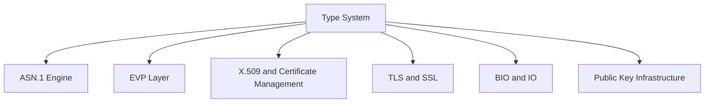
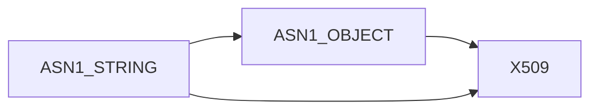
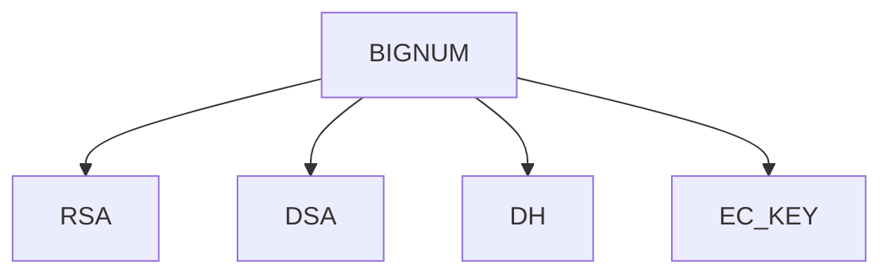
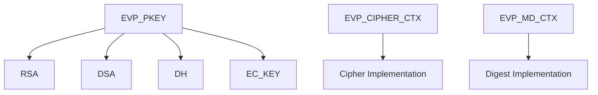
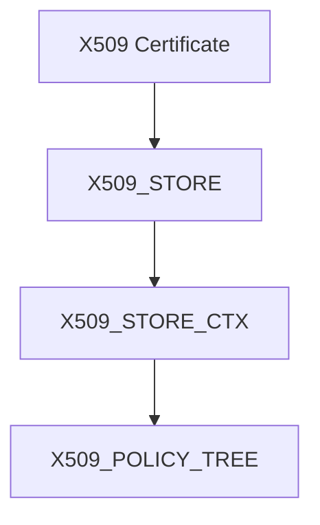
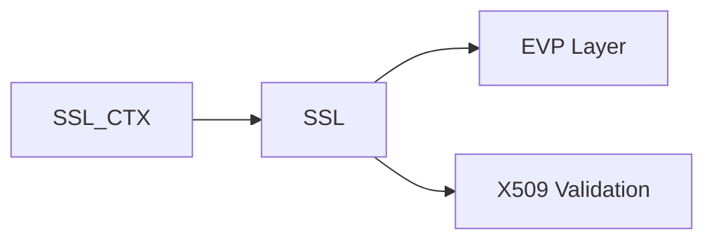
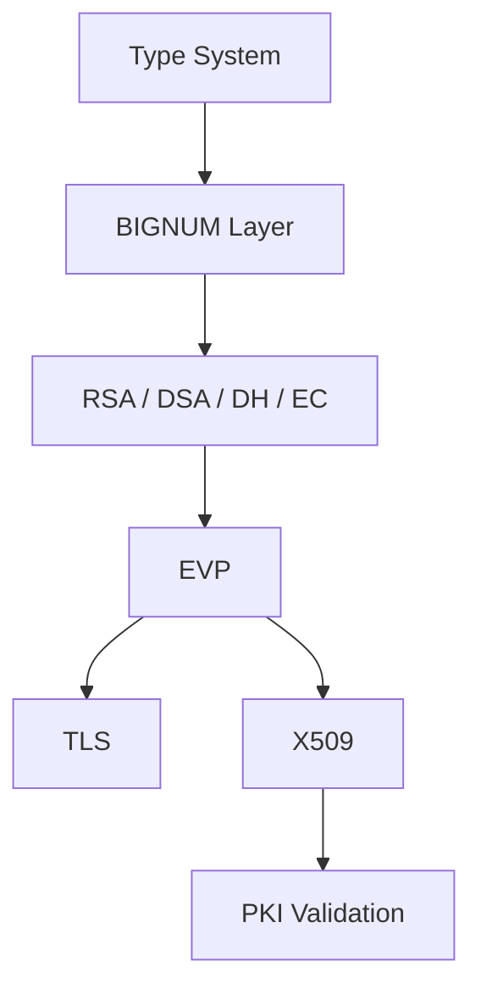

# Type System

The **Type System** sub-module defines the foundational data types used throughout the OpenSSL core embedded in MeshAgent. It provides forward declarations and canonical typedefs for cryptographic primitives, ASN.1 objects, X.509 structures, TLS contexts, and supporting infrastructure.

Rather than implementing algorithms directly, this sub-module establishes the *type contracts* that enable loose coupling, ABI stability, and opaque structure design across the OpenSSL ecosystem.

All core definitions originate from:

```text
openssl-1.1.1f/include/openssl/ossl_typ.h
```

---

## Purpose and Design Principles

The Type System is built around three core principles:

1. **Opaque Structures** — Most types are forward-declared (`struct xxx_st`) and exposed via typedefs. Internal layouts remain hidden.
2. **Binary Compatibility** — Consumers compile against stable type definitions while implementation evolves internally.
3. **Cross-Subsystem Interoperability** — Shared types allow ASN.1, EVP, TLS, X.509, and PKI layers to interoperate safely.

---

## High-Level Architectural Role

The Type System sits at the bottom of the OpenSSL abstraction stack.



All higher-level sub-modules depend on the canonical types defined here.

---

## Core Type Categories

### ASN.1 Core Types

These types represent generic ASN.1 encodable structures:

- `ASN1_STRING` / `asn1_string_st`
- `ASN1_BIT_STRING`, `ASN1_OCTET_STRING`, `ASN1_INTEGER`, `ASN1_ENUMERATED`
- `ASN1_OBJECT` / `asn1_object_st`
- `ASN1_ITEM` / `ASN1_ITEM_st`
- `ASN1_PCTX` / `asn1_pctx_st`, `ASN1_SCTX` / `asn1_sctx_st`
- Time types: `ASN1_TIME`, `ASN1_UTCTIME`, `ASN1_GENERALIZEDTIME`
- String types: `ASN1_UTF8STRING`, `ASN1_IA5STRING`, `ASN1_BMPSTRING`, etc.

These types underpin certificate parsing, PKCS structures, and CMS/OCSP objects.



---

### Big Number Arithmetic (BN Layer)

Cryptographic algorithms rely on arbitrary-precision integers.

Key types:

- `BIGNUM` / `bignum_st`
- `BN_CTX` / `bignum_ctx`
- `BN_BLINDING` / `bn_blinding_st`
- `BN_MONT_CTX` / `bn_mont_ctx_st`
- `BN_RECP_CTX` / `bn_recp_ctx_st`
- `BN_GENCB` / `bn_gencb_st`



All asymmetric cryptography builds on these primitives.

---

### EVP High-Level Abstraction Layer

The EVP layer provides algorithm-agnostic cryptographic interfaces.

Core types:

- `EVP_CIPHER` / `evp_cipher_st`, `EVP_CIPHER_CTX` / `evp_cipher_ctx_st`
- `EVP_MD` / `evp_md_st`, `EVP_MD_CTX` / `evp_md_ctx_st`
- `EVP_PKEY` / `evp_pkey_st`, `EVP_PKEY_CTX` / `evp_pkey_ctx_st`
- `EVP_PKEY_METHOD` / `evp_pkey_method_st`
- `EVP_PKEY_ASN1_METHOD` / `evp_pkey_asn1_method_st`
- `EVP_ENCODE_CTX` / `evp_Encode_Ctx_st`
- `HMAC_CTX` / `hmac_ctx_st`



---

### Asymmetric Key Structures

Forward-declared key structures:

- `RSA` / `rsa_st`, `RSA_METHOD` / `rsa_meth_st`, `RSA_PSS_PARAMS` / `rsa_pss_params_st`
- `DSA` / `dsa_st`, `DSA_METHOD` / `dsa_method`
- `DH` / `dh_st`, `DH_METHOD` / `dh_method`
- `EC_KEY` / `ec_key_st`, `EC_KEY_METHOD` / `ec_key_method_st`

---

### X.509 and Certificate Infrastructure

Certificate-related types:

- `X509` / `x509_st`
- `X509_STORE` / `x509_store_st`, `X509_STORE_CTX` / `x509_store_ctx_st`
- `X509_NAME` / `X509_name_st`
- `X509_CRL` / `X509_crl_st`
- `X509_ALGOR` / `X509_algor_st`
- `X509_VERIFY_PARAM` / `X509_VERIFY_PARAM_st`
- `X509_PUBKEY` / `X509_pubkey_st`
- `X509_REVOKED` / `x509_revoked_st`
- `X509_SIG_INFO` / `x509_sig_info_st`
- Policy structures: `X509_POLICY_TREE` / `X509_POLICY_TREE_st`, `X509_POLICY_NODE` / `X509_POLICY_NODE_st`, `X509_POLICY_LEVEL` / `X509_POLICY_LEVEL_st`, `X509_POLICY_CACHE` / `X509_POLICY_CACHE_st`
- Extension types: `AUTHORITY_KEYID` / `AUTHORITY_KEYID_st`, `DIST_POINT` / `DIST_POINT_st`, `ISSUING_DIST_POINT` / `ISSUING_DIST_POINT_st`, `NAME_CONSTRAINTS` / `NAME_CONSTRAINTS_st`



---

### TLS / SSL Context Types

TLS session management depends on:

- `SSL` / `ssl_st`
- `SSL_CTX` / `ssl_ctx_st`
- `SSL_DANE` / `ssl_dane_st`



---

### BIO and I/O Abstractions

- `BIO` / `bio_st`
- `BUF_MEM` / `buf_mem_st`

---

### Randomness and Initialization

- `RAND_METHOD` / `rand_meth_st`
- `RAND_DRBG` / `rand_drbg_st`
- `OPENSSL_INIT_SETTINGS` / `ossl_init_settings_st`

---

### Certificate Transparency and OCSP

- `SCT` / `sct_st`, `SCT_CTX` / `sct_ctx_st`
- `CTLOG` / `ctlog_st`, `CTLOG_STORE` / `ctlog_store_st`
- `CT_POLICY_EVAL_CTX` / `ct_policy_eval_ctx_st`
- `OCSP_RESPONSE` / `ocsp_response_st`, `OCSP_RESPID` / `ocsp_responder_id_st`, `OCSP_REQ_CTX` / `ocsp_req_ctx_st`

---

### Engine and UI Infrastructure

- `ENGINE` / `engine_st`
- `UI` / `ui_st`, `UI_METHOD` / `ui_method_st`
- `CRYPTO_EX_DATA` / `crypto_ex_data_st`
- `CONF` / `conf_st`
- `COMP_CTX` / `comp_ctx_st`, `COMP_METHOD` / `comp_method_st`
- `PKCS8_PRIV_KEY_INFO` / `pkcs8_priv_key_info_st`
- `OSSL_STORE_INFO` / `ossl_store_info_st`, `OSSL_STORE_SEARCH` / `ossl_store_search_st`
- `X509V3_CTX` / `v3_ext_ctx`

---

## Opaque Type Pattern

Most definitions follow this pattern:

```c
typedef struct rsa_st RSA;
```

This means:

- The structure layout is hidden.
- Consumers manipulate pointers only.
- Memory management and invariants are controlled internally.

**Benefits:** ABI stability, reduced compile-time dependencies, security through encapsulation.

---

## Cross-Module Dependency Flow



---

## Integration within MeshAgent

Within MeshAgent, OpenSSL types are:

- Used by TLS channels for secure communication
- Used by PKI components for certificate validation
- Used by cryptographic modules for encryption and signing
- Used by WebRTC and secure transport subsystems

The Type System acts as the contract boundary between OpenSSL core, Microstack networking, WebRTC components, and agent security infrastructure.

---

## Related Sub-modules

- [ASN.1 Engine](../asn1_engine/asn1_engine.md)
- [Symmetric Ciphers](../symmetric_ciphers/symmetric_ciphers.md)
- [Digest and MAC](../digest_and_mac/digest_and_mac.md)
- [Public Key Infrastructure](../public_key_infrastructure/public_key_infrastructure.md)
- [X.509 and Certificate Management](../x509_and_certificate_management/x509_and_certificate_management.md)
- [TLS and SSL](../tls_and_ssl/tls_and_ssl.md)
- [BIO and IO](../bio_and_io/bio_and_io.md)
- [Supporting Infrastructure](../supporting_infrastructure/supporting_infrastructure.md)

Parent: [Openssl Core](../../openssl-core.md)
