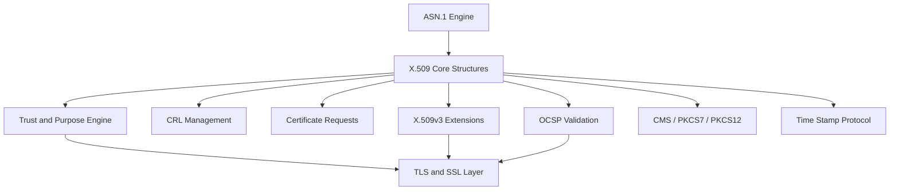
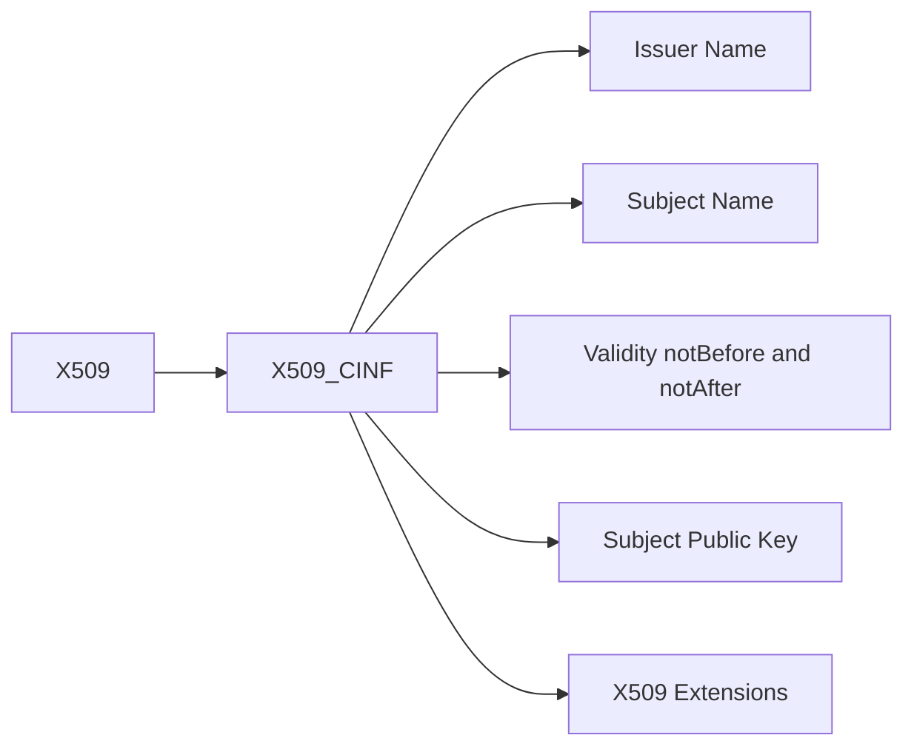
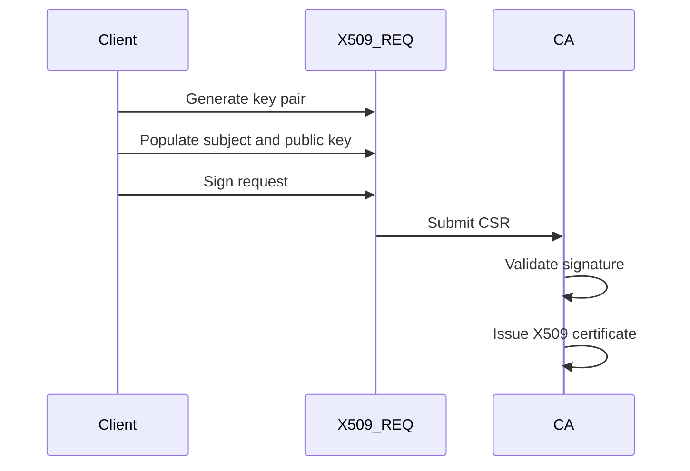
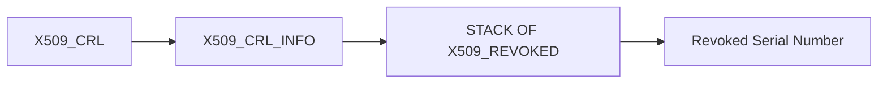
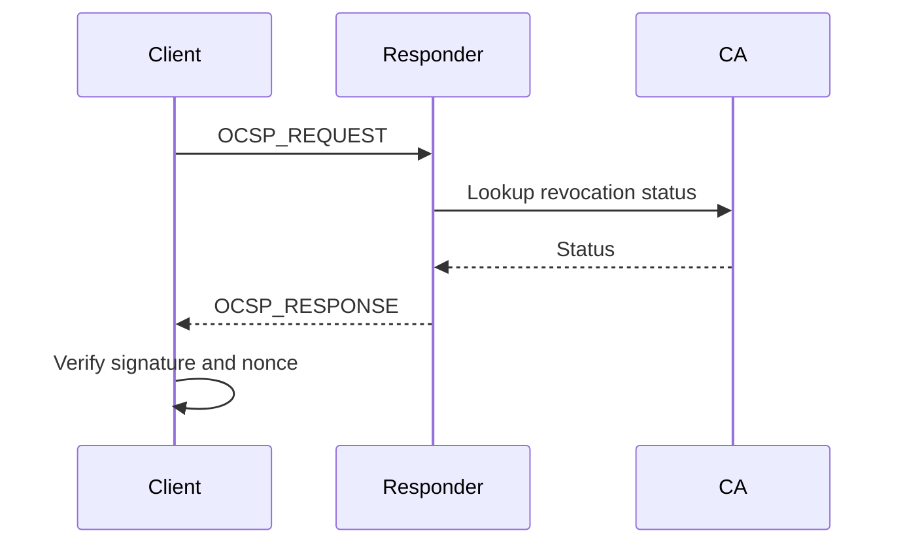

# X.509 and Certificate Management

The **X.509 and Certificate Management** sub-module provides the full certificate lifecycle implementation for the OpenSSL integration inside MeshAgent. It defines the core ASN.1 structures, parsing logic, verification routines, and extension handling required to support:

- X.509 certificates (v1/v3)
- Certificate Signing Requests (CSR)
- Certificate Revocation Lists (CRL)
- Online Certificate Status Protocol (OCSP)
- CMS / PKCS#7 / PKCS#12 containers
- Time-Stamp Protocol (TSP)
- X.509v3 extensions and policy constraints

Source files:

```text
openssl-1.1.1f/include/openssl/x509.h
openssl-1.1.1f/include/openssl/x509v3.h
openssl-1.1.1f/include/openssl/ocsp.h
openssl-1.1.1f/include/openssl/cms.h
openssl-1.1.1f/include/openssl/pkcs7.h
openssl-1.1.1f/include/openssl/pkcs12.h
openssl-1.1.1f/include/openssl/ts.h
```

---

## Architectural Overview



---

## Core Certificate Structures

### X509_CINF (`x509_cinf_st`) — Certificate Information

Represents the "To Be Signed" (TBS) certificate structure:

- Version, serial number, signature algorithm
- Issuer (`X509_NAME`)
- Validity (`X509_VAL` / `X509_val_st` — notBefore, notAfter)
- Subject (`X509_NAME`)
- Subject public key (`X509_PUBKEY`)
- Extensions (v3)



The `X509` object wraps `X509_CINF` and adds signature algorithm metadata, signature value, and auxiliary trust data (`X509_CERT_AUX` / `x509_cert_aux_st`).

### X509_NAME and X509_NAME_ENTRY (`X509_name_entry_st`)

Distinguished Names (DNs) are composed of multiple `X509_NAME_ENTRY` objects. These structures enable issuer comparison, subject comparison, and name hashing for certificate lookup.

### X509_EXTENSION (`X509_extension_st`)

Represents a single X.509v3 extension: OID, criticality flag, and DER-encoded value.

### X509_SIG (`X509_sig_st`)

Wraps a signature: algorithm identifier + DER-encoded signature value.

### X509_INFO (`X509_info_st`)

Container for a certificate, CRL, and private key loaded from PEM files.

### X509_ATTRIBUTE (`x509_attributes_st`)

Represents an attribute in a certificate request or PKCS#8 structure.

### Private Key (`private_key_st`)

Holds encrypted private key material with cipher info and decrypted `EVP_PKEY`.

### Trust (`x509_trust_st`)

Defines a trust check function for a specific trust ID (SSL client/server, email, code signing, OCSP, TSA).

---

## Certificate Signing Requests (CSR)

- `X509_REQ` / `X509_req_st` — CSR container
- `X509_REQ_INFO` / `X509_req_info_st` — TBS portion (version, subject, public key, attributes)



---

## X.509v3 Extension Engine

Extensions are represented by `X509_EXTENSION` and processed via `X509V3_EXT_METHOD` / `v3_ext_method`.

### Key Extension Structures

- `BASIC_CONSTRAINTS` / `BASIC_CONSTRAINTS_st` — CA flag and path length
- `GENERAL_NAME` / `GENERAL_NAME_st` — SAN entries (DNS, IP, email, URI, directory, etc.)
- `OTHERNAME` / `otherName_st` — OtherName SAN type
- `EDIPARTYNAME` / `EDIPartyName_st` — EDI party name
- `ACCESS_DESCRIPTION` / `ACCESS_DESCRIPTION_st` — AIA/SIA entries
- `DIST_POINT_st` — CRL distribution point
- `POLICYINFO_st` — Certificate policy
- `POLICYQUALINFO` / `POLICYQUALINFO_st` — Policy qualifier (CPS URI or user notice)
- `NOTICEREF` / `NOTICEREF_st`, `USERNOTICE` / `USERNOTICE_st` — Policy user notice
- `POLICY_CONSTRAINTS` / `POLICY_CONSTRAINTS_st` — Policy constraint extension
- `POLICY_MAPPING_st` — Policy mapping
- `PROXY_CERT_INFO_EXTENSION` / `PROXY_CERT_INFO_EXTENSION_st` — Proxy certificate
- `PROXY_POLICY` / `PROXY_POLICY_st` — Proxy policy
- `PKEY_USAGE_PERIOD` / `PKEY_USAGE_PERIOD_st` — Key usage period
- `SXNETID` / `SXNET_ID_st`, `SXNET_st` — Strong extranet ID
- `IPAddressChoice` / `IPAddressChoice_st`, `IPAddressFamily` / `IPAddressFamily_st`, `IPAddressOrRange` / `IPAddressOrRange_st` — RFC 3779 IP address extensions
- `ASIdOrRange_st`, `ASRange_st` — RFC 3779 AS number extensions
- `ADMISSIONS` / `Admissions_st`, `ADMISSION_SYNTAX` / `AdmissionSyntax_st`, `NamingAuthority_st`, `PROFESSION_INFO` / `ProfessionInfo_st` — German admission syntax

### Extension Context (`v3_ext_ctx`)

Provides runtime context for issuer certificate, subject certificate, CRL, and configuration database.

### Extension Method (`v3_ext_method` / `X509V3_EXT_METHOD`)

Defines encode/decode, print, and value conversion callbacks for each extension type.

### Configuration Method (`X509V3_CONF_METHOD` / `X509V3_CONF_METHOD_st`)

Pluggable configuration backend for extension value lookup.

### Purpose (`X509_PURPOSE` / `x509_purpose_st`)

Defines certificate purpose checks (SSL client/server, S/MIME, code signing, OCSP, TSA).

---

## Certificate Revocation Lists (CRL)

- `X509_CRL_INFO` / `X509_crl_info_st` — TBS CRL (issuer, thisUpdate, nextUpdate, revoked list, extensions)
- `X509_REVOKED` — Revoked certificate entry (serial, revocation date, extensions)



---

## OCSP (Online Certificate Status Protocol)

- `OCSP_CERTID` / `ocsp_cert_id_st` — Certificate identifier (hash algorithm, issuer name hash, issuer key hash, serial)
- `OCSP_REQUEST` / `ocsp_request_st` — OCSP request
- `OCSP_REQINFO` / `ocsp_req_info_st` — Request info
- `OCSP_SIGNATURE` / `ocsp_signature_st` — Request/response signature
- `OCSP_BASICRESP` / `ocsp_basic_response_st` — Basic OCSP response
- `OCSP_SINGLERESP` / `ocsp_single_response_st` — Per-certificate status
- `OCSP_CERTSTATUS` / `ocsp_cert_status_st` — Good/revoked/unknown
- `OCSP_RESPBYTES` / `ocsp_resp_bytes_st` — Response bytes
- `OCSP_CRLID` / `ocsp_crl_id_st` — CRL reference
- `OCSP_SERVICELOC` / `ocsp_service_locator_st` — Service locator
- `ocsp_revoked_info_st` — Revocation info
- `ocsp_one_request_st` — Single request
- `ocsp_response_data_st` — Response data



---

## CMS / PKCS#7 / PKCS#12 Integration

### CMS (Cryptographic Message Syntax)

- `CMS_ContentInfo` / `CMS_ContentInfo_st` — Top-level CMS container
- `CMS_SignerInfo` / `CMS_SignerInfo_st` — Signer information
- `CMS_RecipientInfo` / `CMS_RecipientInfo_st` — Recipient information
- `CMS_RecipientEncryptedKey` / `CMS_RecipientEncryptedKey_st` — Encrypted key for recipient
- `CMS_ReceiptRequest` / `CMS_ReceiptRequest_st` — Receipt request
- `CMS_Receipt` / `CMS_Receipt_st` — Receipt
- `CMS_RevocationInfoChoice` / `CMS_RevocationInfoChoice_st` — CRL or OCSP revocation info
- `CMS_CertificateChoices` — Certificate choice (X.509 or other)
- `CMS_OtherKeyAttribute` / `CMS_OtherKeyAttribute_st` — Other key attribute

### PKCS#7

- `PKCS7` / `pkcs7_st` — Top-level PKCS#7 container
- `PKCS7_SIGNER_INFO` / `pkcs7_signer_info_st` — Signer info
- `PKCS7_ENVELOPE` / `pkcs7_enveloped_st` — Enveloped data
- `PKCS7_SIGN_ENVELOPE` / `pkcs7_signedandenveloped_st` — Signed and enveloped
- `PKCS7_DIGEST` / `pkcs7_digest_st` — Digest data
- `PKCS7_ENCRYPT` / `pkcs7_encrypted_st` — Encrypted data
- `PKCS7_ENC_CONTENT` / `pkcs7_enc_content_st` — Encrypted content
- `PKCS7_ISSUER_AND_SERIAL` / `pkcs7_issuer_and_serial_st` — Issuer and serial
- `pkcs7_recip_info_st` — Recipient info
- `pkcs7_signed_st` — Signed data

### PKCS#12

- `PKCS12` / `PKCS12_st` — PFX container
- `PKCS12_SAFEBAG` / `PKCS12_SAFEBAG_st` — Safe bag (cert, key, CRL, etc.)
- `PKCS12_MAC_DATA` / `PKCS12_MAC_DATA_st` — MAC data for integrity
- `pkcs12_bag_st` — Bag content

### Password-Based Encryption

- `PBEPARAM` / `PBEPARAM_st` — PBE parameters (salt, iteration count)
- `PBE2PARAM` / `PBE2PARAM_st` — PBES2 parameters
- `PBKDF2PARAM` / `PBKDF2PARAM_st` — PBKDF2 parameters
- `SCRYPT_PARAMS` / `SCRYPT_PARAMS_st` — scrypt parameters

### Netscape Compatibility

- `NETSCAPE_SPKI` / `Netscape_spki_st` — Signed public key and challenge
- `NETSCAPE_CERT_SEQUENCE` / `Netscape_certificate_sequence` — Certificate sequence
- `Netscape_spkac_st` — SPKAC structure

---

## Time Stamp Protocol (TSP)

- `TS_REQ` / `TS_req_st` — Timestamp request
- `TS_MSG_IMPRINT` / `TS_msg_imprint_st` — Message imprint (hash algorithm + hash value)
- `TS_ACCURACY` / `TS_accuracy_st` — Timestamp accuracy
- `TS_TST_INFO` / `TS_tst_info_st` — Timestamp token info
- `TS_STATUS_INFO` / `TS_status_info_st` — Response status
- `TS_RESP_CTX` / `TS_resp_ctx` — Response generation context
- `TS_resp_st` — Timestamp response
- `TS_VERIFY_CTX` / `TS_verify_ctx` — Verification context
- `ESS_CERT_ID` / `ESS_cert_id` — ESS certificate ID (SHA-1)
- `ESS_cert_id_v2_st` — ESS certificate ID v2 (configurable hash)
- `ESS_ISSUER_SERIAL` / `ESS_issuer_serial` — Issuer and serial
- `ESS_SIGNING_CERT` / `ESS_signing_cert` — Signing certificate attribute
- `ESS_SIGNING_CERT_V2` / `ESS_signing_cert_v2_st` — Signing certificate v2

---

## Security Considerations

The sub-module enforces:

- Signature validation via `X509_verify()`
- Certificate chain validation via `X509_verify_cert()`
- Revocation checking (CRL / OCSP)
- Name constraints enforcement
- Policy mapping validation
- Suite B and cryptographic strength checks

Critical extensions are honored and validated. Unsupported critical extensions cause verification failure.

---

## Related Sub-modules

- [ASN.1 Engine](../asn1_engine/asn1_engine.md)
- [Type System](../type_system/type_system.md)
- [Public Key Infrastructure](../public_key_infrastructure/public_key_infrastructure.md)
- [TLS and SSL](../tls_and_ssl/tls_and_ssl.md)
- [Digest and MAC](../digest_and_mac/digest_and_mac.md)

Parent: [Openssl Core](../../openssl-core.md)
