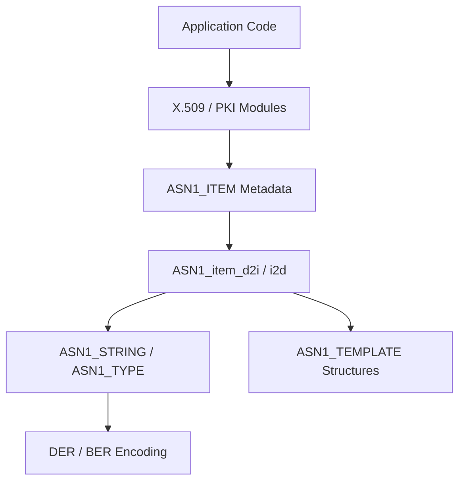
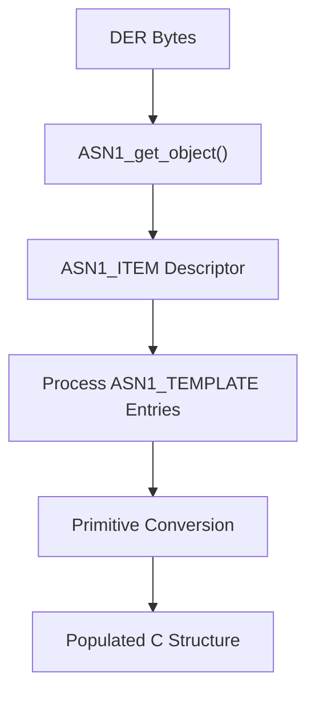
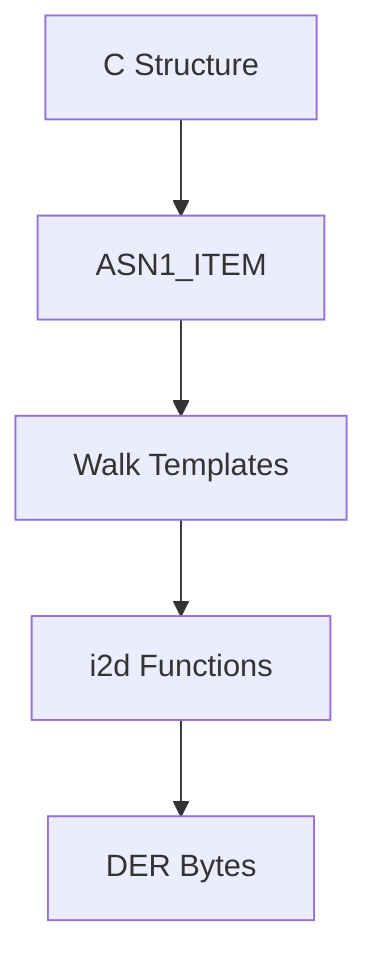
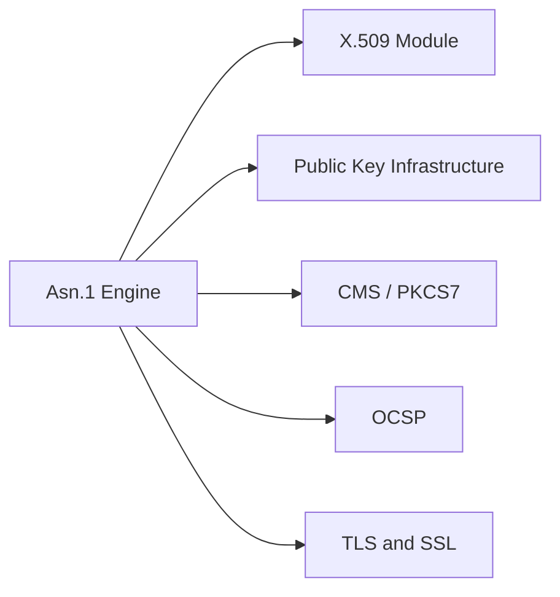

# Asn.1 Engine

The **Asn.1 Engine** module implements the Abstract Syntax Notation One (ASN.1) encoding/decoding framework used throughout OpenSSL. It provides the core data structures, template system, tagging rules, and streaming mechanisms required to serialize and deserialize cryptographic objects such as X.509 certificates, PKCS#7 messages, CMS structures, OCSP responses, and TLS handshake elements.

This module is the foundation for higher-level components such as [X.509 and Certificate Management](../X.509 and Certificate Management/X.509 and Certificate Management.md), [Public Key Infrastructure](../Public Key Infrastructure/Public Key Infrastructure.md), and [TLS and SSL](../TLS and SSL/TLS and SSL.md).

---

## 1. Purpose and Scope

ASN.1 is a platform-neutral data description language. In OpenSSL, it is primarily used with **DER (Distinguished Encoding Rules)** and **BER (Basic Encoding Rules)**.

The Asn.1 Engine provides:

- Primitive ASN.1 type representations (INTEGER, BIT STRING, OCTET STRING, etc.)
- Generic container types (`ASN1_TYPE`, `ASN1_STRING`)
- Template-driven SEQUENCE and CHOICE definitions
- Automatic encode/decode (d2i/i2d) generation
- Streaming and NDEF (indefinite-length) encoding support
- Extensibility hooks (extern/primitive/custom callbacks)

---

## 2. High-Level Architecture

The Asn.1 Engine is built around three primary layers:

1. **Primitive Layer** – Core ASN.1 types and string handling.
2. **Template Layer** – Metadata-driven SEQUENCE/CHOICE definitions.
3. **Runtime Engine** – Generic `ASN1_item_*` encode/decode/print logic.



---

## 3. Core Data Structures

### 3.1 `asn1_string_st` (ASN1_STRING)

Defined in `asn1.h`, this structure is the base container for most ASN.1 primitive values.

```text
struct asn1_string_st {
    int length;
    int type;
    unsigned char *data;
    long flags;
};
```

Responsibilities:

- Holds raw encoded or decoded data
- Tracks ASN.1 tag type
- Supports flags for special behaviors (NDEF, MSTRING, X509 time)

Derived types such as `ASN1_INTEGER`, `ASN1_UTF8STRING`, and `ASN1_OCTET_STRING` build on this foundation.

---

### 3.2 `ASN1_TYPE`

A tagged union that represents ANY-type constructs.

```text
struct asn1_type_st {
    int type;
    union {
        ASN1_STRING *asn1_string;
        ASN1_OBJECT *object;
        ASN1_INTEGER *integer;
        ...
    } value;
};
```

Used heavily in:

- CMS
- PKCS#7
- Extensions with flexible value types

---

### 3.3 `ASN1_ITEM_st`

Defined in `asn1t.h`, this is the **metadata descriptor** for a type.

```text
struct ASN1_ITEM_st {
    char itype;
    long utype;
    const ASN1_TEMPLATE *templates;
    long tcount;
    const void *funcs;
    long size;
    const char *sname;
};
```

`ASN1_ITEM` describes:

- Whether a type is PRIMITIVE, SEQUENCE, CHOICE, or EXTERN
- Field layout
- Structure size
- Associated callback logic

It enables the generic runtime encoder/decoder.

---

### 3.4 `ASN1_TEMPLATE_st`

Templates describe fields inside SEQUENCE and CHOICE structures.

```text
struct ASN1_TEMPLATE_st {
    unsigned long flags;
    long tag;
    unsigned long offset;
    const char *field_name;
    ASN1_ITEM_EXP *item;
};
```

Template flags control:

- OPTIONAL fields
- IMPLICIT/EXPLICIT tagging
- SET OF / SEQUENCE OF
- Context-specific tagging

---

## 4. Encoding and Decoding Flow

The runtime engine uses metadata to encode and decode any ASN.1-defined structure.

### Decode (DER → C Structure)



Key APIs:

- `ASN1_item_d2i`
- `ASN1_item_ex_d2i`
- `d2i_TYPE`

---

### Encode (C Structure → DER)



Key APIs:

- `ASN1_item_i2d`
- `ASN1_item_ndef_i2d`
- `i2d_TYPE`

---

## 5. Advanced Mechanisms

### 5.1 ADB (ANY DEFINED BY)

`ASN1_ADB` and `ASN1_ADB_TABLE` enable dynamic type resolution based on another field value.

Used in:

- Algorithm identifiers
- CMS content types
- PKCS#7 structures

This allows the decoder to choose a structure at runtime.

---

### 5.2 Primitive and External Hooks

The engine supports:

- `ASN1_PRIMITIVE_FUNCS`
- `ASN1_EXTERN_FUNCS`
- `ASN1_AUX`

These provide:

- Custom parsing
- Reference counting
- Encoding preservation (signature-safe reserialization)
- Streaming support

---

### 5.3 Streaming and NDEF

For large payloads (CMS, SMIME), the engine supports:

- Indefinite-length encoding
- BIO-based streaming (`BIO_f_asn1`, `BIO_new_NDEF`)
- SMIME streaming write/read

This prevents loading entire structures into memory.

---

## 6. Integration Within OpenSSL

The Asn.1 Engine underpins most cryptographic object handling.



- **X.509 and Certificate Management** uses ASN.1 SEQUENCE templates for certificate fields.
- **Public Key Infrastructure** uses ASN.1 for key parameters and signatures.
- **TLS and SSL** uses ASN.1 for certificate exchange.

---

## 7. Template-Driven Design Pattern

The Asn.1 Engine uses a declarative pattern:

1. Define a C structure.
2. Declare an `ASN1_SEQUENCE` or `ASN1_CHOICE` macro.
3. Generate encode/decode functions.
4. Use generic runtime APIs.

Example conceptual pattern:

```text
ASN1_SEQUENCE(MyStruct) = {
    ASN1_SIMPLE(MyStruct, field1, ASN1_INTEGER),
    ASN1_OPT(MyStruct, field2, ASN1_UTF8STRING)
} ASN1_SEQUENCE_END(MyStruct)
```

This macro expands into an `ASN1_ITEM` definition used by the runtime engine.

---

## 8. Responsibilities Summary

| Layer | Responsibility |
|--------|---------------|
| Primitive Types | Store ASN.1 basic values |
| Templates | Describe structure layout |
| ASN1_ITEM | Metadata for runtime engine |
| Runtime Functions | Encode/decode/print |
| ADB Mechanism | Dynamic type selection |
| Streaming Support | Large data handling |

---

## 9. Relationship to Type System

While the **Type System** module defines opaque forward declarations and high-level type categories, the **Asn.1 Engine** provides:

- Concrete binary encoding rules
- Structural layout metadata
- Runtime serialization engine

See also: [Type System](../Type System/Type System.md)

---

## 10. Key Takeaways

- The Asn.1 Engine is the serialization backbone of OpenSSL.
- It uses metadata-driven templates instead of handwritten parsers.
- It supports extensibility through external and primitive hooks.
- It enables secure re-encoding (critical for signature validation).
- Nearly all certificate, key, and PKI structures depend on it.

Without the Asn.1 Engine, higher-level cryptographic modules would not be able to interchange data securely or interoperably.