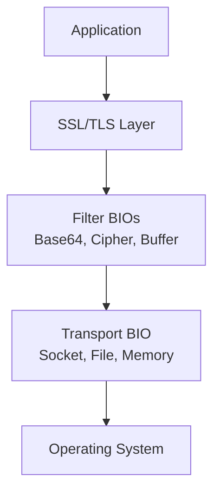
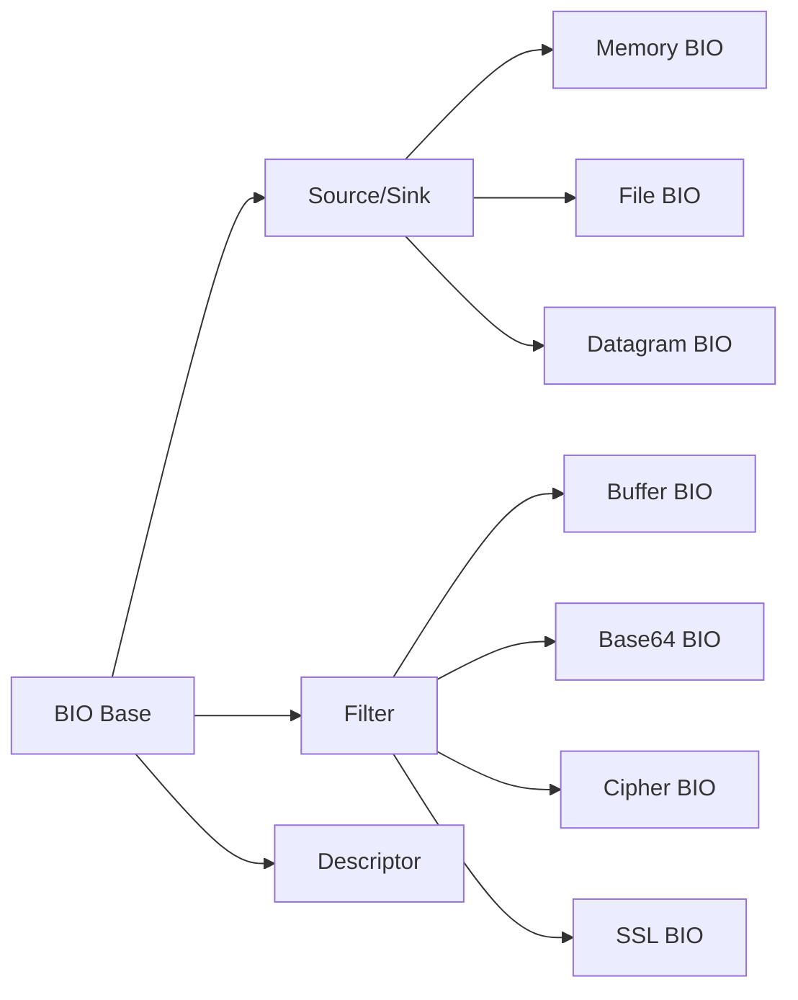
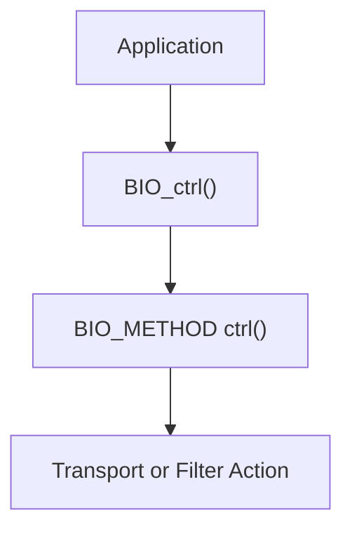
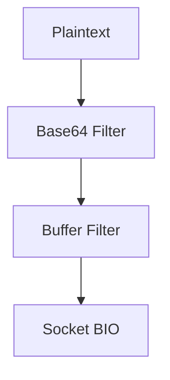
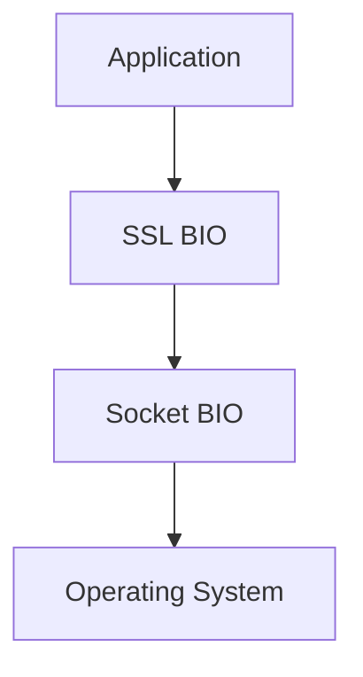
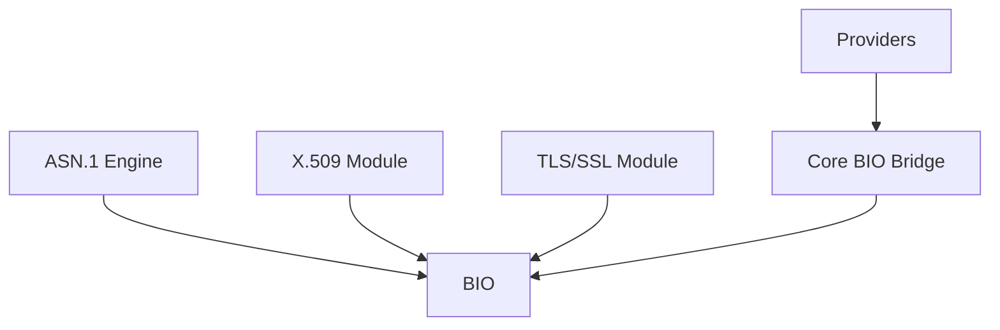

# Bio And Io

The **Bio And Io** module provides OpenSSL’s abstraction layer for input and output operations. It is built around the **BIO (Basic I/O)** framework, which unifies file, memory, socket, datagram, SSL/TLS, and filter-based I/O behind a consistent API.

This module is the foundation for how OpenSSL performs:

- Network communication (TCP, UDP, SCTP)
- File and memory buffering
- SSL/TLS record transport
- Filter chains (Base64, cipher, digest, buffering)
- Provider ↔ core I/O bridging

At its core, Bio And Io decouples *transport*, *buffering*, and *processing* so that cryptographic and protocol layers can operate independently of the underlying I/O mechanism.

---

## 1. Architectural Overview

The BIO layer is designed around three concepts:

1. **BIO objects** – runtime instances representing an I/O endpoint or filter
2. **BIO_METHOD** – method tables describing behavior for each BIO type
3. **BIO chains** – stackable pipelines combining multiple BIOs

### High-Level Architecture



The same API (for example `BIO_read()` and `BIO_write()`) works regardless of whether the underlying transport is a:

- File (`BIO_s_file`)
- Memory buffer (`BIO_s_mem`)
- TCP socket (`BIO_s_socket`)
- Datagram socket (`BIO_s_datagram`)
- SSL-wrapped transport (`BIO_TYPE_SSL`)

---

## 2. BIO Classification Model

BIO types are grouped into three classes:

- **Descriptor BIOs** – Wrap OS descriptors (sockets, file descriptors)
- **Source/Sink BIOs** – Produce or consume data
- **Filter BIOs** – Transform data in a chain

### Type Hierarchy



This separation allows flexible composition of processing pipelines.

---

## 3. Core Structures

### 3.1 BIO_METHOD

`BIO_METHOD` defines the behavior of a BIO type. It contains function pointers for:

- Read / write operations
- Control commands
- Creation and destruction
- Optional vectored I/O (`sendmmsg`, `recvmmsg`)

Conceptually:

```text
BIO_METHOD
 ├── write()
 ├── read()
 ├── ctrl()
 ├── create()
 └── destroy()
```

Custom BIO types can be implemented using:

- `BIO_meth_new()`
- `BIO_meth_set_read()`
- `BIO_meth_set_write()`
- `BIO_meth_set_ctrl()`

This makes Bio And Io extensible and provider-compatible.

---

### 3.2 BIO_MSG and Multi-Message I/O

For high-performance datagram transports, Bio And Io supports batched operations.

**BIO_MSG** represents one message in vectored I/O:

```text
BIO_MSG
 ├── data
 ├── data_len
 ├── peer
 ├── local
 └── flags
```

Used with:

- `BIO_sendmmsg()`
- `BIO_recvmmsg()`

This enables efficient UDP/SCTP packet processing.

---

### 3.3 BIO_POLL_DESCRIPTOR

`BIO_POLL_DESCRIPTOR` provides a transport-neutral polling abstraction.

It supports:

- File descriptor polling
- SSL object polling
- Custom transport handles

This allows integration with event loops without exposing transport internals.

---

### 3.4 BIO_ADDR and BIO_ADDRINFO

Bio And Io includes a platform-neutral address abstraction:

- `BIO_ADDR` – Single address wrapper
- `BIO_ADDRINFO` – Linked results from DNS resolution

These are used by:

- `BIO_lookup()`
- `BIO_connect()`
- `BIO_accept_ex()`

They replace direct `sockaddr` usage and improve portability.

---

### 3.5 buf_mem_st (Memory Buffers)

Defined in `buffer.h`, `buf_mem_st` represents dynamically growable buffers:

```text
buf_mem_st
 ├── length
 ├── data
 ├── max
 └── flags
```

Key capabilities:

- Dynamic resizing (`BUF_MEM_grow`)
- Secure memory mode (`BUF_MEM_FLAG_SECURE`)
- Clean reallocation (`BUF_MEM_grow_clean`)

Memory BIOs rely on this structure.

---

## 4. BIO Control System

BIO behavior is modified via `BIO_ctrl()` using control codes.

Examples:

- `BIO_CTRL_RESET`
- `BIO_CTRL_FLUSH`
- `BIO_CTRL_PENDING`
- `BIO_CTRL_DGRAM_SET_MTU`
- `BIO_C_SET_SSL`

### Control Flow



This design enables uniform configuration of:

- Socket options
- Timeouts
- MTU discovery
- SSL binding
- Buffer sizing

---

## 5. BIO Chains (Stacking Model)

BIOs can be stacked using `BIO_push()` and `BIO_pop()`.

### Example Pipeline



Data written to the head BIO flows downward through each layer.

Read operations propagate upward in reverse order.

This stacking model enables flexible processing pipelines without rewriting transport logic.

---

## 6. Datagram and SCTP Support

Bio And Io provides advanced datagram capabilities:

- MTU discovery
- Peer detection
- Local address control
- SCTP message metadata

### SCTP Metadata Structures

- `bio_dgram_sctp_sndinfo`
- `bio_dgram_sctp_rcvinfo`
- `bio_dgram_sctp_prinfo`

These allow:

- Stream ID selection
- Partial reliability policies
- Transmission sequence tracking

This functionality is critical for DTLS and WebRTC-style transports.

---

## 7. Integration with SSL/TLS

The SSL BIO (`BIO_TYPE_SSL`) acts as a filter layered above a transport BIO.

### SSL Over Socket Example



The SSL BIO:

- Encrypts outgoing data
- Decrypts incoming data
- Manages handshake state
- Handles renegotiation and retries

Retry semantics are exposed via:

- `BIO_should_retry()`
- `BIO_get_retry_reason()`

This allows non-blocking and event-driven TLS implementations.

---

## 8. Retry and Non-Blocking Semantics

Bio And Io supports non-blocking I/O through flag-based signaling.

Common flags:

- `BIO_FLAGS_READ`
- `BIO_FLAGS_WRITE`
- `BIO_FLAGS_SHOULD_RETRY`

Typical pattern:

```text
if BIO_read() <= 0
    if BIO_should_retry()
        wait for readiness
```

This abstraction enables portability across:

- POSIX sockets
- Windows sockets
- SSL internal state machines

---

## 9. Polling and Event Loop Integration

To integrate with event-driven systems, Bio And Io provides:

- `BIO_get_rpoll_descriptor()`
- `BIO_get_wpoll_descriptor()`
- `BIO_wait()`

These allow applications to:

- Extract underlying file descriptors
- Integrate with `select`, `poll`, `epoll`, or custom loops
- Avoid direct socket coupling

---

## 10. Custom BIO Implementations

Developers can implement custom transports using:

- `BIO_meth_new()`
- `BIO_meth_set_*()` functions
- `BIO_new_ex()`

Custom BIOs may represent:

- Hardware devices
- Secure enclaves
- IPC mechanisms
- Provider-level transports

This makes Bio And Io a core extensibility point in OpenSSL.

---

## 11. Relationship to the Wider OpenSSL Architecture

Within the broader system:

- The **TLS/SSL layer** depends on BIO for record transport
- The **X.509 and PKI modules** use BIO for certificate I/O
- The **ASN.1 engine** reads and writes through BIO streams
- The **Provider interface** uses core BIO bridges

### Cross-Module Interaction



Bio And Io acts as the universal transport backbone across OpenSSL subsystems.

---

## 12. Key Design Principles

Bio And Io follows these architectural principles:

- **Abstraction over OS primitives**
- **Composable filter chains**
- **Transport independence**
- **Non-blocking compatibility**
- **Extensibility through method tables**

It enables cryptographic logic to remain isolated from transport mechanics while still supporting high-performance networking features such as vectored datagram I/O and SCTP metadata.

---

# Summary

The **Bio And Io** module is OpenSSL’s universal I/O abstraction layer. It provides:

- A unified API for files, memory, sockets, and SSL
- Stackable filter pipelines
- Non-blocking and retry semantics
- Datagram and SCTP extensions
- Event-loop integration
- Custom transport extensibility

Every major OpenSSL subsystem relies on BIO for moving bytes securely and efficiently. Without Bio And Io, higher-level cryptographic and protocol components would need to manage transport details directly.

Bio And Io is therefore one of the most foundational layers in the OpenSSL architecture.